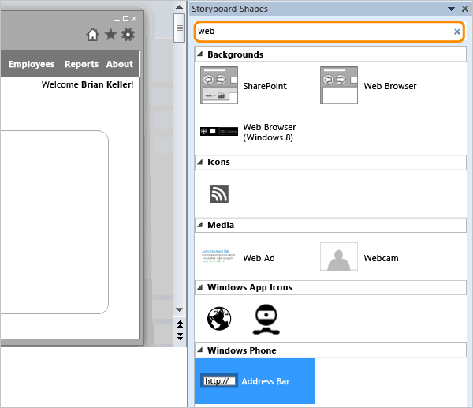
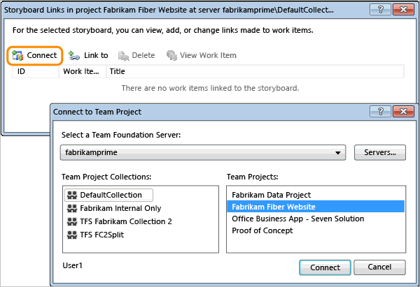
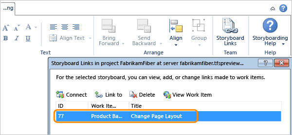

# Storyboard your ideas using Microsoft PowerPoint

[!INCLUDE [temp](../../_shared/version-vsts-tfs-all-versions.md)]

With storyboarding, you turn your ideas and goals into something visual. Your ideas are easier for other people to understand, so they can give you constructive feedback, sooner. You can bring your ideas to life with storyboard shapes, text, animation, and all the other features that Microsoft PowerPoint Storyboarding provides.

> [!IMPORTANT]  
> Starting with Visual Studio 2019, the Team Foundation plug-in for Office is deprecating support for Storyboarding with PowerPoint and Microsoft Project. Also, the Visual Studio Gallery for PowerPoint Storyboarding has been deprecated.   

## Use storyboard shapes and PowerPoint features

1.  If you're interfacing with Azure Boards or TFS 2017 or later versions, you must have [Office PowerPoint 2010 or later version installed](https://www.microsoftstore.com/store/msusa/en_US/pdp/productID.323024400). For version compatibility, see [Requirements and compatibility, Office](/azure/devops/server/compatibility#office). If you're interfacing with TFS 2013 or TFS 2015, you must have Office PowerPoint 2007 or later version installed.  

2.  If you haven't installed a version of [Visual Studio (2013 or later)](https://visualstudio.microsoft.com/downloads/download-visual-studio-vs) or the [Team Foundation Server Standalone Office Integration (free)](https://go.microsoft.com/fwlink/?LinkId=832491&clcid=0x409), you'll need to install one of these versions to create and modify storyboards.

	> [!NOTE]   
	>The only way to get the Team Foundation plug-in is by installing one of the latest editions of Visual Studio or the TFS Standalone Office Integration installer. TFS Office Integration 2015 supports connection to Azure Boards and TFS from Excel, Project, and the PowerPoint-based storyboarding tool. 

3.  Open Power Point Storyboarding and start with a blank slide. You should see the **Storyboarding** ribbon and **Storyboard Shapes** library. If you don't see the Storyboarding ribbon, see step 2.

     

    Or, you can open PowerPoint Storyboarding from the work item **Storyboarding** tab. 

     

    Or, from the web portal and the new work item form, click the **Start storyboarding** menu option from any valid work item.     

	 

4.  Add a background shape that's appropriate for your app. To add a shape, just drag it onto the slide.

     

5.  Search for more shapes to complete your design.

    

6.  Create mores slides to show the flow of your app. Share them with your team to get early feedback on the design.

    

> [!TIP]  
>- Use animation to bring your user interface flow to life.  
>- Take screenshots of your apps. For example, add a screenshot as the background of a master slide.   

## Link your storyboard to a backlog item

When you share your storyboards to a shared network location, you can link the storyboards to a backlog item. That way, your team members will be able to open the storyboards from the work items and annotate them with their suggestions.

1.  Save or upload your storyboard to a shared location that everyone on your team can access.

2.  If you started Power Point Storyboarding from a backlog item, then you are already linked to the initial item and you are done.

    Otherwise, open the **Links** tab or the **Storyboard Links** tab.

    

	> [!NOTE]  
	>The **Storyboards** tab is no longer supported in the new web form. However, you can link to a storyboard from the **Links** tab using the Storyboard link.  

3.  If you're not already connected to a project, [connect now](../../../organizations/projects/connect-to-projects.md). If you can't connect, [get added as a team member](../../../organizations/settings/add-teams.md#add-team-members).

    

4.  Then, link to a work item.

    

5.  Select a work item to link to. The next screenshot shows how to do that using a saved query. You can also do a simple search on the title, or just provide the ID.

    

    

    

6.  Now the storyboard is linked to the work item.

    

7.  And, whoever views the work item can also access the storyboard.

	 

With PowerPoint Storyboarding, you can illustrate a new or a modified interface. You can capture existing user interfaces and build a storyboard from a collection of predefined storyboard shapes. Also, you can customize the slide layouts for your web, client, or phone applications. And, by linking the storyboard to the product backlog item or user story, you automatically share it with your team.

## Related articles

Start using Storyboarding with PowerPoint today by downloading the free plug-in to PowerPoint: 
- [Team Foundation Server Office&reg; Integration 2017](https://visualstudio.microsoft.com/downloads#team-foundation-server-office-integration-2017)

### Custom shapes 
You can create your own shapes using [My Shapes](add-share-storyboard-shapes.md), which get saved to the following folder in a .sbsx file:

<code><i>Drive</i>:\Users\<i>UserName</i>\AppData\Local\Microsoft\Team Foundation\6.0\PowerPoint\Shapes</code>

<!---
You can then share your custom shapes or import custom shapes developed by others in the Visual Studio community.  
-->

### PowerPoint for Mac 

macOS is not supported. You need to use PowerPoint on the same computer where you have installed Visual Studio or the Team Foundation Server Standalone Office Integration 2015 in order to get the Team Foundation add-in. These applications require Windows.

