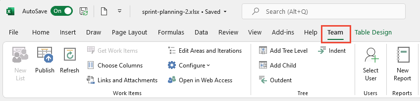
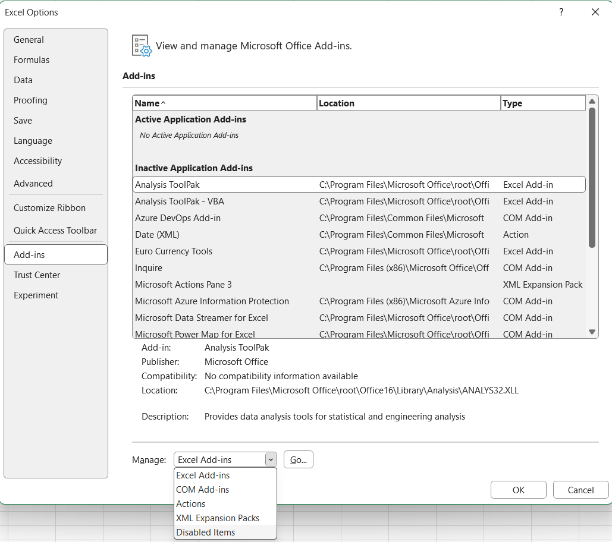
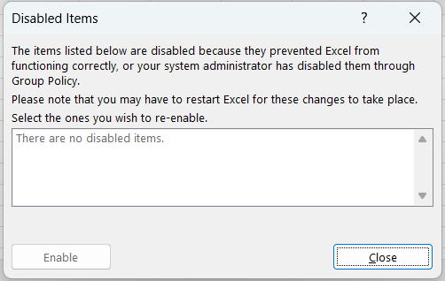

# Resolve Azure DevOps and Office integration issues

[!INCLUDE [version-lt-eq-azure-devops](../../../includes/version-lt-eq-azure-devops.md)]

If the **Team** ribbon is missing in Microsoft Excel, as shown in the following image, do the procedures in this article to resolve the issue.

> [!div class="mx-imgBorder"]
> 

> [!NOTE]
> The Azure DevOps Office integration is feature complete with no plans for updates or improvements. Future investments focus on native tooling for [bulk importing or updating work items using CSV files](../../queries/import-work-items-from-csv.md). If you encounter issues with the Office integration, consider using this alternative.
> All Office integration tasks require an installed version of Visual Studio or the free [Azure DevOps Office Integration 2019](https://visualstudio.microsoft.com/downloads/#other-family), which installs the Azure DevOps Office Integration Add-in. For prerequisites, see [Azure Boards and Office integration](track-work.md).

[!INCLUDE [temp](../../includes/deprecate-project.md)]

## Install Azure DevOps Integration 2019

This tool allows you to connect to Azure Boards from Excel. To install the Azure DevOps Integration 2019 tool, follow these steps:

1. Download the [Azure DevOps Office Integration 2019](https://visualstudio.microsoft.com/downloads/#other-family) tool.

1. Install the tool by running the downloaded file.
1. Restart Excel to see the **Team** ribbon.

If you still don't see the **Team** ribbon, follow the steps in the following sections.

## Enable the Azure DevOps add-in

1. In Excel, select **File** > **Options**.  
2. Select **Add-ins** > **COM Add-ins** from the *Manage* dropdown menu > **Go**.

   :::image type="content" source="media/excel-options-com-add-ins.png" alt-text="Screenshot of sequence to add COM add-in.":::

3. Make sure there's a check in the **Team Foundation Add-in** box.

   > [!div class="mx-imgBorder"]
   > 

4. Restart Excel.

The **Team** ribbon shows.

If the **Team** ribbon doesn't appear at next launch, the load behavior of the add-in might be changed, so do these next steps.

### Update the registry

1. Launch the Registry Editor from your Windows Start Menu by entering `regedit` in the Search or Run box.

   > [!div class="mx-imgBorder"]
   > 

1. Go to one of the following paths containing the **TFCOfficeShim.Connect.[version]** folder:

   > [!NOTE]
   > If there are multiple folders with the same name, select the one with the highest version number.

   - `HKEY_CURRENT_USER\SOFTWARE\Microsoft\Office\Excel\Addins` (if this key doesn't exist, try one of the following options)
   - `HKEY_LOCAL_MACHINE\SOFTWARE\Microsoft\Office\Excel\Addins`
   - `HKEY_LOCAL_MACHINE\SOFTWARE\WOW6432Node\Microsoft\Office\Excel\Addins`

      > [!div class="mx-imgBorder"]
   > 

1. Double-select to open **LoadBehavior** and set the value data field to `3`. If the value is `0` the **Team** ribbon doesn't load.

1. Select **OK** and restart Excel.

    For more information about the LoadBehavior entry, see [Registry Entries for VSTO Add-ins, LoadBehavior values](/visualstudio/vsto/registry-entries-for-vsto-add-ins#LoadBehavior).  

## Verify if the add-in is disabled

1. From the Excel **File** menu, select **Options**.
1. Choose **Add-ins** and from the *Manage* dropdown menu and select **Disabled Items** > **Go**.

      > [!div class="mx-imgBorder"]
   > 

1. If you see *Azure DevOps Add In* in the list, choose it and select **Enable**.

      > [!div class="mx-imgBorder"]
   > 

## Office add-in doesn't load or open in Excel when Visual Studio fails

To connect to Azure Boards, go to the **Team** ribbon and choose **New List**. If the New List dialog fails to open, or you receive TF86001 or similar error message, then you might need to repair Visual Studio.

> [!div class="mx-imgBorder"]
> 

This error usually occurs when Visual Studio is installed before Office Excel or Project. In this case, the Visual Studio Tools for Office Runtime aren't configured correctly. To fix this error, repair your Visual Studio installation.

> [!NOTE]
> For authentication issues, like `TF31003` and `TF30063`, see [User account doesn't have permission](/previous-versions/azure/devops/reference/error/tf31003-user-account-no-permission-connect-tfs).

### Prerequisites

Install Visual Studio to ensure that you have access to the Visual Studio Command Prompt and the  [Gacutil.exe (Global Assembly Cache Tool)](/dotnet/framework/tools/gacutil-exe-gac-tool). If you don't have Visual Studio, you can install the [Visual Studio Community edition for free](https://visualstudio.microsoft.com/downloads/).

### Run the Gacutil tool  

1. Open the Visual Studio Command Prompt and choose to run it as an administrator.

   > [!div class="mx-imgBorder"]
   > 

2. Run the following commands based on your software:

    |Software |Commands |
    |---------|---------|
    |Microsoft 365   | `GACUTIL /I C:\Windows\assembly\GAC_MSIL\Policy.14.0.Microsoft.Office.Interop.Excel\15.0.0.0__71e9bce111e9429c\Policy.14.0.Microsoft.Office.Interop.Excel.dll`</br>`GACUTIL /I C:\Windows\assembly\GAC_MSIL\Policy.14.0.office\15.0.0.0__71e9bce111e9429c\Policy.14.0.Office.dll`   |
    |Office 2016 and Office 2013   |  `GACUTIL /I C:\Windows\assembly\GAC_MSIL\Policy.12.0.Microsoft.Office.Interop.Excel\15.0.0.0__71e9bce111e9429c\Policy.12.0.Microsoft.Office.Interop.Excel.dll`<\br>`GACUTIL /I C:\Windows\assembly\GAC_MSIL\Policy.12.0.office\15.0.0.0__71e9bce111e9429c\Policy.12.0.Office.dll`  |
    |Office 2010     |`GACUTIL /I C:\Windows\assembly\GAC_MSIL\Policy.12.0.Microsoft.Office.Interop.Excel\14.0.0.0__71e9bce111e9429c\Policy.12.0.Microsoft.Office.Interop.Excel.dll`<\br>`GACUTIL /I C:\Windows\assembly\GAC_MSIL\Policy.12.0.office\14.0.0.0__71e9bce111e9429c\Policy.12.0.Office.dll`  |

3. After you successfully run the `GACUTIL` commands, restart Excel and look for the Azure DevOps Integration Tool for Office add-in.

If the previous steps don't help, try the next steps:  

1. [Repair Office](https://support.office.com/article/Repair-an-Office-application-7821d4b6-7c1d-4205-aa0e-a6b40c5bb88b?ui=en-US&rs=en-US&ad=US).  
2. Uninstall Office and then reinstall Office.
3. Contact Microsoft via the [Developer Community](https://developercommunity.visualstudio.com/home).  

## User can't sign in to Azure DevOps from Excel after password change

If you changed your network password and start receiving authentication errors with the new account info, you might be experiencing a known issue. The token stored in Visual Studio is no longer valid, but the system doesn’t recognize the need to refresh it. You don't need to take any action; the token expires eventually, and authentication begins working again, though the delay is unpredictable. Use the following workaround to manually remove the token.

### Remove the token from the registry

1. Close all open Excel instances.
2. Save and then clear the registry path by running the following commands from an elevated Command Prompt (run as administrator):

   ```CommandPrompt
   reg export HKEY_CURRENT_USER\SOFTWARE\Microsoft\VSCommon\14.0\ClientServices\TokenStorage\VisualStudio\VssApp %TEMP%\oicreds.reg
   ```

   ```CommandPrompt
   reg delete HKEY_CURRENT_USER\SOFTWARE\Microsoft\VSCommon\14.0\ClientServices\TokenStorage\VisualStudio\VssApp
   ```

3. Open Excel and it prompts for sign-in when it connects to Azure DevOps.

Wait until the token expires or delete this reg key every time a password changes if configured in a way that causes this issue.

## Intermittent issues doing refresh and publish

If you get an error during refresh or publish, there might be a Conditional Access Policy in Microsoft Entra ID. To resolve this issue, clear the contents of the folder: ```%LOCALAPPDATA%\.IdentityService```.

## Can't cast COM object of type Microsoft.Office.Interop.Excel.ApplicationClass

You might get an error message when opening a work item list in Excel, triggered from Team Explorer. For more information, see [How to solve 'Unable to cast COM object of type Microsoft.Office.Interop.Excel.ApplicationClass' to interface type 'Microsoft.Office.Interop.Excel._Application.''](/archive/blogs/dau-blog/how-to-solve-unable-to-cast-com-object-of-type-microsoft-office-interop-excel-applicationclass-to-interface-type-microsoft-office-interop-excel-_application)

<a id="resolve-data-conflicts">  </a>

## Resolve data conflicts when you publish or refresh Excel data

A data conflict occurs when you try to publish a work item from [Excel](bulk-add-modify-work-items-excel.md) and the version of that work item differs from the version in the work item database. The following example shows how two team members can create such a conflict:

1. A team member opens a copy of a work item in a work item list in Excel or Project.  
2. Team member A edits the work item and makes one set of changes.  
3. Team member B edits that same work item and makes a different set of changes, and publishes those changes.  
4. Team member A finishes editing the work item and tries to publish the changes to the work item.  
5. Excel or Project displays the **Work Item Publishing Errors** dialog box, which shows items that it couldn't publish.  
  
### Resolve a data conflict  
  
1. In the **Work Item Publishing Errors** dialog box, for each work item in the **Unpublished work items** box that has **Conflict** in the **Issue** column, follow these steps.  
2. In the **Unpublished work items** box, select the work item.  
   The **Details** area shows a list of conflicts for the selected work item. The **Conflicting field** column shows the name of the field in which the conflict occurs. The **Local version** and **Server version** columns show the local and server data, respectively, and a check box appears next to the data in each of these columns.  
3. For each row in the **Details** box, select the check box next to the correct value.  
   When you select the local version, the data in Office Excel or Office Project overwrites the data on the server. If you select the server version, the server data overwrites the data in Office Excel or Office Project.  
4. Select **Publish**.  
  
> [!NOTE]  
> This step publishes only the work items that you corrected. If you don't resolve all data validation errors related to a work item, that work item isn't published.

<a id="resolve-data-validation-errors">  </a>

## Resolve data validation errors that occur when you publish from Excel

A data validation error occurs when a change in the work item list or project plan violates a work item type's rule. The following examples show common data validation errors:  
  
- Someone assigns a work item to a team member whose name isn't included in the list of allowed values  
- Someone creates a work item but forgets to complete a required field, such as the work item type.  
  
If a data validation error occurs when you try to publish changes, the **Work Item Publishing Errors** dialog box appears, and in the **Unpublished work items** list the **Issue** column shows **Validation error** or another phrase that contains **Invalid**.  

### Resolve a data validation error  

 You can use the **Work Item Publishing Errors** dialog box to resolve a data validation error.  

1. In the **Work Item Publishing Errors** dialog box, for each work item that appears with a data validation error, follow these steps.  
  
   > [!NOTE]  
   > If the data validation error is an invalid work item type, the **Edit Work Item** button isn't visible, and a work item form doesn't appear. You must correct the error in the Office Excel worksheet or the Office Project plan. For information about how to resolve an error in Office Excel, see the next procedure in this article.  
  
2. In the **Unpublished work items** box, select the work item, and then select **Edit Work Item**.  
  
   A work item form appears.  
  
3. In the work item form, review the information and correct the value.  
4. Select **Close** to save your changes and close the work item form.  
5. After you correct the data validation errors, select **Publish** to publish the corrected work items.  
  
   > [!NOTE]  
   > This step publishes only the work items that you corrected. If you don't resolve a data validation error, that work item isn't published.  
  
6. Select **Close** to close the **Work Item Publishing Errors** dialog box.  

### Resolve a data validation error by using error checking in Excel  

You can use the Office Excel tools to find and resolve an error in a work item list. For more information about how to use Office Excel error checking tools, see the Office Excel Help.  
  
#### Resolve a data validation error by using error checking in Excel 2007  
  
1. In Microsoft Excel, select the **Formulas** tab.  
2. In the **Formula Auditing** group, select **Error Checking**.  
   If the error checking tool finds an error, the **Error Checking** dialog box appears.  
3. For basic information about the error, see the text that describes the error in the **Error Checking** dialog box. For more information about the error, select **Help on this error**.  
4. In the work item list, select the cell that contains the error, and then correct the value.
5. In the **Error Checking** dialog box, select **Resume** to find the next data validation error.  
   - If the **Error Checking** dialog box shows another error, repeat the previous two steps to resolve the error.  
   - If a message appears that indicates error checking completed, select **OK** to close both this message and the **Error Checking** dialog box.  

## Related articles

- [Bulk modify work items (web portal)](../bulk-modify-work-items.md)  
- [Bulk import or update work items using CSV files](../../queries/import-work-items-from-csv.md)
- [FAQs: Work in Excel connected to Azure Boards](faqs.yml)
- [Add or remove add-ins](https://support.office.com/article/Add-or-remove-add-ins-0af570c4-5cf3-4fa9-9b88-403625a0b460)
