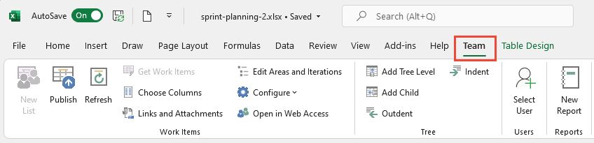
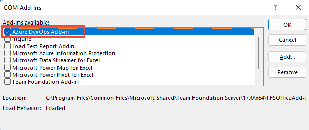
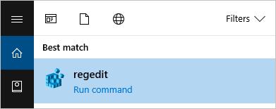
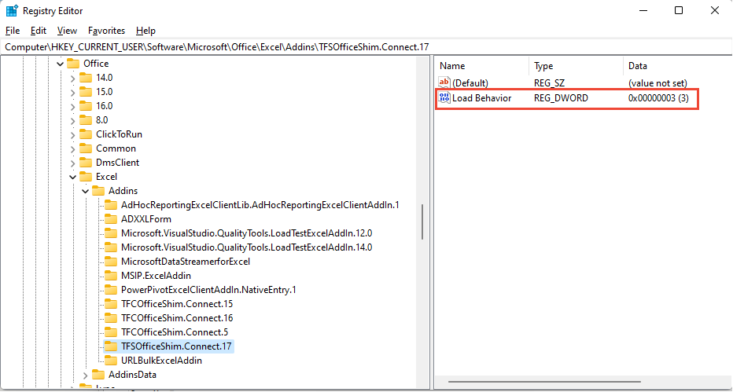
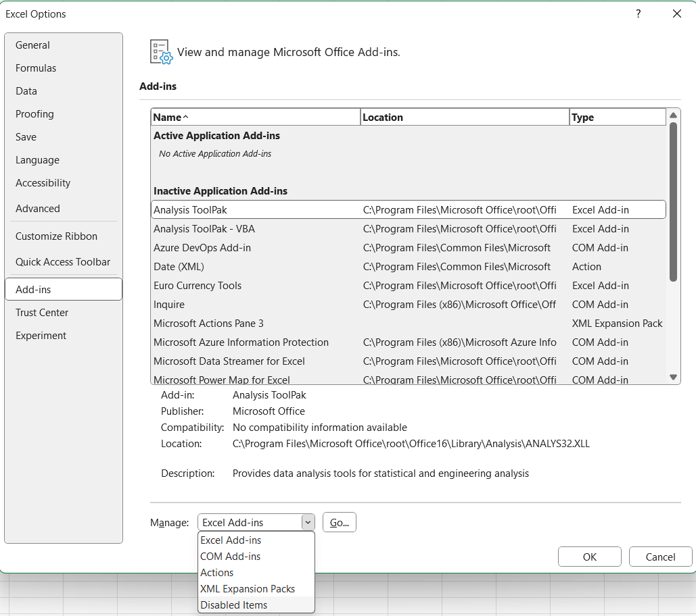
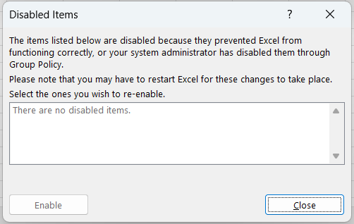
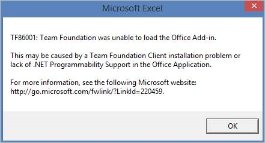
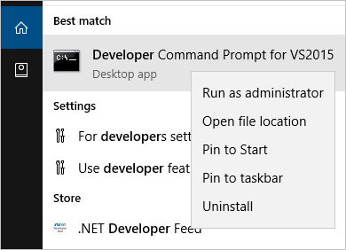

# Resolve Azure DevOps and Office integration problems

[!INCLUDE [version-lt-eq-azure-devops](../../../includes/version-lt-eq-azure-devops.md)]

Azure DevOps integrates with Microsoft Office applications, primarily Excel and Project, to enable bulk editing and management of work items. This integration relies on the Azure DevOps Office Integration add-in, which adds a **Team** ribbon to your Office applications.

> [!div class="mx-imgBorder"]
> 

[!INCLUDE [deprecate-office-integration](../../includes/deprecate-office-integration.md)]

You might encounter integration problems in these common scenarios:

- **Missing Team ribbon**: The Azure DevOps Team ribbon doesn't appear in Excel or other Office applications.
- **Add-in not loading**: The Azure DevOps add-in fails to load or is disabled.
- **Authentication problems**: Sign-in problems after password changes or organizational updates.  
- **Publishing errors**: Data conflicts or validation errors when updating work items from Office.
- **Installation conflicts**: Problems that arise from installing Office and Visual Studio in different orders.

This article provides step-by-step solutions for the most common Azure DevOps Office integration problems. Before troubleshooting, make sure you have the necessary prerequisites and understand the current state of Office integration support.

[!INCLUDE [ai-assistance-mcp-server-tip](../../../includes/ai-assistance-mcp-server-tip.md)]

[!INCLUDE [temp](../../includes/deprecate-project.md)]

## Install Azure DevOps Integration 2019

This tool allows you to connect to Azure Boards from Excel. To install the Azure DevOps Integration 2019 tool, follow these steps:

1. Download the [Azure DevOps Office Integration 2019](https://visualstudio.microsoft.com/downloads/#other-family) tool.

1. Install the tool by running the downloaded file.
1. Restart Excel to see the **Team** ribbon.

If you still don't see the **Team** ribbon, complete the steps in the following sections.

## Enable the Azure DevOps add-in

1. In Excel, select **File** > **Options**.  
1. Select **Add-ins** > **COM Add-ins** from the *Manage* dropdown menu > **Go**.

   :::image type="content" source="media/excel-options-com-add-ins.png" alt-text="Screenshot of sequence to add COM add-in.":::

1. Ensure there's a check in the **Team Foundation Add-in** box.

   > [!div class="mx-imgBorder"]
   > 

1. Restart Excel.

The **Team** ribbon shows.

If the **Team** ribbon doesn't appear at next launch, the load behavior of the add-in might have changed, so complete these next steps.

### Update the registry

1. Launch the Registry Editor from your Windows Start Menu by entering `regedit` in the Search or Run box.

   > [!div class="mx-imgBorder"]
   > 

1. Go to one of the following paths containing the **TFCOfficeShim.Connect.[version]** folder:

   > [!NOTE]
   > If there are multiple folders with the same name, select the one with the highest version number.

   - `HKEY_CURRENT_USER\SOFTWARE\Microsoft\Office\Excel\Addins` (if this key doesn't exist, try one of the following options)
   - `HKEY_LOCAL_MACHINE\SOFTWARE\Microsoft\Office\Excel\Addins`
   - `HKEY_LOCAL_MACHINE\SOFTWARE\WOW6432Node\Microsoft\Office\Excel\Addins`

      > [!div class="mx-imgBorder"]
   > 

1. Double-select to open **LoadBehavior** and set the value data field to `3`. If the value is `0` the **Team** ribbon doesn't load.

1. Select **OK** and restart Excel.

    For more information about the LoadBehavior entry, see [Registry Entries for VSTO Add-ins, LoadBehavior values](/visualstudio/vsto/registry-entries-for-vsto-add-ins#LoadBehavior).  

## Verify if the add-in is disabled

1. From the Excel **File** menu, select **Options**.
1. Choose **Add-ins**. In the *Manage* dropdown menu, select **Disabled Items** and select **Go**.

      > [!div class="mx-imgBorder"]
   > 

1. If you see *Azure DevOps Add In* in the list, select it and choose **Enable**.

      > [!div class="mx-imgBorder"]
   > 

## Excel crashes when signing in to Azure DevOps from the add-in

A recent Excel update surfaced a pre-existing bug in the Azure DevOps add-in that can cause Excel to crash when attempting to sign in to Azure DevOps. An updated installer that contains the fix is now available.

**To resolve this issue:**

1. Close all Excel windows.
1. Uninstall your current version of the add-in.
1. Download the [Azure DevOps Office Integration 2019](https://visualstudio.microsoft.com/downloads/#other-family) installer again.
1. Run the installer to reinstall the add-in.
1. Restart Excel.

## Office add-in doesn't load or open in Excel when Visual Studio fails

To connect to Azure Boards, go to the **Team** ribbon and choose **New List**. If the New List dialog fails to open, or you receive TF86001 or similar error message, you might need to repair Visual Studio.

> [!div class="mx-imgBorder"]
> 

This error usually occurs when you install Visual Studio before Office Excel or Project. In this case, the Visual Studio Tools for Office Runtime aren't configured correctly. To fix this error, repair your Visual Studio installation.

> [!NOTE]
> For authentication problems, like `TF31003` and `TF30063`, see [User account doesn't have permission](/previous-versions/azure/devops/reference/error/tf31003-user-account-no-permission-connect-tfs).

### Prerequisites

Install Visual Studio to ensure that you have access to the Visual Studio Command Prompt and the [Gacutil.exe (Global Assembly Cache Tool)](/dotnet/framework/tools/gacutil-exe-gac-tool). If you don't have Visual Studio, you can install the [Visual Studio Community edition for free](https://visualstudio.microsoft.com/downloads/).

### Run the Gacutil tool  

1. Open the Visual Studio Command Prompt and choose to run it as an administrator.

   > [!div class="mx-imgBorder"]
   > 

1. Run the following commands based on your software:

    |Software |Commands |
    |---------|---------|
    |Microsoft 365   | `GACUTIL /I C:\Windows\assembly\GAC_MSIL\Policy.14.0.Microsoft.Office.Interop.Excel\15.0.0.0__71e9bce111e9429c\Policy.14.0.Microsoft.Office.Interop.Excel.dll`</br>`GACUTIL /I C:\Windows\assembly\GAC_MSIL\Policy.14.0.office\15.0.0.0__71e9bce111e9429c\Policy.14.0.Office.dll`   |
    |Office 2016 and Office 2013   |  `GACUTIL /I C:\Windows\assembly\GAC_MSIL\Policy.12.0.Microsoft.Office.Interop.Excel\15.0.0.0__71e9bce111e9429c\Policy.12.0.Microsoft.Office.Interop.Excel.dll`<\br>`GACUTIL /I C:\Windows\assembly\GAC_MSIL\Policy.12.0.office\15.0.0.0__71e9bce111e9429c\Policy.12.0.Office.dll`  |
    |Office 2010     |`GACUTIL /I C:\Windows\assembly\GAC_MSIL\Policy.12.0.Microsoft.Office.Interop.Excel\14.0.0.0__71e9bce111e9429c\Policy.12.0.Microsoft.Office.Interop.Excel.dll`<\br>`GACUTIL /I C:\Windows\assembly\GAC_MSIL\Policy.12.0.office\14.0.0.0__71e9bce111e9429c\Policy.12.0.Office.dll`  |

1. After you successfully run the `GACUTIL` commands, restart Excel and look for the Azure DevOps Integration Tool for Office add-in.

If the previous steps don't help, try the next steps:  

1. [Repair Office](https://support.office.com/article/Repair-an-Office-application-7821d4b6-7c1d-4205-aa0e-a6b40c5bb88b?ui=en-US&rs=en-US&ad=US).  
1. Uninstall Office and then reinstall Office.
1. Contact Microsoft through the [Developer Community](https://developercommunity.visualstudio.com/home).  

## User can't sign in to Azure DevOps from Excel after password change

If you changed your network password and start receiving authentication errors with the new account info, you might be experiencing a known issue. The token stored in Visual Studio is no longer valid, but the system doesn't recognize the need to refresh it. You don't need to take any action; the token expires eventually, and authentication begins working again, though the delay is unpredictable. Use the following workaround to manually remove the token.

### Remove the token from the registry

1. Close all open Excel instances.
1. Save your work, and then clear the registry path by running the following commands from an elevated Command Prompt (run as administrator):

   ```CommandPrompt
   reg export HKEY_CURRENT_USER\SOFTWARE\Microsoft\VSCommon\14.0\ClientServices\TokenStorage\VisualStudio\VssApp %TEMP%\oicreds.reg
   ```

   ```CommandPrompt
   reg delete HKEY_CURRENT_USER\SOFTWARE\Microsoft\VSCommon\14.0\ClientServices\TokenStorage\VisualStudio\VssApp
   ```

1. Open Excel. It prompts for sign-in when it connects to Azure DevOps.

Wait until the token expires or delete this registry key every time a password changes if you configure it in a way that causes this issue.

## Intermittent issues doing refresh and publish

If you get an error during refresh or publish, a Conditional Access Policy in Microsoft Entra ID might be causing the problem. To resolve this problem, clear the contents of the folder: ```%LOCALAPPDATA%\.IdentityService```.

## Can't cast COM object of type Microsoft.Office.Interop.Excel.ApplicationClass

You might get an error message when opening a work item list in Excel, triggered from Team Explorer. For more information, see [How to solve 'Unable to cast COM object of type Microsoft.Office.Interop.Excel.ApplicationClass' to interface type 'Microsoft.Office.Interop.Excel._Application.''](/archive/blogs/dau-blog/how-to-solve-unable-to-cast-com-object-of-type-microsoft-office-interop-excel-applicationclass-to-interface-type-microsoft-office-interop-excel-_application)

<a id="resolve-data-conflicts">  </a>

## Resolve data conflicts when you publish or refresh Excel data

A data conflict occurs when you try to publish a work item from [Excel](bulk-add-modify-work-items-excel.md) and the version of that work item differs from the version in the work item database. The following example shows how two team members can create such a conflict:

1. A team member opens a copy of a work item in a work item list in Excel or Project.  
1. Team member A edits the work item and makes one set of changes.  
1. Team member B edits that same work item and makes a different set of changes, and publishes those changes.  
1. Team member A finishes editing the work item and tries to publish the changes to the work item.  
1. Excel or Project displays the **Work Item Publishing Errors** dialog box, which shows items that it couldn't publish.  
  
### Resolve a data conflict  
  
1. In the **Work Item Publishing Errors** dialog box, for each work item in the **Unpublished work items** box that has **Conflict** in the **Issue** column, follow these steps.  
1. In the **Unpublished work items** box, select the work item.  
   The **Details** area shows a list of conflicts for the selected work item. The **Conflicting field** column shows the name of the field in which the conflict occurs. The **Local version** and **Server version** columns show the local and server data, respectively, and a check box appears next to the data in each of these columns.  
1. For each row in the **Details** box, select the check box next to the correct value.  
   When you select the local version, the data in Office Excel or Office Project overwrites the data on the server. If you select the server version, the server data overwrites the data in Office Excel or Office Project.  
1. Select **Publish**.  
  
> [!NOTE]  
> This step publishes only the work items that you corrected. If you don't resolve all data validation errors related to a work item, that work item isn't published.

<a id="resolve-data-validation-errors">  </a>

## Resolve data validation errors that occur when you publish from Excel

A data validation error occurs when a change in the work item list or project plan violates a work item type's rule. The following examples show common data validation errors:  
  
- Someone assigns a work item to a team member whose name isn't included in the list of allowed values.  
- Someone creates a work item but forgets to complete a required field, such as the work item type.  
  
If a data validation error occurs when you try to publish changes, the **Work Item Publishing Errors** dialog box appears. In the **Unpublished work items** list, the **Issue** column shows **Validation error** or another phrase that contains **Invalid**.  

### Resolve a data validation error  

 Use the **Work Item Publishing Errors** dialog box to resolve a data validation error.  

1. In the **Work Item Publishing Errors** dialog box, for each work item that appears with a data validation error, follow these steps.  
  
   > [!NOTE]  
   > If the data validation error is an invalid work item type, the **Edit Work Item** button isn't visible, and a work item form doesn't appear. You must correct the error in the Office Excel worksheet or the Office Project plan. For information about how to resolve an error in Office Excel, see the next procedure in this article.  
  
1. In the **Unpublished work items** box, select the work item, and then select **Edit Work Item**.  
  
   A work item form appears.  
  
1. In the work item form, review the information and correct the value.  
1. Select **Close** to save your changes and close the work item form.  
1. After you correct the data validation errors, select **Publish** to publish the corrected work items.  
  
   > [!NOTE]  
   > This step publishes only the work items that you corrected. If you don't resolve a data validation error, that work item isn't published.  
  
1. Select **Close** to close the **Work Item Publishing Errors** dialog box.  

### Resolve a data validation error by using error checking in Excel  

You can use the Office Excel tools to find and resolve an error in a work item list. For more information about how to use Office Excel error checking tools, see the Office Excel Help.  
  
#### Resolve a data validation error by using error checking in Excel 2007  
  
1. In Microsoft Excel, select the **Formulas** tab.  
1. In the **Formula Auditing** group, select **Error Checking**.  
   If the error checking tool finds an error, the **Error Checking** dialog box appears.  
1. For basic information about the error, see the text that describes the error in the **Error Checking** dialog box. For more information about the error, select **Help on this error**.  
1. In the work item list, select the cell that contains the error, and then correct the value.
1. In the **Error Checking** dialog box, select **Resume** to find the next data validation error.  
   - If the **Error Checking** dialog box shows another error, repeat the previous two steps to resolve the error.  
   - If a message appears that indicates error checking completed, select **OK** to close both this message and the **Error Checking** dialog box.  

## Resolve TF80070: An error occurred while performing the operation

The TF80070 error typically occurs due to assembly binding conflicts between different versions of the Newtonsoft.Json library used by Azure DevOps Office integration and other installed applications.

:::image type="content" source="../../media/error-tf80070.png" alt-text="Screenshot showing error message for TF80070.":::

### Symptoms

You might encounter this error when you:
- Attempt to connect to Azure DevOps from Excel
- Open or refresh work item lists in Excel
- Publish changes from Excel to Azure DevOps

### Resolution

Resolve this issue by creating a configuration file that redirects assembly bindings to the correct version of the Newtonsoft.Json library.

1. Locate your Excel installation folder. The typical paths are:
   - **Microsoft 365/Office 2016-2021**: `C:\Program Files\Microsoft Office\root\Office16\`
   - **Office 2013**: `C:\Program Files\Microsoft Office\Office15\`
   - **Office 2010**: `C:\Program Files\Microsoft Office\Office14\`

1. Create a new text file in the Excel installation folder and name it `excel.exe.config`.

   > [!IMPORTANT]
   > You need administrator privileges to create files in the Office installation directory. Right-click on **Notepad** and select **Run as administrator** before you create the file.

1. Add the following XML content to the `excel.exe.config` file:

   ```xml
   <?xml version="1.0" encoding="utf-8"?>
   <configuration>
     <runtime>
       <assemblyBinding xmlns="urn:schemas-microsoft-com:asm.v1">
         <dependentAssembly>
           <assemblyIdentity name="Newtonsoft.Json" publicKeyToken="30AD4FE6B2A6AEED" culture="neutral"/>
           <bindingRedirect oldVersion="0.0.0.0-12.0.0.0" newVersion="13.0.0.0"/>
         </dependentAssembly>
       </assemblyBinding>
     </runtime>
   </configuration>
   ```

1. Save the file and ensure the name is exactly `excel.exe.config` (not `excel.exe.config.txt`).

1. Close all Excel instances and restart Excel.

1. Test the connection by attempting to connect to Azure DevOps from Excel again.

If the problem persists after completing the previous troubleshooting steps, consider repairing the user's profile and checking for corrupted system files.

1. Open the Command Prompt or PowerShell as the Administrator.
1. Run the DISM tool to repair the Windows image:

   ```cmd
   DISM.exe /Online /Cleanup-Image /RestoreHealth
   ```

1. After DISM completes, run the System File Checker:

   ```cmd
   sfc /scannow
   ```

<a id="use-ai-assistance"></a>

## Use AI to troubleshoot Office integration issues

Use the following prompt with Copilot Chat to troubleshoot Azure DevOps Office integration problems. Copy and paste it, replacing the bracketed placeholders with your specific information.

```copilot-prompt
I'm having an Azure DevOps Office integration issue: [DESCRIBE THE PROBLEM - for example: "Excel won't open the Team ribbon" or "I get TF86001 error"]

Here's my setup:
- Office and version: [Microsoft 365 / Office 2021 / Office 2019 / Office 2016]
- Azure DevOps add-in status: [Enabled / Disabled / Missing / Not visible]
- Team ribbon: [Visible / Missing / Grayed out]
- Error code (if any): [TF86001 / TF80070 / TF31003 / other]
- Visual Studio installed: [Yes / No]
- What I just did: [Installed Office / Updated Excel / Changed password / Installed Visual Studio]

Can you help me fix this? Please give me step-by-step instructions based on the error and my setup.
```

**Tips for the best results:**
- **Most important**: Include the error code (if you see one) and the Team ribbon status (visible or missing).
- **Very helpful**: Mention any recent changes, such as an Office update, password change, or software installed.
- **Nice to have**: Your Office version and whether Visual Studio is installed.

> [!NOTE]
> Copilot is powered by AI, so results might vary. For more information, see [Copilot general use FAQs](https://aka.ms/copilot-general-use-faqs).

## Related content

- [Bulk modify work items (web portal)](../bulk-modify-work-items.md)  
- [Bulk import or update work items using CSV files](../../queries/import-work-items-from-csv.md)
- [FAQs: Work in Excel connected to Azure Boards](faqs.yml)
- [Add or remove add-ins](https://support.office.com/article/Add-or-remove-add-ins-0af570c4-5cf3-4fa9-9b88-403625a0b460)
- [All troubleshooting guides & FAQs](../../../troubleshoot/index.yml)

