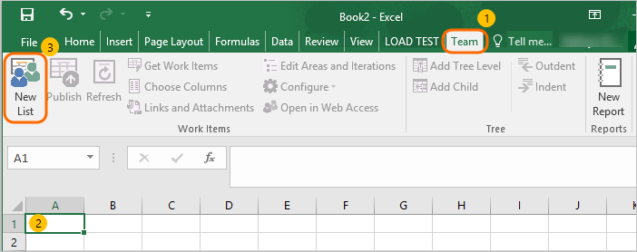
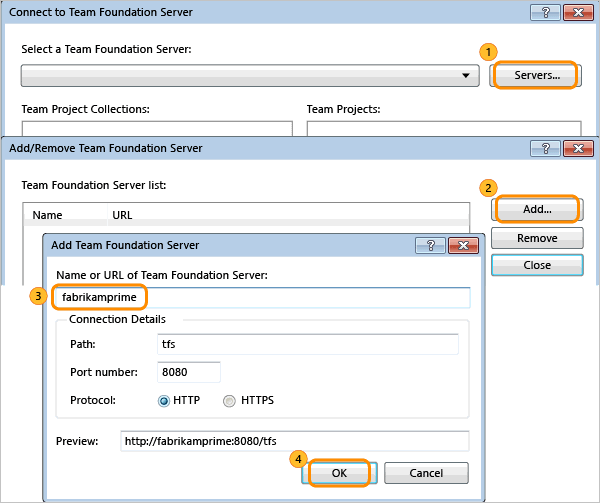

# Work in Microsoft Excel or Project 

[!INCLUDE [temp](../../_shared/version-vsts-tfs-all-versions.md)]

To support your work tracking efforts, you can use Microsoft Excel and Microsoft Project. You can decide to either work in an online mode where you are connected to either Azure Boards or Team Foundation Server (TFS), or in an offline mode where you access the local computer and document.  
  
> [!IMPORTANT]  
> You may receive the following error if you install Microsoft Office 2010 on the same computer as a previous version of Office.  
>   
>  **Team Foundation Error**  
>   
>  **Interface not registered (Exception from HRESULT: 0x80040155)**  
>   
>  You may be able to resolve this error by repairing Office. You can access the Repair option by opening the **Control Panel**, choose **Uninstall or change a program**, open the context menu for Office 2010, and then choose **Change**. See also, [TFS-Office integration issues](tfs-office-integration-issues.md).  
  
You can start work from Excel, Project, or Team Explorer. Your worksheet or project plan can be tied to a list of work items or a work item query.  
  
To work in Excel, see [Bulk add work items with Excel](bulk-add-modify-work-items-excel.md).   
  
  
  
To work in Project, see [Create your backlog and tasks using Project](create-your-backlog-tasks-using-project.md).

  
  

 When you import work items into Excel or Project, local copies of your work items are created. The data in the local document at first matches the data in the database, but you or other team members can change the data about work items and cause the two to differ. To view the most recent changes from the database, refresh the document. This downloads the latest values in the data store to your local document. To write changes from the document to the database, publish the changes. Publishing uploads the changes you made to the work item tracking data store.   

## Work offline and reconnect to Azure Boards and TFS
One advantage of working in Excel or Project is that you can work offline and add or modify work items. The following procedures show you how to disconnect an Excel work item list or a Project plan from Azure Boards and TFS and later reconnect to synchronize the document with the work item database.  
  
> [!NOTE]
>  If the project that contains work items for your Excel or Project document is moved to a different organization, project collection or TFS instance, you must reconfigure the server to which the document connects. For more information, see [Connect to Excel or Project](#excel-project) later in this article.  
  

 
##  Disconnect  a document file from the network  
  
To disconnect a an Excel or Project document file from the network:  
  
1.  Open the document that you want to change while you are offline.  
  
2.  Refresh the work item list to retrieve the latest information from the work item database.    
    -   If you are using Excel, on the **Team** ribbon, in the **Work Items** group, choose **Refresh**.    
    -   If you are using Project, on the **Team** menu, choose **Refresh**.  
 
3.  If you are using Excel, add to the work item list the columns for all fields that you want to modify.  
  
     You can't add columns when the work item list is disconnected from the server.  
  
4.  Disconnect your computer from the network, or save the work item list file and copy it to another computer.  
  
     An error message might appear that tells you that the Office program could not establish a connection with TFS.  
  
5.  Modify or update the work item list as needed.  
  
    > [!NOTE]
    >  You can't create most types of links between work items when the work item document is disconnected from the system. The exceptions are parent-child links in an Excel tree list, and both parent-child and predecessor-successor links in a Project plan.  
  
 
###  Reconnect a file to Azure Boards and TFS 
  
To reconnect an Excel or Project document file:  
  
1.  Reconnect your computer to the network, or copy the file to a computer that is connected to Azure Boards and TFS.  
  
2.  If you changed the document while you were offline, follow one of these steps:    
    -   If you are using Excel, on the **Team** ribbon, in the **Work Items** group, choose **Publish**.    
    -   If you are using Project, on the **Team** menu, choose **Publish Changes**.  
  
3.  If you didn't change the document while you were offline, follow one of these steps:    
    -   If you are using Excel, on the **Team** ribbon, in the **Work Items** group, choose **Refresh**.    
    -   If you are using Project, on the **Team** menu, choose **Refresh**.  
  
4.  Resolve any data validation errors or conflicts that occur.  

## Connect from Excel or Project

To add or modify work items by using Excel or Project, you connect your worksheet or project plan to a project. Establishing this connection binds the document to the Azure DevOps project to exchange information. 
 
### Connect from a worksheet or project plan

To follow these procedures, you must be a member of the **Readers** group or have your **View work items in this node** permission set to **Allow**. 

1.  If you don't have Excel 2007 or a more recent version, [install it](https://products.office.com/excel). For TFS 2017 or TFS 2018, you'll need Project 2010 or a more recent version. For client compatibility, see [Client compatibility](/azure/devops/server/compatibility)

2.  If you haven't installed a version of [Visual Studio (2010 or later)](https://visualstudio.microsoft.com/downloads/download-visual-studio-vs) or [Team Foundation Server Standalone Office Integration (free)](https://visualstudio.microsoft.com/downloads/?q=Office+Integration), you'll need to install one of these versions to connect to a project defined on Azure DevOps Services or an on-premises TFS. 

	> [!NOTE]  
	> The only way to get the Team Foundation add-in to Excel is by installing Visual Studio or [TFS Standalone Office Integration](https://visualstudio.microsoft.com/downloads/?q=Office+Integration).   

3.  Start with a blank worksheet or project plan. If you don't see the **Team** ribbon (or the **Team** menu if you use Excel 2007 or Project 2007), see step 2.

    

    > [!TIP]    
    > If the **Team** ribbon no longer appears, you might need to [re-enable it](/visualstudio/vsto/how-to-re-enable-a-vsto-add-in-that-has-been-disabled).

4.  Connect to an Azure DevOps organization or a TFS instance and the project. If you can't connect, [get added as a team member](../../../organizations/security/add-users-team-project.md).

    

    If it is your first time connecting from Excel or Project, you might have to add the Azure DevOps organization or TFS server to the list of recognized servers.

    

5.  Your worksheet or project plan is now bound to your project. What this means is that you can add work items to the project from the Office document or add work items to the Office document from the project.

    To learn more, see [Bulk add work items with Excel](bulk-add-modify-work-items-excel.md) or [Create your backlog and tasks using Project](create-your-backlog-tasks-using-project.md).

> [!NOTE]  
> If the project is moved to a different project collection in the same instance of TFS, your documents will automatically be reconnected. However, if the project is moved to a different instance of TFS, you must manually reconnect your documents to the new server.

### Work offline

An advantage to using Excel or Project is that you can work offline to add or modify work items. Complete the following procedures to disconnect an Excel worksheet or Project plan and later reconnect to synchronize your updates with the work item database.

### Disconnect the document from a project

1.  Open the document that you want to change while you are offline.

2.  Follow one of the following steps:

    -   If you are using Excel, on the **Team** ribbon, in the **Work Items** group, choose **Refresh**.

    -   If you are using Project, on the **Team** menu, choose **Refresh**.

    This step refreshes the work item list to retrieve the latest information from the work item database.

3.  If you are using Excel, add to the work item list the columns for all fields that you want to modify.

    You cannot add columns when the work item list is not connected to TFS.

4.  Save your Excel or Project file. You can now modify the information even if you are offline, disconnected from the project or network. 

5.  Change the work item list as needed.

### Reconnect the document to the project

1.  Make sure your computer is online.  

2.  If you changed the document while you were offline, follow one of these steps:

    -   If you are using Excel, on the **Team** ribbon, in the **Work Items** group, choose **Publish**.

    -   If you are using Project, on the **Team** menu, choose **Publish Changes**.

3.  If you did not change the document while you were offline, follow one of these steps:

    -   If you are using Excel, on the **Team** ribbon, in the **Work Items** group, choose **Refresh**.

    -   If you are using Project, on the **Team** menu, choose **Refresh**.

4.  Resolve any data validation errors or conflicts that occur.
5.  
## Related articles

- [Bulk add or modify work items with Excel](bulk-add-modify-work-items-excel.md)  
- [Create your backlog and tasks using Project](create-your-backlog-tasks-using-project.md)  
- [Create your backlog](../../backlogs/create-your-backlog.md)
- [Requirements and compatibility](/azure/devops/server/requirements) 

### Can I open a query in Excel or Project from the web portal?  

To open Excel from the web portal, install the [VSTS Open in Excel](https://marketplace.visualstudio.com/items?itemName=blueprint.vsts-open-work-items-in-excel) Marketplace extension. Otherwise, you can open [Excel](bulk-add-modify-work-items-excel.md) or [Project](create-your-backlog-tasks-using-project.md) and then open a query that you've created in the web portal. 

 
## Resolve publishing errors  
To resolve publishing errors that arise when working in Excel or Project, see the following topics:   
  
- [Resolve data conflicts](resolve-excel-data-conflicts-publish-refresh.md): 
	A data conflict occurs when one team member changes a field value in either Project or Excel at the same time another team member changes the same field in Team Foundation Server.

- [Resolve data validation errors](resolve-excel-data-validation-errors.md):
	A data validation error occurs if a team member changes a work item in a way that violates the rules for that type of work item.
  
- [Resolve invalid links in a tree hierarchy](resolve-excel-invalid-links-tree-list.md):
	An invalid link occurs if a team member views work items in Excel as a hierarchy or tree list, and moves a work item or sorts the list so that it breaks the dependencies between work items. You can resolve this error by reviewing the error message and repositioning work items to reflect the work item structure.

- [Address inaccuracies published for summary values](../../../report/sql-reports/address-inaccuracies-published-for-summary-values.md): 
	If you determine that hours are counted twice in reports that contain task hours, you can correct the problem by using the Work Items With Summary Values team query.

 
