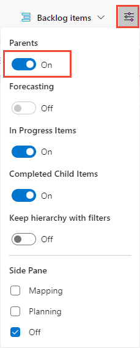
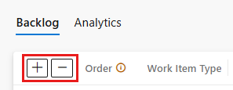
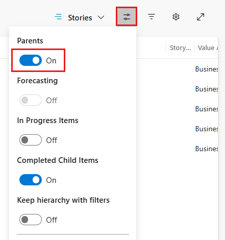
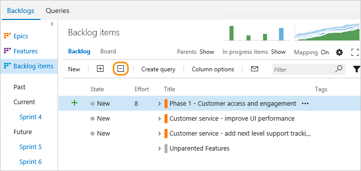
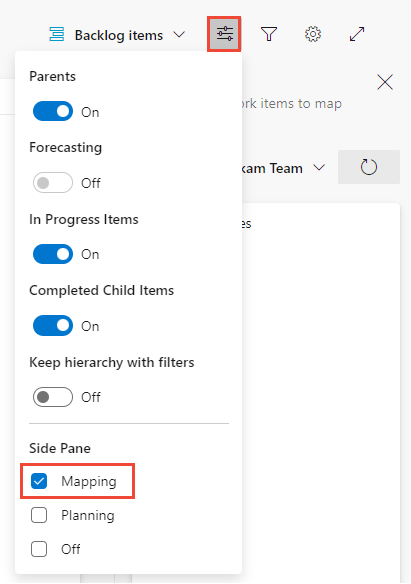
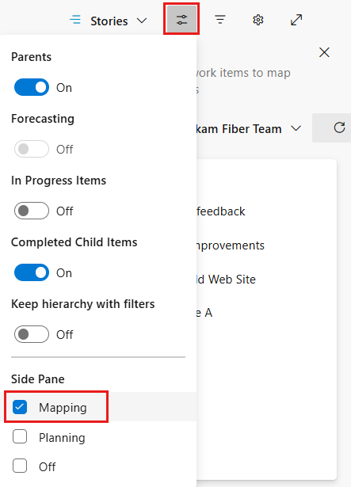
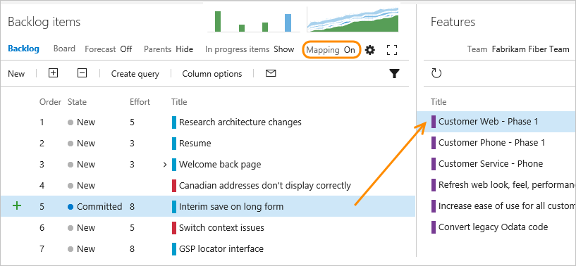
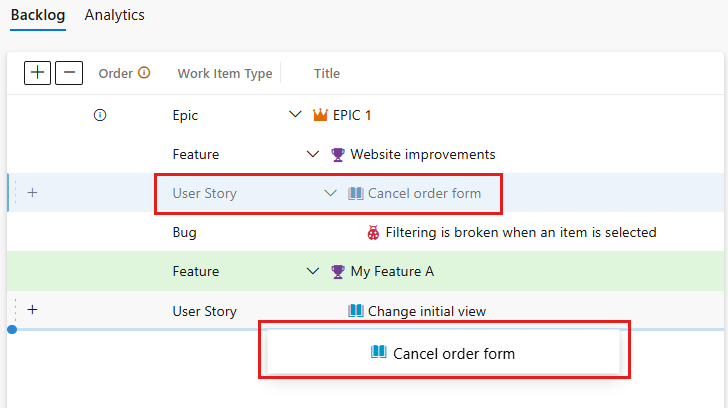
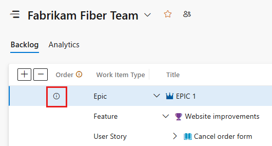
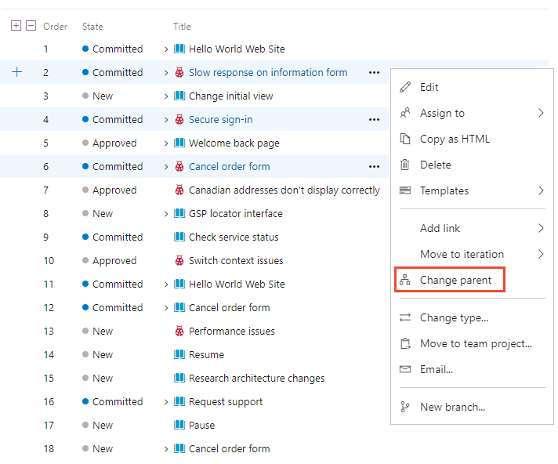

# Organize your backlog and map child work items to parents in Azure Boards

[!INCLUDE [version-lt-eq-azure-devops](../../includes/version-lt-eq-azure-devops.md)]

After you've added [features or epics](define-features-epics.md) to your portfolio backlog, organize your backlog by mapping backlog items. You can quickly add and group items into a hierarchy. And also drill up or down within the hierarchy, reorder and reparent items, and filter hierarchical views.  

In this article you'll learn how to:  
 
> [!div class="checklist"]    
> * Open your product backlog or portfolio backlog  
> * View the tree hierarchy  
> * Group backlog items using the Mapping pane  
> * Reparent items through dragging or the **Change parent** option  

[!INCLUDE [temp](../includes/setup-backlogs-boards.md)]

[!INCLUDE [temp](../includes/prerequisites.md)]

::: moniker range="azure-devops"  

> [!NOTE]   
> **Stakeholder** access users for a private project can't drag items to map or reparent them or to assign their sprint. 

::: moniker-end

::: moniker range="< azure-devops"  

> [!NOTE]   
> **Stakeholder** access users can't drag items to map or reparent them or to assign their sprint. 

::: moniker-end  

## Open your backlog from the web portal

From your web browser, open your product backlog.  

::: moniker range=">= azure-devops-2020"

1. (1) Check that you've selected the right project, (2) choose **Boards>Backlogs**, and then (3) select the correct team from the team selector menu. 

	> [!div class="mx-imgBorder"]  
	> 

    To select another backlog, open the selector and then choose a different team or select the **View Backlog directory** option. Or, enter a keyword in the search box to filter the list of team backlogs for the project.

	> [!div class="mx-imgBorder"]  
	>  

	> [!TIP]    
	> Choose the :::image type="icon" source="../../media/icons/icon-favorite-star.png" border="false"::: star icon to favorite a team backlog. Favorited artifacts (:::image type="icon" source="../../media/icons/icon-favorited.png" border="false"::: favorited icon) appear at the top of the team selector list. 

1. Check that you have selected **Stories** (for Agile), **Issues** (for Basic), **Backlog items** (for Scrum), or **Requirements** (for CMMI) as the backlog level. 

	> [!div class="mx-imgBorder"]  
	>  

2. (Optional) To choose which columns should display and in what order, choose the  :::image type="icon" source="../../media/icons/actions-icon.png" border="false"::: actions icon and select **Column options**. For more information, see [Change column options](../backlogs/set-column-options.md). 

	> [!div class="mx-imgBorder"]  
	>  

::: moniker-end

::: moniker range="azure-devops-2019"

1. (1) Check that you've selected the right project, (2) choose **Boards>Backlogs**, and then (3) select the correct team from the team selector menu. 

	

	To choose another team, open the selector and select a different team or choose the :::image type="icon" source="../../media/icons/home-icon.png" border="false"::: **Browse all backlogs** option. Or, you can enter a keyword in the search box to filter the list of team backlogs for the project.

	> [!div class="mx-imgBorder"]  
	>  

	> [!TIP]    
	> Choose the :::image type="icon" source="../../media/icons/icon-favorite-star.png" border="false"::: star icon to favorite a team backlog. Favorited artifacts (:::image type="icon" source="../../media/icons/icon-favorited.png" border="false"::: favorited icon) appear at the top of the team selector list. 

1. Check that you have selected **Backlog items** (for Scrum), **Stories** (for Agile), or **Requirements** (for CMMI) as the backlog level. 

	> [!div class="mx-imgBorder"]  
	>  

2. (Optional) To choose which columns should display and in what order, choose the :::image type="icon" source="../../media/icons/actions-icon.png" border="false"::: actions icon and select **Column options**. For more information, see [Change column options](../backlogs/set-column-options.md). 

	> [!div class="mx-imgBorder"]  
	>  

::: moniker-end

::: moniker range="tfs-2018"

From your web browser, open your team's product backlog. (1) Select the team from the project/team selector, choose (2) **Work**, (3) **Backlogs**, and then (4) the product backlog, which is **Backlog items** (for Scrum), **Stories** (for Agile), or **Requirements** (for CMMI). 

> [!div class="mx-imgBorder"]
>  

To choose another team, open the project/team selector and select a different team or choose the **Browse** option. 

> [!div class="mx-imgBorder"]  
>  
	
::: moniker-end

[!INCLUDE [temp](../includes/image-differences-with-wits.md)]

## Show parent tasks and expand the tree hierarchy  

::: moniker range="azure-devops"

You can set various options to view backlog work items using the **View options** menu. To learn which options to set based on the tasks you want to accomplish, see [Configure your backlog view](configure-your-backlog-view.md). 

1. To view Parents or a tree hierarchy, choose the :::image type="icon" source="../../media/icons/view-options-icon.png" border="false"::: view options icon and slide **Parents** to **On**.  

	> [!div class="mx-imgBorder"]
	> 

	The hierarchical view displays. From this view, you can reparent items by dragging a child item to a new parent. 

	> [!div class="mx-imgBorder"]
	> 

1. Use the :::image type="icon" source="../media/icons/expand_icon.png" border="false"::: **Expand** and :::image type="icon" source="../media/icons/collapse_icon.png" border="false"::: **Collapse** icons to expand or collapse one level of the hierarchy.   

	> [!div class="mx-imgBorder"]  
	>   

::: moniker-end

::: moniker range=">= azure-devops-2019 < azure-devops"

You can set various options to view backlog work items using the **View options** menu. To learn which options to set based on the tasks you want to accomplish, see [Configure your backlog view](configure-your-backlog-view.md). 

1. To view Parents or a tree hierarchy, choose  :::image type="icon" source="../../media/icons/view-options-icon.png" border="false"::: **View options** and slide **Parents** to **On**.  

	> [!div class="mx-imgBorder"]
	> 

	The hierarchical view displays. From this view, you can reparent items by dragging a child item to a new parent. 

	> [!div class="mx-imgBorder"]
	> 

1. Use the :::image type="icon" source="../media/icons/expand_icon.png" border="false"::: **Expand** and :::image type="icon" source="../media/icons/collapse_icon.png" border="false"::: **Collapse** icons to expand or collapse one level of the hierarchy.  

	> [!div class="mx-imgBorder"]  
	>    

::: moniker-end

::: moniker range="tfs-2018"

From the product backlog page, set **Parents** to **Show** when you want to drill up or down within the hierarchy. You can also drag items to reparent items from this view.   

 

Use the :::image type="icon" source="../media/icons/expand_icon.png" border="false"::: **Expand** and :::image type="icon" source="../media/icons/collapse_icon.png" border="false"::: **Collapse** icons to expand or collapse one level of the hierarchy.  
  
 

::: moniker-end

## Map items to group them under a feature or epic 

If you've already created your backlog, and now you want to organize it, you can do that most easily by mapping child items to parents.   

::: moniker range="azure-devops"

1. Choose :::image type="icon" source="../../media/icons/view-options-icon.png" border="false"::: **View options** and select **Mapping**.  

	> [!div class="mx-imgBorder"]
	> 

	The Mapping pane displays immediately. 

1. Find Unparented backlog items that may appear at the end of the parented set of backlog items. Parents must be turned on in view options. 

   > [!div class="mx-imgBorder"]
   > 

2. To map features to epics, select the **Features** backlog from the backlog selector. The Epics Mapping pane automatically displays. 

::: moniker-end

::: moniker range=">= azure-devops-2019 < azure-devops"

1. Choose :::image type="icon" source="../../media/icons/view-options-icon.png" border="false"::: **View options** and select **Mapping**.  

	> [!div class="mx-imgBorder"]
	> 

	The Mapping pane displays immediately. 

1. Find Unparented backlog items that may appear at the end of the parented set of backlog items. Parents must be turned on in view options. 

   > [!div class="mx-imgBorder"]
   > 

2. To map features to epics, select the **Features** backlog from the backlog selector. The Epics Mapping pane automatically displays. 

::: moniker-end

::: moniker range="tfs-2018"

To map a backlog item under a feature, you first turn on mapping from your backlog (Backlog items, Stories, or Requirements). Next, find the Unparented backlog items group by turning the **Parents** control to **Show**. Unparented backlog items appear at the end of the parented set of backlog items. 
 
Drag items that are currently unparented to the feature under which they belong. Also, you can drag a backlog item to a different feature to change its parent. This mapping creates parent-child links from feature to user stories, which is captured in the  (links) tab.

 

::: moniker-end

You can multi-select backlog and sprint backlog items in the same way as you [multi-select items from query results](../backlogs/bulk-modify-work-items.md).   

It's the same process to map features to epics. From the Features backlog, drag features to an epic listed under the mapping pane.  

## Change the parent task and reorder items

When you need to change the order or grouping, drag the item to its new location. 

You can reparent an item using the mapping pane, or drag it within the hierarchy to change its parent.  

> [!div class="mx-imgBorder"]  
>  

 You can only reparent backlog items under other features, and features under other epics. 

Also, to change an item's priority within a group, drag the item up or down within its hierarchical group. 
Reordering from a portfolio backlog works the same as when you [moved items into priority order on your product backlog](create-your-backlog.md).   

### Limitations on reordering backlog items owned by other teams

If you find you can't reorder a backlog item, check whether the  :::image type="icon" source="../../media/icons/info.png" border="false":::  info icon appears in the first column as shown in the following image. 

> [!div class="mx-imgBorder"]  
>  

You can reparent items owned by other teams, but you can't reorder items owned by other teams. For more information, see [Backlogs, portfolios, and Agile project management, Work with multi-team ownership of backlog items](backlogs-overview.md#multi-team). 

::: moniker range=">= azure-devops-2019"

## Change a parent of multiple backlog items 

From a product or portfolio backlog, you can multi-select several work items and choose **Change parent&hellip;** to link the items to a parent work item. 

::: moniker-end

::: moniker range="azure-devops"
> [!div class="mx-imgBorder"]  
> 

::: moniker-end

::: moniker range=">= azure-devops-2019 < azure-devops"
> [!div class="mx-imgBorder"]  
> 

::: moniker-end

[!INCLUDE [temp](../includes/add-portfolio-backlogs.md)]

[!INCLUDE [temp](../includes/display-rollup-section.md)]

## Related articles  

- [Define features and epics](define-features-epics.md)
- [Configure your backlog view](configure-your-backlog-view.md)
- [Work with multi-team ownership of backlog items](backlogs-overview.md#multi-team)
- [Select backlog navigation levels for your team](../../organizations/settings/select-backlog-navigation-levels.md)
- [Filter product and portfolio backlogs](filter-backlogs-boards-plans.md)
- [Keyboard shortcuts](../../project/navigation/keyboard-shortcuts.md)

