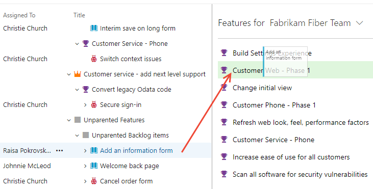
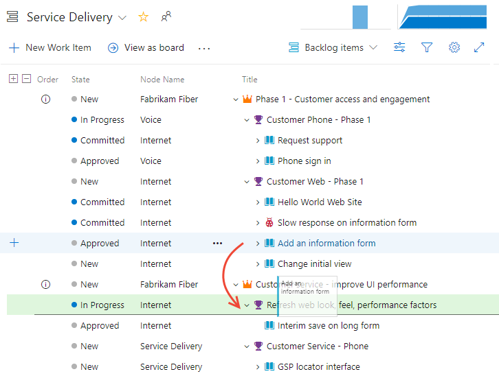
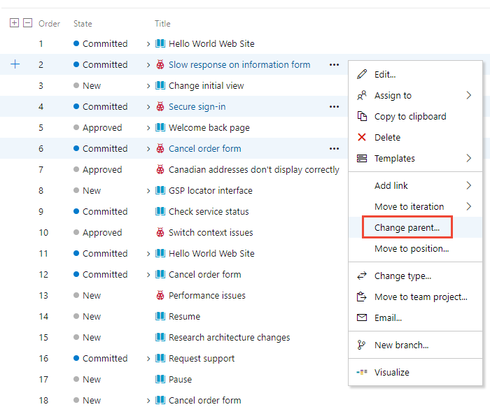

# Organize your backlog, map child work items to parents 

[!INCLUDE [temp](../_shared/version-vsts-tfs-all-versions.md)]

After you've added [features or epics](define-features-epics.md) to your portfolio backlog, you can quickly organize your backlog by mapping backlog items to them. With features and epics, you can quickly add and group items into a hierarchy, drill up or down within the hierarchy, reorder and reparent items, and filter hierarchical views.  

In this article you'll learn how to:  

::: moniker range=">= tfs-2018"

>[!div class="checklist"]    
> * Open your product backlog or portfolio backlog  
> * View the tree hierarchy  
> * Group backlog items using the Mapping pane  
> * Reparent items using drag-and-drop or the **Change parent** option  

::: moniker-end

::: moniker range=">= tfs-2013 <= tfs-2017"

>  [!div class="checklist"] 
> * Open your product backlog or portfolio backlog  
> * View the tree hierarchy  
> * Group backlog items using the Mapping pane  
> * Reparent items using drag-and-drop

::: moniker-end
 
::: moniker range="tfs-2013"
> [!NOTE]   
> The Epic portfolio backlog is supported in TFS 2015 and later versions.  

::: moniker-end

[!INCLUDE [temp](../_shared/setup-backlogs-boards.md)]

[!INCLUDE [temp](../_shared/prerequisites.md)]

::: moniker range="azure-devops"
Users with **Stakeholder** access for a private project can't use drag and drop to map or reparent work items or change their sprint. 
::: moniker-end

::: moniker range="<= azure-devops-2019"
Users with **Stakeholder** access can't use drag and drop to map or reparent work items or change their sprint. 
::: moniker-end

## Open your backlog from the web portal

From your web browser, open your product backlog.  

::: moniker range=">= azure-devops-2019"

0. (1) Check that you have selected the right project, (2) choose **Boards>Backlogs**, and then (3) select the correct team from the team selector menu. 

	

	To choose another team, open the selector and select a different team or choose the  **Browse all sprints** option. Or, you can enter a keyword in the search box to filter the list of team backlogs for the project.

	> [!div class="mx-imgBorder"]  
	>  

	> [!TIP]    
	> Choose the  star icon to favorite a team backlog. Favorited artifacts ( favorited icon) appear at the top of the team selector list. 

0. Check that you have selected **Backlog items** (for Scrum), **Stories** (for Agile), or **Requirements** (for CMMI) as the backlog level. 

	> [!div class="mx-imgBorder"]  
	>  

0. (Optional) To choose which columns should display and in what order, choose the  actions icon and select **Column options**. To learn more, see [Change column options](../backlogs/set-column-options.md). 

	> [!div class="mx-imgBorder"]  
	>  

::: moniker-end

::: moniker range=">= tfs-2017 <= tfs-2018"

From your web browser, open your team's product backlog. (1) Select the team from the project/team selector, choose (2) **Work**, (3) **Backlogs**, and then (4) the product backlog, which is **Backlog items** (for Scrum), **Stories** (for Agile), or **Requirements** (for CMMI). 

> [!div class="mx-imgBorder"]
>  

To choose another team, open the project/team selector and select a different team or choose the **Browse** option. 

> [!div class="mx-imgBorder"]  
>  
	
::: moniker-end

::: moniker range="<= tfs-2015"

From your web browser, open your team's product backlog. Select **Boards>Backlogs**. 

::: moniker-end

[!INCLUDE [temp](../_shared/image-differences-with-wits.md)]

## Show parents and expand the tree hierarchy  

::: moniker range=">= azure-devops-2019"

0. To view Parents or a tree hierarchy, choose the  view options icon and slide **Parents** to **On**.  

	> [!div class="mx-imgBorder"]
	> 

	The hierarchical view displays. From this view, you can reparent items by drag and drop, moving a child item to a new parent. 

	> [!div class="mx-imgBorder"]
	> 

0. Use the expand  and collapse  icons to expand or collapse one level of the hierarchy.  

	> [!div class="mx-imgBorder"]  
	>   

::: moniker-end

::: moniker range="<= tfs-2018"

From the product backlog page, set **Parents** to **Show** when you want to drill up or down within the hierarchy. You can also drag and drop items to reparent items from this view.   

 

Use the expand  and collapse  icons to expand or collapse one level of the hierarchy. 
  
 

::: moniker-end

## Map items to group them under a feature or epic 
If you've already created your backlog, and now you want to organize it, you can do that most easily by mapping child items to parents.   

::: moniker range=">= azure-devops-2019"

0. Choose the  view options icon and select **Mapping**.  

	> [!div class="mx-imgBorder"]
	> 

	The Mapping pane displays immediately. 

0.  Find Unparented backlog items which will appear at the end of the parented set of backlog items. Parents must be turned on in view options. 

	> [!div class="mx-imgBorder"]
	> 

0. To map features to epics, select the **Features** backlog from the backlog selector. The Epics Mapping pane will automatically display. 

::: moniker-end

::: moniker range="<= tfs-2018"

To map a backlog item under a feature, you first turn mapping on from your backlog (Backlog items, Stories, or Requirements). Next, find the Unparented backlog items group by turning the Parents control to Show. Unparented backlog items will appear at the end of the parented set of backlog items. 
 
Drag items that are currently unparented to the feature under which they belong. Also, you can drag a backlog item to a different feature to change its parent. This mapping creates parent-child links from feature to user stories, which is captured in the  (links) tab.

 

::: moniker-end

::: moniker range=">= tfs-2017"

You can multi-select work items on the backlog and sprint backlogs in the same way as [multi-select works within query results](../backlogs/bulk-modify-work-items.md).   
::: moniker-end

::: moniker range="tfs-2015"
Multi-select of work items on the backlog and sprint backlogs requires TFS 2015.1 or later versions. This feature works in the same way as [multi-select works within query results](../backlogs/bulk-modify-work-items.md).   
::: moniker-end

::: moniker range=">= tfs-2015"
It's the same process to map features to epics. From the Features backlog, drag features to an epic listed under the mapping pane.  

::: moniker-end

::: moniker range=">= tfs-2015"

## Change parent (re-parent) and reorder items
When you need to change the order or grouping, simply drag the item to its new location. 

You can re-parent an item using the mapping pane, or simply drag it within the hierarchy to change its parent.  

> [!div class="mx-imgBorder"]  
>  

 You can only re-parent backlog items under other features, and features under other epics. 

Also, to change an item's priority within a group, you can drag the item up or down within its hierarchical group. 
This works the same as when you [moved items into priority order on your product backlog](create-your-backlog.md).   

::: moniker-end

::: moniker range=">= tfs-2018"

## Change parent of multiple backlog items 

From the product backlog you can multi-select several work items and choose **Change parent&hellip;** to link the items to a parent work item item. 

> [!div class="mx-imgBorder"]  
> 

::: moniker-end

[!INCLUDE [temp](../_shared/add-portfolio-backlogs.md)]

## Related articles  

- [Define features and epics](define-features-epics.md)
- [Work with multi-team ownership of backlog items](backlogs-overview.md#multi-team)
- [Select backlog navigation levels for your team](../../organizations/settings/select-backlog-navigation-levels.md)
- [Product backlog controls](product-backlog-controls.md)
- [Filter product and portfolio backlogs](filter-backlogs.md)
- [Backlog keyboard shortcuts](backlogs-keyboard-shortcuts.md)

