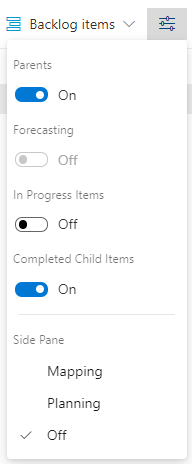
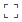

# Product backlog controls  

[!INCLUDE [temp](../includes/version-all.md)]

Once you've defined your product backlog, you can use the following controls to change or filter the view. 

> [!IMPORTANT]  
> If you turn the **In Progress** control off, then items that are in the *Active*, *Committed*, or *Resolved* states or in the In Progress category state won't appear in the backlog. 

:::row:::
   :::column span="":::
      **Icon or Link**
   :::column-end:::
   :::column span="":::
      **Control**
   :::column-end:::
   :::column span="2":::
      **Function**
   :::column-end:::
:::row-end:::
---
:::row:::
   :::column span="":::
      **Backlog**   
   :::column-end:::
   :::column span="":::
         
   :::column-end:::
   :::column span="2":::
      [Switch to backlog view](create-your-backlog.md) 
   :::column-end:::
:::row-end:::
::: moniker range=">= azure-devops-2020"
:::row:::
   :::column span="":::
      **Analytics**  
   :::column-end:::
   :::column span="":::
         
   :::column-end:::
   :::column span="2":::
      [Switch to Analytics in-context reports](../../report/dashboards/overview.md#work-tracking-analytics) 
   :::column-end:::
:::row-end:::
::: moniker-end
::: moniker range="<= tfs-2018"
:::row:::
   :::column span="":::
      **Board**  
   :::column-end:::
   :::column span="":::
         
   :::column-end:::
   :::column span="2":::
      [Switch to Kanban board](../boards/kanban-quickstart.md) 
   :::column-end:::
:::row-end:::
:::row:::
   :::column span="":::
      **Forecast**  
   :::column-end:::
   :::column span="":::
         
   :::column-end:::
   :::column span="2":::
      [Turn forecasting Off/On](../sprints/forecast.md) 
   :::column-end:::
:::row-end:::
:::row:::
   :::column span="":::
      **Mapping**  
   :::column-end:::
   :::column span="":::
         
   :::column-end:::
   :::column span="2":::
      [Turn mapping Off/On](organize-backlog.md)  
   :::column-end:::
:::row-end:::
:::row:::
   :::column span="":::
      **Parents**  
   :::column-end:::
   :::column span="":::
         
   :::column-end:::
   :::column span="2":::
      [Show/Hide parents](organize-backlog.md) 
   :::column-end:::
:::row-end:::
:::row:::
   :::column span="":::
      **In progress items** 
   :::column-end:::
   :::column span="":::
         
   :::column-end:::
   :::column span="2":::
      [Show/Hide in progress items](create-your-backlog.md#show-hide-in-progress)   
   :::column-end:::
:::row-end:::
:::row:::
   :::column span="":::
        
   :::column-end:::
   :::column span="":::
         
   :::column-end:::
   :::column span="2":::
      Email a copy of your backlog
   :::column-end:::
:::row-end:::
::: moniker-end
::: moniker range=">= azure-devops-2019"
:::row:::
   :::column span="":::
      :::image type="icon" source="../../media/icons/backlogs.png" border="false":::
   :::column-end:::
   :::column span="":::
      Backlog selector
   :::column-end:::
   :::column span="2":::
      [Switch backlog view](create-your-backlog.md)   
      > [!NOTE]
      > Your backlog levels may differ from that shown in the previous image based on the process selected or customizations made to your process. Other common labels are Backlog items (Scrum), Requirements (CMMI), and Issues (Basic). To learn more, see [Choose a process](../work-items/guidance/choose-process.md). 
   :::column-end:::
:::row-end:::
::: moniker-end
::: moniker range=">= azure-devops-2020"
:::row:::
   :::column span="":::
      :::image type="icon" source="../../media/icons/view-options-icon.png" border="false":::  
   :::column-end:::
   :::column span="":::
      View options
   :::column-end:::
   :::column span="2":::
      - [Turn Parents on/off](organize-backlog.md) (not available for top-level portfolio backlog) 
      - [Turn Forecasting on/off](../sprints/forecast.md) (Only available on product backlog) 
      - [Turn In Progress items on/off](create-your-backlog.md#show-hide-in-progress)  
      - [Turn Completed child items on/off](create-your-backlog.md#show-hide-completed)  
      - [Show Mapping](organize-backlog.md) (not available for top-level portfolio backlog) 
      - [Show Planning](../sprints/assign-work-sprint.md)  
        
   :::column-end:::
:::row-end:::
::: moniker-end
::: moniker range="azure-devops-2019"
:::row:::
   :::column span="":::
      :::image type="icon" source="../../media/icons/view-options-icon.png" border="false"::: 
   :::column-end:::
   :::column span="":::
      View options
   :::column-end:::
   :::column span="2":::
      - [Turn Parents on/off](organize-backlog.md) (not available for top-level portfolio backlog) 
      - [Turn Forecasting on/off](../sprints/forecast.md) (Only available on product backlog)  
      - [Turn In Progress items on/off](create-your-backlog.md#show-hide-in-progress)   
      - [Show Mapping](organize-backlog.md) (not available for top-level portfolio backlog) 
      - [Show Planning](../sprints/assign-work-sprint.md)  
        :::image type="icon" source="media/view-options.png" border="false":::
   :::column-end:::
:::row-end:::
::: moniker-end
::: moniker range=">= azure-devops-2019"
:::row:::
   :::column span="":::
        
   :::column-end:::
   :::column span="":::
      Filter
   :::column-end:::
   :::column span="2":::
      [Turn filtering On/Off](filter-backlogs-boards-plans.md)
   :::column-end:::
:::row-end:::
:::row:::
   :::column span="":::
       :::image type="icon" source="../../media/icons/blue-gear.png" border="false":::    
   :::column-end:::
   :::column span="":::
      Settings
   :::column-end:::
   :::column span="2":::
      [Manage teams and configure team tools](../../organizations/settings/manage-teams.md) 
   :::column-end:::
:::row-end:::
:::row:::
   :::column span="":::
       /   
   :::column-end:::
   :::column span="":::
      Full screen  
   :::column-end:::
   :::column span="2":::
      Enter or exit full screen mode
   :::column-end:::
:::row-end:::
::: moniker-end
::: moniker range="<= tfs-2018"
:::row:::
   :::column span="":::
          
   :::column-end:::
   :::column span="":::
      Filter
   :::column-end:::
   :::column span="2":::
      [Turn filtering On/Off](filter-backlogs-boards-plans.md)
   :::column-end:::
:::row-end:::
:::row:::
   :::column span="":::
         
   :::column-end:::
   :::column span="":::
      Settings
   :::column-end:::
   :::column span="2":::
      [Manage teams and configure team tools](../../organizations/settings/manage-teams.md) 
   :::column-end:::
:::row-end:::
:::row:::
   :::column span="":::
       /   
   :::column-end:::
   :::column span="":::
      Full screen mode  
   :::column-end:::
   :::column span="2":::
      Enter or exit full screen mode
   :::column-end:::
:::row-end:::
::: moniker-end
:::row:::
   :::column span="":::
       /  
   :::column-end:::
   :::column span="":::
      Expand/Collapse
   :::column-end:::
   :::column span="2":::
      Expand or collapse one level of the tree hierarchy
   :::column-end:::
:::row-end:::
::: moniker range=">= azure-devops-2019"
:::row:::
   :::column span="":::
       
   :::column-end:::
   :::column span="":::
      More commands  
   :::column-end:::
   :::column span="2":::
      - [Set column options](set-column-options.md)  
      - [Create Query](../queries/organize-queries.md)  
      - [Email](../work-items/email-work-items.md)   
   :::column-end:::
:::row-end:::
::: moniker-end
---

> [!NOTE]   
> Even if you have show parents turned on, the **Create Query** and **Email**  controls will only list items at the currently selected level. 
 

## Related articles

- [Backlogs, portfolios, and Agile project management](backlogs-overview.md)  
- [Workflow states and state categories](../work-items/workflow-and-state-categories.md)
