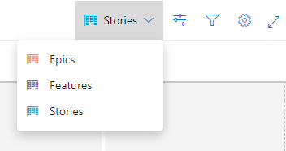
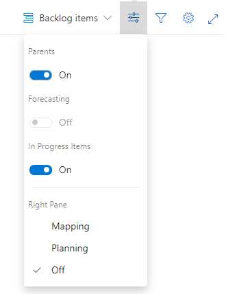

# Product backlog controls  

[!INCLUDE [temp](../_shared/version-vsts-tfs-all-versions.md)]

Once you've defined your product backlog, you can use the following controls to change or filter the view. 

::: moniker range=">= azure-devops-2019"

| Icon  | Control                  | Function              |
|---------|------------------------|--------------------|
|  | Backlog options  | [Switch backlog view](create-your-backlog.md)     |  
|  | View options |- [Turn Parents on/off](organize-backlog.md) - [Turn Forecasting on/off](../sprints/forecast.md) - [Turn In Progress items on/off](../sprints/forecast.md) - [Show Mapping](organize-backlog.md) - [Show Planning](../sprints/assign-work-sprint.md)  |  
|  |  Filter | [Turn filtering On/Off](filter-backlogs.md)  |   
|  | Settings   | [Manage teams and configure team tools](../../organizations/settings/manage-teams.md)  |  
|  /   | Full screen | Enter or exit full screen mode  |  
|  /  | Expand/Collapse | Expand or collapse one level of the tree hierarchy |   
|  | Actions options |- [Set column options](set-column-options.md) -[Create query](../queries/using-queries.md) - [Email](../work-items/email-work-items.md)  |  

> [!IMPORTANT]  
> If you turn the **In Progress** control off, then items that are in the *Active*, *Committed*, or *Resolved* states or in the In Progress category state won't appear in the backlog. 

<!---
| In progress items | [Show/Hide in progress items](../sprints/forecast.md)   |
| Board    | [Switch to Kanban board view](../boards/kanban-quickstart.md)  |
|   | Email a copy of your backlog      |
 
-->

::: moniker-end

::: moniker range="<= tfs-2018"

| Control                  | Function                      |
|--------------------------|-------------------------------|
| Backlog  | [Switch to backlog view](create-your-backlog.md)    |
| Board    | [Switch to Kanban board view](../boards/kanban-quickstart.md)  |
| Forecast | [Turn forecasting Off/On](../sprints/forecast.md) |
| Mapping | [Turn mapping Off/On](organize-backlog.md)   |
| Parents | [Show/Hide parents](organize-backlog.md) |
| In progress items | [Show/Hide in progress items](../sprints/forecast.md)   |
|     | [Manage teams and configure team tools](../../organizations/settings/manage-teams.md)  |
|  /   | Enter or exit full screen mode      |
|  /    | Expand or collapse one level of the tree hierarchy    |
|   | Email a copy of your backlog      |
|   | [Turn filtering On/Off](filter-backlogs.md)  |  

> [!IMPORTANT]  
> If you set the **In progress** control to **Hide**, then items that are in the *Active*, *Committed*, or *Resolved* states or in the In Progress category state won't appear in the backlog. 

::: moniker-end

Even if you have show parents turned on, the **Create query** and mail  controls will only list items at the currently selected level. 
 

## Related articles

- [Backlogs, portfolios, and Agile project management](backlogs-overview.md)  
- [Workflow states and state categories](../work-items/workflow-and-state-categories.md)