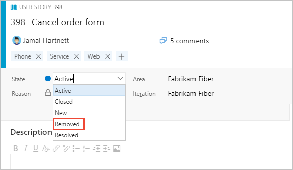
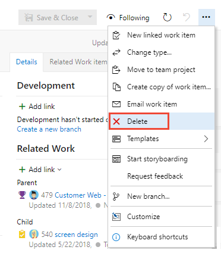
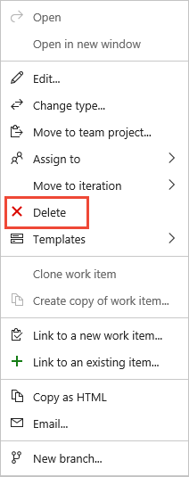
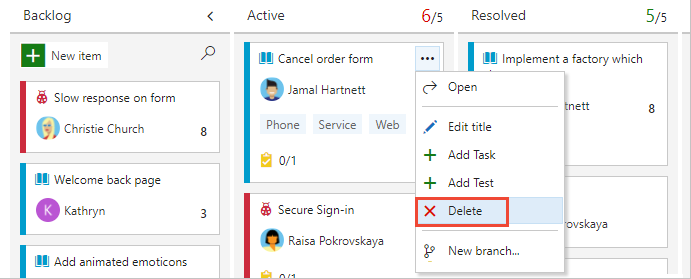
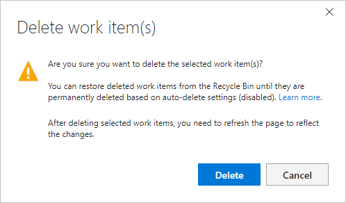
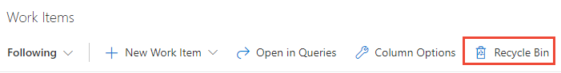

# Remove, delete, or restore work items 

[!INCLUDE [temp](../includes/version-all.md)]

Work items can live forever in your work tracking data store. You never have to delete them. However, depending on your business needs, you may want to one of the following actions: 

::: moniker range=">= tfs-2017"
- **Change state**: Remove work items from appearing on backlogs and boards by changing the work item **State** to *Remove* or *Cut*.  
- **Delete**: Remove work items from backlogs, boards, and queries. Deleted work items are moved to a Recycle Bin. From the **Recycle Bin**, you can restore or permanently delete them. 
- **Destroy**: Permanently delete work items, deleting all data from the work tracking data store. 
- **Restore**: Recover deleted work items, restoring them from the Recycle Bin.  
::: moniker-end

::: moniker range="tfs-2013"
- **Change state**: Remove work items from appearing on backlogs and boards by simply changing the work item **State** to *Remove* or *Cut*.  
- **Destroy**: Permanently delete work items, deleting all data from the work tracking data store. 
::: moniker-end

The ability to archive work items or projects isn't a supported feature at this time. 

::: moniker range=">= azure-devops-2019"
To move a work item from one project to another, or to change the work item type, see [Move work items, change work item type](move-change-type.md). 
::: moniker-end

::: moniker range=">= tfs-2017"
 
> [!NOTE]  
> For information about the Azure Artifacts Recycle Bin, see [Delete and recover packages](../../artifacts/how-to/delete-and-recover-packages.md).
::: moniker-end


## Prerequisites 


::: moniker range=">= tfs-2015"
- To remove, modify, or delete work items, you must be a member of the **Contributors** group or have the following permissions set to **Allow**. 
	- [Remove work items](#remove): Have the **View work items in this node** and **Edit work items in this node** Area Path permissions set to **Allow**.   
	- [Delete work items](#delete) and [Restore work items](#restore): Have the **Delete and restore work items** project-level permission set to **Allow**. Also, to restore work items, you must have **Basic** access or higher. Users with **Stakeholder** access can view the contents of the **Recycle Bin**, but can't restore or permanently delete items in the bin.  
::: moniker-end
::: moniker range="tfs-2013"
- To remove, modify, or delete work items, you must be a member of the **Contributors** group or have the following permissions set to **Allow**. 
	- [Remove work items](#remove): Have the **View work items in this node** and **Edit work items in this node** Area Path permissions set to **Allow**.  
::: moniker-end

::: moniker range=">= azure-devops-2020"
- To [Restore or destroy work items](#restore) or [Delete or destroy work items (az boards CLI)](#az-boards-cli), you must be a member of the **Project Administrators** group or have the **Delete work items in this project** project-level permission set to **Allow**.  
::: moniker-end

::: moniker range="azure-devops-2019"
- To [Restore or destroy work items](#restore), you must be a member of the **Project Administrators** group or have the **Delete work items in this project** project-level permission set to **Allow**.  
::: moniker-end

::: moniker range=">= tfs-2017 < azure-devops-2019"
- To [Restore or destroy work items](#restore) or [Destroy work items (witadmin CLI)](#witadmin-cli), you must be a member of the **Project Administrators** group or have the **Delete work items in this project** project-level permission set to **Allow**.  
::: moniker-end

::: moniker range="<= tfs-2015"
- To [Destroy work items (witadmin CLI)](#witadmin-cli), you must be a member of the **Project Administrators** group or have the **Delete work items in this project** project-level permission set to **Allow**.  
::: moniker-end
 
::: moniker range="<= tfs-2015"

> [!NOTE]  
> By default, for TFS 2015.1 and earlier versions, the Contributors group has **Delete work items in this project** set to **Not set**. This setting causes the Contributors group to inherit the value from the closest parent that has it explicitly set.
::: moniker-end


For a simplified view of permissions assigned to built-in groups, see [Permissions and access](../../organizations/security/permissions-access.md).  

::: moniker range="azure-devops" 
> [!NOTE]  
> Users with **Stakeholder** access for a public project have full access to all work tracking features just like users with **Basic** access. For details, see [Stakeholder access quick reference](../../organizations/security/stakeholder-access.md).

::: moniker-end

[!INCLUDE [temp](../../includes/version-selector-minimize.md)]

::: moniker range=">= tfs-2015"

## Remove or delete multiple work items 

You can act on individual work items or bulk modify several work items. 

From the web portal, you can multi-select several work items from a backlog or query results page and perform a bulk update using the associated feature. To delete or restore several work items at the same time, see [Bulk modify work items](bulk-modify-work-items.md).  

::: moniker-end

<a id="remove"> </a>  

## Remove work items

By changing the **State** of a work item to *Removed*, you effectively remove it from a backlog or board view (product, portfolio, and sprint backlogs, Kanban board, and Taskboards). The *Removed* state corresponds to the **Removed** workflow category state. If you define custom workflow states, any state you map to the **Removed** workflow category state will act in a similar way. 

> [!div class="mx-imgBorder"]  
>   

To cause removed items to not show up in queries, you must add a clause that filters on the **State** field.  

::: moniker range=">= azure-devops-2019"

> [!NOTE]  
> The *Removed* state isn't supported with the Basic process. It is only supported with the Agile, Scrum, and CMMI process work item types. The Basic process is available when you add a project to Azure DevOps Services or [Azure DevOps Server 2019 Update 1](https://go.microsoft.com/fwlink/?LinkId=2097609).  

::: moniker-end


<a id="delete"> </a> 
<a id="delete-work-items" />

::: moniker range=">= tfs-2015"

## Delete work items   

Deleted work items won't appear in your backlogs, boards, or queries. Deleted items are moved to a **Recycle Bin** from which you can recover them if needed. To delete a test case, test plan, or other test-related work item types, see [Delete test artifacts](delete-test-artifacts.md).  


::: moniker-end

::: moniker range=">= azure-devops-2019"

1. You can delete a work item from within the work item form, by multi-selecting work items from a backlog or query results page, or from a Kanban board or Taskboard. 

	To delete a single work item, open the work item, choose the  :::image type="icon" source="../media/icons/actions-icon.png" border="false"::: **Actions**, and select **Delete**. 

	> [!div class="mx-imgBorder"]
	>   
	To delete several work items, [multi-select them from a backlog or a query results list](bulk-modify-work-items.md) and then choose the  :::image type="icon" source="../media/icons/actions-icon.png" border="false"::: actions icon and select <strong>Delete</strong>. 

	> [!div class="mx-imgBorder"]
	>  

	To delete a work item from your Kanban or taskboard, choose the  :::image type="icon" source="../media/icons/actions-icon.png" border="false"::: actions icon of the card and select <strong>Delete</strong>. 
 
	> [!div class="mx-imgBorder"]  
	> 
	>
1. Confirm you want to actually delete the item(s).  

	> [!div class="mx-imgBorder"]
	>   


::: moniker-end

::: moniker range="tfs-2015"  

> [!NOTE]  
> The **Delete and Recycle Bin** features are available from TFS 2015.2 and later versions. 

::: moniker-end

::: moniker range=">= tfs-2015 <= tfs-2018"

1. You can delete a work item from within the work item form, or by multi-selecting work items from a backlog or query results page.   

	To delete a single work item, open the work item, choose the  :::image type="icon" source="../media/icons/actions-icon.png" border="false"::: **Actions**, and select **Delete**. 

	> [!div class="mx-imgBorder"]
	>   

	To delete several work items, [multi-select them from a backlog or a query results list](bulk-modify-work-items.md) and then choose the  :::image type="icon" source="../media/icons/actions-icon.png" border="false"::: actions icon and select <strong>Delete</strong>. 

	> [!div class="mx-imgBorder"]
	>   

	You can also delete work items from your Kanban or taskboard. 
 
	

	Or, you can drag them to the  (Recycle bin). You can only access the (Recycle bin) from the **Work** hub. 

2. Confirm you want to actually delete the item(s).  

	

	> [!NOTE]    
	> The Delete work items confirmation dialog for on-premises Azure DevOps may indicate there are auto-delete settings (disabled). There are no settings you can enable or disable. There is only a background process which permanently deletes work items that have been set to delete.   

::: moniker-end


<a id="restore" />
<a id="restore-or-permanently-delete-work-items" />

::: moniker range=">= tfs-2015"  

## Restore or destroy work items  

::: moniker-end

::: moniker range=">= azure-devops-2019"

You restore deleted work items or permanently delete them from the web portal Recycle Bin. 

1. Choose **Boards>Work Items** and then choose the **Recycle Bin**.  
 
	> [!div class="mx-imgBorder"]  
	> 

	If you don't see the **Recycle Bin** option, choose **More commands &hellip;** and choose it from the menu of options.

	> [!NOTE]   
	> Deleted test artifacts won't appear in the **Recycle Bin** and can't be restored. Deletion of test artifacts not only deletes the selected test artifact but also all its associated child items such as child test suites, test points across all configurations, testers (the underlying test case work item doesn't get deleted), test results history, and other associated history.

1.  A new browser tab opens with the query which lists work items added to the Recycle Bin. 
1.	Select the items you want to restore and then choose **Restore**.  
	 

	Optionally, you can choose to permanently delete the items.

	> [!NOTE] 
	> You can't open work items that have been moved to the **Recycle Bin**. Also, you'll only see the **Permanently delete option** if your [Permanently delete work items](../../organizations/security/set-permissions-access-work-tracking.md#move-delete-permissions) project-level permission is set to **Allow**.  

1.	Confirm your selection. 

::: moniker-end

<a id="restore-work-items" />

::: moniker range=">= tfs-2015 <= tfs-2018"  

You restore deleted work items from the web portal **Recycle Bin**. 

::: moniker-end  

::: moniker range="tfs-2015"  

> [!NOTE]  
> The **Delete** and **Recycle Bin** features require TFS 2015.2 or later version. 

::: moniker-end  

::: moniker range=">= tfs-2015 <= tfs-2018"  

1. Choose **Work>Backlog**s or **Work>Queries** and then choose the **Recycle Bin**.  
 
	

	A new browser tab opens with the query that lists work items added to the **Recycle Bin**. 

1. Select the items you want to restore  and then choose **Restore**.  

    

   Optionally, you can choose to permanently delete the items.

	> [!NOTE] 
	> You can't open work items that have been moved to the **Recycle Bin**. Also, you'll only see the **Permanently delete option** if your [Permanently delete work items](../../organizations/security/set-permissions-access-work-tracking.md#move-delete-permissions) project-level permission is set to **Allow**.  

2. Confirm your selection. 

::: moniker-end


<a id="az-boards-cli" />

::: moniker range=">= azure-devops-2020" 
 
## Delete or destroy work items (command line)

You can delete or destroy a work item with the [az boards work-item delete](/cli/azure/boards/work-item#ext-azure-devops-az-boards-work-item-delete) command. To get started, see [Get started with Azure DevOps CLI](../../cli/index.md).  

> [!NOTE] 
> You can restore work items you **delete**, but you can't restore work items you choose to **destroy**.

```azurecli 
az boards work-item delete --id
                           [--destroy]
                           [--org]
                           [--project]
                           [--yes] 
``` 

#### Parameters 

- **id**: Required. The ID of the work item.
- **destroy**: Optional. Permanently delete this work item.
- **org**: Azure DevOps organization URL. You can configure the default organization using `az devops configure -d organization=ORG_URL`. Required if not configured as default or picked up using `git config`. Example: `--org https://dev.azure.com/MyOrganizationName/`.
- **project**: Name or ID of the project. You can configure the default project using `az devops configure -d project=NAME_OR_ID`. Required if not configured as default or picked up using `git config`.
- **yes**: Optional. Do not prompt for confirmation.

#### Example 

The following command permanently deletes the bug with the ID 864 and doesn't prompt you for confirmation.

```azurecli
az boards work-item delete --id 864 --destroy --yes
```

::: moniker-end


::: moniker range="<= tfs-2018"

<a id="witadmin-cli" />
 
## Destroy work items (command line)  

Use the **witadmin destroywi** command to permanently remove work items from the data store. A permanent delete means all information in the work tracking data store is deleted and cannot be restored nor reactivated.  

> [!NOTE]   
> Deleting work items from the **witadmin** command line is deprecated for TFS 2018.2 and later versions, and not supported for Azure Boards cloud service.  

Open a Command Prompt window where the latest version of Visual Studio is installed and change the directory to where the **witadmin.exe** tool has been installed.  
::: moniker-end  
::: moniker range="tfs-2018"  
For example, you would change to the following directory for TFS 2018. (For other versions, see [Remove work items permanently (witadmin destroywi)](../../reference/witadmin/remove-work-items-permanently.md)).  

`%programfiles(x86)%\Microsoft Visual Studio\2018\Professional\Common7\IDE\CommonExtensions\Microsoft\TeamFoundation\Team Explorer`  
::: moniker-end
::: moniker range="tfs-2017"  
For example, you would change to the following directory for TFS 2017. (For other versions, see [Remove work items permanently (witadmin destroywi)](../../reference/witadmin/remove-work-items-permanently.md)).  

`%programfiles(x86)%\Microsoft Visual Studio\2017\Professional\Common7\IDE\CommonExtensions\Microsoft\TeamFoundation\Team Explorer`  
::: moniker-end
::: moniker range="tfs-2015"  
For example, you would change to the following directory for TFS 2015. (For other versions, see [Remove work items permanently (witadmin destroywi)](../../reference/witadmin/remove-work-items-permanently.md)).  

`cd %programfiles(x86)%\Microsoft Visual Studio 14.0\Common7\IDE` 
::: moniker-end
::: moniker range="tfs-2013"  
For example, you would change to the following directory for TFS 2013. (For other versions, see [Remove work items permanently (witadmin destroywi)](../../reference/witadmin/remove-work-items-permanently.md)).  

`cd %programfiles(x86)%\Microsoft Visual Studio 12.0\Common7\IDE` 
::: moniker-end
::: moniker range="tfs-2018"  
On a 32-bit edition of Windows, replace %programfiles(x86)% with %programfiles%.      

The **witadmin** command-line tool installs with any version of Visual Studio or Team Explorer. You can access this tool by installing the [free version of Visual Studio Community](https://visualstudio.microsoft.com/downloads/).  

- To delete several work items, enter the server name and directory path to the collection. For example:   

	``` CLI
	witadmin destroywi /collection:http://TFSServerName:8080/tfs/DefaultCollection /id:12,15,23
	```
- To delete a single work item, enter the ID as shown:  

	``` CLI
	witadmin destroywi /collection:http://TFSServerName:8080/tfs/DefaultCollection /id:2003
	```    
::: moniker-end

::: moniker range=">= tfs-2015"  

## How delete and restore actions work  

**When you delete a work item, the following actions occur:**

- Generates a new revision of the work item  
- Updates the **Changed By/Changed Date** fields to support traceability  
- Preserves the work item completely, including all field assignments, attachments, tags, and links  
- Causes the work item to become non-queryable and therefore won't appear in any work tracking experience, query result, or report  
- Updates charts accordingly, CFD, velocity, burndown and lightweight charts are updated to remove deleted work items  
- Removes work tracking extensions  
- Preserves trend data except for the latest value 
- Removes the work item from the data warehouse/cube similar to as if it was permanently removed.  


**When you restore a work item, the following actions occur:**   

- Causes a new revision of the work item to be made  
- Updates the **Changed By/Changed Date** fields to support traceability   
- Becomes queryable  
- All fields remain unchanged  
- History contains two new revisions, one for deletion, and one for restore  
- Reattaches work tracking extensions  
- Updates charts accordingly, CFD, velocity, burndown and lightweight charts are updated to include the restored work items  
- Restores trend data  
- Adds the work item back to the data warehouse/cube  
- Sets the area or iteration path fields to the root node if the previous area path or iteration paths were deleted.   

::: moniker-end


::: moniker range=">= tfs-2018"

##  REST API 

To programmatically delete, restore, and destroy work items, see one of the following REST API resources:  

- [Recycle bin REST API Reference](/rest/api/azure/devops/wit/recyclebin)
- [Work Items - Delete REST API Reference](/rest/api/azure/devops/wit/work%20items/delete)
  
::: moniker-end

## Related articles   

::: moniker range="> tfs-2018"  

- [Best tool to add, update, and link work items](../work-items/best-tool-add-update-link-work-items.md)  
- [View and add work items using the Work Items page](../work-items/view-add-work-items.md)  
- [Delete test artifacts](delete-test-artifacts.md) 
- [Set permissions and access for work tracking](../../organizations/security/set-permissions-access-work-tracking.md)  
- [Set permissions at the project-level or project collection-level](../../organizations/security/set-project-collection-level-permissions.md)  
- [Stakeholder access quick reference](../../organizations/security/stakeholder-access.md) 
::: moniker-end

::: moniker range="<= tfs-2018"  

- [Best tool to add, update, and link work items](../work-items/best-tool-add-update-link-work-items.md)  
- [View and add work items using the Work Items page](../work-items/view-add-work-items.md)  
- [Remove work items permanently (witadmin destroywi)](../../reference/witadmin/remove-work-items-permanently.md)
- [Delete test artifacts](delete-test-artifacts.md) 
- [Set permissions and access for work tracking](../../organizations/security/set-permissions-access-work-tracking.md)  
- [Set permissions at the project-level or project collection-level](../../organizations/security/set-project-collection-level-permissions.md)  
- [Stakeholder access quick reference](../../organizations/security/stakeholder-access.md) 

::: moniker-end
 

<!--- 
rest api 
ARCHIVE WORK ITEMS
 I am looking for a way to archive the work items to an on-premise file share as a Disaster Recovery solution. It would be good to have a tool or a feature in Azure DevOps that could do that for us.


::: moniker range="tfs-2013"  

> [!NOTE]  
> The **Delete and Recycle bin** features are available from TFS 2015.2 and later versions. The Delete option isn't available for TFS 2013. You can only delete work items from the **witadmin destroywi** command. 

::: moniker-end


In this article you'll learn:  


::: moniker range=">= azure-devops-2020"

> [!div class="checklist"]
> * Which permissions you need to delete, destroy, or restore work items   
> * How to remove work items from the backlog by changing the State  
> * How to delete work items  
> * How to restore or destroy work items (from the Recycle Bin, web portal)  
> * How to permanently delete work items (**az boards** command-line tool)  

::: moniker-end


::: moniker range="azure-devops-2019"

> [!div class="checklist"]
> * Which permissions you need to delete, destroy, or restore work items   
> * How to remove work items from the backlog by changing the State  
> * How to delete work items  
> * How to restore or permanently delete work items (from the Recycle Bin, web portal)  

::: moniker-end


::: moniker range=">= tfs-2015 < azure-devops-2019"

> [!div class="checklist"]
> * Which permissions you need to delete, destroy, or restore work items   
> * How to remove work items from the backlog by changing the State  
> * How to delete work items  
> * How to restore or permanently delete work items (from the Recycle Bin, web portal)  
> * How to permanently delete work items (**witadmin destroy** command-line tool)  
 
::: moniker-end

::: moniker range="tfs-2015"
 
> [!NOTE]  
> The **Delete** and **Recycle Bin** features are available from TFS 2015.2 and later versions.
::: moniker-end


::: moniker range="tfs-2013"

>[!div class="checklist"]         
> * Which permissions you need to remove or destroy work items   
> * How to remove work items from the backlog by changing the State to Removed     
> * How to permanently delete work items (**witadmin destroy** command-line tool)   

::: moniker-end
--> 
	
