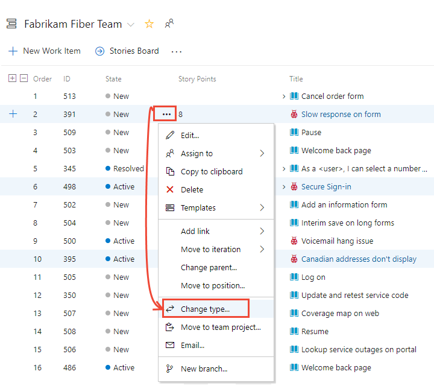

::: moniker range=">= azure-devops-2019"

# Move, change, or delete work items 

[!INCLUDE [temp](../_shared/azure-boards.md)]

Often times you find that someone created a work item of the wrong work item type (WIT) or within an incorrect project. You can correct these issues for individual work items or bulk modify several work items. You can also remove work items added to your backlog or taskboard that aren't relevant anymore.  


::: moniker-end

::: moniker range="<= tfs-2018"

# Delete or restore work items 

[!INCLUDE [temp](../../_shared/version-tfs-all-versions.md)]

You can remove work items added to your backlog or taskboard that aren't relevant anymore. Simply change the State to Remove, or delete the work item. You can perform operations on individual work items or bulk modify several work items. 

> [!TIP]    
You can't change the work item type for an existing work item, but you can [copy the work item and specify a new type](copy-clone-work-items.md#copy-clone). Also, if you have several work items with type changes you want to make, you can [export them using Excel](office/bulk-add-modify-work-items-excel.md), and then re-add them as a new type. 
::: moniker-end

In this article you'll learn:  

::: moniker range=">= azure-devops-2019"

> [!div class="checklist"]    
> * How to change the work item type of one or more work items   
> * How to move one or more work items to another project     
> * How to remove work items from the backlog by changing the State to Removed  
> * How to delete work items   
> * How to restore or permanently delete work items (web portal)
> * What permissions are required to delete work items   

::: moniker-end

[!INCLUDE [temp](../../_shared/version-selector-minimize.md)]

::: moniker range=">= tfs-2017 <= tfs-2018"

>[!div class="checklist"]         
> * How to remove work items from the backlog by changing the State to Removed 
> * How to delete work items  
> * How to restore or permanently delete work items (web portal)    
> * How to permanently delete work items (command-line tool)  
> * What permissions are required to delete work items    

::: moniker-end


::: moniker range="<= tfs-2015"

>[!div class="checklist"]         
> * How to remove work items from the backlog by changing the State to Removed     
> * How to permanently delete work items (command-line tool)  
> * What permissions are required to delete work items   

::: moniker-end

You only have access to those actions that are supported on your platform and for which you have permissions. If you are a member of the Contributors group (anyone who has been added as a team member) or Project Administrators groups, you have access to the following features. For a simplified view of permissions assigned to built-in groups, see [Permissions and access](../../organizations/security/permissions-access.md). 


You can access the following actions for which you have permissions. If you are a member of the Contributors group (anyone who has been added as a team member) or Project Administrators groups, you have access to the following features. For a simplified view of permissions assigned to built-in groups, see [Permissions and access](../../organizations/security/permissions-access.md). 

::: moniker range="azure-devops"

<table>
<tbody valign="top">
<tr>
<th width="50%">Contributors & Stakeholders</th>
<th width="50%">Project Administrators</th>
</tr>
<tr>
<td>
<ul>
<li>[Change work item type](#change-type)</li> 
<li>[Remove work items (change State)](#remove)</li>
<li>[Delete work items](#delete)</li>
<li>[Restore work items](#restore)</li>
</ul>
</td>
<td><ul>
<li>[Move a work item to another project](#move)</li>
<li>[Permanently delete work items](#restore) </li>
<li>[Permanently delete test artifacts](delete-test-artifacts.md)</li>
</ul>
</td>
</tr>
</tbody>
</table>


::: moniker-end

::: moniker range="azure-devops-2019"

<table>
<tbody valign="top">
<tr>
<th width="50%">Contributors & Stakeholders</th>
<th width="50%">Project Administrators</th>
</tr>
<tr>
<td>
<ul>
<li>[Change work item type](#change-type) <sup>1</sup></li> 
<li>[Remove work items (change State)](#remove)</li>
<li>[Delete work items](#delete)</li>
<li>[Restore work items](#restore)</li>
</ul>
</td>
<td><ul>
<li>[Move a work item to another project](#move) <sup>1</sup></li>
<li>[Permanently delete work items](#restore) </li>
<li>[Permanently delete test artifacts](delete-test-artifacts.md)</li>
</ul>
</td>
</tr>
</tbody>
</table>

**Notes:**
1. You can change the work item type or move work items to another project within a project collection. These features require that the data warehouse is disabled. With the data warehouse disabled, you'll use the [Analytics Service](/azure/devops/report/powerbi/what-is-analytics) to support your reporting needs. To learn more about disabling the data warehouse, see [Disable the data warehouse and cube](../../report/admin/disable-data-warehouse.md). 
::: moniker-end

::: moniker range=">= azure-devops-2019"

You can't change type, move work items, or delete/restore work items whose work item types support test management or that belong to the [Hidden Types Category](../work-items/agile-glossary.md#hidden-types). This includes all work items that track tests&mdash;such as test cases, shared steps, and shared parameters&mdash;code review requests and responses, and feedback requests and responses.   

::: moniker-end

::: moniker range=">= tfs-2017 <= tfs-2018"

<table>
<tbody valign="top">
<tr>
<th width="50%">Contributors & Stakeholders</th>
<th width="50%">Project Administrators</th>
</tr>
<tr>
<td>
<ul>
<li>[Remove work items (change State)](#remove)</li>
<li>[Delete work items](#delete)</li>
<li>[Restore work items](#restore)</li>
</ul>
</td>
<td>
<ul>
<li>[Permanently delete work items (web portal](#restore)</li>
<li>[Permanently delete work items (command-line)](#perm-delete)</li>
<li>[Permanently delete test artifacts](delete-test-artifacts.md)</li>
</ul>
</td>
</tr>
</tbody>
</table>


::: moniker-end

::: moniker range="tfs-2015"


<table>
<tbody valign="top">
<tr>
<th width="50%">Contributors & Stakeholders</th>
<th width="50%">Project Administrators</th>
</tr>
<tr>
<td>
<ul>
<li>[Remove work items (change State)](#remove)</li>
<li>[Delete work items](#delete)</li>
<li>[Restore work items](#restore)</li>
</ul>
</td>
<td><ul>
<li>[Permanently delete work items (web portal](#restore)</li>
<li>[Permanently delete work items (command-line)](#perm-delete)</li>
</ul>
</td>
</tr>
</tbody>
</table>


::: moniker-end

::: moniker range="tfs-2013"

- **Contributors & Stakeholders**: [Remove work items (change State)](#remove)  
- **Project Administrators**: [Permanently delete work items (command-line)](#perm-delete)  


::: moniker-end

::: moniker range=">= tfs-2015"

> [!TIP]  
> From the web portal, you can [multi-select several work items](bulk-modify-work-items.md) from a backlog or query results page and perform a bulk update using the associated feature.  To change, move, delete, or restore several work items at the same time, see [Bulk modify work items](bulk-modify-work-items.md). 

::: moniker-end

## Prerequisites  

::: moniker range="azure-devops"

* You must connect to a project. If you don't have a project yet, [create one](/azure/devops/boards/get-started/sign-up-invite-teammates). 
* You must be added to a project as a member of the **Contributors** or **Project Administrators** security group. To get added, [Add users to a project or team](/azure/devops/organizations/security/add-users-team-project). 
* To modify work items, you must have your **View work items in this node** and **Edit work items in this node** permissions set to **Allow**. By default, the **Contributors** group has this permission set. To learn more, see [Set permissions and access for work tracking](/azure/devops/organizations/security/set-permissions-access-work-tracking). 
* To change the work item type, delete, or remove work items, you must be granted **Stakeholder** access or higher  For details, see [About access levels](/azure/devops/organizations/security/access-levels).
* To move work items to another project, you must be a member of the **Project Administrators** group or have the **Move work items out of this project** permission set to **Allow**. By default, the **Contributors** group doesn't have this permission set.
* To delete work items, you must be a member of the **Project Administrators** group or have the **Delete work items in this project** permission set to Allow. By default, the Contributors group has **Delete and restore work items** set to **Allow**.

> [!NOTE]  
> Users with **Stakeholder** access for a public project have full access to all work tracking features just like users with **Basic** access. For details, see [About access levels](/azure/devops/organizations/security/access-levels).


::: moniker-end


::: moniker range="azure-devops-2019"

* You must connect to a project. If you don't have a project yet, [create one](/azure/devops/organizations/projects/create-project).
* You must be added to a project as a member of the **Contributors** or **Project Administrators** security group. To get added, [Add users to a project or team](/azure/devops/organizations/security/add-users-team-project). 
* To modify work items, you must have your **View work items in this node** and **Edit work items in this node** permissions set to **Allow**. By default, the **Contributors** group has this permission set. To learn more, see [Set permissions and access for work tracking](/azure/devops/organizations/security/set-permissions-access-work-tracking). 
* To change the work item type, delete, or remove work items, you must be granted **Stakeholder** access or higher.  For details, see [About access levels](/azure/devops/organizations/security/access-levels).
* To move work items to another project, you must be a member of the **Project Administrators** group or have the **Move work items out of this project** permission set to **Allow**. By default, the **Contributors** group doesn't have this permission set.
* To delete work items, you must be a member of the **Project Administrators** group or have the **Delete work items in this project** permission set to **Allow**. By default, the Contributors group has **Delete and restore work items** set to **Allow**.

::: moniker-end 


::: moniker range=">= tfs-2017 <= tfs-2018"

* You must connect to a project. If you don't have a project yet, [create one](/azure/devops/organizations/projects/create-project).
* You must be added to a project as a member of the **Contributors** or **Project Administrators** security group. To get added, [Add users to a project or team](/azure/devops/organizations/security/add-users-team-project). 
* To modify work items, you must have your **View work items in this node** and **Edit work items in this node** permissions set to **Allow**. By default, the **Contributors** group has this permission set. To learn more, see [Set permissions and access for work tracking](/azure/devops/organizations/security/set-permissions-access-work-tracking). 
* To remove or delete work items, you must be granted **Stakeholder** access or higher. For details, see [About access levels](/azure/devops/organizations/security/access-levels).
* To delete work items, you must be a member of the **Project Administrators** group or have the **Delete work items in this project** permission set to Allow. The **Contributors** group has **Delete and restore work items** at the project-level set to **Allow** by default.

::: moniker-end


::: moniker range="<= tfs-2015" 

* You must connect to a project. If you don't have a project yet, [create one](/azure/devops/organizations/projects/create-project).
* You must be added to a project as a member of the **Contributors** or **Project Administrators** security group. To get added, [Add users to a project or team](/azure/devops/organizations/security/add-users-team-project). 
* To modify work items, you must have your **View work items in this node** and **Edit work items in this node** permissions set to **Allow**. By default, the **Contributors** group has this permission set. To learn more, see [Set permissions and access for work tracking](/azure/devops/organizations/security/set-permissions-access-work-tracking). 
* To delete or remove work items, you must be granted **Stakeholder** access or higher. For details, see [About access levels](/azure/devops/organizations/security/access-levels).
* To delete work items, you must be a member of the **Project Administrators **group or have the **Delete work items in this project** permission set to **Allow**. By default, for TFS 2015.1 and earlier versions, the Contributors group has **Delete work items in this project** set to **Not set**. This setting causes the Contributors group to inherit the value from the closest parent that has it explicitly set.

::: moniker-end

To learn more, see [Set permissions and access for work tracking](../../organizations/security/set-permissions-access-work-tracking.md) or [Set permissions at the project-level or project collection-level](../../organizations/security/set-project-collection-level-permissions.md). 


::: moniker range=">= azure-devops-2019"

<a id="change-type"> </a>  

## Change the work item type 

Changing the work item type refreshes the work item form with the fields defined for the type selected. For example, you can change a bug to a task and the form will refresh with the fields defined for a task. 

> [!NOTE]  
> You can't change the work item type of work items associated with test management. Both Contributors and users assigned Stakeholder access can change the work item type.  

You can change a single work item or several [multi-selected work items](bulk-modify-work-items.md) to a new type. 

0. Open a work item, choose the  actions icon, and select the  **Change type...** option. 

	  

	Or, from the backlog or query results page, multi-select several work items whose type you want to change. You can select several work items of the same type or different type so long as you want to change them all to the same work item type.  

	Choose the  actions icon,  and select the  **Change type...** option.     

	> [!div class="mx-imgBorder"]  
	>   

	> [!IMPORTANT]   
	>From the Query results page, the **Change type&hellip;** option becomes unavailable if you have checked the Query Editor's **Query across projects** checkbox. 

2. Select the type and optionally enter a comment.  

	    

	Comments are automatically added to the [Discussion control](../work-items/work-item-form-controls.md#discussion). 

3. Save the work item to complete the change.  
 
	> [!NOTE]     
	> The system automatically resets the State and Reason fields to the default initial values of the specified type.  

	From the Query results page, you must save all work items that you bulk-modified. When you bulk modify items from the backlog, they are automatically saved. Work items shown in bold text indicate that local changes have not yet been saved to the data store. The system automatically saves each work item. Refresh the page to reflect your changes.   


::: moniker-end

::: moniker range=">= azure-devops-2019"

<a id="move"> </a>  

## Move a work item to another project  

When you discover that a work item belongs to a different project within your organization or collection, you can move it where it belongs. You can move a single work item or several [multi-selected work items](bulk-modify-work-items.md). 


You can only move work items from one project to another project within the organization or collection. You can't move work items associated with test management. To move work items to another project, you must be a member of the Project Administrators group or be [granted explicit permissions to move work items](../../organizations/security/set-permissions-access-work-tracking.md#move-delete-permissions).

1. Open the work item and choose the  **Move...** option from the work item form's  Actions menu.    

	If you don't see the option, then you haven't been granted [permissions to move work items out of the project](../../organizations/security/set-permissions-access-work-tracking.md#move-delete-permissions).  

	Or, from the backlog or query results page, multi-select several work items whose type you want to change. You can select several work items of the same type or different type so long as you want to change them all to the same work item type. 

	Choose the  actions icon to open the context menu of one of the selected work items, and choose the  **Move&hellip;** option. 

2. Select the destination project and optionally enter a comment.  

	
  
	Comments are automatically added to the [Discussion control](../work-items/work-item-form-controls.md#discussion) and an entry is made to the History control. Also, the system automatically resets the State and Reason fields to the default initial values for the work item type that you move.  

::: moniker-end


<a id="remove"> </a>  

## Remove work items

By changing the **State** of a work item to <em>Removed</em>, you effectively remove it from a backlog or board view (product, portfolio, and sprint backlogs, Kanban board, and taskboards).

> [!div class="mx-imgBorder"]  
>   

To cause removed items to not show up in queries, you must add a clause that filters on the **State** field. 

::: moniker range="azure-devops"

> [!NOTE]  
> The <em>Removed</em> state isn't supported with the Basic process. It is only supported with the Agile, Scrum, and CMMI process work item types. 

::: moniker-end

<a id="delete"> </a> 
::: moniker range=">= azure-devops-2019"

## Delete work items  

Deleted work items won't appear in your backlogs, boards, or queries. Deleted items are moved to a Recycle bin from which you can recover them if needed. To delete a test case, test plan, or test suite, or other test-related work item types, see [Delete test artifacts](delete-test-artifacts.md). 

0. You can delete a work item from within the work item form, by multi-selecting work items from a backlog or query results page, or from a Kanban board or taskboard. 

	To delete a single work item, open the work item, choose the  actions icon and select <strong>Delete</strong>. 

	> [!div class="mx-imgBorder"]
	>   
	To delete several work items, [multi-select them from a backlog or a query results list](bulk-modify-work-items.md) and then choose the  actions icon and select <strong>Delete</strong>. 

	> [!div class="mx-imgBorder"]
	>  

	To delete a work item from your Kanban or taskboard, choose the  actions icon of the card and select <strong>Delete</strong>. 
 
	> [!div class="mx-imgBorder"]  
	> 
	>
0. Confirm you want to actually delete the item(s).  

	> [!div class="mx-imgBorder"]
	>   


::: moniker-end

::: moniker range=">= tfs-2015 <= tfs-2018"

## Delete work items 
 
::: moniker-end  

::: moniker range="tfs-2015"  
> [!NOTE]  
> The **Delete and Recycle bin** features are available from TFS 2015.2 and later versions. 
::: moniker-end

::: moniker range=">= tfs-2015 <= tfs-2018"

Deleted work items won't appear in your backlogs, boards, or queries. Deleted items are moved to a Recycle bin from which you can recover them if needed. To delete a test case, test plan, or test suite, or other test-related work item types, see [Delete test artifacts](delete-test-artifacts.md). 

1. You can delete a work item from within the work item form, or by multi-selecting work items from a backlog or query results page.   

	To delete a single work item, open the work item, choose the  actions icon and select <strong>Delete</strong>. 

	> [!div class="mx-imgBorder"]
	>   

	To delete several work items, [multi-select them from a backlog or a query results list](bulk-modify-work-items.md) and then choose the  actions icon and select <strong>Delete</strong>. 

	> [!div class="mx-imgBorder"]
	>   

	You can also delete work items from your Kanban or taskboard. 
 
	

	Or, you can drag them to the  (Recycle bin). You can only access the (Recycle bin) from the **Work** hub. 

2. Confirm you want to actually delete the item(s).  

	

	> [!NOTE]    
	> The Delete work items confirmation dialog for on-premises TFS may indicate there are auto-delete settings (disabled). There are no settings you can enable or disable. There is only a background process which permanently deletes work items that have been set to delete.   

::: moniker-end

<a id="restore" />

::: moniker range=">= azure-devops-2019"

## Restore or permanently delete work items   

You restore deleted work items from the web portal Recycle bin. 

1. Choose **Boards>Work Items** and then choose the **Recycle bin**.  
 
	> [!div class="mx-imgBorder"]  
	> 

	A new browser tab opens with the query which lists work items added to the Recycle bin. 

2.	Select the items you want to restore and then choose **Restore**.  
 
	 
	> [!NOTE] 
	> You can't open work items that have been moved to the Recycle bin.  

	Optionally, you can choose to permanently delete the items.

	> [!NOTE] 
	> You'll only see the Permanently delete option if your [Permanently delete work items permission](../../organizations/security/set-permissions-access-work-tracking.md#move-delete-permissions) is set to Allow.  

3.	Confirm your selection. 

::: moniker-end

<a id="restore-work-items" />

::: moniker range=">= tfs-2015 <= tfs-2018"  

## Restore or permanently delete work items   

You restore deleted work items from the web portal Recycle bin. 

::: moniker-end  

::: moniker range="tfs-2015"  

> [!NOTE]  
> The <strong>Delete</strong> and <strong>Recycle bin</strong> features require TFS 2015.2 or later version.  

::: moniker-end  

::: moniker range=">= tfs-2015"

0. Choose <strong>Work>Backlogs</strong> or <strong>Work>Queries</strong> and then choose the <strong>Recycle bin</strong>.  
 
	

	A new browser tab opens with the query which lists work items added to the Recycle bin. 

0.	Select the items you want to restore  and then choose **Restore**.  
 
	 

	Optionally, you can choose to permanently delete the items.

	> [!NOTE] 
	> You'll only see the Permanently delete option if your [Permanently delete work items permission](../../organizations/security/set-permissions-access-work-tracking.md#move-delete-permissions) is set to Allow.  

3.	Confirm your selection. 

::: moniker-end


<a id="perm-delete" />
::: moniker range="<= tfs-2018"

## Permanently delete work items (command line)  

To permanently delete work items from the web portal, you must be a member of the Project Administrators group or be [granted explicit permissions to delete or restore work items](../../organizations/security/set-permissions-access-work-tracking.md#move-delete-permissions).
::: moniker-end

::: moniker range="tfs-2018"
Deleting work items from the command line is deprecated for TFS 2018.2 and later versions, and not supported for Azure Boards.
::: moniker-end

<a id="perm-delete"> </a>    
::: moniker range="<= tfs-2018"

Use the ```witadmin destroywi``` command to permanently remove work items from the data store. A permanent delete means all information in the work tracking data store is deleted and cannot be restored nor reactivated. You must be a member of the Project Administrators group of have your **Edit project-level information** permission set to Allow. 
::: moniker-end  

::: moniker range="tfs-2018"  
0. Open a Command Prompt window where the latest version of Visual Studio is installed and change the directory to where the **witadmin.exe** tool has been installed. For example, you would change to the following directory for TFS 2018. (For other versions, see [Remove work items permanently (witadmin destroywi)](../../reference/witadmin/remove-work-items-permanently.md)).  

	`%programfiles(x86)%\Microsoft Visual Studio\2018\Professional\Common7\IDE\CommonExtensions\Microsoft\TeamFoundation\Team Explorer`  

	On a 32-bit edition of Windows, replace %programfiles(x86)% with %programfiles%.      

	The **witadmin** command-line tool installs with any version of Visual Studio or Team Explorer. You can access this tool by installing the [free version of Visual Studio Community](https://visualstudio.microsoft.com/downloads/).  

0.	To delete several work items, enter the server name and directory path to the collection. For example:   

	```witadmin destroywi /collection:http://TFSServerName:8080/tfs/DefaultCollection /id:12,15,23```
 
	To delete a single work item, simply enter the ID as shown:  

	```witadmin destroywi /collection:http://TFSServerName:8080/tfs/DefaultCollection /id:2003```    

::: moniker-end

::: moniker range="tfs-2017"  
0. Open a Command Prompt window where the latest version of Visual Studio is installed and change the directory to where the **witadmin.exe** tool has been installed. For example, you would change to the following directory for TFS 2017. (For other versions, see [Remove work items permanently (witadmin destroywi)](../../reference/witadmin/remove-work-items-permanently.md)).  

	`%programfiles(x86)%\Microsoft Visual Studio\2017\Professional\Common7\IDE\CommonExtensions\Microsoft\TeamFoundation\Team Explorer`  

	On a 32-bit edition of Windows, replace %programfiles(x86)% with %programfiles%.      

	The **witadmin** command-line tool installs with any version of Visual Studio or Team Explorer. You can access this tool by installing the [free version of Visual Studio Community](https://visualstudio.microsoft.com/downloads/).  

0.	To delete several work items, enter the server name and directory path to the collection. For example:   

	```witadmin destroywi /collection:http://TFSServerName:8080/tfs/DefaultCollection /id:12,15,23```
 
	To delete a single work item, simply enter the ID as shown:  

	```witadmin destroywi /collection:http://TFSServerName:8080/tfs/DefaultCollection /id:2003```    

::: moniker-end

::: moniker range="tfs-2015"  

0. Open a Command Prompt window where the latest version of Visual Studio is installed and change the directory to where the **witadmin.exe** tool has been installed. For example, you would change to the following directory for TFS 2015. (For other versions, see [Remove work items permanently (witadmin destroywi)](../../reference/witadmin/remove-work-items-permanently.md)).  

	`cd %programfiles(x86)%\Microsoft Visual Studio 14.0\Common7\IDE` 

	> [!NOTE] 
	>**Required permissions:** For TFS 2015.2 or later versions, you must have [Permanently delete work items permission set to Allow](../../organizations/security/set-permissions-access-work-tracking.md#move-delete-permissions). For TFS 2015.1 or earlier versions, you must be a member of the Project Administrators group of have Edit project-level information permissions set to Allow. 	

	On a 32-bit edition of Windows, replace %programfiles(x86)% with %programfiles%.      

	The **witadmin** command-line tool installs with any version of Visual Studio or Team Explorer. You can access this tool by installing the [free version of Visual Studio Community](https://visualstudio.microsoft.com/downloads/).  

0.	To delete several work items, enter the server name and directory path to the collection. For example:   

	```witadmin destroywi /collection:http://TFSServerName:8080/tfs/DefaultCollection /id:12,15,23```
 
	To delete a single work item, simply enter the ID as shown:  

	```witadmin destroywi /collection:http://TFSServerName:8080/tfs/DefaultCollection /id:2003```    

::: moniker-end


::: moniker range="tfs-2013"  

0. Open a Command Prompt window where the latest version of Visual Studio is installed and change the directory to where the **witadmin.exe** tool has been installed. For example, you would change to the following directory for TFS 2013. (For other versions, see [Remove work items permanently (witadmin destroywi)](../../reference/witadmin/remove-work-items-permanently.md)).  

	`cd %programfiles(x86)%\Microsoft Visual Studio 12.0\Common7\IDE` 

	On a 32-bit edition of Windows, replace %programfiles(x86)% with %programfiles%.      

	The **witadmin** command-line tool installs with any version of Visual Studio or Team Explorer. You can access this tool by installing the [free version of Visual Studio Community](https://visualstudio.microsoft.com/downloads/).  

2.	To delete several work items, enter the server name and directory path to the collection. For example:   

	```witadmin destroywi /collection:http://TFSServerName:8080/tfs/DefaultCollection /id:12,15,23```
 
	To delete a single work item, simply enter the ID as shown:  

	```witadmin destroywi /collection:http://TFSServerName:8080/tfs/DefaultCollection /id:2003```    

::: moniker-end


## Related articles   

::: moniker range=">= tfs-2018"  
- [Best tool to add, update, and link work items](../work-items/best-tool-add-update-link-work-items.md)  
- [View and add work items using the Work Items page](../work-items/view-add-work-items.md)  
- [Remove work items permanently (witadmin destroywi)](../../reference/witadmin/remove-work-items-permanently.md)
- [Delete test artifacts](delete-test-artifacts.md) 
- [Create a test plan](../../test/create-a-test-plan.md)
- [Control how long to keep test results](../../test/how-long-to-keep-test-results.md) 

::: moniker-end

::: moniker range="tfs-2017"  

- [Best tool to add, update, and link work items](../work-items/best-tool-add-update-link-work-items.md)  
- [Delete test artifacts](delete-test-artifacts.md) 
- [Add, update, and follow a work item](../backlogs/add-work-items.md)  
- [Remove work items permanently (witadmin destroywi)](../../reference/witadmin/remove-work-items-permanently.md)

::: moniker-end


::: moniker range="<= tfs-2015"  

- [Best tool to add, update, and link work items](../work-items/best-tool-add-update-link-work-items.md)  
- [Add and update a work item](../backlogs/add-work-items.md)  
- [Remove work items permanently (witadmin destroywi)](../../reference/witadmin/remove-work-items-permanently.md)

::: moniker-end


::: moniker range=">= tfs-2015"  

### Delete and restore actions performed under the hood  

#### Delete work items 

When you delete a work item, the following actions occur:  

- Generates a new revision of the work item  
- Updates the Changed By/Changed Date fields to support traceability  
- Preserves the work item completely, including all field assignments, attachments, tags, and links  
- Causes work item to become non-queryable and therefore can't appear in any work tracking experience, query result, or report  
- Updates charts accordingly, CFD, velocity, burndown and lightweight charts are updated to remove deleted work items  
- Removes WIT extensions  
- Preserves trend data except for the latest value 
- Removes the work item from the data warehouse/cube similar to as if it was permanently removed.  

#### Restore work items

When you restore a work item, the following actions occur:   

- Causes a new revision of the work item to be made  
- Updates the Changed By/Changed Date fields to support traceability   
- Becomes queryable  
- All fields remain unchanged  
- History contains 2 new revisions, one for deletion, and one for restore  
- Reattaches WIT extensions   
- Updates charts accordingly, CFD, velocity, burndown and lightweight charts are updated to include the restored work items  
- Restores trend data  
- Adds the work item back to the data warehouse/cube similar  
- Sets the area or iteration path fields to the root node if the previous area path or iteration paths were deleted.   

::: moniker-end


