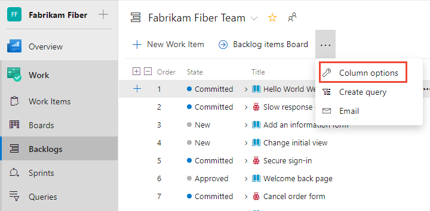
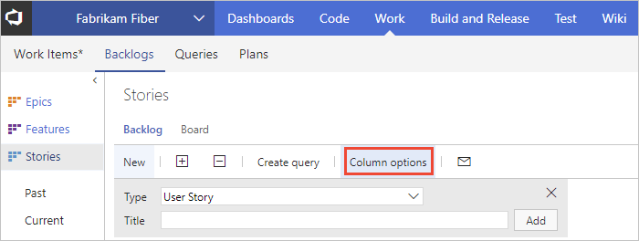
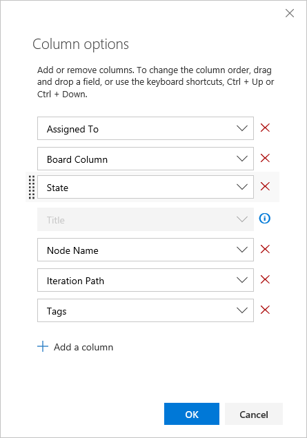
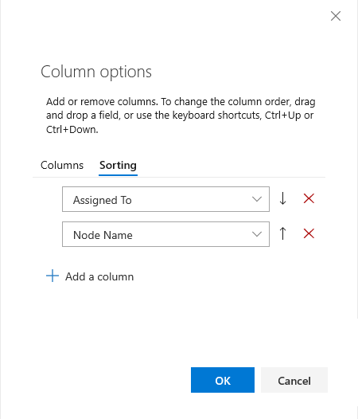

# Change column options 

[!INCLUDE [temp](../includes/version-all.md)]

Each column corresponds to a work item field. You can add and remove columns from work item lists to show the fields of interest to you. Or, you can drag a column to a new position. Your settings persist for each page you customize and are only valid for your views. 

Specifically, you can perform the following actions from the following list views:  

 
:::row:::
   :::column span="2":::
      **Action**
   :::column-end:::
   :::column span="":::
      [**Backlogs**](create-your-backlog.md)
   :::column-end:::
   :::column span="":::
      [**Sprint backlogs**](../sprints/assign-work-sprint.md)
   :::column-end:::
   :::column span="":::
      [**Queries**](../queries/view-run-query.md) 
   :::column-end:::
   :::column span="":::
      [**Work items**](../work-items/view-add-work-items.md)
   :::column-end:::
:::row-end::: 
:::row:::
   :::column span="2":::
      Add or remove a column field
   :::column-end:::
   :::column span="":::
      Yes
   :::column-end:::
   :::column span="":::
      Yes
   :::column-end:::
   :::column span="":::
      Yes
   :::column-end:::
   :::column span="":::
      Yes
   :::column-end:::
:::row-end::: 
::: moniker range=">= azure-devops-2020"
:::row:::
   :::column span="2":::
      Add or remove the Parent field
   :::column-end:::
   :::column span="":::
      Yes
   :::column-end:::
   :::column span="":::
      Yes
   :::column-end:::
   :::column span="":::
      Yes
   :::column-end:::
   :::column span="":::
      Yes
   :::column-end:::
:::row-end::: 
:::row:::
   :::column span="2":::
      Add or remove a rollup column
   :::column-end:::
   :::column span="":::
      Yes
   :::column-end:::
   :::column span="":::
      No
   :::column-end:::
   :::column span="":::
      No
   :::column-end:::
   :::column span="":::
      No
   :::column-end:::
:::row-end::: 
::: moniker-end
:::row:::
   :::column span="2":::
      Sort on a column
   :::column-end:::
   :::column span="":::
      No
   :::column-end:::
   :::column span="":::
      No
   :::column-end:::
   :::column span="":::
      Yes
   :::column-end:::
   :::column span="":::
      Yes
   :::column-end:::
:::row-end::: 

> [!TIP]    
> Unlike a query result, you can't sort a backlog by a column. However, you can use the **Create Query** link on each backlog to create a query that you can sort on any field column you choose from the **Sorting** tab of the Column options dialog. While you may be able to add a field to sort on, not all fields are supported. For example, selection of the **Parent**, **History**, **Description**, or other rich-text field will result in the display of an error message as you can't sort on these fields. 

::: moniker range="azure-devops"
You can add most fields listed in the [Work item field index](../work-items/guidance/work-item-field.md). All fields defined within the project collection or organization are available for selection, even those fields that aren't used for your particular project. You can view the list of fields defined for your collection from [**Organization Settings>Process>Fields**](../../organizations/settings/work/customize-process-field.md#review-fields)

::: moniker-end 

::: moniker range=">= azure-devops-2019 < azure-devops"

You can add most fields listed in the [Work item field index](../work-items/guidance/work-item-field.md). All fields defined within the project collection or organization are available for selection, even those fields that aren't used for your particular project. If your project uses the Inherited process model, you can view the list of fields defined for your collection from [**Organization Settings>Process>Fields**](../../organizations/settings/work/customize-process-field.md#review-fields)
::: moniker-end 

::: moniker range="<= tfs-2018"
You can add most fields listed in the [Work item field index](../work-items/guidance/work-item-field.md). All fields defined within the project collection or organization are available for selection, even those fields that aren't used for your particular project.
::: moniker-end

## About persistence 

Once you set the column options for a specific view, your settings  persist until you change them. The following notes apply to specific views. 

::: moniker range=">= azure-devops-2019"

- Column options you set for a backlog apply only to the active team and backlog. Options you set for the product backlog differ from the options you set for a portfolio backlog. 
- Column options you set for a Sprint backlog persist for all sprints you select until you change them.  
- Column options you set for a query persist when you save the query. 
- Column options you set for one of the supported Work items views persists for a specific view only, such as **Assigned to me**, **Following**, **Mentioned**, and so on.  

::: moniker-end

::: moniker range="<= tfs-2018"

- Column options you set for a backlog apply only to the active team and backlog. Options set for the product backlog differ from those you set for a portfolio backlog. 
- Column options you set for a Sprint backlog persist for all sprints you select until you change them.  
- Column options you set for a query persist when you save the query. For Shared queries, your settings can get overwritten when someone else saves different column option settings. 
::: moniker-end

::: moniker range="azure-devops"
> [!NOTE]    
> You can't set column options for other members of your team, nor can you set default column options.  
::: moniker-end

::: moniker range=">= azure-devops-2019 < azure-devops"
> [!NOTE]    
> You can't set column options for other members of your team. Also, for projects that use the Inheritance process model, you can't set default column options. For projects that use the On-premises XML process model, you can set the default column options for product, portfolio, and sprint backlogs. To learn how, see [Process configuration XML element reference](../../reference/xml/process-configuration-xml-element.md).
::: moniker-end
::: moniker range="<= tfs-2018"
> [!NOTE]    
> You can't set column options for other members of your team. For projects that use the On-premises XML process model, you can set the default column options for product and portfolio backlogs. To learn how, see [Process configuration XML element reference](../../reference/xml/process-configuration-xml-element.md).
::: moniker-end

## Open Column options

Start by opening the **Column Options** dialog. If you don't see the option, choose the &hellip; and choose from the options provided.   

::: moniker range=">= azure-devops-2019"

> [!div class="mx-imgBorder"]  
>  
::: moniker-end 

 ::: moniker range="<= tfs-2018"

 

::: moniker-end 

## Add or remove columns

::: moniker range=">= tfs-2018"

In the Column options dialog, choose **Add a column** to add a field that isn't shown. To change the order of the fields, drag-and-drop the field where you want it within the set of selected fields. And, to remove a field, choose the .

::: moniker-end

::: moniker range="tfs-2018"
> [!NOTE]    
> The following dialog is available from TFS 2018.2 and later versions. 
::: moniker-end

::: moniker range=">= tfs-2018"
  
::: moniker-end

::: moniker range="<= tfs-2017"

Find the field you want to add from the **Available columns** set and choose **>** (greater-than character) to move it into the **Selected columns** list. You can then change the order of the columns with the ↑/↓ up and down arrows. To remove a field, select it and then choose the **<** (less-than character).  
 

::: moniker-end

::: moniker range=">= azure-devops-2020"

## Add or remove rollup columns

Rollup columns can display progress bars or the sum of numeric fields of child items. You can add them to any product or portfolio backlog. To learn more, see [Display rollup progress or totals](display-rollup.md). 

::: moniker-end

## Sort on a column 

::: moniker range=">= azure-devops-2019"

You can sort query results and Work items views. From the Column options dialog, choose **Sorting**.  Add or remove a column field and drag and drop it into the order you want. Choose the up or down arrows to choose whether it sorts in ascending or descending order. 

> [!div class="mx-imgBorder"]  
>  

::: moniker-end

::: moniker range="<= tfs-2018"

You can sort query results. From the Column options dialog, choose **Sorting**.  Add or remove a column field and drag and drop it into the order you want. Choose the up or down arrows to choose whether it sorts in ascending or descending order. 

> [!div class="mx-imgBorder"]  
>  

::: moniker-end

## Use keyboard shortcuts to change the column order, column width, or sort options

You can change the column order, column size, or sort options by using the following keyboard commands:
- To change the column order, choose the field and drag it to a new location
- To resize a column, choose the column divider to the right of the field and drag to a new location  
- For query results:
	- Add the field as a column in order to sort by that field 
	- To sort by a column, hold down the shift key and click on the field
	- To reverse the sort order, shift-click on the field 
	- To sort by multiple columns, shift-click on each column in the order you want to sort   

::: moniker range=">= tfs-2015"

For additional keyboard shortcuts, enter **?** to display available shortcuts based on the page you're on. 
::: moniker-end

## Related articles

::: moniker range=">= azure-devops-2020"

- [Display rollup progress or totals](display-rollup.md)
- [Interactively filter backlogs, boards, queries, and plans](filter-backlogs-boards-plans.md) 
- [Work item field index](../work-items/guidance/work-item-field.md) 
- [Backlogs, boards, and plans](backlogs-boards-plans.md)   
- [View, run, or email a work item query](../queries/view-run-query.md)
- [Create managed queries](../queries/using-queries.md)
- [Customize a sprint Taskboard](../sprints/customize-taskboard.md)
::: moniker-end

::: moniker range="< azure-devops-2020"
- [Interactively filter backlogs, boards, queries, and plans](filter-backlogs-boards-plans.md) 
- [Work item field index](../work-items/guidance/work-item-field.md) 
- [Backlogs, boards, and plans](backlogs-boards-plans.md)   
- [Create managed queries](../queries/using-queries.md)

::: moniker-end