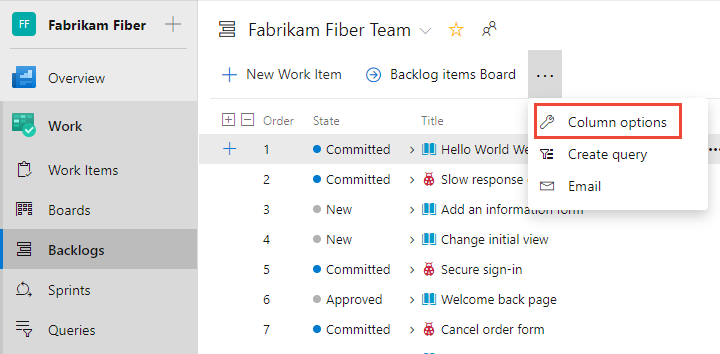
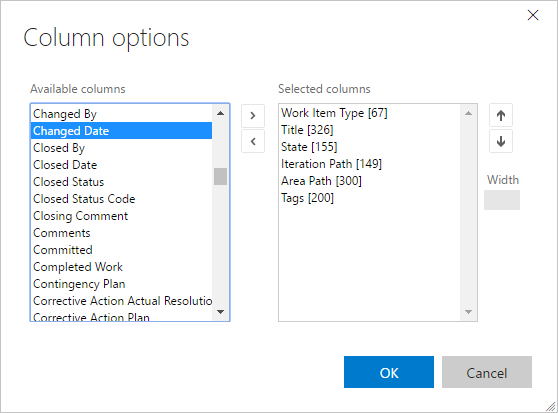

# Change column options 

[!INCLUDE [temp](../_shared/version-vsts-tfs-all-versions.md)]

From each backlog page or query, you can add or remove columns. Or, you can drag a column to a new position. Your settings persist for each page you customize and are only valid for your views.    

> [!TIP]    
> Unlike a query result, you can't sort a backlog by a column. However, you can use the **Create Query** link on each backlog to create a query that you can sort on any field column you choose.

Start by opening the **Column Options** dialog. Each user can set their own column options which persist for each product or portfolio backlog across the user's sessions.    

::: moniker range=">= azure-devops-2019"

> [!div class="mx-imgBorder"]  
>  
::: moniker-end 

 ::: moniker range="<= tfs-2018"

 

::: moniker-end 

::: moniker range=">= tfs-2018"

In the Column options dialog, choose **Add a column** to add a field that isn't shown. To change the order of the fields, drag-and-drop the field where you want it within the set of selected fields. And, to remove a field, choose the .

::: moniker-end

::: moniker range="tfs-2018"
> [!NOTE]    
> The following dialog is available from TFS 2018.2 and later versions. 
::: moniker-end

::: moniker range=">= tfs-2018"
  
::: moniker-end

::: moniker range="azure-devops"
You can add most fields listed in the [Work item field index](../work-items/guidance/work-item-field.md). Note that all fields defined within the project collection or organization are available for selection, even those that aren't used for your particular project. You can view the list of fields defined for your collection from [**Organization Settings>Process>Fields**](../../organizations/settings/work/customize-process-field.md#review-fields)

::: moniker-end 

::: moniker range="azure-devops-2019"

You can add most fields listed in the [Work item field index](../work-items/guidance/work-item-field.md). Note that all fields defined within the project collection or organization are available for selection, even those that aren't used for your particular project. If your project uses the Inherited process model, you can view the list of fields defined for your collection from [**Organization Settings>Process>Fields**](../../organizations/settings/work/customize-process-field.md#review-fields)
::: moniker-end 

::: moniker range="tfs-2018"
You can add most fields listed in the [Work item field index](../work-items/guidance/work-item-field.md). Note that all fields defined within the project collection or organization are available for selection, even those that aren't used for your particular project.
::: moniker-end

::: moniker range="<= tfs-2017"

Find the field you want to add from the **Available columns** set and choose **>** (greater-than character) to move it into the **Selected columns** list. You can then change the order of the columns with the / up and down arrows. To remove a field, select it and then choose the **<** (less-than character).  
 
 

You can add most fields listed in the [Work item field index](../work-items/guidance/work-item-field.md). Note that all fields defined within the project collection or organization are available for selection, even those that aren't used for your particular project.

::: moniker-end

## Use keyboard shortcuts to change the column order, column width, or sort options

You can change the column order, column size, or sort options by using the following keyboard commands:
- To change the column order, click on the field and drag it to a new location
- To re-size a column, click the column divider to the right of the field and drag to a new location  
- For query results:
	- Add the field as a column in order to sort by that field 
	- To sort by a column, hold down the shift key and click on the field
	- To reverse the sort order, shift-click on the field 
	- To sort by multiple columns, shift-click on each column in the order you want to sort   

::: moniker range=">= tfs-2015"
For additional keyboard shortcuts, enter **Shift-?** to display available commands based on the page you're on. 
::: moniker-end

## Related articles

- [Work item field index](../work-items/guidance/work-item-field.md) 
- [Backlogs, boards, and plans](backlogs-boards-plans.md)   
- [Create managed queries](../queries/using-queries.md)
