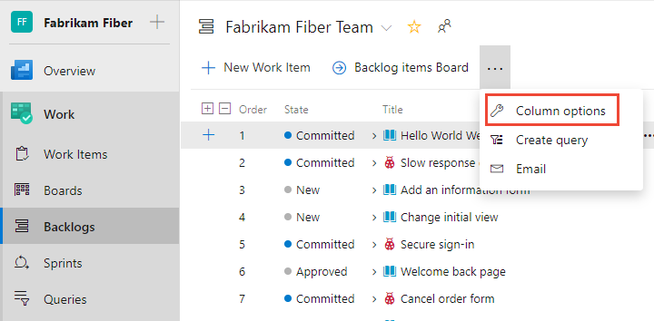
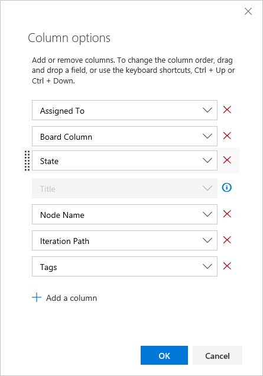
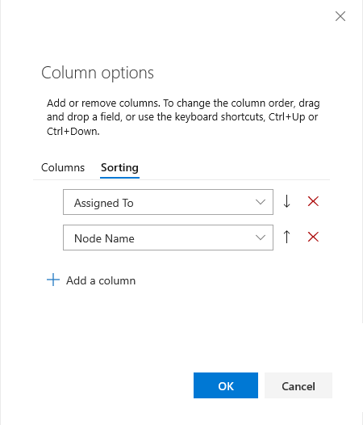

# Manage columns in a work item list in Azure Boards 

[!INCLUDE [version-lt-eq-azure-devops](../../includes/version-lt-eq-azure-devops.md)]
[!INCLUDE [version-vs-gt-eq-2019.md](../../includes/version-vs-gt-eq-2019.md)]

Each column in a work item list corresponds to a work item field. Add or remove columns to show the fields you need, or drag a column to reorder it. Your column settings persist per page and apply only to your views.

The following table shows which column actions are available in each list view:  

:::row:::
   :::column span="2":::
      **Action**
   :::column-end:::
   :::column span="":::
      [**Backlogs**](create-your-backlog.md)
   :::column-end:::
   :::column span="":::
      [**Sprint backlogs**](../sprints/assign-work-sprint.md)
   :::column-end:::
   :::column span="":::
      [**Queries**](../queries/view-run-query.md) 
   :::column-end:::
   :::column span="":::
      [**Work items**](../work-items/view-add-work-items.md)
   :::column-end:::
:::row-end::: 
:::row:::
   :::column span="2":::
      Add or remove a column field
   :::column-end:::
   :::column span="":::
      Yes
   :::column-end:::
   :::column span="":::
      Yes
   :::column-end:::
   :::column span="":::
      Yes
   :::column-end:::
   :::column span="":::
      Yes
   :::column-end:::
:::row-end::: 
::: moniker range="<=azure-devops"
:::row:::
   :::column span="2":::
      Add or remove the Parent field
   :::column-end:::
   :::column span="":::
      Yes
   :::column-end:::
   :::column span="":::
      Yes
   :::column-end:::
   :::column span="":::
      Yes
   :::column-end:::
   :::column span="":::
      Yes
   :::column-end:::
:::row-end::: 
:::row:::
   :::column span="2":::
      Add or remove a rollup column
   :::column-end:::
   :::column span="":::
      Yes
   :::column-end:::
   :::column span="":::
      No
   :::column-end:::
   :::column span="":::
      No
   :::column-end:::
   :::column span="":::
      No
   :::column-end:::
:::row-end::: 
::: moniker-end
:::row:::
   :::column span="2":::
      Sort on a column
   :::column-end:::
   :::column span="":::
      No
   :::column-end:::
   :::column span="":::
      No
   :::column-end:::
   :::column span="":::
      Yes
   :::column-end:::
   :::column span="":::
      Yes
   :::column-end:::
:::row-end::: 

> [!TIP]    
> You can't sort a backlog by column. To sort backlog items, select **Create Query** on the backlog to create a query, then use the **Sorting** tab in the **Column options** dialog. Not all fields support sorting — for example, **Parent**, **History**, **Description**, and other rich-text fields return an error if you try to sort on them. 

::: moniker range="azure-devops"
You can add most fields listed in the [Work item field index](../work-items/guidance/work-item-field.md), including fields defined across the organization that aren't used in your project. To review available fields, go to [**Organization Settings > Process > Fields**](../work-items/work-item-fields.md#review-fields).

::: moniker-end 

::: moniker range=" < azure-devops"

You can add most fields listed in the [Work item field index](../work-items/guidance/work-item-field.md), including fields defined across the project collection that aren't used in your project. If your project uses the Inherited process model, review available fields at [**Organization Settings > Process > Fields**](../work-items/work-item-fields.md#review-fields).
::: moniker-end 

## Column option persistence

Column options persist until you change them. The following rules apply:

- **Backlogs** — Settings apply to the active team and backlog level. Product backlog and portfolio backlog settings are independent.
- **Sprint backlogs** — Settings apply across all sprints until you change them.
- **Queries** — Settings persist when you save the query.
- **Work items** — Settings persist per view only (for example, **Assigned to me**, **Following**, or **Mentioned**).

::: moniker range="azure-devops"
> [!NOTE]    
> You can't set column options for other team members or set default column options.
::: moniker-end

::: moniker range=" < azure-devops"
> [!NOTE]    
> You can't set column options for other team members. For projects that use the Inherited process model, you can't set default column options. For projects that use the On-premises XML process model, you can set defaults for product, portfolio, and sprint backlogs. For more information, see [Process configuration XML element reference](../../reference/xml/process-configuration-xml-element.md).
::: moniker-end

## Prerequisites

[!INCLUDE [temp](../includes/prerequisites.md)]

## Open the Column options dialog

Open the **Column Options** dialog from any work item list. If the option isn't visible, select **More actions** (&hellip;) to find it.

> [!div class="mx-imgBorder"]  
>  

## Add or remove columns

#### [Browser](#tab/browser/)

In the **Column options** dialog:

- Select **Add a column** to add a field.
- Drag and drop fields to reorder them.
- Select  to remove a field.

  

#### [Visual Studio](#tab/visual-studio/)

> [!IMPORTANT]
> Use the [default view](../work-items/view-add-work-items.md#view-work-items) instead of this legacy view. The default view gives you quick access to a list of work items based on your assignment, following, mentioned, or recent updates. The legacy view isn't receiving new features and might be removed in a future release of Visual Studio.

You can only change column options for queries in Visual Studio. To open, choose **Column Options**.

:::image type="content" source="media/columns/open-column-options-visual-studio.png" alt-text="Screenshot of Query Results, Visual Studio, open Column Options.":::

### Add or remove columns

In the **Column Options** dialog, select a field from **Available columns** and select **> Add selected columns**. To add multiple fields at once, use Shift+click. New fields appear at the bottom of the **Selected columns** list.

To reorder fields, select a field and use the up or down arrows.  

:::image type="content" source="media/columns/column-options-dialog-visual-studio.png" alt-text="Screenshot shows Column Options dialog, Visual Studio, Fields tab.":::

### Change column sort order

Select the **Sorting** tab to control which fields sort query results. Add or remove fields the same way as on the **Fields** tab, then use the up and down arrows to set the sort priority. To reverse the sort direction, select the field and choose **Sort ascending** or **Sort descending**.  

:::image type="content" source="media/columns/column-options-dialog-sorting-visual-studio.png" alt-text="Screenshot shows Column Options dialog, Visual Studio, Sorting tab.":::

* * *

::: moniker range="<=azure-devops"

## Add or remove rollup columns

Rollup columns can display progress bars or the sum of numeric fields of child items. You can add them to any product or portfolio backlog. For more information, see [Display rollup progress or totals](display-rollup.md). 

::: moniker-end

## Sort on a column 

To sort query results or **Work items** views, open the **Column options** dialog and select **Sorting**. Add the fields you want to sort by, drag them into priority order, and use the up or down arrows to set ascending or descending order.

> [!div class="mx-imgBorder"]  
>  

## Keyboard shortcuts for columns and sorting

- **Reorder a column** — Drag the column header to a new position.
- **Resize a column** — Drag the column divider to the right of the header.
- **Sort by a column** (query results only) — Shift+select the column header.
- **Reverse sort order** — Shift+select the same column header again.
- **Sort by multiple columns** — Shift+select each column header in the order you want.

For a full list of keyboard shortcuts, press **?** on any page. 

## Related content

- [Display rollup progress or totals](display-rollup.md)
- [Interactively filter backlogs, boards, queries, and plans](filter-backlogs-boards-plans.md) 
- [Work item field index](../work-items/guidance/work-item-field.md)  
- [View, run, or email a work item query](../queries/view-run-query.md)
- [Create managed queries](../queries/using-queries.md)
- [Customize a sprint Taskboard](../sprints/customize-taskboard.md)
