# Set up your Backlogs and Boards  

[!INCLUDE [temp](../_shared/version-vsts-tfs-all-versions.md)]

In most cases you can start using your product and portfolio backlogs once your project is created. A default team is created along with associated backlogs and boards. You can start adding work items to your product backlog using the [Backlog](create-your-backlog.md) or [Board](../boards/kanban-quickstart.md). 

However, if you have added a team and want to start using the team backlogs and boards, you may need to ensure you've configured your backlogs and boards correctly. Also, over time, changes may be made to a project or team configuration which can impact the work items that appear on your backlog and boards. 

For an overview of the tools associated with your team, see [Manage and configure team tools](../../organizations/settings/manage-teams.md).

## Default backlog and board work items 
The first thing you need to understand is that your product **Backlog** and **Board** display work items which meet the following criteria:

::: moniker range="azure-devops"

- Work item type belongs to the Requirements category. The types differ depending on the process selected for your project:  
	- [Basic](../get-started/track-issues-tasks.md) : Issue, Backlog name=<strong>Issues</strong>  
	- [Agile](../work-items/guidance/agile-process.md): User Story, Backlog name=<strong>Stories</strong>  
	- [Scrum](../work-items/guidance/scrum-process.md): Product Backlog Item, Backlog name=<strong>Backlog items</strong> 
	- [CMMI](../work-items/guidance/cmmi-process.md): Requirement, Backlog name=<strong>Requirements</strong>  
- Work item <strong>Area Path</strong> matches one of the selected team's Area Paths
- Work item <strong>Iteration Path</strong> is under the team's Default Iteration Path
::: moniker-end

::: moniker range="<= azure-devops-2019"
- Work item type belongs to the Requirements category. The types differ depending on the process selected for your project: 
	- [Agile](../work-items/guidance/agile-process.md): User Story, Backlog name=<strong>Stories</strong>  
	- [Scrum](../work-items/guidance/scrum-process.md): Product Backlog Item, Backlog name=<strong>Backlog items</strong> 
	- [CMMI](../work-items/guidance/cmmi-process.md): Requirement, Backlog name=<strong>Requirements</strong>  
- Work item <strong>Area Path</strong> matches one of the selected team's Area Paths
- Work item <strong>Iteration Path</strong> is under the team's Default Iteration Path

::: moniker-end

You can determine the work item types that belong to your Requirements category by [opening your product Backlog](create-your-backlog.md) and checking the product backlog name. 

::: moniker range=">= azure-devops-2019"

> [!div class="mx-imgBorder"]  
>  

::: moniker-end

::: moniker range="<= tfs-2018"
As shown in the following image, (1) choose the team, (2) **Work**, (3)**Backlogs**, and then the product backlog. 

> [!div class="mx-imgBorder"]  
> 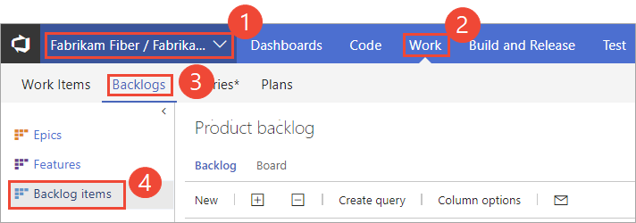 

::: moniker-end

To look up your team's Area Path(s) and Iteration Paths, see [Define area paths and assign to a team](../../organizations/settings/set-area-paths.md) and 
[Define iteration paths (aka sprints) and configure team iterations](../../organizations/settings/set-iteration-paths-sprints.md). 

## Checklist for work items, backlogs, and boards 

If you don't see the work items you expect on your [product Backlog](create-your-backlog.md) or [Kanban Board](../boards/kanban-quickstart.md), perform the following checks: 

1. Make sure you have selected the team backlog or board of interest. To learn how, see [Use breadcrumbs and selectors to navigate and open artifacts](../../project/navigation/use-breadcrumbs-selectors.md). 

2. [Create a query](../queries/using-queries.md) of your backlog items, specifying the work item types that belong to your Requirements category and the Area Path associated with your team, for example:  

	> [!div class="mx-imgBorder"]  
	> 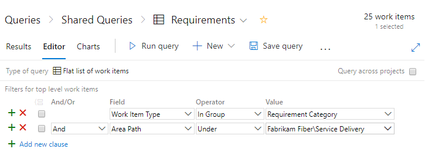  

3. Add the <strong>State</strong>, <strong>Area Path</strong> and <strong>Iteration Path</strong> fields to the [column options](set-column-options.md).

4. Check the query results and that the values of the work items you expect to show up on your backlog meet these criteria: 
- <strong>Area Path</strong> belongs to your team's area path(s)
- <strong>Iteration Path</strong> belongs under your team's default iteration path
- <strong>State</strong> isn't Closed, Completed, Done, or Removed. 

> [!NOTE]   
> You can also filter your product backlog to show or hide work items that are in an **In Progress** state category, corresponding to an Active, Resolved, Committed, Doing workflow state. 

## Add bugs to your backlogs and boards

::: moniker range="azure-devops"
For all processes except the Basic process, each team can manage the way bugs are tracked. You can track bugs as belonging to the Requirements category and they show up on the Backlog and Kanban Board, or the Tasks category and they show up on the Taskboard, or the Bugs category where they don't appear on either backlogs or boards. 
::: moniker-end

::: moniker range="<= azure-devops"

Each team can manage the way bugs are tracked. You can track bugs as belonging to the Requirements category and they show up on the Backlog and Kanban Board, or the Tasks category and they show up on the Taskboard, or the Bugs category where they don't appear on either backlogs or boards. 
::: moniker-end

If you want bugs to show up on your Backlog and Board, choose <strong>Bugs are managed with requirements</strong>.

> [!div class="mx-imgBorder"]  
> 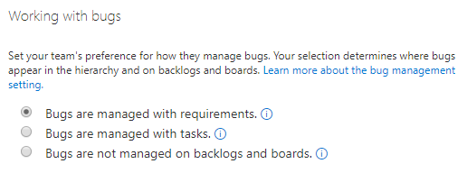   

For details, see [Show bugs on backlogs and boards](../../organizations/settings/show-bugs-on-backlog.md). 

## Correct your Kanban Board configuration

If you see the following error when you open your Kanban board, you need to correct the configuration. The main reason for this error is that the workflow states of work item types that have been added to the Requirements category aren't mapped to the column. 

> [!div class="mx-imgBorder"]  
> 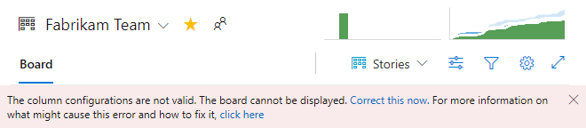

Choose the **Correct this now** link to open the Settings dialog. To map the workflow states, refer to [Add columns to your Kanban board, Update Kanban column-to-State mappings](../boards/add-columns.md#state-mappings). 


::: moniker range=">= tfs-2017 <= tfs-2018 || azure-devops"

## Customize your Kanban Board checklist items

Checklists are a great way to create work items that are automatically linked with a parent-child link to another work item on a Kanban board. You can customize the work item types that you can add as a checklist by opening the Board Settings, choose **Annotations**, and enable the work item types you want to appear on the board. For details, see [Customize cards](../boards/customize-cards.md#annotations).

For example, here we've chosen to track bugs along with tasks, and  enable Task and Bug to appear within checklists. To learn more about checklists, see [Add task checklists](../boards/add-task-checklists.md) and [Add, run, and update inline tests](../boards/add-run-update-tests.md). 

> [!div class="mx-imgBorder"]  
> 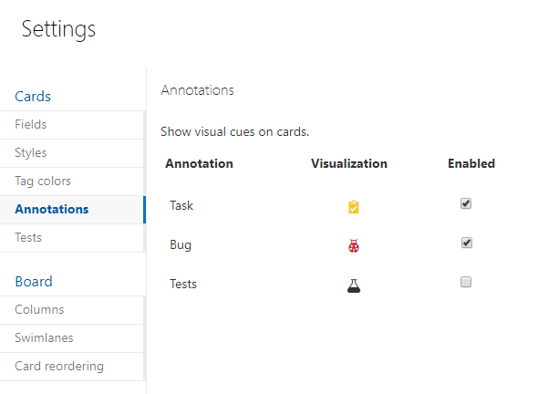

::: moniker-end

<a id="customize-checklist-2019" />

::: moniker range="azure-devops-2019"

## Customize your Kanban Board checklist items

If you added work item types to the Task Category as described in [Add custom work item types to your Taskboard](#taskboard-types) later in this article, you can choose whether or not these types appear within a checklist on your product Kanban board. You do this by opening the Board Settings, choose **Annotations**, and enable the work item types you want to appear on the board. For details, see [Customize cards](../boards/customize-cards.md#annotations).

For example, here  we've chosen to track bugs along with tasks, and we enable Issue and Ticket as well as Task and Bug. To learn more about checklists, see [Add task checklists](../boards/add-task-checklists.md) and [Add, run, and update inline tests](../boards/add-run-update-tests.md). 

> [!div class="mx-imgBorder"]  
> 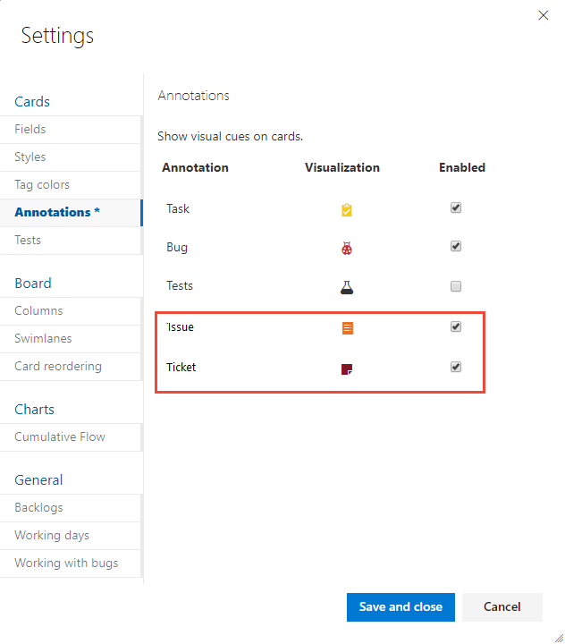  

::: moniker-end


## Hide or show backlog levels 

Your team can also choose to hide or show one or more backlog level. Often times feature teams manage backlog items, while management teams manage features and epics. In this situation, you can enable or disable a backlog level. 

> [!div class="mx-imgBorder"]  
> 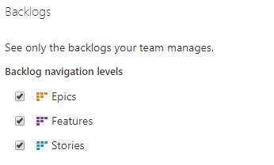   

For details, see [Select backlog navigation levels for your team](../../organizations/settings/select-backlog-navigation-levels.md). 


## Add custom work item types to your backlogs and portfolio backlog levels 

If you want to track different work item types on your product backlog, you can do that by adding custom work item types and adding them to a specific backlog level. 

You can also add custom work item types and add them to portfolio backlogs. You can add up to five portfolio backlogs. 

For example, here we've added Initiatives, 4th level, and 5th level work item types to support five levels of portfolio backlogs. We've also added a custom work item type named Ticket and added that to the product backlog. 

> [!div class="mx-imgBorder"]  
> 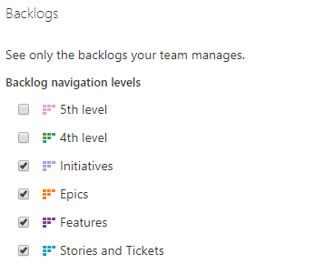   

For details, see the following resources: 

::: moniker range="azure-devops"

- [Add and manage work item types](../../organizations/settings/work/customize-process-wit.md)
- [Customize your backlogs or boards for a process](../../organizations/settings/work/customize-process-backlogs-boards.md) 
- [Customize an inheritance process](../../organizations/settings/work/inheritance-process-model.md)  
::: moniker-end

::: moniker range="azure-devops-2019"

**Inheritance process model:**  
- [Add and manage work item types](../../organizations/settings/work/customize-process-wit.md)
- [Customize your backlogs or boards for a process](../../organizations/settings/work/customize-process-backlogs-boards.md) 
- [Customize an inheritance process](../../organizations/settings/work/inheritance-process-model.md)  

**On-premises XML process model:**  
- [Add a work item type to a backlog and board](../../reference/add-wits-to-backlogs-and-boards.md)  
- [Add portfolio backlogs](../../reference/add-portfolio-backlogs.md)
- [Customize the On-premises XML process model](../../reference/on-premises-xml-process-model.md) 

::: moniker-end

::: moniker range="<= tfs-2018"  

- [Add a work item type to a backlog and board](../../reference/add-wits-to-backlogs-and-boards.md)  
- [Add portfolio backlogs](../../reference/add-portfolio-backlogs.md)
- [Customize the On-premises XML process model](../../reference/on-premises-xml-process-model.md) 
- [Add portfolio backlogs](../../reference/add-portfolio-backlogs.md)  

::: moniker-end  


::: moniker range="<= azure-devops-2019"

<a id="taskboard-types" />

## Add custom work item types to your Taskboard

For on-premises deployments that use the On-premises XML process model to customize work tracking, you can add existing and custom work item types to the sprint Taskboards. For example, if you want to track Issues (or Impediments for the Scrum process) and a custom work item type, Tickets, along with Tasks and Bugs, you would perform the following tasks: 

1. Define the Ticket custom work item type. See [Add or modify a work item type](../../reference/add-modify-wit.md). 
2. Add Issue and Ticket work item types to the Task Category by modifying the Categories XML file. For details, see [Categories XML element reference](../..//reference/xml/categories-xml-element-reference.md).  

	For example, here we add Issue and Ticket to the Task Category.  

	> [!div class="tabbedCodeSnippets"]
	> ```XML
	>   <CATEGORY name="Task Category" refname="Microsoft.TaskCategory">
	>     <DEFAULTWORKITEMTYPE name="Task" />
	> 	<WORKITEMTYPE name="Issue" / 
	> 	<WORKITEMTYPE name="Ticket" / 
	>   </CATEGORY>
	> ```

3. Make sure that the Issue and Ticket workflow states are mapped to category states. As needed, modify the ProcessConfiguration XML file to add Issues and Tickets to the `TaskBacklog` section. 

	For example, here the New, Active, and Closed states are mapped for the Task Category.

	> [!div class="tabbedCodeSnippets"]
	> ```XML
	>   <TaskBacklog category="Microsoft.TaskCategory" pluralName="Tasks" singularName="Task" workItemCountLimit="1000">
	>     <States>
	>       <State value="New" type="Proposed" />
	>       <State value="Active" type="InProgress" />
	>       <State value="Closed" type="Complete" />
	>     </States>
	> . . .
	>   </TaskBacklog>
	> ```

4. To verify your changes, open a Sprint backlog and make sure you can add an Issue or Ticket in the same way you add a Task. See [Add tasks](../sprints/add-tasks.md). 

::: moniker-end

::: moniker range="azure-devops-2019"

> [!NOTE]  
> If your project collection uses the On-premises XML process model to customize work tracking, you can enable work item types that you add to the Task Category to appear as a checklist on your product Kanban board. To learn how, see [Customize your Kanban Board checklist items](#customize-checklist-2019) provided earlier in this article. 

::: moniker-end


## Other factors that can affect which work items appear

The following settings can impact on the type and number of work items that will appear in your backlogs and boards. 

- In your Kanban board, newly added work items may not appear if they are stack ranked lower within the product backlog. By choosing the <strong>Show more items</strong> link, you can cause the board to refresh and display these additional items. 

	> [!div class="mx-imgBorder"]  
	> 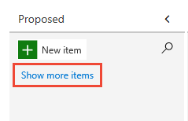  

- If you have nested work items that belong to the same category, only leaf nodes will appear on the Kanban board. For this reason, we recommend that you don't nest work items of the same work item type or belonging to the same category. To learn more see [Backlogs, portfolios, and Agile project management, Display of leaf node work items](backlogs-overview.md#leaf-node).

- If you have turned off the **In Progress** view, then those work items where work has started won't appear in the backlog list.  

	::: moniker range=">= azure-devops-2019"  
	> [!div class="mx-imgBorder"]  
	> 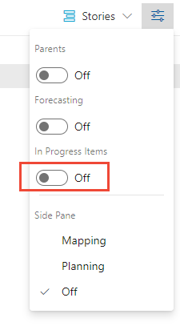  
	::: moniker-end  
	::: moniker range="<= tfs-2018"  
	> [!div class="mx-imgBorder"]  
	> 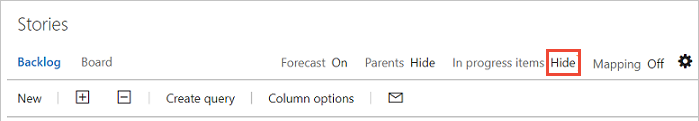  
	::: moniker-end  

- Work items appear in the priority order in which they are added or moved to. This order or sequence is managed by the **Stack Rank** (Basic, Agile, and CMMI processes) or **Backlog Priority** (Scrum) field. To learn more, see [Backlogs, portfolios, and Agile project management, Backlog priority or stack rank order](backlogs-overview.md#stack-rank).

- Each backlog can display up to 999 work items. If your backlog exceeds this limit, then you may want to consider adding a team and moving some of the work items to the other team's backlog.  

- Sprint backlogs show only those work items that meet the team's area path and the **Iteration Path** defined for the sprint. 

- (Inheritance process model) If an administrator [disables or deletes a work item type](../../organizations/settings/work/customize-process-wit.md#enable-disable), it will no longer appear on backlogs and boards. 

- (On-premises XML process model) If an administrator [deletes or destroys a work item type](../../reference/witadmin/witadmin-import-export-manage-wits.md), it will no longer appear on backlogs and boards.


## Related articles

- [Add a team, move from one default team to several teams](../../organizations/settings/add-teams.md)
- [Refine your backlog](best-practices-product-backlog.md)  
- [Create your backlog](create-your-backlog.md)
- [Backlog priority or stack rank order](backlogs-overview.md#stack-rank)
- [Use categories to group work item types](../../reference/xml/use-categories-to-group-work-item-types.md)
- [Workflow states & state categories](../work-items/workflow-and-state-categories.md)  
