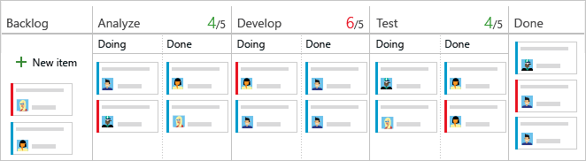
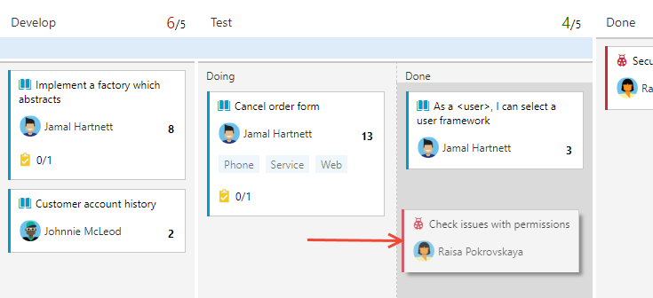
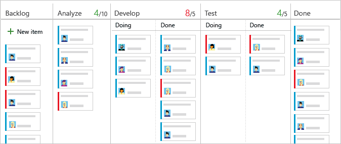

# Manage columns on your Kanban board

[!INCLUDE [version-lt-eq-azure-devops](../../includes/version-lt-eq-azure-devops.md)] 

The Kanban board helps you visualize your team's workflow, including the types of work and handoffs that occur regularly as your team progresses work items. Each column on your Kanban board corresponds to work that your team does before that stage is considered done.

::: moniker range=">= azure-devops-2020"

> [!NOTE]    
> To manage columns on a sprint taskboard, see [Customize a taskboard](../sprints/customize-taskboard.md). To manage columns on a backlog or in query results, see [Change column options](../backlogs/set-column-options.md).   
::: moniker-end

::: moniker range="<= azure-devops-2019"

> [!NOTE]    
> To add columns to a taskboard, you need to customize the workflow. For more information, see [Add or modify a work item type](../../reference/add-modify-wit.md). To add columns to a backlog or query results, see [Change column options](../backlogs/set-column-options.md).   
>
> For an overview of the features supported on each backlog and board, see [Backlog, board, and plan views](../backlogs/backlogs-boards-plans.md).

::: moniker-end

[!INCLUDE [temp](../includes/prerequisites-team-settings.md)]

Complete the following tasks, so you don't need to revisit your configuration.

#### [Process Administrator](#tab/process-administrator)

- Add custom work item types that you want to appear on your backlog or board. For more information, see [Add and manage work item types](../../organizations/settings/work/customize-process-work-item-type.md).
- Customize your product and portfolio backlogs. Customization ensures that the chosen work item types appear on the backlogs and boards. For more information, see [Customize backlogs and boards](../../organizations/settings/work/customize-process-backlogs-boards.md). 
- Customize workflow states. Each workflow state appears as a column on the Kanban board. For details, see [Customize a workflow](../../organizations/settings/work/customize-process-workflow.md).

#### [Team Administrator](#tab/team-administrator)

- Set the backlogs that you want to be active for your team. You only need to configure the Kanban boards of backlogs that your team plans to use. For details, see [Select backlog navigation levels for your team](../../organizations/settings/select-backlog-navigation-levels.md).
- Determine how to track bugs. Bugs might have different workflow states from other types of work items in the **Requirement** category. As a result, bugs must be mapped separately from other work item types. For details, see [Show bugs on backlogs and boards](../../organizations/settings/show-bugs-on-backlog.md).
- Identify the columns that your team can use to support its workflow and Kanban processes. For more information, see [Map the flow of work](#map-the-flow-of-work) later in this article. 
- Add, remove, or rename columns and map workflow states to columns. For more information, see [Manage columns on your Kanban board](#add-or-rename-columns) later in this article.  

---
Also, we recommend that you review the following articles: 

- [Kanban overview](kanban-overview.md)
- [Configure and customize Azure Boards](../configure-customize.md)
- [Set up your backlogs and boards](../backlogs/set-up-your-backlog.md)  
- [Workflow states and state categories](../work-items/workflow-and-state-categories.md)  

### Map workflow states 

The Kanban board uses the **Work item type** and **State** categories to group work items that you want handled in the same manner.

1. Identify your team's workflows. See the following table of example workflows and their descriptions.

   |Workflow  |Description  |
   |---------|---------|
   |Backlog    | Make a prioritized list of work items that the team isn't yet ready to work on       |
   |Analyze    | Identify well-understood and shared acceptance criteria, along with overall work required to develop and test the item         |
   |Develop   |Code and run unit tests for the item         |
   |Test    | Run exploratory, automated, integration, and other tests        |
   |Done    | Hand off to production because the item is ready        |

2. Know your work item types and on which boards they appear.

   |Work item type category |Work items appear here |
   |---------|---------|
   |Requirement    |  Only on the product board       | 
   |Feature   | Only on the Feature portfolio board        |         
   |Epic     | Only on the Epic portfolio board        | 
   |Custom|    Only on a custom portfolio board |        

   > [!TIP]   
   > We recommend that you map each workflow state to a Kanban column, as if it's not mapped, it doesn't appear on the Kanban board.

1. Specify the workflow **State** for each work item type and column, using one of the following four categories.

   |State category  |Description  |
   |---------|---------|
   |Proposed   | The first Kanban board column is automatically mapped to the default state for each work item |
   |In Progress | Work flow state must be specified for each WIT and column       |
   |Completed  | Can only map to the last Kanban board column      |
   |Removed     | Workflow state doesn't need to be specified     |

> [!NOTE]
> Adding bugs or other work items to a Kanban board may create new workflow states, requiring adjustments to column-to-state mappings in the following situations:
>
>- When a team admin [shows bugs on backlogs and boards](../../organizations/settings/show-bugs-on-backlog.md)
>- When a project admin [adds work item types to backlogs and boards](../../reference/add-wits-to-backlogs-and-boards.md)
>- When a project collection or project admin customizes the workflow for a work item type in the Requirement category using [inherited process](../../organizations/settings/work/customize-process-workflow.md) or [on-premises XML process](../../reference/xml/change-workflow-wit.md)

## Add and edit columns

Column titles and choices depend on the [process](../work-items/guidance/choose-process.md) that you used to create your project and whether your team has chosen to [treat bugs like requirements or like tasks](../../organizations/settings/show-bugs-on-backlog.md).

Do the following steps to add and edit your columns.

::: moniker range=">= azure-devops-2019"

1. [Open your Kanban board](kanban-quickstart.md).

2. Select **Configure team settings** :::image type="icon" source="../../media/icons/blue-gear.png" border="false"::: to configure the board and set general team settings.  

	> [!div class="mx-imgBorder"]
	>   

3. Select **Columns** and then a column tab to see all the settings that you can modify. Your initial column settings look similar to the settings shown in the following image. 

	> [!div class="mx-imgBorder"]
	>   

4. Change your column titles to map to your workflow stages. You can add, rename, and move columns to support more stages. 

	Rename the first three columns to **Backlog**, **Analyze**, and **Develop**. Then, add a column and label it **Test**. 

	You can rename a column directly from the Kanban board. 

	:::image type="content" source="media/rename-kanban-columns-direct-ts.png" alt-text="Screenshot showing renaming a column directly on a board.":::

	Or, you can open the dialog and change one or more settings for a Kanban column. 

	> [!div class="mx-imgBorder"]
	>   

5. To change the column order, drag the column tab to the position that you want.  

6. To delete a column, first make sure that the column doesn't contain any work items. If it does, move the items to another column. Then:

   1. Open **Settings**, select **Columns**, and select **Actions** :::image type="icon" source="../../media/icons/actions-icon.png" border="false"::: from the column tab.
   2. Select **Remove** from the menu.  

	> [!div class="mx-imgBorder"]
	>     

7. [Change state mappings as needed](#state-mappings) for added columns, added workflow states, or added WITs. 

   Usually, you need to update state mappings when you change the [Working with bugs](../../organizations/settings/show-bugs-on-backlog.md) setting, add [WITs to the Requirement category](../../reference/add-wits-to-backlogs-and-boards.md), or [customize the workflow](../../organizations/settings/work/customize-process-workflow.md).  

8. When you're done with your changes, select **Save**.

::: moniker-end 

::: moniker range="tfs-2018"  

1. [Open your Kanban board](kanban-quickstart.md). If you're not a team admin, [get added as one](../../organizations/settings/add-team-administrator.md). Only team and project admins can customize the Kanban board.

1. Select **Settings** :::image type="icon" source="../../media/icons/team-settings-gear-icon.png" border="false"::: to open the common configuration settings dialog for the Kanban board. 

	  

2. Select **Columns** and then a column tab to see all the settings that you can modify. Your initial column settings look similar to the following example. 

	> [!div class="mx-imgBorder"]
	> 

3. Change your column titles to map to your workflow stages. You can add, rename, and move columns to support more stages. 

	Rename the first, second, and third columns to **Backlog**, **Analyze**, and **Develop**. Then, add a column and label it **Test**. 

	You can rename a column directly from the Kanban board. 

	

	Or, you can open the dialog and change one or more settings for a Kanban column. 

	 

4. To change the column order, drag the column tab to the position that you want.  

5. To delete a column, first make sure that the column doesn't contain any work items. If it does, move the items to another column. Then, select **Actions** :::image type="icon" source="../../media/icons/actions-icon.png" border="false"::: on the column tab and select **Remove** from the menu. 

	> [!div class="mx-imgBorder"]
	>   

6. [Change state mappings as needed](#state-mappings) for added columns, added workflow states, or added WITs.  

   Usually, you need to update state mappings when you change the [Working with bugs](../../organizations/settings/show-bugs-on-backlog.md) setting, add [WITs to the Requirement category](../../reference/add-wits-to-backlogs-and-boards.md), or [customize the workflow](../../organizations/settings/work/customize-process-workflow.md).  

7. When you're done with your changes, select **Save**.  

::: moniker-end  

### Update status and handoff items

Drag-and-drop your work items to update the status. For example, to signal when work can start in a downstream stage, drag items to the next column. 

You can move an item from one column to any other column on the board, forward and back. To hand off work to another team member, reassign it directly from the board.

Team members who receive the handoff can [set alerts](../../organizations/notifications/manage-your-personal-notifications.md) to get immediate email notifications of their newly assigned work. 

### Change your team's priorities

Drag an item up or down within a column.
:::image type="content" source="media/ALM_AC_ChangePriorities.png" alt-text="Screenshot that shows moving an item within a column.":::

### Track Kanban column status  

Use the [query tool](../queries/using-queries.md) to list a subset of work items for review, triage, update, or chart generation. For example, you can create a query to list all active user stories (specify two clauses: `Work Item Type=User Story` and `State=Active`). 

Specify [WIP limits](wip-limits.md), [split columns](#split-columns), and [definition of done](definition-of-done.md)

## Split columns

Because each column corresponds to a stage of work, you can quickly see the number of items in progress at each stage. However, a lag often exists between when work gets moved into a column and when work actually starts. To counter that lag and reveal the actual state of work in progress, you can turn on split columns.  When they're split, each column contains two subcolumns, *Doing* and *Done*.

  

Split columns let your team implement a pull mechanism within the workflow process. Without split columns, teams push work forward, to signal that they've completed their stage of work. However, pushing it to the next stage doesn't necessarily mean that a team member immediately starts work on that item.  

With split columns, your team knows exactly how many items sit idle, waiting for work to begin. You have greater visibility into the quantity of items that sit idle at each stage throughout your workflow process.

### Move items into the *Doing* and *Done* columns 

With split columns turned on, you update status of items on the Kanban board in the same way you have before. However, now when you've completed work on an item, you move it into *Done*, instead of a downstream column. When the next team member becomes free to work on the next high priority item, they pull it into *Doing* and reassign it to themselves.  

For example, as a team member completes their coding task, they move the item into *Done* under the Develop column. When the tester is ready to test the item, they pull it into *Doing* under the Test column.  

> [!div class="mx-imgBorder"]  
> 

### Identify bottlenecks

Split columns provide you even greater insight into how many items sit idle in a *Done* column. Your team can readily see when items pile up, which signal a potential bottleneck.   

  

By reviewing the frequency of pile ups and where they occur, your team can adjust their processes to eliminate the bottlenecks. Workflow processes that incur no or few bottlenecks correspond to perfect flows. No item sits in a queue for any 

### Choose which columns you want to split  

Before you split columns, ensure you [mapped each stage of your team's process to a Kanban column](#map-workflow-states). Only split columns where clear hand-offs exist and you want teams to pull the item into the next stage. 

::: moniker range=">= azure-devops-2019"
1. [Open your Kanban board](kanban-quickstart.md) and choose the  :::image type="icon" source="../../media/icons/blue-gear.png" border="false":::  gear icon to configure the board and set general team settings.  

   :::image type="content" source="../../organizations/settings/media/configure-team/open-board-settings.png" alt-text="Screenshot of Open board settings for a team, vertical navigation.":::

2. Choose **Columns** and then choose the column tab that you want to split. Add a check mark in the checkbox to cause the column to split.  

	> [!NOTE]   
	> You'll see different column titles and choices based on the [process](../work-items/guidance/choose-process.md) used to create your project and whether your team has chosen to [treat bugs like requirements or like tasks](../../organizations/settings/show-bugs-on-backlog.md).  
	
:::image type="content" source="media/columns/split-columns.png" alt-text="Screenshot of Kanban board settings page, Split columns.":::

1. When you're done, choose **Save and close**.

	> [!TIP]    
	> You can filter queries and create charts using the [Board Column Done field](../queries/query-by-workflow-changes.md#kanban_query_fields). 

::: moniker-end 

::: moniker range="tfs-2018"
1. [Open your Kanban board](kanban-quickstart.md) and choose :::image type="icon" source="../../media/icons/team-settings-gear-icon.png" border="false"::: gear icon to open the common configuration settings dialog for the Kanban board.  

   :::image type="content" source="media/add-columns-open-settings-ts.png" alt-text="Screenshot of Kanban board, open common configuration settings.":::

2. Choose **Columns** and then choose the column tab that you want to split. Place a check in the checkbox to cause the column to split.   

	> [!NOTE]   
	> You'll see different column titles and choices based on the [process](../work-items/guidance/choose-process.md) used to create your project and whether your team has chosen to [treat bugs like requirements or like tasks](../../organizations/settings/show-bugs-on-backlog.md).  

   :::image type="content" source="media/columns/split-columns-tfs-2018.png" alt-text="Screenshot of Kanban board settings dialog, Split columns.":::

3. When you're done with your changes, choose **Save**.  

	> [!TIP]    
	> You can filter queries and create charts using the [Board Column Done field](../queries/query-by-workflow-changes.md#kanban_query_fields).  
::: moniker-end

### List work items in a *Doing* or *Done* column 

You can query for work items in a split column using the **Board Column Done** field. This field takes of a value of False when in the *Doing* column and True when in the *Done* column. 

For examples on querying Board columns, see [Query by assignment or workflow changes](../queries/query-by-workflow-changes.md#kanban_query_fields)

## Do more tasks

In the following table, we've listed tasks and their associated articles, so you can do more with your Kanban board. 

|Article |Task |
|---------|---------|
|[Interactively filter backlogs, boards, queries, and plans](../backlogs/filter-backlogs-boards-plans.md)    |Filter your board to focus on select work based on assignment to a team member or sprint, tags, or parent feature.         |
|[Update status](#update-status)    | Update workflow status through drag-and-drop operations.        |
|[Change priorities](#change-priorities)  | Reorder cards to change priority of work items.        |
|[Customize cards](customize-cards.md)    | View and quickly assign values to key field.        |
|[Track board column status](#track-column-status)   | Create queries and charts based on board columns.        |
|[View and configure a cumulative flow diagram](../../report/dashboards/cumulative-flow.md)   |Review a cumulative flow diagram based on column assignments.         |

## Related articles

- [Accelerate work with swimlanes](expedite-work.md)
- [Show bugs on backlogs and boards](../../organizations/settings/show-bugs-on-backlog.md)  
- [Enable live updates](live-updates.md)
- [Azure Boards FAQs](../faqs.yml)
- [REST API Boards reference](/rest/api/azure/devops/work/boards)
