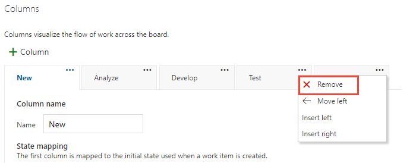
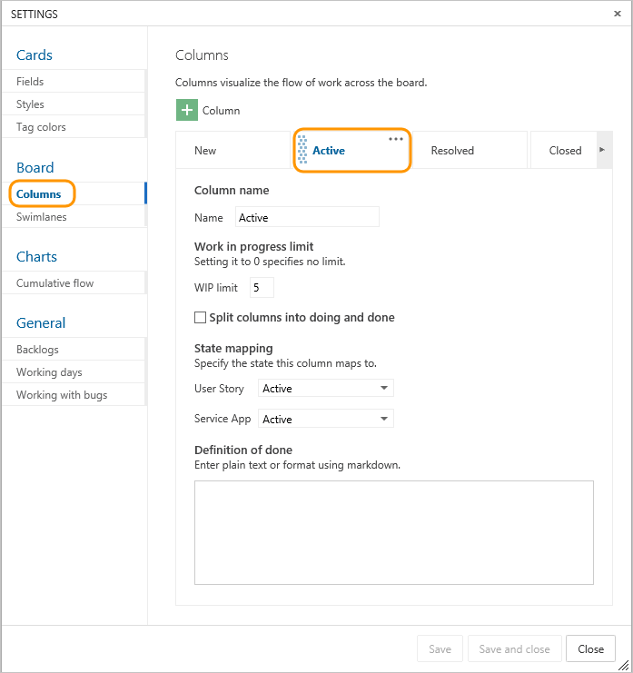
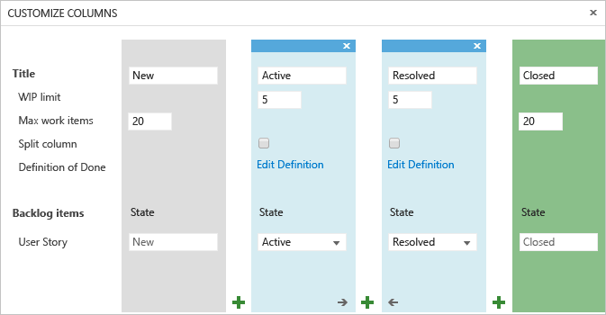
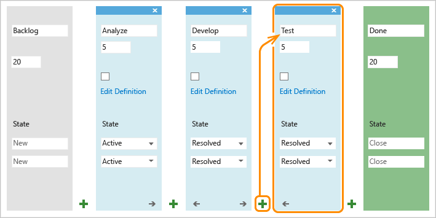
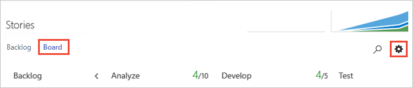
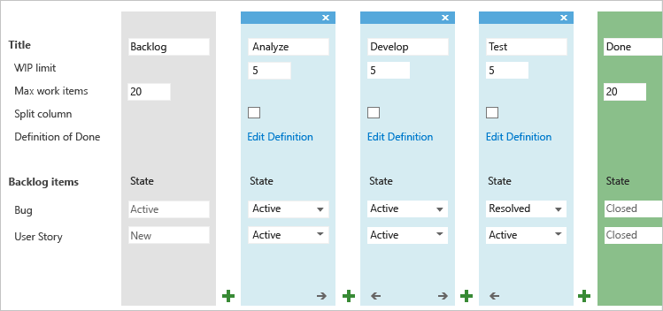

# Add columns to your Kanban board

[!INCLUDE [temp](../_shared/version-vsts-tfs-all-versions.md)] 

Kanban's number one practice is to visualize the flow of work. Accordingly, your number one task is to visualize your team's workflow. You do this by identifying the types of work and handoffs that occur regularly as your team moves items off the backlog and into a shippable state.

After you identify your team's workflow stages, you're ready to [configure your Kanban board to map to them](add-columns.md#add-or-rename-columns). Once configured, you use your Kanban board to update status, reassign work, and reorder items to reflect changing priorities.

For example, the main workflow stages performed by our example dev team are captured here as Analyze, Develop, and Test. Each column corresponds to a work stage the team performs on each item before it can be considered done.

If you're just getting started, review [Kanban basics](kanban-basics.md) to get an overview of how to access your board and implement Kanban.

::: moniker range="azure-devops"
> [!NOTE]    
>If you're looking at how to add columns to a taskboard, you need to customize the workflow. For details, see [Customize your work flow](../../reference/customize-work.md). To add columns to a backlog or query results, see [Change column options](../backlogs/set-column-options.md).   
>
>For an overview of the features supported on each backlog and board, see [Backlog, board, and plan views](../backlogs/backlogs-boards-plans.md).
::: moniker-end

::: moniker range=">= tfs-2013 <= azure-devops-2019"
> [!NOTE]    
>If you're looking at how to add columns to a taskboard, you need to customize the workflow. For details, see [Add or modify a work item type](../../reference/add-modify-wit.md). To add columns to a backlog or query results, see [Change column options](../backlogs/set-column-options.md).   
>
>For an overview of the features supported on each backlog and board, see [Backlog, board, and plan views](../backlogs/backlogs-boards-plans.md).
::: moniker-end

[!INCLUDE [temp](../_shared/prerequisites-team-settings.md)]

##Map the flow of work
It's best if you involve the entire team to identify an initial set of workflow stages. Each team member provides useful perspectives to capture and further deepen team understanding of the end-to-end processes.

To get started, ask your team these questions: 

- *What types of activities do we regularly perform?* 
- *What natural hand offs occur within our team? Or, from our team to other teams?* 
- *What activities will help reinforce our team policies, such as analysis, code review, or design acceptance?*
- *What work needs to occur at each stage?* 

Our example development team came up with these stages as essential to their process: 

* **Backlog**: Prioritized list of items which aren't yet ready to work on  
* **Analyze**: Well understood and shared acceptance criteria identified   and overall work required to develop and test item  
* **Develop**: Code and run unit tests for the item  
* **Test**: Perform exploratory, automated, integration, and other tests
* **Done**: Item ready to handoff to production.  

You can always revisit these initial stages later and adjust. 

Another idea, capture the list of items your team identifies as critical-to-complete for each stage. You can use that later to fill out the [Definition of Done](http://msdn.microsoft.com/library/dn914589.aspx) for each column. 

## Update status and handoff items

Using your Kanban board couldn't be simpler. Using drag-and-drop operations you update the status or change priorities. 

For example, to signal when work can start in a downstream stage, simply drag items into the next column. 

You'll notice that you can move an item from one column to any other column on the board. That way, if you discover more work is needed at an earlier stage, you can simply move the item backward, for example from Test into Analyze or Develop. 

Also, to handoff work to another team member, simply reassign it directly from the board.

And, team members receiving the handoff can [set alerts](../queries/alerts-and-notifications.md) to receive immediate email notifications of their newly assigned work. 

## Change priorities

To keep teams working on the highest priority items, you'll want to react quickly when a change in priority occurs even after work starts. With your Kanban board it's a snap. Simply drag an item up or down within a column.

## Add or rename columns

Now that you've got the essentials of how to work with your Kanban board, here's how you get it to look like what you need it to.

You'll see different column titles and choices based on the [Process](../work-items/guidance/choose-process.md) you used to create your project and whether your team has chosen to [treat bugs like requirements or like tasks](../../organizations/settings/show-bugs-on-backlog.md).  

::: moniker range=">= azure-devops-2019"

0.  [Open your Kanban board](kanban-quickstart.md). If you're not a team admin, [get added as one](../../organizations/settings/add-team-administrator.md). Only team and project admins can customize the Kanban board.

0. Choose the  gear icon to configure the board and set general team settings.  

	> [!div class="mx-imgBorder"]
	>   

2. Choose **Columns** and then a column tab to see all the settings you can modify. Your initial column settings will look something like this. 

	 

3. Change your column titles to map to your workflow stages. You can add, rename, and move columns to support more stages. 

	Here, we rename the first, second, and third columns to Backlog, Analyze, and Develop. We then add a column and label it Test. 

	You can rename a column directly form the Kanban board. 

	

	Or, you can open the dialog and change one or more settings for a Kanban column. 

	> [!div class="mx-imgBorder"]
	>   

0. To change the column order, simply drag the column tab to the position you want.  

0. To delete a column, first make sure that the column doesn't contain any work items. If it does, move the items to another column. Then, open **Settings**, choose **Columns**, and choose the  actions icon from the column tab and select **Remove** from the menu.  

	> [!div class="mx-imgBorder"]
	>     

0.	[Change State mappings as needed](#state-mappings) for added columns, added workflow states, or added work item types (WITs). 

	Usually you need to do this when you change the [Working with bugs](../../organizations/settings/show-bugs-on-backlog.md) setting, add [WITs to the Requirement Category](../../reference/add-wits-to-backlogs-and-boards.md), or [customize the workflow](../../organizations/settings/work/customize-process-workflow.md).  

0. When done with your changes, choose **Save**.

::: moniker-end 

::: moniker range="tfs-2018"  
0.  [Open your Kanban board](kanban-quickstart.md). If you're not a team admin, [get added as one](../../organizations/settings/add-team-administrator.md). Only team and project admins can customize the Kanban board.

0. Choose  to open the common configuration settings dialog for the Kanban board. 

	  

2. Choose **Columns** and then a column tab to see all the settings you can modify. Your initial column settings will look something like this. 

	 

3. Change your column titles to map to your workflow stages. You can add, rename, and move columns to support more stages. 

	Here, we rename the first, second, and third columns to Backlog, Analyze, and Develop. We then add a column and label it Test. 

	You can rename a column directly form the Kanban board. 

	

	Or, you can open the dialog and change one or more settings for a Kanban column. 

	 

0. To change the column order, simply drag the column tab to the position you want.  

0. To delete a column, first make sure that the column doesn't contain any work items. If it does, move the items to another column. Then, choose the column tab  actions icon and select **Remove** from the menu. 

	> [!div class="mx-imgBorder"]
	>   

0.	[Change State mappings as needed](#state-mappings) for added columns, added workflow states, or added work item types (WITs).  

	Usually you need to do this when you change the [Working with bugs](../../organizations/settings/show-bugs-on-backlog.md) setting, add [WITs to the Requirement Category](../../reference/add-wits-to-backlogs-and-boards.md), or [customize the workflow](../../organizations/settings/work/customize-process-workflow.md).  

0. When done with your changes, choose **Save**.  

::: moniker-end  

::: moniker range="tfs-2017"  
0.  [Open your Kanban board](kanban-quickstart.md). If you're not a team admin, [get added as one](../../organizations/settings/add-team-administrator.md). Only team and project admins can customize the Kanban board.

0. Choose  to open the common configuration settings dialog for the Kanban board. 

	  

2. Choose **Columns** and then a column tab to see all the settings you can modify. Your initial column settings will look something like this. 

	 

3. Change your column titles to map to your workflow stages. You can add, rename, and move columns to support more stages. 

	Here, we rename the first, second, and third columns to Backlog, Analyze, and Develop. We then add a column and label it Test. 

	You can rename a column directly form the Kanban board. 

	

	Or, you can open the dialog and change one or more settings for a Kanban column. 

	 

0. To change the column order, simply drag the column tab to the position you want.  

0. To delete a column, first make sure that the column doesn't contain any work items. If it does, move the items to another column. Then, choose the column tab  actions icon and select **Delete** from the menu. 

	  

::: moniker-end  

::: moniker range="tfs-2015"  

0.  [Open your Kanban board](kanban-quickstart.md). If you're not a team admin, [get added as one](../../organizations/settings/add-team-administrator.md). Only team and project admins can customize the Kanban board.  

0. the  gear icon, to open the common configuration settings dialog for the Kanban board. 

	  

	#### TFS 2015.1  

0. Choose **Columns** and then a column tab to see all the settings you can modify. Your initial column settings will look something like this. 

	

0. Change your column titles to map to your workflow stages. You can add, rename, and move columns to support more stages. 

	Here, we rename the first, second, and third columns to Backlog, Analyze, and Develop. We then add a column and label it Test. 

	You can rename a column directly form the Kanban board. 

	

	Or, you can open the dialog and change one or more settings for a Kanban column. 

	

0. To change the column order, simply drag the column tab to the position you want.  

0. To delete a column, first make sure that the column doesn't contain any work items. If it does, move the items to another column. Then, choose the column tab  actions icon and select **Delete** from the menu. 

	  

0. [Change State mappings as needed](#state-mappings) for added columns, added workflow states, or added work item types (WITs). 

	Usually you need to do this when you change the [Working with bugs](../../organizations/settings/show-bugs-on-backlog.md) setting or add [WITs to the Requirement Category](../../reference/add-wits-to-backlogs-and-boards.md).  
 
0. When done with your changes, choose **Save**.  

	#### TFS 2015  

0. Change your column titles to map to your workflow stages. You can add, rename, and move columns to support more stages. 

	  

	Here, we rename the first, second, and third columns to Backlog, Analyze, and Develop. We then add a column and label it Test. 

	  

	Rename column titles to best reflect each stage of work. Keep the column titles as simple as possible. 

0. To change the column order, use the left  or right  arrow icons. 

0. To delete a column, first make sure that the column doesn't contain any work items. If it does, move the items to another column. Then, click X at the top of the column.

0. [Change State mappings as needed](#state-mappings) for added columns, added workflow states, or added work item types (WITs).

	Usually you need to do this when you change the [Working with bugs](../../organizations/settings/show-bugs-on-backlog.md) setting or add [WITs to the Requirement Category](../../reference/add-wits-to-backlogs-and-boards.md).

::: moniker-end  

::: moniker range="tfs-2013"  

0.  [Open your Kanban board](kanban-quickstart.md). If you're not a team admin, [get added as one](../../organizations/settings/add-team-administrator.md). Only team and project admins can customize the Kanban board.  

0. Choose the  gear icon, to open Customize Columns.  

	  

	If you're not a team admin, [get added as one](../../organizations/settings/add-team-administrator.md). Only team and project admins can customize columns.   

	  

0. Change your column titles to map to your workflow stages. You can add, rename, and move columns to support more stages. 

	Here, we rename the first, second, and third columns to Backlog, Analyze, and Develop. We then add a column and label it Test. 

	  

	Rename column titles to best reflect each stage of work. Keep the column titles as simple as possible.

0. To change the column order, use the left  or right  arrow icons. 

0. To delete a column, first make sure that the column doesn't contain any work items. If it does, move the items to another column. Then, choose **X** at the top of the column.

0. [Change State mappings as needed](#state-mappings) for added columns, added workflow states, or added work item types (WITs).

	Usually you need to do this when you change the [Working with bugs](../../organizations/settings/show-bugs-on-backlog.md) setting or add [WITs to the Requirement Category](../../reference/add-wits-to-backlogs-and-boards.md).
 
::: moniker-end

## Update Kanban column-to-State mappings
 
Another "under the hood" item that impacts Kanban column-to-State mappings is categories. The Kanban board and other Agile tools uses categories to group WITs that they want to treat the same. 

What does this mean for Kanban board users? First, only work items whose WITs belong to the Requirement Category show up on the Kanban board. Second, if you add bugs or other WITs to appear on the Kanban board, you potentially introduce additional workflow states. This means that you may need to adjust the Kanban column-to-State mappings when you perform one of these additional customizations:

* Your team admin chooses to [show bugs on backlogs and boards](../../organizations/settings/show-bugs-on-backlog.md)  
* Your project admin [adds WITs to backlogs and boards](../../reference/add-wits-to-backlogs-and-boards.md)
* Your project collection or project admin customizes the workflow for a WIT in the Requirement Category: [Azure Boards](../../organizations/settings/work/customize-process-workflow.md) or [TFS](../../reference/xml/change-workflow-wit.md)  

For example, if you change the team setting and add bugs to the Requirements Category, the bug WIT will now appear in the Columns dialog. You'll want to make sure that the Kanban column-to-State mappings match what you want. For more information, see [Workflow states and state categories](../work-items/workflow-and-state-categories.md). 

::: moniker range=">= tfs-2017"

In this example two new states have been added, Triaged for bug, and Investigate for user story. Each needs to be mapped to an existing or new column in order for the Kanban board to display work items assigned to these states.  

  
::: moniker-end

::: moniker range="tfs-2015"

**TFS 2015.1**
In this example two new states have been added, Triaged for bug, and Investigate for user story. Each needs to be mapped to an existing or new column in order for the Kanban board to display work items assigned to these states.  

  

**TFS 2015**
In this example, bugs have been added to show on the Kanban board. You need to map the bug state for each column on the Kanban board.  
 

::: moniker-end

::: moniker range="tfs-2013"

In this example, bugs have been added to show on the Kanban board. You need to map the bug state for each column on the Kanban board.  
 

::: moniker-end

## Track Kanban column status  

Your Kanban board is one of several tools you have for tracking work. The [query tool](../queries/using-queries.md) allows you to list a subset of work items for the purposes of review, triage, update, or chart generation. For example, you can create a query to list all active user stories (specify two clauses: Work Item Type=User Story; State=Active). 

::: moniker range=">= tfs-2017"
But what if you want to list items based on their Kanban column assignment? Can you do that? Yes, you can track Kanban board column moves using the [Board Column and Board Column Done fields](../queries/query-by-workflow-changes.md#kanban_query_fields).
::: moniker-end

::: moniker range=">= tfs-2013 <= tfs-2015"
But what if you want to list items based on their Kanban column assignment? Can you do that? Yes, from TFS 2015 Update 1 or later version. No, if you work from TFS 2015 or earlier versions. You track Kanban board column moves using the [Board Column and Board Column Done fields](../queries/query-by-workflow-changes.md#kanban_query_fields).  

 
**For TFS 2013, TFS 2015:**
What you can do is view the history of changes made to a work item. The [History field](../queries/history-and-auditing.md) captures all updates made to an item, including column moves. You can view this by opening the card (double-click to open). 

For example, the following History shows two updates made by dragging the item into a different Kanban column. The first (revision 8) involved a column move, from Analyze to Develop; and a State change, New to Active. However, the second (revision 9) only involved a column move, from Develop to Test; the State remains at Active.
 

As an item's card moves from one Kanban column to the next, the item's workflow state updates based on the Kanban column-to-State mapping. You can see and set these mappings from the Customize Columns dialog. For example, here's the default mapping for the Agile user story.

Kanban columns may correspond to an actual workflow state or a pseudo state. For example, Develop, Test, and Verify columns may all map to the Active state. In this case, when you move an item from Develop to Test or from Test to Verify, the item's State doesn't change. 

::: moniker-end

## Related articles

That's about all you need to know about working with Kanban columns. Here are a few more options you have for customizing the look and feel of the board. 

* [Workflow states & state categories](../work-items/workflow-and-state-categories.md)  
* [Set up your backlogs and boards](../backlogs/set-up-your-backlog.md)
* [Show bug on backlogs and boards](../../organizations/settings/show-bugs-on-backlog.md)  
* [Work in Progress limits](wip-limits.md)  
* [Add swimlanes, expedite work](expedite-work.md)   
* [Split columns](split-columns.md)   
* [Definition of Done](definition-of-done.md)  

### REST API resources
To interact programmatically with Kanban board and other team settings, see the [REST API, Boards reference](/rest/api/azure/devops/work/boards).
