# Add columns to your Kanban board

[!INCLUDE [temp](../includes/version-all.md)] 

Kanban's number one practice is to visualize the flow of work. Accordingly, your number one task is to visualize your team's workflow. You perform this task by identifying the types of work and hand-offs that occur regularly as your team moves items off the backlog and into a shippable state.

For example, the main workflow stages performed by our example dev team are captured here as Analyze, Develop, and Test. Each column corresponds to a work stage the team performs on each item before it can be considered done.

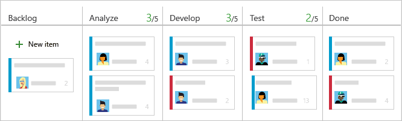

After you identify your team's workflow stages, you're ready to [configure your Kanban board to map to them](add-columns.md#add-or-rename-columns). Once configured, you use your Kanban board to update status, reassign work, and reorder items to reflect changing priorities.

If you're just getting started, review [Kanban basics](kanban-basics.md) to get an overview of how to access your board and implement Kanban.

::: moniker range=">= azure-devops-2020"

> [!NOTE]    
> If you're looking at how to add columns to a sprint Taskboard, see [Customize a Taskboard](../sprints/customize-taskboard.md). To add columns to a backlog or query results, see [Change column options](../backlogs/set-column-options.md).   
::: moniker-end

::: moniker range=">= tfs-2013 <= azure-devops-2019"

> [!NOTE]    
> If you're looking at how to add columns to a taskboard, you need to customize the workflow. For details, see [Add or modify a work item type](../../reference/add-modify-wit.md). To add columns to a backlog or query results, see [Change column options](../backlogs/set-column-options.md).   
>
> For an overview of the features supported on each backlog and board, see [Backlog, board, and plan views](../backlogs/backlogs-boards-plans.md).

::: moniker-end

## Why configure your Kanban board columns?  

The main reason to configure your team's Kanban board columns is to support your team's workflow and Kanban processes. These processes may include triaging work prior to committing to the work, managing handoff from one team member to another&mdash;such as development to test&mdash;managing Work in Progress (WIP), and more. 

In addition, you can use your Kanban board to perform the following tasks: 

- Visualize work that is in progress and work nearing completion or completed  
- Filter your board to focus on select work based on assignment to a team member or sprint, tags, or parent feature. For details, see [Interactively filter backlogs, boards, queries, and plans](../backlogs/filter-backlogs-boards-plans.md)
- Update workflow status through drag-and-drop as shown in [Update status](#update-status) later in this article  
- Reorder cards to change priority of work items as described in [Change priorities](#change-priorities) later in this article 
- View and quickly assign values to key fields as described in [Customize cards](customize-cards.md) 
- Create queries and charts based on Board columns as illustrated in [Track board column status](#track-column-status) later in this article 
- Review Cumulative Flow Diagram based on column assignments as described in [View/configure a Cumulative Flow Diagram](../../report/dashboards/cumulative-flow.md) 

[!INCLUDE [temp](../includes/prerequisites-team-settings.md)]

In addition, we recommend that you review the following articles: 

- [Configure and customize Azure Boards](../configure-customize.md)
- [Set up your Backlogs and Boards](../backlogs/set-up-your-backlog.md)  
- [Workflow states & state categories](../work-items/workflow-and-state-categories.md)  

## Board column customization sequence 

Before you configure your team's Kanban board columns, you'll want to make sure the following tasks are complete as possible. Otherwise, you'll find yourself revisiting your configuration. Revisiting a single team's configuration is one thing, however if you support many teams, then you've added extra work by skipping this step. 

**Process Administrator**: 
1. Add custom work item types that you want to appear on your backlog or board. For details, see [Add and manage work item types](../../organizations/settings/work/customize-process-work-item-type.md).
2. Customize your product and portfolio backlogs to ensure all work item types you want to have will appear on the backlogs and boards. For details see [Customize backlogs & boards](../../organizations/settings/work/customize-process-backlogs-boards.md). 
3. Customize workflow states. Each workflow state appears as a column on the Kanban board. For details, see [Customize a workflow](../../organizations/settings/work/customize-process-workflow.md)

**Team Administrator**:
1. Set the backlogs you want active for your team. You only need to configure the Kanban boards of those backlogs that your team will use. For details, see [Select backlog navigation levels for your team](../../organizations/settings/select-backlog-navigation-levels.md).
1. Determine how bugs will be tracked. Bugs may have different workflow states from other requirement work item types and therefore must be mapped separate from other work item types. For details, see [Show bugs on backlogs and boards](../../organizations/settings/show-bugs-on-backlog.md).
1. Identify the columns your team will use to support their workflow and Kanban processes. For details, see [Map the flow of work](#map-the-flow-of-work) later in this article. 
1. Add, remove, or rename columns and map workflow states to columns. For details, see [Add, edit, rename, or remove columns, split columns](#add-or-rename-columns) later in this article.  

For example, if you add bugs or other work item types to appear on a Kanban board, you potentially introduce other workflow states. New workflow states request you to adjust the Kanban column **State mappings** when one of the following customizations is made:

* Your team admin chooses to [show bugs on backlogs and boards](../../organizations/settings/show-bugs-on-backlog.md)  
* Your project admin [adds WITs to backlogs and boards](../../reference/add-wits-to-backlogs-and-boards.md)
* Your project collection or project admin customizes the workflow for a WIT in the Requirement Category: [Inherited process](../../organizations/settings/work/customize-process-workflow.md) or [On-premises XML process](../../reference/xml/change-workflow-wit.md)  

## What is State mapping?  

One of the main configuration details you need to understand to correctly add columns to your Kanban board is how workflow states map to Kanban board column states. The Kanban board and other Azure Boards tools use categories to group WITs that they want to treat the same. Two types of categories are used.  

- **Work item type categories**:  
	- Only work items whose work item types belong to the Requirement Category show up on the product board. 
	- Only work items whose work item types belong to the Feature Category show up on the Feature portfolio board. 
	- Only work items whose work item types belong to the Epic Category show up on the Epic portfolio board. 
	- Only work items whose work item types belong to a custom category show up on a custom portfolio board. 

- **State categories**: 
	- There are four and only four state categories: *Proposed*, *In Progress*, *Completed*, and *Removed*. 
	- Workflow states defined for a work item type belong to one of the four state categories. 
	- For each work item type and each Kanban board column, the workflow state must be specified (except those workflow states in the *Removed* category).
	- The first Kanban board column is automatically mapped to the default State for each work item type's *Proposed* state category. 
	- For middle Kanban board columns, you can map the column to any of the states that belong to the *Proposed* or *In Progress* state categories. Also, you can only specify [Work in Progress limits](wip-limits.md), [Split columns](split-columns.md), and [Definition of Done](definition-of-done.md) for these columns. 
	- The *Completed* state category can only map to the last Kanban board column.  

> [!TIP]   
> If a workflow state isn't mapped to a Kanban column, then that state doesn't show up on the Kanban board. This is allowed but not recommended.  

### Correct your Kanban Board configuration

If you see the following error when you open your Kanban board, you need to correct the configuration. The main reason for this error is that the workflow states of work item types that have been added to the Requirements category aren't mapped to the column. 

> [!div class="mx-imgBorder"]
> 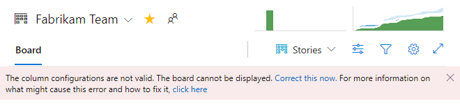

Choose **Correct this now** to open the **Settings** dialog.  

::: moniker range=">= tfs-2017"

In this example two new states have been added, **Triaged** for bug, and **Investigate** for user story. Each state needs to be mapped to an existing or new column in order for the Kanban board to display work items assigned to these states.  

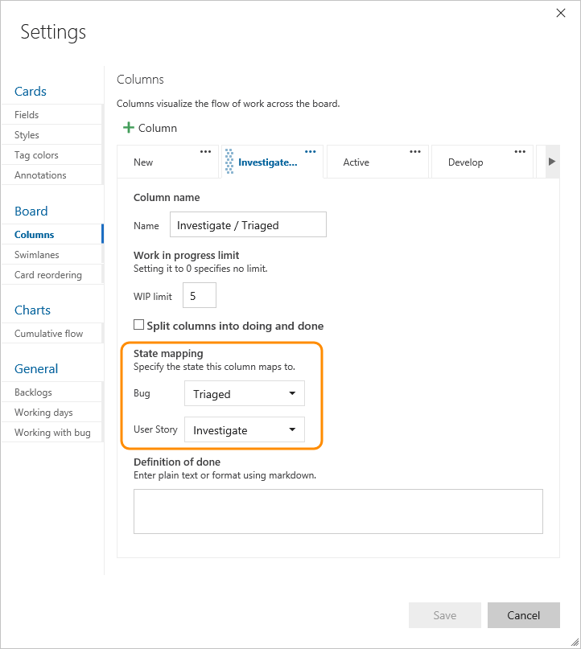  
::: moniker-end

::: moniker range="tfs-2015"

**TFS 2015.1**
In this example two new states have been added, **Triaged** for bug, and **Investigate** for user story. Each state needs to be mapped to an existing or new column in order for the Kanban board to display work items assigned to these states.  

  

**TFS 2015**
In this example, bugs have been added to show on the Kanban board. You need to map the bug state for each column on the Kanban board.  
 

::: moniker-end

::: moniker range="tfs-2013"

In this example, bugs have been added to show on the Kanban board. You need to map the bug state for each column on the Kanban board.  
 

::: moniker-end

## Map the flow of work

It's best if you involve the entire team to identify an initial set of workflow stages. Each team member provides useful perspectives to capture and further deepen team understanding of the end-to-end processes.

To get started, ask your team these questions: 

- *What types of activities do we regularly perform?* 
- *What natural hand offs occur within our team? Or, from our team to other teams?* 
- *What activities will help reinforce our team policies, such as analysis, code review, or design acceptance?*
- *What work needs to occur at each stage?*  
- *What limits do we want to set for each workflow state?*  
- *Will a split column be useful for one or more columns?*  

Our example development team came up with these stages as essential to their process: 

* **Backlog**: Prioritized list of work items that aren't yet ready to work on  
* **Analyze**: Well understood and shared acceptance criteria identified and overall work required to develop and test item  
* **Develop**: Code and run unit tests for the item  
* **Test**: Perform exploratory, automated, integration, and other tests
* **Done**: Item ready to handoff to production.  

You can always revisit these initial stages later and adjust. 

Another idea, capture the list of items your team identifies as critical-to-complete for each stage. You can use that information later to fill out the [Definition of Done](./definition-of-done.md) for each column. 

## Add, edit, rename, or remove columns,

Now that you've got the essentials of how to work with your Kanban board, here's how you get it to look like what you need it to.

You'll see different column titles and choices based on the [Process](../work-items/guidance/choose-process.md) you used to create your project and whether your team has chosen to [treat bugs like requirements or like tasks](../../organizations/settings/show-bugs-on-backlog.md).  

::: moniker range=">= azure-devops-2019"

1. [Open your Kanban board](kanban-quickstart.md). If you're not a team admin, [get added as one](../../organizations/settings/add-team-administrator.md). Only team and project admins can customize the Kanban board.

1. Choose **Configure team settings** :::image type="icon" source="../../media/icons/blue-gear.png" border="false"::: to configure the board and set general team settings.  

	> [!div class="mx-imgBorder"]
	>   

2. Choose **Columns** and then a column tab to see all the settings you can modify. Your initial column settings look similar to the settings shown in the following image. 

	> [!div class="mx-imgBorder"]
	> 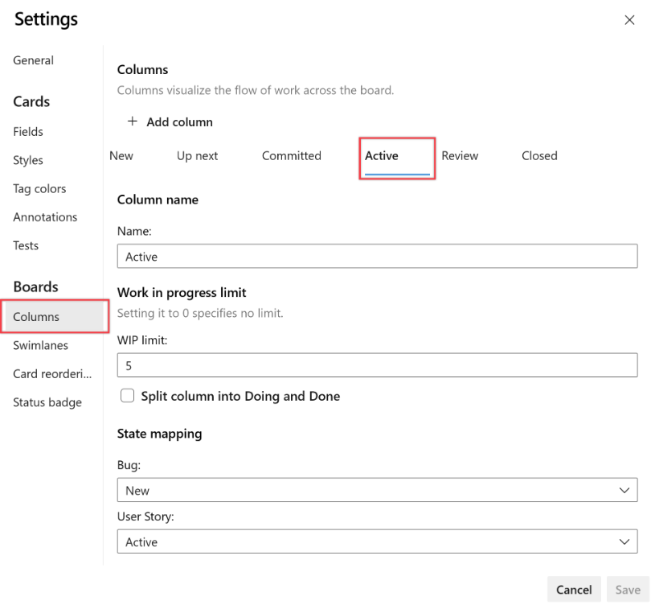  

3. Change your column titles to map to your workflow stages. You can add, rename, and move columns to support more stages. 

	Here, we rename the first, second, and third columns to Backlog, Analyze, and Develop. We then add a column and label it Test. 

	You can rename a column directly from the Kanban board. 

	

	Or, you can open the dialog and change one or more settings for a Kanban column. 

	> [!div class="mx-imgBorder"]
	> 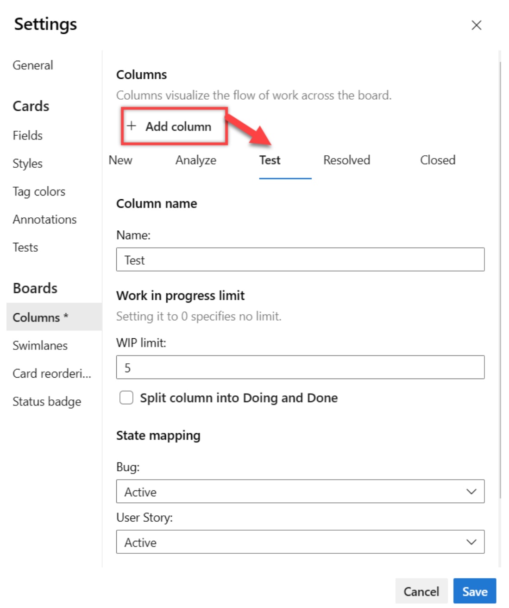  

4. To change the column order, drag the column tab to the position you want.  

5. To delete a column, first make sure that the column doesn't contain any work items. If it does, move the items to another column. Then, open **Settings**, choose **Columns**, and choose the  :::image type="icon" source="../../media/icons/actions-icon.png" border="false":::  actions icon from the column tab and select **Remove** from the menu.  

	> [!div class="mx-imgBorder"]
	>     

6. [Change State mappings as needed](#state-mappings) for added columns, added workflow states, or added work item types (WITs). 

   Usually you need update **State mappings** when you change the [Working with bugs](../../organizations/settings/show-bugs-on-backlog.md) setting, add [WITs to the Requirement Category](../../reference/add-wits-to-backlogs-and-boards.md), or [customize the workflow](../../organizations/settings/work/customize-process-workflow.md).  

7. When done with your changes, choose **Save**.

::: moniker-end 

::: moniker range="tfs-2018"  

1. [Open your Kanban board](kanban-quickstart.md). If you're not a team admin, [get added as one](../../organizations/settings/add-team-administrator.md). Only team and project admins can customize the Kanban board.

1. Choose  to open the common configuration settings dialog for the Kanban board. 

	  

2. Choose **Columns** and then a column tab to see all the settings you can modify. Your initial column settings will look something like this. 

	> [!div class="mx-imgBorder"]
	> 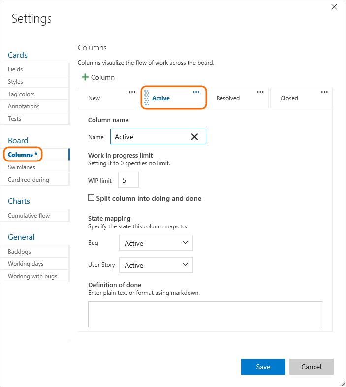

3. Change your column titles to map to your workflow stages. You can add, rename, and move columns to support more stages. 

	Here, we rename the first, second, and third columns to Backlog, Analyze, and Develop. We then add a column and label it Test. 

	You can rename a column directly from the Kanban board. 

	

	Or, you can open the dialog and change one or more settings for a Kanban column. 

	 

4. To change the column order, drag the column tab to the position you want.  

5. To delete a column, first make sure that the column doesn't contain any work items. If it does, move the items to another column. Then, choose the column tab  :::image type="icon" source="../../media/icons/actions-icon.png" border="false":::  actions icon and select **Remove** from the menu. 

	> [!div class="mx-imgBorder"]
	>   

6. [Change State mappings as needed](#state-mappings) for added columns, added workflow states, or added work item types (WITs).  

   Usually you need to update **State mappings** when you change the [Working with bugs](../../organizations/settings/show-bugs-on-backlog.md) setting, add [WITs to the Requirement Category](../../reference/add-wits-to-backlogs-and-boards.md), or [customize the workflow](../../organizations/settings/work/customize-process-workflow.md).  

7. When done with your changes, choose **Save**.  

::: moniker-end  

::: moniker range="tfs-2017"  

1. [Open your Kanban board](kanban-quickstart.md). If you're not a team admin, [get added as one](../../organizations/settings/add-team-administrator.md). Only team and project admins can customize the Kanban board.

1. Choose  to open the common configuration settings dialog for the Kanban board. 

	  

2. Choose **Columns** and then a column tab to see all the settings you can modify. Your initial column settings will look something like this. 

	 

3. Change your column titles to map to your workflow stages. You can add, rename, and move columns to support more stages. 

	Here, we rename the first, second, and third columns to Backlog, Analyze, and Develop. We then add a column and label it Test. 

	You can rename a column directly from the Kanban board. 

	

	Or, you can open the dialog and change one or more settings for a Kanban column. 

	 

4. To change the column order, drag the column tab to the position you want.  

5. To delete a column, first make sure that the column doesn't contain any work items. If it does, move the items to another column. Then, choose the column tab  :::image type="icon" source="../../media/icons/actions-icon.png" border="false":::  actions icon and select **Delete** from the menu. 

	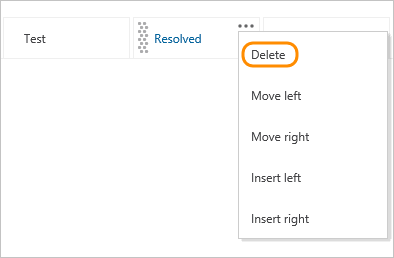  

::: moniker-end  

::: moniker range="tfs-2015"  

1. [Open your Kanban board](kanban-quickstart.md). If you're not a team admin, [get added as one](../../organizations/settings/add-team-administrator.md). Only team and project admins can customize the Kanban board.  

1. the :::image type="icon" source="../media/icons/team-settings-gear-icon.png" border="false"::: gear icon, to open the common configuration settings dialog for the Kanban board. 

	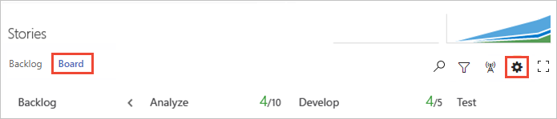  

	#### TFS 2015.1  

2. Choose **Columns** and then a column tab to see all the settings you can modify. Your initial column settings will look something like this. 

	

3. Change your column titles to map to your workflow stages. You can add, rename, and move columns to support more stages. 

	Here, we rename the first, second, and third columns to Backlog, Analyze, and Develop. We then add a column and label it Test. 

	You can rename a column directly from the Kanban board. 

	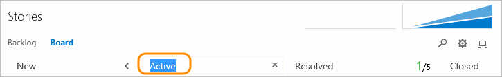

	Or, you can open the dialog and change one or more settings for a Kanban column. 

	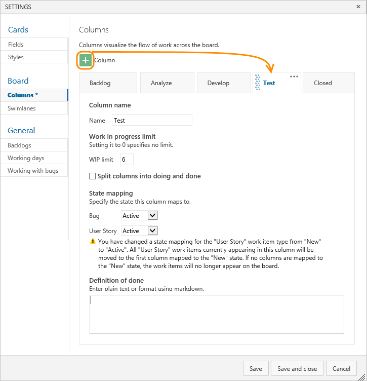

4. To change the column order, drag the column tab to the position you want.  

5. To delete a column, first make sure that the column doesn't contain any work items. If it does, move the items to another column. Then, choose the column tab  :::image type="icon" source="../../media/icons/actions-icon.png" border="false":::  actions icon and select **Delete** from the menu. 

	  

6. [Change State mappings as needed](#state-mappings) for added columns, added workflow states, or added work item types (WITs). 

	Usually you need to do update **State mappings** when you change the [Working with bugs](../../organizations/settings/show-bugs-on-backlog.md) setting or add [WITs to the Requirement Category](../../reference/add-wits-to-backlogs-and-boards.md).  
 
7. When done with your changes, choose **Save**.  

	#### TFS 2015  

8. Change your column titles to map to your workflow stages. You can add, rename, and move columns to support more stages. 

	  

	Here, we rename the first, second, and third columns to Backlog, Analyze, and Develop. We then add a column and label it Test. 

	  

	Rename column titles to best reflect each stage of work. Keep the column titles as simple as possible. 

9. To change the column order, use the left ← or right → arrow icons. 

1. To delete a column, first make sure that the column doesn't contain any work items. If it does, move the items to another column. Then, click X at the top of the column.

11. [Change State mappings as needed](#state-mappings) for added columns, added workflow states, or added work item types (WITs).

     Usually you need to update **State mappings** when you change the [Working with bugs](../../organizations/settings/show-bugs-on-backlog.md) setting or add [WITs to the Requirement Category](../../reference/add-wits-to-backlogs-and-boards.md).

::: moniker-end  

::: moniker range="tfs-2013"  

1. [Open your Kanban board](kanban-quickstart.md). If you're not a team admin, [get added as one](../../organizations/settings/add-team-administrator.md). Only team and project admins can customize the Kanban board.  

1. Choose the :::image type="icon" source="../media/icons/team-settings-gear-icon.png" border="false"::: gear icon, to open Customize Columns.  

	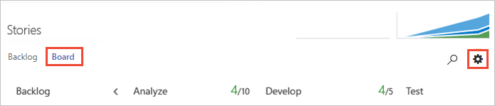  

	If you're not a team admin, [get added as one](../../organizations/settings/add-team-administrator.md). Only team and project admins can customize columns.   

	  

2. Change your column titles to map to your workflow stages. You can add, rename, and move columns to support more stages. 

	Here, we rename the first, second, and third columns to Backlog, Analyze, and Develop. We then add a column and label it Test. 

	  

	Rename column titles to best reflect each stage of work. Keep the column titles as simple as possible. 

3. To change the column order, use the left ← or right → arrow icons. 

4. To delete a column, first make sure that the column doesn't contain any work items. If it does, move the items to another column. Then, choose **X** at the top of the column. 

5. [Change State mappings as needed](#state-mappings) for added columns, added workflow states, or added work item types (WITs).

	Usually you need to update **State mappings** when you change the [Working with bugs](../../organizations/settings/show-bugs-on-backlog.md) setting or add [WITs to the Requirement Category](../../reference/add-wits-to-backlogs-and-boards.md).
 
::: moniker-end

## Use your Kanban board  

Once you have a well-configured Kanban board, you can start using it. To learn how, see [Start using your Kanban board](kanban-quickstart.md).  

[!INCLUDE [temp](../includes/note-kanban-boards-teams.md)]

### Update status and handoff items

Using your Kanban board couldn't be simpler. Using drag-and-drop operations you update the status or change priorities. 

For example, to signal when work can start in a downstream stage, drag items into the next column. 

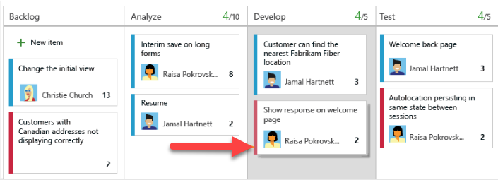

You'll notice that you can move an item from one column to any other column on the board. That way, if you discover more work is needed at an earlier stage, you can move the item backward, for example from Test into Analyze or Develop. 

Also, to handoff work to another team member, reassign it directly from the board.

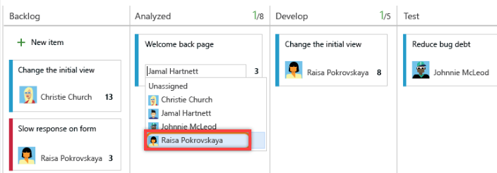

And, team members receiving the handoff can [set alerts](../../notifications/manage-your-personal-notifications.md) to receive immediate email notifications of their newly assigned work. 
 

### Change priorities

To keep teams working on the highest priority items, you'll want to react quickly when a change in priority occurs even after work starts. With your Kanban board it's a snap. Simply drag an item up or down within a column.

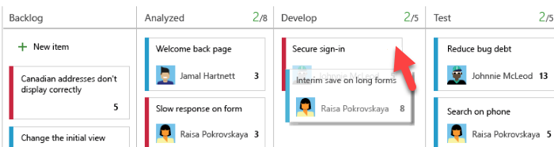

### Track Kanban column status  

Your Kanban board is one of several tools you have for tracking work. The [query tool](../queries/using-queries.md) allows you to list a subset of work items for the purposes of review, triage, update, or chart generation. For example, you can create a query to list all active user stories (specify two clauses: Work Item Type=User Story; State=Active). 

::: moniker range=">= tfs-2017"
But what if you want to list items based on their Kanban column assignment? Can you do that? Yes, you can track Kanban board column moves using the [Board Column and Board Column Done fields](../queries/query-by-workflow-changes.md#kanban_query_fields).
::: moniker-end

::: moniker range=">= tfs-2013 <= tfs-2015"
But what if you want to list items based on their Kanban column assignment? Can you do that? Yes, from TFS 2015 Update 1 or later version. No, if you work from TFS 2015 or earlier versions. You track Kanban board column moves using the [Board Column and Board Column Done fields](../queries/query-by-workflow-changes.md#kanban_query_fields).  

 
**For TFS 2013, TFS 2015:**
What you can do is view the history of changes made to a work item. The [History field](../queries/history-and-auditing.md) captures all updates made to an item, including column moves. You can view history by opening the card (double-click to open). 

For example, the following History shows two updates made by dragging the item into a different Kanban column. The first (revision 8) involved a column move, from Analyze to Develop; and a State change, New to Active. However, the second (revision 9) only involved a column move, from Develop to Test; the State remains at Active.
 

As an item's card moves from one Kanban column to the next, the item's workflow state updates based on the Kanban column-to-State mapping. You can see and set these mappings from the Customize Columns dialog. For example, here's the default mapping for the Agile user story.

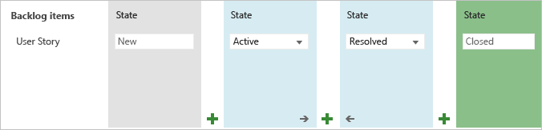

Kanban columns may correspond to an actual workflow state or a pseudo state. For example, Develop, Test, and Verify columns may all map to the Active state. In this case, when you move an item from Develop to Test or from Test to Verify, the item's State doesn't change. 

::: moniker-end
 

## FAQs 

- [Is there a way to widen columns on a Kanban board?](../faqs.yml#is-there-a-way-to-widen-columns-on-a-kanban-board)  
- [Can I query based on Kanban board columns?](../faqs.yml#can-i-query-based-on-kanban-board-columns)  
- [Can I view a query as a Kanban board?](../faqs.yml#can-i-view-a-query-as-a-kanban-board)  
- [Is there a way to copy a Kanban configuration to another team?](../faqs.yml#is-there-a-way-to-copy-a-kanban-configuration-to-another-team)  

## Supported Marketplace extensions

- [Query Based Boards](https://marketplace.visualstudio.com/items?itemName=realdolmen.EdTro-AzureDevOps-Extensions-QueryBasedBoards-Public)
- [Azure Boards Kanban Tools](https://marketplace.visualstudio.com/items?itemName=alm-devops-rangers.KanbanBoardTools) 
- [Roll-up Board](https://marketplace.visualstudio.com/items?itemName=ms-devlabs.RollUpBoard)
- [FlowViz](https://marketplace.visualstudio.com/items?itemName=agile-extensions.flowviz)

## Related articles

That's about all you need to know about working with Kanban columns. Here are a few more options you have for customizing the look and feel of the board. 

- [Customize cards](customize-cards.md)  
- [Expedite work with swimlanes](expedite-work.md)
- [Show bug on backlogs and boards](../../organizations/settings/show-bugs-on-backlog.md)  
- [Enable live updates ](live-updates.md)

### REST API resources
To interact programmatically with Kanban board and other team settings, see the [REST API, Boards reference](/rest/api/azure/devops/work/boards).
