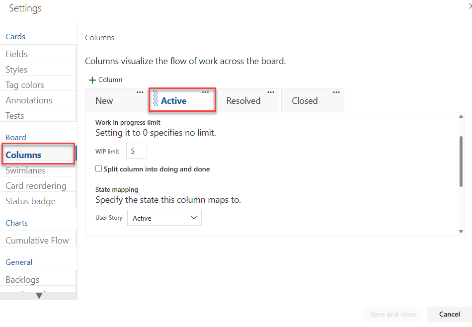
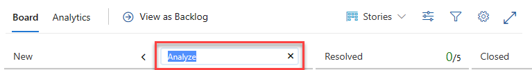
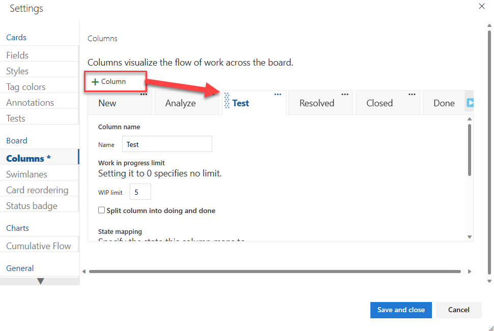

# Add columns to your Kanban board to manage your workflow

[!INCLUDE [version-lt-eq-azure-devops](../../includes/version-lt-eq-azure-devops.md)] 

Kanban's number one practice is to visualize the flow of work. So, your number one task is to visualize your team's workflow. You do this task by identifying the types of work and handoffs that occur regularly as your team moves items off the backlog and into a shippable state.

For example, the main workflow stages for the following dev team are captured as Analyze, Develop, and Test. Each column corresponds to work that the team does before that stage is considered done.

After you identify your team's workflow stages, you're ready to [configure your Kanban board to map to them](add-columns.md#add-or-rename-columns). After you configure the Kanban board, you can use it to update status, reassign work, and reorder items to reflect changing priorities.

If you're just getting started, review [Kanban basics](kanban-basics.md) to get an overview of how to access your board and implement Kanban.

::: moniker range=">= azure-devops-2020"

> [!NOTE]    
> If you want to add columns to a sprint taskboard, see [Customize a taskboard](../sprints/customize-taskboard.md). To add columns to a backlog or query results, see [Change column options](../backlogs/set-column-options.md).   
::: moniker-end

::: moniker range="<= azure-devops-2019"

> [!NOTE]    
> If you want to add columns to a taskboard, you need to customize the workflow. For details, see [Add or modify a work item type](../../reference/add-modify-wit.md). To add columns to a backlog or query results, see [Change column options](../backlogs/set-column-options.md).   
>
> For an overview of the features supported on each backlog and board, see [Backlog, board, and plan views](../backlogs/backlogs-boards-plans.md).

::: moniker-end

## Why configure your Kanban board columns?  

The main reason to configure your team's Kanban board columns is to support your team's workflow and Kanban processes. These processes might include triaging work before committing to it, managing handoff from one team member to another (such as development to test), managing work in progress (WIP), and more. 

You can also use your Kanban board to do the following tasks: 

- Visualize work that's in progress, nearing completion, and completed.  
- Filter your board to focus on select work based on assignment to a team member or sprint, tags, or parent feature. For details, see [Interactively filter backlogs, boards, queries, and plans](../backlogs/filter-backlogs-boards-plans.md).
- Update workflow status through drag-and-drop operations, as shown in [Update status](#update-status) later in this article.  
- Reorder cards to change priority of work items, as described in [Change priorities](#change-priorities) later in this article. 
- View and quickly assign values to key fields, as described in [Customize cards](customize-cards.md). 
- Create queries and charts based on board columns, as illustrated in [Track board column status](#track-column-status) later in this article. 
- Review a cumulative flow diagram based on column assignments, as described in [View and configure a cumulative flow diagram](../../report/dashboards/cumulative-flow.md). 

[!INCLUDE [temp](../includes/prerequisites-team-settings.md)]

Also, we recommend that you review the following articles: 

- [Configure and customize Azure Boards](../configure-customize.md)
- [Set up your backlogs and boards](../backlogs/set-up-your-backlog.md)  
- [Workflow states and state categories](../work-items/workflow-and-state-categories.md)  

## Customization sequence for board columns

Before you configure your team's Kanban board columns, make sure that you complete the following tasks as much as possible. Otherwise, you'll find yourself revisiting your configuration. Revisiting a single team's configuration is one thing, but if you support many teams, you're adding extra work by skipping this step. 

**Process administrator**: 
1. Add custom work item types that you want to appear on your backlog or board. For details, see [Add and manage work item types](../../organizations/settings/work/customize-process-work-item-type.md).
2. Customize your product and portfolio backlogs. Customization ensures that the chosen work item types appear on the backlogs and boards. For more information, see [Customize backlogs and boards](../../organizations/settings/work/customize-process-backlogs-boards.md). 
3. Customize workflow states. Each workflow state appears as a column on the Kanban board. For details, see [Customize a workflow](../../organizations/settings/work/customize-process-workflow.md).

**Team administrator**:
1. Set the backlogs that you want to be active for your team. You only need to configure the Kanban boards of backlogs that your team will use. For details, see [Select backlog navigation levels for your team](../../organizations/settings/select-backlog-navigation-levels.md).
1. Determine how to track bugs. Bugs might have different workflow states from other types of work items in the **Requirement** category. As a result, bugs must be mapped separately from other work item types. For details, see [Show bugs on backlogs and boards](../../organizations/settings/show-bugs-on-backlog.md).
1. Identify the columns that your team will use to support its workflow and Kanban processes. For more information, see [Map the flow of work](#map-the-flow-of-work) later in this article. 
1. Add, remove, or rename columns and map workflow states to columns. For more information, see [Manage columns on your Kanban board](#add-or-rename-columns) later in this article.  

For example, if you add bugs or other work item types to appear on a Kanban board, you potentially introduce other workflow states. New workflow states request you to adjust the Kanban column-to-state mappings when one of the following customizations is made:

* Your team admin chooses to [show bugs on backlogs and boards](../../organizations/settings/show-bugs-on-backlog.md).  
* Your project admin [adds work item types (WITs) to backlogs and boards](../../reference/add-wits-to-backlogs-and-boards.md).
* Your project collection or project admin customizes the workflow for a WIT in the **Requirement** category: [inherited process](../../organizations/settings/work/customize-process-workflow.md) or [on-premises XML process](../../reference/xml/change-workflow-wit.md).  

## What is workflow state mapping?  

One of the main configuration details to understand for correctly adding columns to your Kanban board is how workflow states map to column states. The Kanban board and other Azure Boards tools use two categories to group WITs that they want to treat the same:  

- **Work item type categories**:  
	- Only work items whose work item types belong to the **Requirement** category appear on the product board. 
	- Only work items whose work item types belong to the **Feature** category appear on the **Feature** portfolio board. 
	- Only work items whose work item types belong to the **Epic** category appear on the **Epic** portfolio board. 
	- Only work items whose work item types belong to a custom category appear on a custom portfolio board. 

- **State categories**: 
	- There are only four state categories: **Proposed**, **In Progress**, **Completed**, and **Removed**. 
	- Workflow states defined for a work item type belong to one of the four state categories. 
	- For each work item type and each Kanban board column, the workflow state must be specified (except workflow states in the **Removed** category).
	- The first Kanban board column is automatically mapped to the default state for each work item type's **Proposed** state category. 
	- For middle Kanban board columns, you can map the column to any of the states that belong to the **Proposed** or **In Progress** state category. Also, you can only specify [WIP limits](wip-limits.md), [split columns](split-columns.md), and [definition of done](definition-of-done.md) for these columns. 
	- The **Completed** state category can only map to the last Kanban board column.  

> [!TIP]   
> If a workflow state isn't mapped to a Kanban column, that state doesn't appear on the Kanban board. It's allowed, but we don't recommend it.  

### Correct your Kanban board configuration

If you see the following error when you open your Kanban board, you need to correct the configuration. The main reason for this error is that the workflow states of work item types that have been added to the **Requirement** category aren't mapped to the column. 

> [!div class="mx-imgBorder"]
> 

Select **Correct this now** to open the **Settings** dialog.  

In this example, two new states are added: **Triaged** for bug, and **Investigate** for user story. Each state is then mapped to an existing or new column. After each state is mapped to a column, the Kanban board displays the work items assigned to these states.  

  

## Map your workflow stages

It's best if you involve the entire team to identify an initial set of workflow stages. Each team member provides useful perspectives to capture and further deepen team understanding of the end-to-end processes.

To get started, ask your team these questions: 

- *What types of activities do we regularly complete?* 
- *What natural handoffs occur within our team or from our team to other teams?* 
- *What activities will help reinforce our team policies, such as analysis, code review, or design acceptance?*
- *What work needs to occur at each stage?*  
- *What limits do we want to set for each workflow state?*  
- *Will a split column be useful for one or more columns?*  

Our example development team came up with these stages as essential to their process: 

* **Backlog**: Make a prioritized list of work items that the team isn't yet ready to work on.  
* **Analyze**: Identify well-understood and shared acceptance criteria, along with overall work required to develop and test the item.  
* **Develop**: Code and run unit tests for the item.  
* **Test**: Run exploratory, automated, integration, and other tests.
* **Done**: Hand off to production because the item is ready.  

You can always revisit these initial stages later and adjust. 

Another idea is to capture the list of items that your team identifies as critical-to-complete for each stage. You can use that information later to fill out the [definition of done](./definition-of-done.md) for each column. 

## Manage columns on your Kanban board

Now that you know the essentials of how to work with your Kanban board, here's how you get it to look the way you want.

Column titles and choices depend on the [process](../work-items/guidance/choose-process.md) that you used to create your project and whether your team has chosen to [treat bugs like requirements or like tasks](../../organizations/settings/show-bugs-on-backlog.md).  

::: moniker range=">= azure-devops-2019"

1. [Open your Kanban board](kanban-quickstart.md). If you're not a team admin, [get added as one](../../organizations/settings/add-team-administrator.md). Only team and project admins can customize the Kanban board.

1. Select **Configure team settings** :::image type="icon" source="../../media/icons/blue-gear.png" border="false"::: to configure the board and set general team settings.  

	> [!div class="mx-imgBorder"]
	>   

2. Select **Columns** and then a column tab to see all the settings that you can modify. Your initial column settings look similar to the settings shown in the following image. 

	> [!div class="mx-imgBorder"]
	>   

3. Change your column titles to map to your workflow stages. You can add, rename, and move columns to support more stages. 

	Rename the first three columns to **Backlog**, **Analyze**, and **Develop**. Then, add a column and label it **Test**. 

	You can rename a column directly from the Kanban board. 

	

	Or, you can open the dialog and change one or more settings for a Kanban column. 

	> [!div class="mx-imgBorder"]
	>   

4. To change the column order, drag the column tab to the position that you want.  

5. To delete a column, first make sure that the column doesn't contain any work items. If it does, move the items to another column. Then:

   1. Open **Settings**, select **Columns**, and select **Actions** :::image type="icon" source="../../media/icons/actions-icon.png" border="false"::: from the column tab.
   1. Select **Remove** from the menu.  

	> [!div class="mx-imgBorder"]
	>     

6. [Change state mappings as needed](#state-mappings) for added columns, added workflow states, or added WITs. 

   Usually, you need to update state mappings when you change the [Working with bugs](../../organizations/settings/show-bugs-on-backlog.md) setting, add [WITs to the Requirement category](../../reference/add-wits-to-backlogs-and-boards.md), or [customize the workflow](../../organizations/settings/work/customize-process-workflow.md).  

7. When you're done with your changes, select **Save**.

::: moniker-end 

::: moniker range="tfs-2018"  

1. [Open your Kanban board](kanban-quickstart.md). If you're not a team admin, [get added as one](../../organizations/settings/add-team-administrator.md). Only team and project admins can customize the Kanban board.

1. Select **Settings** :::image type="icon" source="../../media/icons/team-settings-gear-icon.png" border="false"::: to open the common configuration settings dialog for the Kanban board. 

	  

2. Select **Columns** and then a column tab to see all the settings that you can modify. Your initial column settings will look something like the following example. 

	> [!div class="mx-imgBorder"]
	> 

3. Change your column titles to map to your workflow stages. You can add, rename, and move columns to support more stages. 

	Rename the first, second, and third columns to **Backlog**, **Analyze**, and **Develop**. Then, add a column and label it **Test**. 

	You can rename a column directly from the Kanban board. 

	

	Or, you can open the dialog and change one or more settings for a Kanban column. 

	 

4. To change the column order, drag the column tab to the position that you want.  

5. To delete a column, first make sure that the column doesn't contain any work items. If it does, move the items to another column. Then, select **Actions** :::image type="icon" source="../../media/icons/actions-icon.png" border="false"::: on the column tab and select **Remove** from the menu. 

	> [!div class="mx-imgBorder"]
	>   

6. [Change state mappings as needed](#state-mappings) for added columns, added workflow states, or added WITs.  

   Usually, you need to update state mappings when you change the [Working with bugs](../../organizations/settings/show-bugs-on-backlog.md) setting, add [WITs to the Requirement category](../../reference/add-wits-to-backlogs-and-boards.md), or [customize the workflow](../../organizations/settings/work/customize-process-workflow.md).  

7. When you're done with your changes, select **Save**.  

::: moniker-end  

## Use your Kanban board  

After you have a well-configured Kanban board, you can start using it. To learn how, see [Start using your Kanban board](kanban-quickstart.md).  

[!INCLUDE [temp](../includes/note-kanban-boards-teams.md)]

### Update status and handoff items

Using your Kanban board couldn't be simpler. You update the status or change priorities by using drag-and-drop operations. 

For example, to signal when work can start in a downstream stage, drag items to the next column. 

You can move an item from one column to any other column on the board. If you discover that more work is needed at an earlier stage, you can move the item backward; for example, from **Test** to **Analyze** or **Develop**. 

To hand off work to another team member, reassign it directly from the board.

Team members who receive the handoff can [set alerts](../../organizations/notifications/manage-your-personal-notifications.md) to get immediate email notifications of their newly assigned work. 
 

### Change your team's priorities

To keep teams working on the highest-priority items, you'll want to react quickly when a change in priority occurs, even after work starts. With your Kanban board, it's a snap. Simply drag an item up or down within a column.

### Track Kanban column status  

Your Kanban board is one of several tools that you have for tracking work. The [query tool](../queries/using-queries.md) allows you to list a subset of work items for the purpose of review, triage, update, or chart generation. For example, you can create a query to list all active user stories (specify two clauses: `Work Item Type=User Story` and `State=Active`). 

But what if you want to list items based on their Kanban column assignment? Can you do that? Yes, you can track column moves on a Kanban board by using the [Board Column and Board Column Done fields](../queries/query-by-workflow-changes.md#kanban_query_fields).

## FAQs 

- [Is there a way to widen columns on a Kanban board?](../faqs.yml#is-there-a-way-to-widen-columns-on-a-kanban-board)  
- [Can I query based on Kanban board columns?](../faqs.yml#can-i-query-based-on-kanban-board-columns)  
- [Can I view a query as a Kanban board?](../faqs.yml#can-i-view-a-query-as-a-kanban-board)  
- [Is there a way to copy a Kanban configuration to another team?](../faqs.yml#is-there-a-way-to-copy-a-kanban-configuration-to-another-team)  

## Supported Visual Studio Marketplace extensions

- [Query Based Boards](https://marketplace.visualstudio.com/items?itemName=realdolmen.EdTro-AzureDevOps-Extensions-QueryBasedBoards-Public)
- [Azure Boards Kanban Tools](https://marketplace.visualstudio.com/items?itemName=alm-devops-rangers.KanbanBoardTools) 
- [Roll-up Board](https://marketplace.visualstudio.com/items?itemName=ms-devlabs.RollUpBoard)
- [FlowViz](https://marketplace.visualstudio.com/items?itemName=agile-extensions.flowviz)

## Related articles

That's about all you need to know about working with Kanban columns. Here are a few more options for customizing the look and feel of the board: 

- [Customize cards](customize-cards.md)  
- [Accelerate work with swimlanes](expedite-work.md)
- [Show bugs on backlogs and boards](../../organizations/settings/show-bugs-on-backlog.md)  
- [Enable live updates](live-updates.md)

### REST API resources
To interact programmatically with Kanban board and other team settings, see the [Boards reference in the REST API](/rest/api/azure/devops/work/boards).
