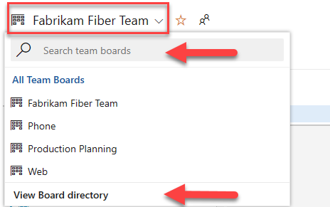

# Add, run, and update inline tests in Azure Boards and Azure DevOps

[!INCLUDE [version-lt-eq-azure-devops](../../includes/version-lt-eq-azure-devops.md)]  

Similar to [task checklists](add-task-checklists.md), you can quickly define inline tests, or a set of manual tests cases, for a backlog item from your board. Not only can you add tests, you can run them and update their status. If you're new to working with the board, see [Kanban board overview](kanban-overview.md). If you're new to testing, see [Exploratory and manual testing scenarios and capabilities](../../test/overview.md).

In this article, learn how to do the following tasks: 
> [!div class="checklist"]    
> * Add inline tests to a backlog item from your board  
> * Run tests and update the status of tests  
> * Expand or collapse inline tests   
> * Reorder or reparent inline tests  

 

Tests you create from the board are automatically linked to the user story or backlog item.  

## Prerequisites

::: moniker range="azure-devops"

- You must connect to a project. If you don't have a project yet, [create one](../get-started/sign-up-invite-teammates.md). 
- You must be added to a [team or project](../../organizations/security/add-users-team-project.md). 
- To add work items and exercise all board features, you must be granted [**Basic** access or higher](../../organizations/security/access-levels.md).
- To view or modify work items, your **View work items in this node** and **Edit work items in this node** permissions set to **Allow**. By default, the **Contributors** group has this permission set. For more information, see [Set permissions and access for work tracking](../../organizations/security/set-permissions-access-work-tracking.md).  
- To view or run tests, you must have **Basic** access or higher. Users with **Stakeholder** access can't view or run tests.  
::: moniker-end

::: moniker range="< azure-devops"
- You must connect to a project. If you don't have a project yet, [create one](../../organizations/projects/create-project.md).
- You must be added to a [team or project](../../organizations/security/add-users-team-project.md). 
- To add work items and exercise all board features, you must be granted [**Basic** access or higher](../../organizations/security/access-levels.md).
- To view or modify work items, your **View work items in this node** and **Edit work items in this node** permissions set to **Allow**. By default, the **Contributors** group has this permission set. For more information, see [Set permissions and access for work tracking](../../organizations/security/set-permissions-access-work-tracking.md).  
- To view or run tests, you must have **Basic** access or higher. Users with **Stakeholder** access can't view or run tests.  

::: moniker-end

## Open your board from the web portal

1. To view your board, open your project from a web browser and choose (1) **Work**, (2) **Boards**, and then (3) select the team's board from the selector. 

	  

	To choose another team's board, open the selector and select a different team or choose the :::image type="icon" source="../../media/icons/home-icon.png" border="false"::: **Browse all team boards** option. Or, you can enter a keyword in the search box to filter the list of team backlogs for the project.

	> [!div class="mx-imgBorder"]  
	>   

	> [!TIP]    
	> Choose the :::image type="icon" source="../../media/icons/icon-favorite-star.png" border="false"::: star icon to favorite a team board. Favorited artifacts (:::image type="icon" source="../../media/icons/icon-favorited.png" border="false"::: favorited icon) appear at the top of the team selector list.

## Add inline tests   

1. To start adding tests, open the menu for the work item.  

	> [!div class="mx-imgBorder"]  
	>    

	Adding inline tests is the same as adding test cases to a test suite. A default test plan and test suite automatically get created under which the manual test cases are grouped.

	For example, a test suite is created for each user story, and all inline tests are added to that suite. In the following example, user story 152 is highlighted which has three manual tests defined with IDs of 153, 155, and 161.  

	 

	For more information, see [Plan your tests](../../test/create-a-test-plan.md).  

2. If you have many tests to add, keep entering each title and select **Enter**. 

	   

	To add details to the test case, open it. You can select the title, double-click the inline item, or open the context menu and choose Open. 

	 

See [Create manual tests](../../test/create-test-cases.md) to learn more about defining tests. 

Before running the test, you must add details. 

## Run the inline test 

Run the test by selecting  Run test from the   :::image type="icon" source="../media/icons/actions-icon.png" border="false":::  actions menu for the inline test.  

  

Microsoft Test Runner starts in a new browser instance. For more information, see [Run manual tests](../../test/run-manual-tests.md).

## Update the status of an inline test from the action menu 

You can update the status of the test from the   :::image type="icon" source="../media/icons/actions-icon.png" border="false":::  actions menu. 

 
 
Updating the status of tests lets you <a href="../../test/track-test-status.md" data-raw-source="[track test results](../../test/track-test-status.md)">track test results</a>.  

[Why doesn't the board show the status for test suites and plans already created in **Test**?](#test-status-kanban)

## Expand or collapse inline tests  

When you first open a board, you're presented with an unexpanded view of checklists.

Select the inline test summary to expand a collapsed set of tests. Select the same summary to collapse an expanded list. 

## Copy or reparent a test 

To reparent a test, drag and drop the test to a different user story.    

  

This action automatically changes the linked relationship of the test and points to the new user story. 

To create a copy of a test to add to a different user story, select the test, select the CTRL key, and then drag and drop the test onto the user story card.  

## Next steps

> [!div class="nextstepaction"]
> [Install the Test & Feedback extension](../../test/perform-exploratory-tests.md)

## Related articles

- [Create manual tests](../../test/create-test-cases.md).  
- [Disable this feature from the common configurations dialog](../../boards/boards/customize-cards.md).
- [Add tasks or child items as checklists](add-task-checklists.md)
- [Create a new branch, drive Git development](../backlogs/connect-work-items-to-git-dev-ops.md)

### Test status in the board

Integrating test with a board makes it easy for teams to get started with manual testing and then take advantage of the full testing capabilities in Test Manager later, when required. When you create test cases from a board in Azure DevOps and later update them in Test Manager, or vice versa, where users create requirement-based suites in Test Manager and update them there, the board accurately reflects the status of those tests. But, the Test status in a board doesn't work if the requirement-based suite has more than one configuration assigned to it. In such scenario, the board only shows the test outcome for the default configuration. We recommend using Test Manager to manage the testing progress across multiple configurations. 
