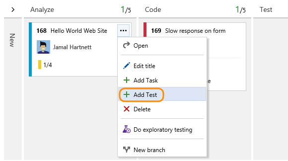

#Add, run, and update inline tests

[!INCLUDE [temp](../../_shared/dev15-and-ts-version-header.md)]  

Similar to [task checklists](add-task-checklists.md), you can quickly define inline tests, or a set of manual tests, for a backlog item from your Kanban board. Not only can you add tests, you can run them and update their status. If you're new to working with the Kanban board, see [Kanban basics](kanban-basics.md). 

In this article, you'll learn: 
> [!div class="checklist"]    
> * How to add inline tests to a backlog item from your Kanban board  
> * How to run tests and update the status of tests  
> * How to expand or collapse inline tests   
> * How to reorder or reparent inline tests  

 

Tests you create from the Kanban board are automatically linked to the user story or backlog item.  

[!INCLUDE [temp](../_shared/prerequisites-kanban.md)]

## Open your Kanban board from the web portal

::: moniker range=">= azure-devops-2019"

0. To view your Kanban board, open your project from a web browser and choose (1) **Work**, (2) **Boards**, and then (3) select the team's board from the selector. 

	  

	To choose another team's board, open the selector and select a different team or choose the  **Browse all team boards** option. Or, you can enter a keyword in the search box to filter the list of team backlogs for the project.

	> [!div class="mx-imgBorder"]  
	>   

	> [!TIP]    
	> Choose the  star icon to favorite a team board. Favorited artifacts ( favorited icon) appear at the top of the team selector list.

::: moniker-end

::: moniker range=">= tfs-2017 <= tfs-2018"

0. To view your Kanban board, open your (1) project from a web browser and choose (2) **Work**, (3) **Backlogs**, (4) **Stories**, and then (5) **Board**. 
	

	If you don't see **Work**, your screen size may be reduced. Click the three dots (), then choose **Work**, **Backlogs**, and then **Board**.   

	   

0.	To choose another team, open the project/team selector and select a different team or choose the **Browse** option. 

	> [!div class="mx-imgBorder"]  
	>  

0. Your Kanban board displays. 

	  

::: moniker-end

## Add tests   

1. To start adding tests, open the menu for the work item.  

	> [!div class="mx-imgBorder"]  
	>    

	Adding inline tests is the same as adding test cases to a test suite. A default test plan and test suite are automatically created under which the manual test cases are grouped.

	For example, a test suite is created for each user story, and all inline tests are added to that suite. Below, user story 152 is highlighted which has three manual tests defined with IDs of 153, 155, and 161.  

	 

	To learn more about test plans and test suites, see [Plan your tests](../../test/create-a-test-plan.md).  

2. If you have a number of tests to add, simply keep typing each title and click Enter. 

	   

	To add details to the test case, open it. You can click the title, double-click the inline item, or open the context menu and choose Open. 

	 

See [Create manual tests](../../test/create-test-cases.md) to learn more about defining tests. 

Prior to running the test, you must add details. 

## Run test 

Run the test by selecting  Run test from the  actions menu for the inline test.  

  

Microsoft Test Runner starts in a new browser instance. For details on running a test, see [Run manual tests](../../test/run-manual-tests.md).

## Update the status of a test  

You can update the status of the test from the  actions menu . 

 
 
Updating the status of tests enable you to [track test results](../../test/track-test-status.md).  

[Why doesn't the Kanban board show the status for test suites and plans already created in **Test**?](#test-status-kanban)

## Expand or collapse inline tests  

Upon first opening the Kanban board, you'll see an unexpanded view of checklists.

Simply click the inline test summary to expand a collapsed set of tests. Click the same summary to collapse an expanded list. 

## Copy or reparent a test 

To reparent a test, drag and drop the test onto a different user story.    

  

This action automatically changes the linked relationship of the test to point to the new user story. 

To create a copy of a test to add to a different user story, select the test, press the CTRL key and then drag and drop the test onto the card of the user story.  

## Related articles

Use inline tests for lightweight traceability and to manage manual tests for user stories or other backlog items that they support. To learn more about test case management, see [Create manual tests](../../test/create-test-cases.md).  

If you find that you don't use this feature, you can disable it from the [common configurations dialog](../../boards/boards/customize-cards.md#annotations). 

Additional ways you can quickly add linked items and objects to user stories from the Kanban board:
- [Add inline tasks](add-task-checklists.md)
- [Create a new branch, drive Git development](../backlogs/connect-work-items-to-git-dev-ops.md) 

To initiate web-based exploratory testing for a user story, you need to install the [Test & Feedback Marketplace extension](https://marketplace.visualstudio.com/items?itemName=ms.vss-exploratorytesting-web). For details, see [Install the Test & Feedback extension](../../test/perform-exploratory-tests.md).

### Test status in the Kanban board

Test integration with the Kanban board makes it easy for teams to get started with manual testing and then take advantage of the full testing capabilities in Test Manager later, when required. When test cases are created from the Kanban board and updated afterwards in Test Manager, the Kanban board shows the correct status. However, integration is not optimized to work in the other direction; for example, when users create requirement-based suites with Test Manager instead of in the Kanban board. We intend to make some major performance improvements to this integration in future releases.
