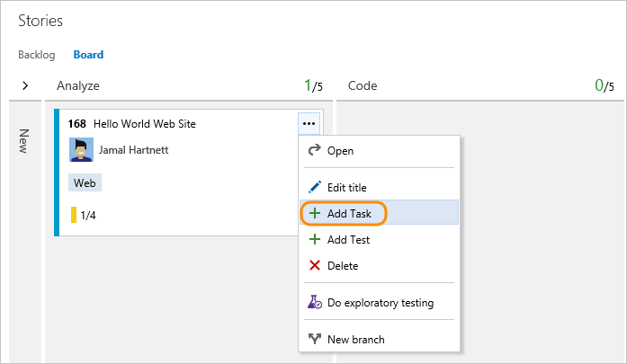
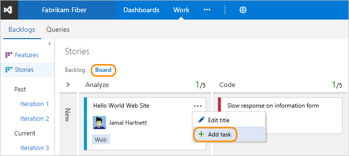
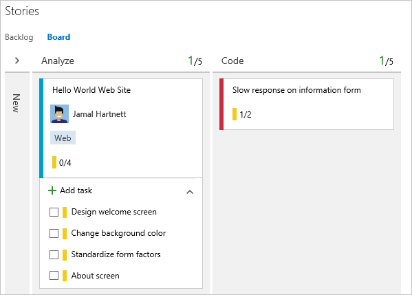
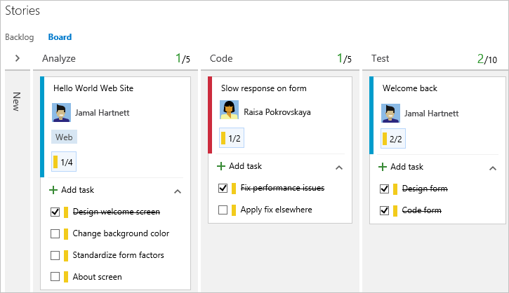
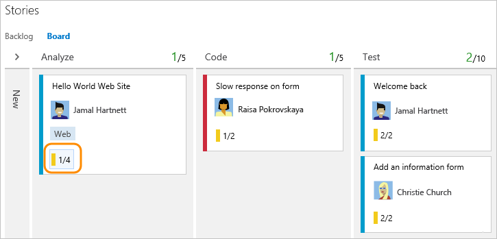
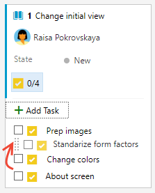
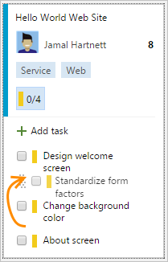

# Add tasks or child items as checklists

[!INCLUDE [temp](../includes/version-vsts-tfs-2015-on.md)]

Many teams find Kanban boards ideal for tracking work as it supports visualizing the flow of work in progress, quickly adding new items, and updating status. If you're new to working with the Kanban board, see [Kanban basics](kanban-basics.md).  

With checklists or to do lists, you continue to enjoy lightweight tracking. You gain visibility into which tasks, bugs, or other child items are in progress or completed. For example, here we show several tasks and bugs for work in progress, both yet to do and those marked as completed. By adding the Issue work item type to the Iteration backlog, issues can be added as checklists. 
::: moniker range=">= azure-devops-2019"
:::image type="content" source="media/checklists/board-checklists.png" alt-text="Screenshot of product-level Kanban board with three work items showing child lists":::
::: moniker-end
::: moniker range="<= tfs-2018"
  
::: moniker-end

In this article, you'll learn: 
> [!div class="checklist"]    
> * Summary of checklist features
> * How to add checklist items from your Kanban board  
> * How to mark a checklist item as done 
> * How to expand or collapse a checklist  
> * How to reorder and reparent checklist items or reassign them to a sprint 

::: moniker range="tfs-2015"
> [!NOTE]  
> Kanban board checklists are supported from TFS 2015.1 and later versions. 
::: moniker-end

## Overview of checklist features 

Checklists are a feature of all Kanban boards, both product and portfolio backlog levels. 

- All Kanban board levels support checklists. For a view of default backlog hierarchies, see [Plan and track work](../get-started/plan-track-work.md).  
- Adding a checklist item automatically adds a parent-child link between the parent work item and the checklist item. 
- For the product-level board:
	- When **Bugs are managed with tasks**, they are available to add and track within a checklist. 
	- When **Bugs are managed with requirements**, you can add tasks to bugs that are tracked on the board. Teams make this choice via Board settings, [**Working with bugs**](../../organizations/settings/show-bugs-on-backlog.md).** 
- Marking any checklist item as "done" moves the work item **State** to closed, done, or completed.  
- Teams can remove select checklist features by disabling them on the [**Annotations** tab of the Board settings](customize-cards.md#annotations).
- Tasks or other child items that you create from the Kanban board are automatically assigned to the sprint/iteration path of the parent work item under which you define them. 
- Any work item type added to the backlog hierarchy is available to add using the checklist feature.  
	To add work item types to track as checklists, add them to the next-lower hierarchical backlog. To learn how, see [Customize your backlogs or boards (Inheritance process)](../../organizations/settings/work/customize-process-backlogs-boards.md) or [Process configuration XML element reference (On-premises XML process)](../../reference/xml/process-configuration-xml-element.md). 

> [!TIP]    
If you find that you don't use this feature, you can disable it from the [common configurations dialog](customize-cards.md#annotations).  

[!INCLUDE [temp](../includes/prerequisites-kanban.md)]

[!INCLUDE [temp](../includes/open-kanban-board.md)] 

## Add one or more child items 

In this example, tasks are added to the product Kanban board using the checklist feature. You can use the same procedures to add any other supported checklist item from your board.  

1. To start adding tasks, open the menu for the work item.  
    ::: moniker range=">=azure-devops-2019"  
    :::image type="content" source="media/checklists/add-task-menu.png" alt-text="Screenshot of open the context menu of work item to add a task.":::
    ::: moniker-end
    ::: moniker range=">= tfs-2017 <= tfs-2018"  
      
    ::: moniker-end
    ::: moniker range="tfs-2015"
      
    ::: moniker-end

2. If you have many tasks to add, keep typing their titles and choose Enter after each title.  
    ::: moniker range=">= azure-devops-2019"  
    :::image type="content" source="media/checklists/four-tasks-added.png" alt-text="Screenshot of added tasks.":::
    ::: moniker-end
    ::: moniker range="<= tfs-2018"
      
    ::: moniker-end
::: moniker range=">= tfs-2017"
3. If you have details you want to add about a task, open the item by choosing the title. 
    :::image type="content" source="media/checklists/open-task.png" alt-text="Screenshot of opening a task.":::
::: moniker-end
::: moniker range="tfs-2015"
4.  If you have details you want to add about a task, open the parent work item and then choose the :::image type="icon" source="../media/icons/icon-links-tab-wi.png" border="false"::: links icon/tab. 

     

    Double-click the task, or select and press the Enter key, to open it.   

      
::: moniker-end

> [!NOTE]  
> Tasks that you create from the Kanban board will show up on your sprint Taskboard. Also, tasks that you create from the [sprint backlog](../sprints/assign-work-sprint.md) or [taskboard](../sprints/task-board.md) will show up within tasks checklists on the Kanban board.  

## Mark a checklist item as done 

When you complete a task or other checklist item, simply choose the checkbox to change its status to Done, Closed, or Completed. 

::: moniker range=">= azure-devops-2019"
:::image type="content" source="media/checklists/board-checklists.png" alt-text="Screenshot of product-level Kanban board showing several done child items":::
::: moniker-end
::: moniker range="<= tfs-2018"

::: moniker-end

The State of the work item is updated from **Active** to **Closed** for Agile and CMMI projects and from **To Do** to **Done** for Scrum projects, and 

> [!TIP]  
> No matter the number of workflow states a checklist item has, checking it moves it to its closed state.      

## Expand or collapse a checklist

Upon first opening the Kanban board, you'll see an unexpanded view of checklists. Choose the checklist summary to expand a collapsed checklist. Choose the same summary to collapse an expanded checklist. 

::: moniker range=">= azure-devops-2019"
:::image type="content" source="media/checklists/unexpanded-checklists.png" alt-text="Screenshot of unexpanded checklist":::
::: moniker-end
::: moniker range="<= tfs-2018"
 
::: moniker-end

## Reorder or reparent tasks or reassign them to a sprint 

You can drag a task within a work item to reorder it. Or, you can drag the task to another work item on the Kanban board to reparent it. 

::: moniker range=">= azure-devops-2019"

::: moniker-end
::: moniker range="<= tfs-2018"
 
::: moniker-end

> [!NOTE]   
> Users with **Stakeholder** access can't drag-and-drop tasks or reorder and reparent tasks.

Tasks or other child items you add as checklists are automatically assigned to the **Iteration Path** of their parent work item. To reassign a checklist item to a different sprint, you must open the item and change its **Iteration Path**. Or, open the sprint backlogs where it's currently defined and  drag it to the new sprint using the Planning pane. For details, see [Assign backlog items to a sprint](../sprints/assign-work-sprint.md).  

 
## Configure the Kanban board 

To configure or change the layout of the Kanban board, see [Customize your boards](../get-started/customize-boards.md). 

## Related articles  

- [Kanban board features and epics](kanban-epics-features-stories.md)
- [Interactively filter backlogs, boards, queries, and plans](../backlogs/filter-backlogs-boards-plans.md)
- [Add, run, update manual tests](add-run-update-tests.md)
- [Create a new branch, drive Git development](../backlogs/connect-work-items-to-git-dev-ops.md)
- [Kanban board controls](kanban-board-controls.md)

### REST API resources
To programmatically create work items, see the [REST API, Work Items reference](/rest/api/azure/devops/wit/work%20items/create?view=azure-devops-rest-6.0&preserve-view=true ).

