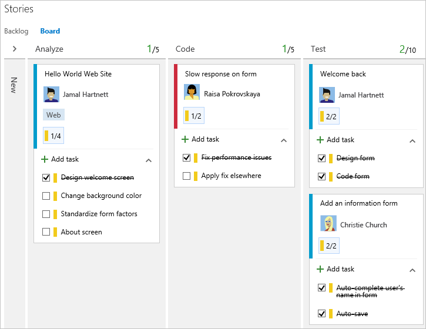

# Add task checklists

[!INCLUDE [temp](../_shared/version-vsts-tfs-2015-on.md)]

Many teams find Kanban ideal for tracking work as it supports visualizing the flow of work in progress. And, you can quickly add new items and update status. If you're new to working with the Kanban board, see [Kanban basics](kanban-basics.md).  

With task checklists, you continue to enjoy lightweight tracking, while gaining visibility into which tasks are still to be completed and those that are done. Task checklists provide a quick and easy way to track elements of work which are important to support completing a backlog item. Here we see several tasks for work in progress, both yet to do and those completed.  

::: moniker range="tfs-2015"

> [!NOTE]  
> Task checklists on the Kanban board are supported from TFS 2015.1 and later versions. 

::: moniker-end

In this article, you'll learn: 
> [!div class="checklist"]    
> * How to add a task or set of tasks to a backlog item from your Kanban board  
> * How to mark a task as done 
> * How to expand or collapse the task checklist  
> * How to reorder and reparent tasks or reassign them to a sprint
> * Keyboard shortcuts for working with the Kanban board 
  
  

[!INCLUDE [temp](../_shared/prerequisites-kanban.md)]

[!INCLUDE [temp](../_shared/open-kanban-board.md)] 

## Add a task or set of tasks 

1. To start adding tasks, open the menu for the work item.  
	::: moniker range=">= tfs-2017"  
	  
	::: moniker-end
	::: moniker range="tfs-2015"
	  
	::: moniker-end

2. If you have a number of tasks to add, simply keep typing your task titles and click Enter.   

	  

3.	If you have details you want to add about a task, open the parent work item and then choose the  links icon/tab. 

	  

4. Double-click the task, or select and press the Enter key, to open it.   

	  

	Tasks that you create from the Kanban board will show up on your sprint taskboard. Also, tasks that you create from the [sprint backlog](../sprints/assign-work-sprint.md) or [taskboard](../sprints/task-board.md) will show up within tasks checklists on the Kanban board.  

## Mark a task as done 

When you complete a task, simply click the checkbox to change its status to Done or Closed. 

  
 
The State of the work item is updated from To Do to Done for Scrum projects, and from Active to Closed for Agile and CMMI projects.  

## Expand or collapse the task checklist  

Upon first opening the Kanban board, you'll see an unexpanded view of checklists.

 

Simply click the task checklist summary to expand a collapsed task checklist. Click the same summary to collapse an expanded checklist. 

## Reorder and reparent tasks or reassign them to a sprint

Tasks that you create from the Kanban board are automatically assigned to the sprint/iteration path of the parent work item under which you define them. 

You can drag a task within a work item to reorder it. Or, you can drag the task to another work item on the Kanban board to reparent it. 

  

> [!NOTE]   
> Users with **Stakeholder** access can't drag-and-drop tasks or reorder and reparent tasks.

To reassign a task to a different sprint, you must open the sprint backlog where it's currently defined and then drag it to the new sprint.  

## Configure the Kanban board 
To configure or change the layout of the board, see one of these topics. 

* [Add columns](add-columns.md)  
* [WIP limits](wip-limits.md)  
* [Add swimlanes, expedite work](expedite-work.md)   
* [Customize cards](../../boards/boards/customize-cards.md)  
* [Split columns](split-columns.md)   
* [Definition of Done](definition-of-done.md)  

## Q & A

### Q: If I manage bugs with tasks, can I add bugs as a checklist to a requirement? 
**A:** No. Task checklists only support the task work item type. 
 

## Related articles  
Use your task checklist for lightweight tracking of to-do lists. If you find that you don't use this feature, you can disable it from the [common configurations dialog](../../boards/boards/customize-cards.md#annotations). 

You can also [add tags and show tags and fields on cards](../../boards/boards/customize-cards.md) to support other tracking needs.  

In addition, you can:  

- [Add, run, update manual tests](add-run-update-tests.md)
- [Create a new branch, drive Git development](../backlogs/connect-work-items-to-git-dev-ops.md)
- [Kanban board controls](kanban-board-controls.md)

### REST API resources
To programmatically create tasks, see the [REST API, Work Items reference](/rest/api/azure/devops/wit/work%20items).

