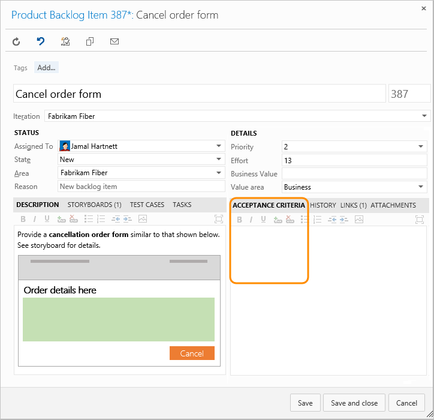

# Use best practices when implementing Kanban in Azure Boards

[!INCLUDE [version-lt-eq-azure-devops](../../includes/version-lt-eq-azure-devops.md)]

Having worked through the four configuration steps that were provided in [Kanban quickstart](../boards/kanban-quickstart.md), you're well on your way to implementing most of Kanban's six core practices.

1. **Visualize your workflow**. Teams track their work using a Kanban board that maps to how they work. Teams discuss how to best focus their resources to deliver the most important work.
2. **Limit work in progress**. Teams set and adhere to work in progress (WIP) limits they set for each stage of work. They use WIP limits to maintain focus on completing what they started and to identify bottlenecks occurring in their processes.
3. **Manage flow**. Teams monitor the overall work in progress and lead time, which gives them an idea of the speed of their delivery.
4. **Make policies explicit**. Teams spell out the standards and processes they agree to follow and make them readily accessible. For example, by making the team's Definition of Done for each work stage explicit, they can avoid wasted time and effort.
5. **Create opportunities for feedback**. Teams meet periodically to reflect on what's working and what needs improvement.
6. **Improve collaboratively, evolve experimentally**. Teams determine how to improve the continuous flow of delivery over time based of key metrics. They involve the entire team to gather insights and ideas. And, when persistent bottlenecks arise, they determine the changes that will help resolve them.

Over time, Kanban can provide your team insight as to how well their current processes work end-to-end and how to improve them. Incremental adoption of Kanban practices tends to yield greater success and builds on the sixth practice, to evolve experimentally. These practices arose from principles of Lean Manufacturing and Systems Thinking.

<a id="practices" />

## WIP limits, challenges, and solutions

Teams occasionally exceed WIP limits by one or two items. However, if your team frequently exceeds the limits by three or more items, they should review processes or adjust the limits.

After a team has worked with WIP limits for several weeks, discuss the challenges team members have. Then, decide which solutions they'd like to use and adjust the limits as needed. The following list, although not exhaustive, indicates some of the common challenges teams come across and proven solutions to overcome them. 

### WIP challenges

* **Social dynamics.** When it comes to following rules, team members can feel challenged. Some naturally want to rebel. Others don't see that the rule applies to them or don't see what they do as breaking the rules. Some team members may take on extra work that's outside the scope of what's been agreed to. And, still others don't want to give up multitasking as they believe it's the key to their productivity and individual achievement. 

* **Variability of work in progress.** Wide variability in the size of work items&mdash;users stories and bugs—can negatively influence the overall workflow. For example, items with estimates that vary in size from 4 hours to 14 days, or 2 to 55 story points, can't be counted the same when it comes to constraining work in progress.

* **Ignoring systemic problems.** Instead of addressing workflow problems when bottlenecks occur, teams soldier on, putting in more time to overcome the bottleneck. 

* **Culture change.** Adopting WIP limits introduces changes to the system, culture, and team. 

### Solutions for managing WIP

* **Build a culture of team productivity.** Address the natural tension that exists between individual productivity versus team productivity. Identify ways in which team members can enhance the overall productivity of the team and workflow process. 

* **Size work to minimize variability.** Before work starts on any item, the team should discuss the overall size of work required and determine if it can be broken down into smaller tasks. 

* **Focus on the flow of high priority items.** When idle, team members ask how they can help move an upstream item forward. When blocked or challenged to deliver an item on time, team members ask for help with completing an item.

* **Resource team capacity for each work stage.** Bottlenecks can occur when there aren't enough specialists who work in a particular stage. Determine ways to either increase team skills within each work stage, or add resources as needed to meet an understaffed work stage.

* **Build shared understanding.** Continuously strive to increase the team's understanding of how to work using Kanban practices. Take actions that allow team members to contribute to process changes. Consider scheduling regular retrospectives or team meetings to discuss what works well and what needs changing. Document team policies to limit ambiguity.

* **Use metrics to adjust processes.** Periodically check Kanban metrics of work in progress and lead time to determine when changes need to be made. 

* **Manage culture changes mindfully.** People want to do their best work&mdash;a core tenet underlying Kanban and its associated disciplines. Apply change management principles as you adopt new practices. Create greater ownership within the team for the success of implementing WIP limits.

<a id="dod" />

## Help your agile team deliver working software  

One of the [12 principles of Agile software development](https://agilemanifesto.org/principles.html) is to "deliver working software frequently, from a couple of weeks to a couple of months, with a preference to the shorter timescale."

> *All agile teams must establish what they mean when they say "working software," which is frequently known as the definition of done. At a high level, a piece of functionality is complete only when its features pass all tests and can be operated by an end user. At a minimum, teams must go beyond the unit test level and test at the system level. The best teams also include integration testing, performance testing, and customer acceptance testing in their definition of what it means to be done with a piece of functionality.* &mdash; Jeff Sutherland

One of the major causes of teams failing to implement Agile is they lack good definitions of done. 

Each stage indicates a handoff to someone else who will do work. What information does the next person in the flow sequence need to quickly succeed. Incomplete work or uncommunicated information can lead to delays and wasted effort. 

As a starting point, consider some of the following criteria as you work with your team to decide what done means throughout the development process.

:::row:::
  :::column span="1":::
  **Stage**
  :::column-end:::
  :::column span="1":::
  **Done criteria**
  :::column-end:::
:::row-end:::
:::row:::
  :::column span="1":::
  Before work starts on a feature, user story, or requirement
  :::column-end:::
  :::column span="1":::
  
  
  1. User story is properly scoped and estimated.
  2. Acceptance criteria is well defined.
  3. Customer needs are understood by the team.
  4. Dependencies have been identified and are tracked.
   
  :::column-end:::
:::row-end:::
:::row:::
  :::column span="1":::
  Bug filing
  :::column-end:::
  :::column span="1":::
  
  
  1. Bug title identifies the issue clearly.
  2. Repro steps are clear and minimal.
  3. Bug specifies a single issue.
  4. Related issues are linked to as related.
  5. Terms used are clearly understood within the team.
  
  :::column-end:::
:::row-end:::
:::row:::
  :::column span="1":::
  Code complete, ready for testing
  :::column-end:::
  :::column span="1":::
  
  
  1. Code complete, commented, and run against current version.
  2. Code peer reviewed and meets team standards.
  3. Builds without error.
  4. Passes unit and system tests.
  5. Remaining hours for tasks set to zero and task closed.
  
  :::column-end:::
:::row-end:::
:::row:::
  :::column span="1":::
  Test complete, ready for release
  :::column-end:::
  :::column span="1":::
  
  
  1. Unit tests implemented for all new features or functions.
  2. Unit tests are all passing.
  3. Acceptance/story tests are written and passing. 
  4. Regression tests are green with known failures. 
  5. Sufficient exploratory testing has been done.
  6. Feature/function works correctly as expected. 
  7. Unsolved defects have been logged as bugs. 
  8. Code coverage is stable or improving.
  
  :::column-end:::
:::row-end:::

As your team makes progress, revisit your Definition of Done criteria. 

> *A development team's Definition of Done is meant to expand over time. A newly formed team will invariably have a less stringent and smaller Definition of Done than a more mature team with a shared history of improving. Expanding a team's Definition of Done lies at the very core of Kaizen, a Japanese term meaning a mindful and constant focus on improvement. While a team may initially require only that code build before being checked in, over time they should evolve more exacting standards like the need for unit tests to accompany new code*. &mdash; David Starr

### Acceptance Criteria versus Definition of Done

Acceptance criteria corresponds to what a customer should expect when a user story, feature, or requirement has been implemented. Conversations between the team and customers to determine the acceptance criteria helps ensure a common understanding within the team to meet customers' expectations. The acceptance criteria can be used as the basis for acceptance tests so that the team can more effectively evaluate whether an item has been satisfactorily completed. 

Acceptance criteria defines when a feature is shippable. Capture the criteria for each backlog item in the Acceptance Criteria field (for Scrum product backlog items) or the Description field (for Agile user stories and CMMI requirements).

  

The Definition of Done, though, is about delivering an incremental piece of a feature as it moves from not started to complete. Agile teams meet with greater success when each handoff made is in a ready state for the recipient to begin their work. 

> *Agility requires delivering done, ready-to-use increments of working software each Sprint. Yet most Scrum and agile teams generate partially done, incomplete Increments. When a Scrum Team is asked why Product Backlog requirements were not completely done in a Sprint, team members often reply, "We didn't have time."* &mdash; Ken Schwaber and David Starr

## Other resources

- [DoD Goes Agile](https://www.scruminc.com/dod-goes-agile/) 
- [Walking Through a Definition of Done](https://www.scrum.org/resources/blog/walking-through-definition-done)
- [Agile Culture](/devops/plan/adopting-agile)
- [What is Kanban?](https://kanbanblog.com/explained/) 
- [Kanban: Successful Evolutionary Change for Your Technology Business by David J. Anderson](https://www.amazon.com/Kanban-Successful-Evolutionary-Technology-Business/dp/0984521402/)
- [Agile Project Management with Kanban by Eric Brechner](https://www.amazon.com/Project-Management-Kanban-Developer-Practices/dp/0735698953/)
