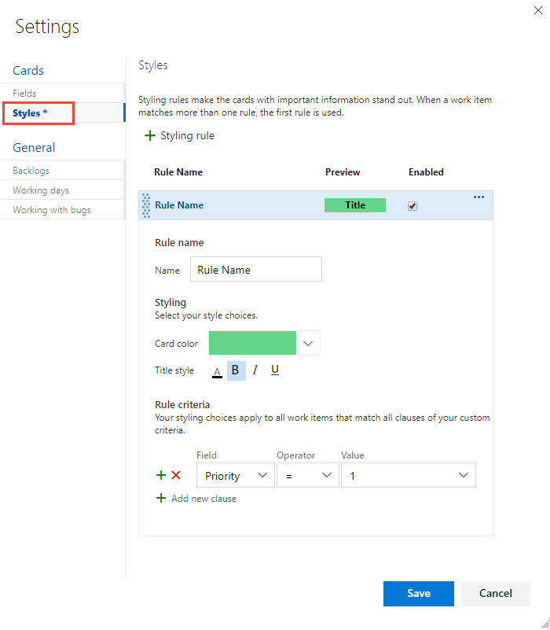

# Customize cards  

[!INCLUDE [temp](../_shared/version-vsts-tfs-2015-on.md)]  

While many work tracking views show up as lists&mdash;such as your backlogs and queries&mdash;board views display cards. Information rich cards not only provide at-a-glance info of interest to you and your team, they also provide a way for you to update a field without opening the work item. And, with style rules, you can highlight those work items with select colors based on the criteria you set.  

Each card corresponds to a work item which you use to share information, track status, and assign work. 

[!INCLUDE [temp](../_shared/setup-backlogs-boards.md)]

In this example, the bug work item type (WIT) shows all the core fields, three additional fields, and tags. Also, To make severity 1 bugs stand out, a styling rule has been added to cause the card to display as yellow.  

In the card shown below, the following customizations have been set for the bug work item type (WIT):
- Show all core fields: ID, Assigned To, Story Points, Tags
- Show three additional fields: State, Changed By, and Changed Date
- Apply tag colors
- Apply styling rule to display bugs with Severity=1 as yellow and bold and underline the Title field

::: moniker range="azure-devops"

> [!NOTE]  
> You can customize a work item type which is different then customizing the card displayed on the Kanban board or taskboard. You customize a WIT by adding fields, changing the workflow, adding custom rules and more. You can also add custom work item types and custom backlog levels. For details, see [Customize an inheritance process](../../organizations/settings/work/inheritance-process-model.md). 

::: moniker-end

::: moniker range=">= tfs-2015 <= azure-devops-2019"
> [!NOTE]  
> You can customize a work item type which is different then customizing the card displayed on the Kanban board or taskboard. You customize a WIT by adding fields, changing the workflow, adding custom rules and more. You can also add custom work item types and custom backlog levels. For details, see [Customize the On-premises XML process model](../../reference/on-premises-xml-process-model.md). 

::: moniker-end

You can either increase or simplify the information that displays on your cards. It all depends on what's of interest to your team. Does your team like to refer to work items by their ID? Do they want to see estimates? Do they want to highlight work items according to set criteria? Or, will just the bare bones of title and assignment suffice? 

Your best bet is to show fields on cards based on what your team frequently refers to or updates when using the Kanban and taskboards. Also, add fields with information that you can use to filter the board. If you're new to working with these tools, see [Kanban basics](../../boards/boards/kanban-basics.md) and [Sprint planning](../../boards/sprints/assign-work-sprint.md). 

[!INCLUDE [temp](../_shared/prerequisites-team-settings.md)]

## Update fields from the cards

Using the board views provides you with quick and easy ways to update work items as work progresses. Making daily or frequent updates helps everyone on your team stay in sync with what's been done and what needs doing next. 

To update status of a work item, you simply drag-and-drop cards to a different column. To change the order or stack ranking of a work item, you drag a card up or down within a column. 

For example, on the Kanban board, moving the card from Analyze to Develop updates the corresponding State field. In this case, the State field updates from Approved to Committed. 

Another handy feature is to simply update a field without having to open the work item. You can update most fields shown on the card. Here we reassign a requirement. 

This quick update feature is particularly useful when you need to update a number of work items at once. For example, you can add estimates for backlog items on the Kanban board or update remaining work on the taskboard. 

To change the title, click the pencil icon in the upper-right corner. To add tags, double-click the work item to open it. And, just a reminder, you can't change the IDs for a work item, not from the card and not from within the form. 

To customize cards on the Kanban board, see [Change how cards display on the Kanban board](#kanban-board). To customize taskboard cards, see [Change how cards display on the taskboard](#task-board).  

## Highlight cards  

With styling rules, you can cause cards to change color when their corresponding work items meet criteria that you set. Here, we highlight severity 1 bugs by having the cards display as yellow. 

::: moniker range="tfs-2015"
This feature requires TFS 2015.1 or later versions.
::: moniker-end

### Example styling rules 

What rules should you apply to highlight work items? Here are a few examples and their associated criteria . 

> [!div class="mx-tdCol2BreakAll"]
> | Work items | Criteria |
> |------------|------------|
> | High priority items | `Priority = 1` |
> | High effort items | `Effort 20` or `Story Points 20` |
> | Stale items unchanged in the last 5 days | `Changed Date @Today-5` |
> |Title contains a key word | `Title Contains Yes` |
> |Severity 1 bugs | `Severity = 1 - Critical   AND   Work Item Type = Bug` |
> |High value business items | `Business Value 50` |
> |Items assigned to specific feature area  | `Area Path Under Fabrikam Fiber\Phone` |
> |Contains specific tag   | `Tags Contain RTM` |
> |Blocked tasks (Scrum process only) | `Blocked = Yes` |

## Choose fields to appear on cards (Kanban boards)

By showing a field on a card, you can edit that field directly on the board without having to open the card, unless it's a read-only field, such as the Change By and Changed Date fields. You can also customize the cards that appear on the Kanban board for features and epics. You follow similar steps, however you start from the [corresponding portfolio backlog](../../boards/backlogs/define-features-epics.md).  

::: moniker range="azure-devops"
 
As a first step, you'll see that you can determine which fields appear on each card type. To add a custom field, you must first [add it to the process used to customize the project](../../organizations/settings/work//add-custom-field.md). 
::: moniker-end  

::: moniker range=">= tfs-2015 <= azure-devops-2019"  
As a first step, you'll see that you can determine which fields appear on each card type. To add a custom field, you must first [add it to the WIT definition](../../reference/add-modify-field.md).  
::: moniker-end  

::: moniker range=">= azure-devops-2019"

0.  [Open your Kanban board](kanban-quickstart.md). If you're not a team admin, [get added as one](../../organizations/settings/add-team-administrator.md). Only team and project admins can customize the Kanban board.

0. Choose the  gear icon to configure the board and set general team settings.  

	> [!div class="mx-imgBorder"]
	>   

0. Choose **Fields** and then a work item type to see all the settings you can modify. Your initial column settings will look something like this. 

	Here we choose User Story. Your choices will vary based on the [process](../../boards/work-items/guidance/choose-process.md) used to create your project and whether your team has chosen to [treat bugs like requirements or like tasks](../../organizations/settings/show-bugs-on-backlog.md).     

	> [!div class="mx-imgBorder"]
	>  

0. Place a check mark in the check box for those fields you want to have appear on the board. 

	If you want work estimates to show, check **Show Effort**. **Show Effort** corresponds to these fields: Effort ([Scrum](../../boards/work-items/guidance/scrum-process.md)), Story Points ([Agile](../../boards/work-items/guidance/agile-process.md)), and Size ([CMMI](../../boards/work-items/guidance/cmmi-process.md)).

0. To add a field, choose the  plus icon and enter the name of a field  you want to add. 

0. To remove a field, choose the  delete icon next to the field.

0. When done with your changes, choose **Save**.

::: moniker-end  

::: moniker range=">= tfs-2017 <= tfs-2018"  
0.  [Open your Kanban board](kanban-quickstart.md). If you're not a team admin, [get added as one](../../organizations/settings/add-team-administrator.md). Only team and project admins can customize the Kanban board.

0. Choose the  gear icon to open the common configuration settings dialog for the Kanban board. 

	 

0. Choose **Fields** and then a work item type to see all the settings you can modify. Your initial column settings will look something like this. 

	Here we choose User Story. Your choices will vary based on the [process](../../boards/work-items/guidance/choose-process.md) used to create your project and whether your team has chosen to [treat bugs like requirements or like tasks](../../organizations/settings/show-bugs-on-backlog.md).     

	> [!div class="mx-imgBorder"]
	>  

0. Place a check mark in the check box for those fields you want to have appear on the board. 

	If you want work estimates to show, check **Show Effort**. **Show Effort** corresponds to these fields: Effort ([Scrum](../../boards/work-items/guidance/scrum-process.md)), Story Points ([Agile](../../boards/work-items/guidance/agile-process.md)), and Size ([CMMI](../../boards/work-items/guidance/cmmi-process.md)).

0. To add a field, choose the  plus icon and enter the name of a field  you want to add. 

0. To remove a field, choose the  delete icon next to the field.

0. When done with your changes, choose **Save**.

::: moniker-end  

::: moniker range="tfs-2015"  

0.  [Open your Kanban board](kanban-quickstart.md). If you're not a team admin, [get added as one](../../organizations/settings/add-team-administrator.md). Only team and project admins can customize the Kanban board.

0. Choose the  gear icon to open the common configuration settings dialog for the Kanban board. 

	 

0. Choose **Fields** and then a work item type to see all the settings you can modify. Your initial column settings will look something like this. 

	Here we choose User Story. Your choices will vary based on the [process](../../boards/work-items/guidance/choose-process.md) used to create your project and whether your team has chosen to [treat bugs like requirements or like tasks](../../organizations/settings/show-bugs-on-backlog.md).     

	**TFS 2015.1 options:**      
	  

	**TFS 2015 options:**      
	  

0. Place a check mark in the check box for those fields you want to have appear on the board. 

	If you want work estimates to show, check **Show Effort** or **Show Cost**. These options will cause the following fields to appear based on the respective process: Effort ([Scrum](../../boards/work-items/guidance/scrum-process.md)), Story Points ([Agile](../../boards/work-items/guidance/agile-process.md)), and Size ([CMMI](../../boards/work-items/guidance/cmmi-process.md)).

0. To add a field, choose the  plus icon and enter the name of a field you want to add. 

0. To remove a field, choose the  delete icon next to the field.

0. When done with your changes, choose **Save**.

::: moniker-end  

## Choose fields to appear on cards (Taskboards)

Scrum teams use the taskboard to burn down work and report on progress during daily standups. Your taskboard shows cards that correspond to both requirements and tasks. If you want bugs to appear on the taskboard, change your team settings for [show bugs on the backlogs and boards](../../organizations/settings/show-bugs-on-backlog.md).

You change the way cards appear on the taskboard in the same way you change the appearance of cards on Kanban boards. Only here, you start from the taskboard.

::: moniker range=">= azure-devops-2019"

0.	[Open the taskboard](../sprints/task-board.md) for the sprint you want to customize. Remember, only [team or project administrators](../../organizations/settings/add-team-administrator.md) can customize the taskboard.

0.	Choose the  gear icon to open the Settings dialog. 

	> [!div class="mx-imgBorder"]  
	> 	

0. Choose **Fields** and then a work item type to see all the settings you can modify. 

0. Place a check mark in the check box for those fields you want to have appear on the board. 

	> [!div class="mx-imgBorder"]  
	>   

	Repeat this step for each work item type you want to change. Don't be surprised if the options change when you choose a different work item type. For example, **Show Remaining Work** only applies to tasks and perhaps bugs, but not to user stories or product backlog items.  

0. To add a field, choose the  plus icon and enter the name of a field  you want to add. 
 
0. To remove a field, choose the  delete icon next to the field.

0. When done with your changes, choose **Save**.

::: moniker-end  

::: moniker range=">= tfs-2017 <= tfs-2018"

0.	[Open the taskboard](../sprints/task-board.md) for the sprint you want to customize. Remember, only [team or project administrators](../../organizations/settings/add-team-administrator.md) can customize the taskboard.  

0.	Choose the  gear icon to open the Settings dialog.  

	    

0. Choose **Fields** and then a work item type to see all the settings you can modify. 

0. Place a check mark in the check box for those fields you want to have appear on the board. 

	> [!div class="mx-imgBorder"]  
	>   

	Repeat this step for each work item type you want to change. Don't be surprised if the options change when you choose a different work item type. For example, **Show Remaining Work** only applies to tasks and perhaps bugs, but not to user stories or product backlog items.   

0. To add a field, choose the  plus icon and enter the name of a field  you want to add.  

0. To remove a field, choose the  delete icon next to the field.  

0. When done with your changes, choose **Save**.

::: moniker-end  

::: moniker range="tfs-2015" 

0.	[Open the taskboard](../sprints/task-board.md) for the sprint you want to customize. Remember, only [team or project administrators](../../organizations/settings/add-team-administrator.md) can customize the taskboard.  

0.	Choose the  gear icon to open the Settings dialog.  

	    

0. Choose **Fields** and then a work item type to see all the settings you can modify. 

0. Place a check mark in the check box for those fields you want to have appear on the board. 
      
	**TFS 2015.1 options:**       
	     
	**TFS 2015 options:**        
	       

	Repeat this step for each work item type you want to change. Don't be surprised if the options change when you choose a different work item type. For example, **Show Remaining Work** only applies to tasks and perhaps bugs, but not to user stories or product backlog items.   

0. To add a field, choose the  plus icon and enter the name of a field  you want to add.  

0. To remove a field, choose the  delete icon next to the field.  

0. When done with your changes, choose **Save**.

::: moniker-end  

  

## Define style rules to highlight cards  

You can apply style rules to change the color of cards on Kanban boards and taskboards.  

::: moniker range=">= azure-devops-2019"

1.	[Open the Kanban board](kanban-quickstart.md) or [taskboard](../sprints/task-board.md) that you want to customize. If you're not a team admin, [get added as one](../../organizations/settings/add-team-administrator.md). Only team and project admins can customize boards.

0. Choose the  gear icon to open the **Settings** dialog. 

0. Choose **Styles** to specify a style rule. Choose the  plus icon to add a style. Select the color to apply to the card and define the criteria for the style rule. 

	In this example we show the **Styles** dialog for the taskboard. 

	> [!div class="mx-imgBorder"]  
	> 

	Follow these rules when creating and ordering your style rules:
	- The criteria you specify works in a similar fashion as when [constructing a query](../../boards/queries/using-queries.md) 
	- All clauses are considered AND clauses, grouping clauses isn't supported  
	- Card rules apply to all work items that meet the rule criteria  
	- Rule color applies to work items based on the order in which rules are listed. If you add more than one style rule, make sure that you move them in the order of most importance. Simply drag them into the order you want them applied.  
	- You can quickly enable and disable a style rule     

	Here we add a Stale tasks rule which highlights tasks that haven't changed in the last five days.

	   

0. To copy or delete a style rule, choose the  actions icon and select **Clone** or **Delete**, respectively.

0. When done with your changes, choose **Save**.

::: moniker-end  

::: moniker range="tfs-2015"  
Requires TFS 2015.1 or later version.  
::: moniker-end  

::: moniker range=">= tfs-2015 <= tfs-2018"

1.	[Open the Kanban board](kanban-quickstart.md) or [taskboard](../sprints/task-board.md) that you want to customize. If you're not a team admin, [get added as one](../../organizations/settings/add-team-administrator.md). Only team and project admins can customize boards.

0. Choose the  gear icon to open the **Settings** dialog. 

0. Choose **Styles** to specify a style rule. Choose the  plus icon to add a style. Select the color to apply to the card and define the criteria for the style rule. 

	In this example we show the **Styles** dialog for the taskboard. 

	> [!div class="mx-imgBorder"]  
	> 

	Follow these rules when creating and ordering your style rules:
	- The criteria you specify works in a similar fashion as when [constructing a query](../../boards/queries/using-queries.md) 
	- All clauses are considered AND clauses, grouping clauses isn't supported  
	- Card rules apply to all work items that meet the rule criteria  
	- Rule color applies to work items based on the order in which rules are listed. If you add more than one style rule, make sure that you move them in the order of most importance. Simply drag them into the order you want them applied.  
	- You can quickly enable and disable a style rule     

	Here we add a Stale tasks rule which highlights tasks that haven't changed in the last five days.

	   

0. To copy or delete a style rule, choose the  actions icon and select **Clone** or **Delete**, respectively.

0. When done with your changes, choose **Save**.

::: moniker-end

## Color-code tags (Kanban boards)  

Prior to setting tag colors, first [add tags to backlog items](../../boards/queries/add-tags-to-work-items.md) that you want to highlight with color.  
 
::: moniker range="tfs-2015"  
Requires TFS 2015.1 or later version.  
::: moniker-end   

0. Open the Settings dialog for the Kanban board you want to customize. 

0. Choose **Tag colors** and then choose the  plus icon to add a tag color. Then, select the tag and the color you want to appear on the cards.  

	::: moniker range=">= tfs-2017"
	> [!div class="mx-imgBorder"]  
	>  
	::: moniker-end   
	::: moniker range="tfs-2015"  
	  
	::: moniker-end   

	> [!TIP]    
	> If tags don't display on the cards, choose **Fields** and make sure that you've checked **Show Tags**. 

0. When done with your changes, choose **Save**.

::: moniker range=">= tfs-2017"  

## Enable annotations (Kanban boards) 

With the Kanban board, you gain a rich set of tools and a rich set of customization options. Annotations provide visual cues about work items, indicating the number of tasks or tests that have been defined for that work item. Choose an annotation to expand the set or gain more information. 

As shown in the following examples, the **Task** and **Test** annotations indicate that two each of tasks and tests have been defined for the work item. If you find that there are some features you're not using, you can disable them from the Annotations tab. 

> [!div class="mx-tdBreakAll"]  
> | Task annotations  |Test annotations  |No annotations |
> |-------------|----------|----------|    
> | |   |  | 

To learn more about using these features, see [Add task checklists](../../boards/boards/add-task-checklists.md) and [Add, run, and update inline tests](../../boards/boards/add-run-update-tests.md).  

::: moniker-end

::: moniker range="azure-devops-2019"

> [!NOTE]  
> If your project collection uses the On-premises XML process model to customize work tracking, you can enable work item types that you add to the Task Category to appear as a checklist on your product Kanban board. To learn how, see [Set up your backlogs and boards, Customize your Kanban Board checklist items](../backlogs/set-up-your-backlog.md#customize-checklist-2019). 

::: moniker-end

::: moniker range=">= tfs-2017"  

### Enable or disable an annotation

1. Open the Settings dialog for the Kanban board you want to customize. 

2. Choose **Annotations** and then check those annotations that you want enabled. For example, to enable tasks but disable tests, check the following boxes.     

	

3. When done with your changes, choose **Save**.

::: moniker-end
 

::: moniker range=">= tfs-2017"  

## Configure inline tests (Kanban board)

You can control the test plan under which inline tests you add through the Kanban board are created. You can choose to create a new test plan for each new test that you add, or add all new tests to a selected test plan going forward. 

::: moniker-end

::: moniker range=">= azure-devops-2019"

1. Open the Settings dialog for the Kanban board (product backlog only) you want to customize. 

2. Choose **Annotations** and make sure that **Test** annotation is enabled. This is a requirement to configure inline tests.

3. Choose **Tests**, and then choose the options you want. To select a test plan, choose the  actions icon and select one test plan from the query provided.  

	> [!div class="mx-imgBorder"]  
	>   

4. Save your changes. 

::: moniker-end

::: moniker range=">= tfs-2017 <= tfs-2018"

1. Open the Settings dialog for the Kanban board (product backlog only) you want to customize. 

2. Choose **Annotations** and make sure that **Test** annotation is enabled. This is a requirement to configure inline tests.

3. Choose **Tests**, and then choose the options you want. To select a test plan, choose the  actions icon and select one test plan from the query provided.  

	   

4. Save your changes. 

::: moniker-end

::: moniker range=">= tfs-2017"

### Open the test plan, test suite from a card

From a card on the Kanban board, you can easily navigate to the underlying test plan and test suite under which the tests are created. Choose the  open icon to open another browser tab showing **Test** and associated test plan and test suite that controls the inline tests.

  

::: moniker-end

## Related articles

- [Configure status badges](../github/configure-status-badges.md?toc=/azure/devops/boards/boards/toc.json&bc=/azure/devops/boards/boards/breadcrumb/toc.json) 
- [Card reordering](reorder-cards.md)  
- [Show bugs on backlogs and boards](../../organizations/settings/show-bugs-on-backlog.md)  

