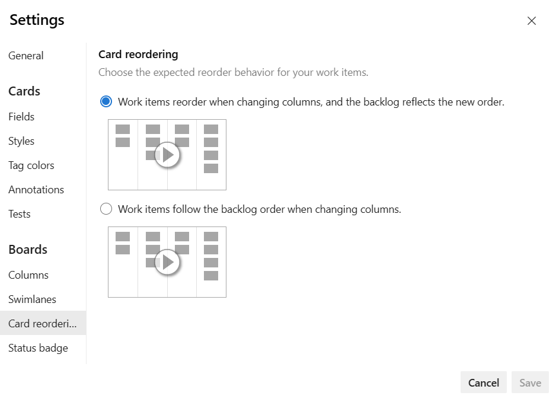

 
# Customize cards on a board  

[!INCLUDE [version-lt-eq-azure-devops](../../includes/version-lt-eq-azure-devops.md)]  

Customize board cards to display the information your team needs most. Cards show work items as visual elements that facilitate quick updates, progress tracking, and at-a-glance status assessment. You can update fields directly on cards without opening work items, and apply visual styling to highlight important items.

> [!NOTE] 
> This article covers board card customization. For Taskboard card customization, see [Customize sprint Taskboards](../sprints/customize-taskboard.md). 

## Prerequisites

| Requirement | Description |
|-------------|-------------|
| **Access** | [**Basic**](../../organizations/security/access-levels.md) access or higher |
| **Permissions** | Member of **Project Administrators** security group or [**Team Administrator** role](../../organizations/settings/add-team-administrator.md) |

For more information, see [Change project-level permissions](../../organizations/security/change-project-level-permissions.md).

## Customization options  

Each team can independently customize their board cards. Customizations aren't inherited from other teams, even when sharing area paths.

You can customize the following aspects of board cards:

::: moniker range=">= azure-devops-2020"
| Setting | Purpose |
|---------|---------|
| **[Fields](#add-fields-to-cards)** | Control which fields appear on cards, including parent work item information |
| **[Styles](#apply-style-rules)** | Change card colors and text styling based on field criteria |
| **[Tag colors](#set-tag-colors)** | Assign specific colors to tags for visual categorization |
| **[Annotations](#manage-annotations)** | Enable or disable icons showing related items (tasks, tests, GitHub) |
| **[Tests](#configure-tests)** | Configure how inline tests appear and behave |
| **[Card reordering](#configure-card-reordering)** | Control behavior when reordering cards |
::: moniker-end

## Access board settings

1. Open your board and select the backlog level you want to customize (Product backlog, Features, Epics).

2. Select :::image type="icon" source="../../media/icons/blue-gear.png" border="false"::: **Settings**.

    > [!div class="mx-imgBorder"]
    >   

## Add fields to cards

Display relevant fields on cards to enable quick viewing and editing without opening work items.

1. In your board settings, select **Fields** and choose the work item type to configure.

   :::image type="content" source="media/customize-cards/settings-fields-142.png" alt-text="Screenshot of Fields settings for User Story work item type.":::

2. Check the boxes for fields you want to display on cards:
   - **Show Effort**: Displays Story Points, Effort, or Size depending on your process
   - **Parent**: Shows parent work item title (enables filtering by parent)
   - Custom fields you added to your process

3. To add a field:
   - Select :::image type="icon" source="../media/icons/green_plus_icon.png" border="false"::: **Add field**
   - Enter the field name
   - Select **Save**

4. To remove a field, select :::image type="icon" source="../../media/icons/delete-icon.png" border="false"::: next to the field name.

> [!TIP]
> You can edit most fields directly on cards. Read-only fields like *Changed By* and *Changed Date* display for reference only.

## Apply style rules

Use style rules to highlight cards based on field values. Cards change color automatically when work items meet your specified criteria.

### Common styling scenarios

| Scenario | Criteria Example |
|----------|-----------------|
| High priority items | `Priority = 1` |
| Large work items | `Story Points >= 20` |
| Stale items | `Changed Date <= @Today-5` |
| Critical bugs | `Severity = 1 - Critical AND Work Item Type = Bug` |
| Blocked work | `Blocked = Yes` |
| Feature area focus | `Area Path Under Fabrikam\Mobile` |

### Create style rules

1. In your board settings, select **Styles** > **Add styling rule**.

   :::image type="content" source="../sprints/media/customize/taskboard-styles-priority.png" alt-text="Screenshot of style rule configuration dialog.":::

2. Choose a card color and define the criteria:
   Set up criteria using query-like syntax:
   - All clauses use AND logic
   - Rules apply in the order listed
   - Higher rules take precedence

3. Use the actions menu (:::image type="icon" source="../../media/icons/actions-icon.png" border="false":::) to **Clone** or **Delete** rules.

4. Select **Save**.

## Set tag colors

Assign colors to specific tags for visual categorization.

1. In your board settings, select **Tag colors** > **Add tag color**.

2. Choose the tag and its display color:

   :::image type="content" source="media/customize-cards/settings-tag-colors.png" alt-text="Screenshot of tag color configuration.":::

3. Select **Save**.

> [!TIP]
> Ensure **Show Tags** is enabled in **Fields** settings for tag colors to appear.

## Manage annotations

Annotations display icons on cards showing related items like tasks, tests, or GitHub commits.

1. In your board settings, select **Annotations**.
2. Check the box next to the annotations that you want to use.

   :::image type="content" source="media/customize-cards/annotate-settings-154.png" alt-text="Screenshot of annotation settings showing available options.":::

3. Select **Save**.

Enabled annotations appear as numbered icons on cards:

| Annotation Type | Example |
|----------------|---------|
| Tasks |  |
| Tests |  |

> [!NOTE]
> Disabling an annotation also disables the ability to add those items directly from the board.

## Configure tests

Control how inline tests are organized when created from boards.

1. In your board settings, select **Tests** (requires Test annotation to be enabled).

2. Choose test organization options:
   - Create new test plan for each test
   - Add all tests to a selected test plan
   - Enable shared test outcomes across suites

    > [!div class="mx-imgBorder"]  
    >   

3. Select **Save**.

## Configure card reordering

Control how card order is maintained when moving cards between columns.

1. In your board settings, select **Card reordering**.

2. Choose the reordering behavior:
   - **Maintain backlog priority order**
   - **Allow free reordering within columns**

    > [!div class="mx-imgBorder"]  
    >  

3. Select **Save**.

::: moniker range=">= azure-devops-2022"
### Move cards to specific positions

1. Select **···** (More actions) on a work item card.
2. Choose **Move to position**.
3. Enter the target position number.

:::image type="content" source="media/reorder/move-to-position.png" alt-text="Screenshot of Move to position dialog.":::
::: moniker-end

## Best practices

- **Start simple**: Begin with essential fields and add more as needed
- **Use consistent styling**: Apply style rules that support your team's workflow
- **Regular review**: Periodically assess which customizations provide value
- **Team alignment**: Ensure all team members understand the visual conventions

## Related content

- [Customize sprint Taskboards](../sprints/customize-taskboard.md)
- [Add tasks or child items as checklists](add-task-checklists.md)
- [Add, run, and update inline tests](add-run-update-tests.md)
- [Set up swimlanes](expedite-work.md)
- [Manage and configure team tools](../../organizations/settings/manage-teams.md)
