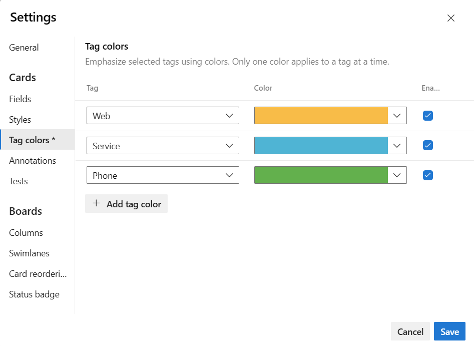
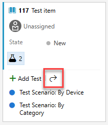

 
# Customize cards  

[!INCLUDE [temp](../includes/version-vsts-tfs-2015-on.md)]  

With the Kanban board, you gain a rich set of tools and a rich set of customization options. Kanban boards display work items as cards. Each card corresponds to a work item that you use to share information, track status, and assign work. Information rich cards provide at-a-glance info of interest to you and your team and allow you to update a field without opening the work item. With style rules, you can highlight cards and tasks based on the criteria you set.  

::: moniker range=">= tfs-2017"
When you enable annotations, you gain quick access to linked work items and other features. If you're new to working with the Kanban board, see [Kanban basics](../../boards/boards/kanban-basics.md). 
::: moniker-end

::: moniker range=">= azure-devops-2019"

In the card shown below, the following options have been set for the bug work item type:
- Show all core fields: ID, Assigned To, Story Points, Tags
- Show three more fields: State, Changed By, and Changed Date
- Apply tag colors
- Apply styling rule to display bugs with Severity=1 as yellow and bold and underline the Title field
- Enable Task, GitHub, and Test annotations  

> [!div class="mx-imgBorder"]  
>   
::: moniker-end

::: moniker range="tfs-2017 || tfs-2018"

In the card shown below, the following options have been set for the bug work item type:
- Show all core fields: ID, Assigned To, Story Points, Tags
- Show three more fields: State, Changed By, and Changed Date
- Apply tag colors
- Apply styling rule to display bugs with Severity=1 as yellow and bold and underline the Title field
- Enable Tasks and Test annotations  

> [!div class="mx-imgBorder"]  
>   
::: moniker-end

::: moniker range="< tfs-2017"

In this example, the bug work item type shows all the core fields, three more fields, and tags. Also, To make severity 1 bugs stand out, a styling rule causes the card to display as yellow.  

::: moniker-end

> [!NOTE] 
> This article addresses customization of a Kanban board. For information on customizing a Taskboard, see [Customize sprint Taskboards](../sprints/customize-taskboard.md). 

You can either increase or simplify the information that displays on your cards. It all depends on what's of interest to your team.  
- *Does your team like to refer to work items by their ID?* 
- *Do they want to see estimates?* 
- *Do they want to highlight work items according to set criteria?* 
- *Or, will just the bare bones of title and assignment suffice?* 

Your best bet is to show fields on cards based on what your team frequently refers to or updates when using the Kanban board. Also, add fields with information that you can use to filter the board. 

::: moniker range=">= azure-devops-2019"

> [!NOTE]  
> You can customize a work item type which is different than customizing the card displayed on the Kanban board. You customize a work item type by adding fields, changing the workflow, adding custom rules and more. You can also add custom work item types and custom backlog levels. For details, see [Customize an inheritance process](../../organizations/settings/work/inheritance-process-model.md). 

::: moniker-end

::: moniker range=">= tfs-2015 < azure-devops-2019"

> [!NOTE]  
> You can customize a work item type which is different than customizing the card displayed on the Kanban board. You customize a work item type by adding fields, changing the workflow, adding custom rules and more. You can also add custom work item types and custom backlog levels. For details, see [Customize the On-premises XML process model](../../reference/on-premises-xml-process-model.md). 

::: moniker-end

[!INCLUDE [temp](../includes/prerequisites-team-settings.md)]

## Card customization options  

Once you open the Settings dialog for the Kanban board, choose one of the following tabs to set your customization options. 

:::row:::
   :::column span="1":::
      **Settings tab** 
   :::column-end:::
   :::column span="3":::
      **Use to...**
   :::column-end:::
:::row-end:::
---
::: moniker range=">= azure-devops-2020"
:::row:::
   :::column span="1":::
      **[Fields](#fields)** 
   :::column-end:::
   :::column span="3":::
      Add or remove fields from cards.  
      Includes adding the **Parent** field to cards.
   :::column-end:::
:::row-end:::
::: moniker-end
::: moniker range="< azure-devops-2020"
:::row:::
   :::column span="1":::
      **[Fields](#fields)** 
   :::column-end:::
   :::column span="3":::
      Add or remove fields from cards. 
   :::column-end:::
:::row-end:::
::: moniker-end
:::row:::
   :::column span="1":::
      **[Styles](#style-rule)** 
   :::column-end:::
   :::column span="3":::
      Add styling rules to change card color and title style based on field criteria. 
   :::column-end:::
:::row-end:::
:::row:::
   :::column span="1":::
      **[Tag colors](#color-tags)** 
   :::column-end:::
   :::column span="3":::
      Specify a tag color, and enable or disable a tag color. 
   :::column-end:::
:::row-end:::
::: moniker range=">= tfs-2017"
:::row:::
   :::column span="1":::
      **[Annotations](#annotations)** 
   :::column-end:::
   :::column span="3":::
      Enable or disable annotations to appear on cards. 
   :::column-end:::
:::row-end:::
:::row:::
   :::column span="1":::
      **[Tests](#tests)** 
   :::column-end:::
   :::column span="3":::
      Configure how you want tests to appear and behave on the cards.
   :::column-end:::
:::row-end:::
::: moniker-end
:::row:::
   :::column span="1":::
      **[Card reordering](reorder-cards.md)** 
   :::column-end:::
   :::column span="3":::
      Choose expected behavior when reordering cards on the board.  
   :::column-end:::
:::row-end:::
---

> [!NOTE]   
> Each team can customize the cards for their Kanban board. Board settings are not inherited from other teams that they may share portions of area paths. 

## Card customization sequence 

Before you configure the cards, you'll want to make sure the following tasks are complete as possible. Otherwise, you'll find yourself revisiting your configuration.  

**Process Administrator**: 
1. Add custom work item types that you want to appear on your backlog or board. For details, see [Add and manage work item types](../../organizations/settings/work/customize-process-work-item-type.md).
2. Customize your product and portfolio backlogs to ensure all work item types you want to have will appear on the backlogs and boards. For details see [Customize backlogs & boards](../../organizations/settings/work/customize-process-backlogs-boards.md). 
3. Customize each work item type to have any custom fields you want to show. For details, see [Customize a workflow](../../organizations/settings/work/add-custom-field.md).

**Team Administrator**:
1. Meet with your team and determine how the team wants to manage bugs, similar to requirements or tasks.  
1. [Add any tags](../queries/add-tags-to-work-items.md) you want to customize on cards to work items. 
1. Meet with your team and determine which annotations should appear on cards and how they want to configure inline tests.  
 

## Open your Kanban board settings

If you're not a team admin, [get added as one](../../organizations/settings/add-team-administrator.md). Only team and project admins can customize the Kanban board.

You can customize cards that appear on the Kanban board for your product backlog or portfolio backlog such as features and epics. You follow similar steps, however you start from the [corresponding portfolio backlog](../../boards/backlogs/define-features-epics.md).  

::: moniker range=">= azure-devops-2019"

1. [Open your Kanban board.](kanban-quickstart.md). 

1. Choose the backlog level you want to customize. 

	> [!div class="mx-imgBorder"]
	>   

1. Choose the  :::image type="icon" source="../../media/icons/blue-gear.png" border="false":::  gear icon to configure the board and set general team settings.  

	> [!div class="mx-imgBorder"]
	>   

1. When done with your changes, choose **Save**.

::: moniker-end 

::: moniker range=">= tfs-2015 <= tfs-2018"

1. [Open your Kanban board](kanban-quickstart.md).  

1. Choose the backlog level you want to customize. 

1. Choose  to open the common configuration settings dialog for the Kanban board. 

	  

1. When done with your changes, choose **Save**.

::: moniker-end

## Choose fields to appear on cards 
 
By showing a field on a card, you can edit that field directly on the board without having to open the card, unless it's a read-only field, such as the Change By and Changed Date fields. This quick update feature is useful when you need to update many work items at once. For example, you can add estimates for backlog items on the Kanban board. 

To change the Title, choose the pencil icon in the upper-right corner. 

<!---
Here we change the Assigned To field. 

 

--> 

::: moniker range=">= azure-devops-2019"
 
As a first step, you'll see that you can determine which fields appear on each card type. To add a custom field, you must first [add it to the process used to customize the project](../../organizations/settings/work/add-custom-field.md). 
::: moniker-end  

::: moniker range=">= tfs-2015 < azure-devops-2019"  
As a first step, you'll see that you can determine which fields appear on each card type. To add a custom field, you must first [add it to the work item type definition](../../reference/add-modify-field.md).  
::: moniker-end  

::: moniker range=">= azure-devops-2019"

1. From the Settings dialog, choose **Fields** and then a work item type to see all the settings you can modify. Your initial column settings appear similar to the image below. 

	Here we choose User Story. Your choices will vary based on the [process](../../boards/work-items/guidance/choose-process.md) used to create your project and whether your team has chosen to [treat bugs like requirements or like tasks](../../organizations/settings/show-bugs-on-backlog.md).     

	> [!div class="mx-imgBorder"]
	>  

1. Place a check mark in the check box for those fields you want to have appear on the board. 

	If you want work estimates to show, check **Show Effort**. **Show Effort** corresponds to these fields: Effort ([Scrum](../../boards/work-items/guidance/scrum-process.md)), Story Points ([Agile](../../boards/work-items/guidance/agile-process.md)), and Size ([CMMI](../../boards/work-items/guidance/cmmi-process.md)).

1. To add a field, choose the :::image type="icon" source="../media/icons/green_plus_icon.png" border="false"::: plus icon and enter the name of a field  you want to add. 

1. To remove a field, choose the :::image type="icon" source="../../media/icons/delete-icon.png" border="false"::: delete icon next to the field.

1. When done with your changes, choose **Save**.

::: moniker-end  

::: moniker range=">= azure-devops-2020"
> [!NOTE]  
> To show the **Title** of the parent work item, choose the **Parent** field. Choosing the **Parent** title from a card opens the parent work item. To change the parent work item, open the child work item and remove the link and add a different parent work item. You can filter your board based on parent work items, whether the **Parent** field is added to cards or not.
::: moniker-end

::: moniker range=">= tfs-2017 <= tfs-2018"  

1. From the Settings dialog, choose **Fields**  and then a work item type to see all the settings you can modify. Your initial column settings will look something like this. 

	Here we choose User Story. Your choices will vary based on the [process](../../boards/work-items/guidance/choose-process.md) used to create your project and whether your team has chosen to [treat bugs like requirements or like tasks](../../organizations/settings/show-bugs-on-backlog.md).     

	> [!div class="mx-imgBorder"]
	>  

1. Place a check mark in the check box for those fields you want to have appear on the board. 

	If you want work estimates to show, check **Show Effort**. **Show Effort** corresponds to these fields: Effort ([Scrum](../../boards/work-items/guidance/scrum-process.md)), Story Points ([Agile](../../boards/work-items/guidance/agile-process.md)), and Size ([CMMI](../../boards/work-items/guidance/cmmi-process.md)).

1. To add a field, choose the :::image type="icon" source="../media/icons/green_plus_icon.png" border="false"::: plus icon and enter the name of a field  you want to add. 

1. To remove a field, choose the :::image type="icon" source="../../media/icons/delete-icon.png" border="false"::: delete icon next to the field.

1. When done with your changes, choose **Save**.

::: moniker-end  

::: moniker range="tfs-2015"  

1. From the Settings dialog, choose **Fields** and then a work item type to see all the settings you can modify. Your initial column settings will look something like this. 

	Here we choose User Story. Your choices will vary based on the [process](../../boards/work-items/guidance/choose-process.md) used to create your project and whether your team has chosen to [treat bugs like requirements or like tasks](../../organizations/settings/show-bugs-on-backlog.md).     

	**TFS 2015.1 options:**      
	  

	**TFS 2015 options:**      
	  

1. Place a check mark in the check box for those fields you want to have appear on the board. 

	If you want work estimates to show, check **Show Effort** or **Show Cost**. These options will cause the following fields to appear based on the respective process: Effort ([Scrum](../../boards/work-items/guidance/scrum-process.md)), Story Points ([Agile](../../boards/work-items/guidance/agile-process.md)), and Size ([CMMI](../../boards/work-items/guidance/cmmi-process.md)).

1. To add a field, choose the :::image type="icon" source="../../media/icons/add-icon.png" border="false"::: plus icon and enter the name of a field you want to add. 

1. To remove a field, choose the :::image type="icon" source="../../media/icons/delete-icon.png" border="false"::: delete icon next to the field.

1. When done with your changes, choose **Save**.

::: moniker-end  

  

## Define style rules to highlight cards  
 
With styling rules, you can cause cards to change color when their corresponding work items meet criteria that you set. Here, we highlight severity 1 bugs by having the cards display as yellow. 

::: moniker range="tfs-2015"
This feature requires TFS 2015.1 or later versions.
::: moniker-end

::: moniker range=">= tfs-2018"

::: moniker-end
::: moniker range=">= tfs-2015 <= tfs-2017"

::: moniker-end

### Example styling rules 

What rules should you apply to highlight work items? Here are a few examples and their associated criteria.

> [!div class="mx-tdCol2BreakAll"]
> | Work items | Criteria |
> |------------|------------|
> | High priority items | `Priority = 1` |
> | High effort items | `Effort 20` or `Story Points 20` |
> | Stale items unchanged in the last 5 days | `Changed Date @Today-5` |
> |Title contains a key word | `Title Contains Yes` |
> |Severity 1 bugs | `Severity = 1 - Critical   AND   Work Item Type = Bug` |
> |High value business items | `Business Value 50` |
> |Items assigned to specific feature area  | `Area Path Under Fabrikam Fiber\Phone` |
> |Contains specific tag   | `Tags Contain RTM` |
> |Blocked tasks (Scrum process only) | `Blocked = Yes` |

You can apply style rules to change the color of cards on Kanban boards and taskboards.  

::: moniker range=">= azure-devops-2019"

1. From the Settings dialog, choose **Styles** to specify a style rule. Choose the :::image type="icon" source="../../media/icons/green_plus_icon.png" border="false"::: plus icon to add a style. Select the color to apply to the card and define the criteria for the style rule. 

	In this example, we show the **Styles** dialog for the Dashboard. 

	> [!div class="mx-imgBorder"]  
	> 

	Follow these rules when creating and ordering your style rules:  
   - The criteria you specify works in a similar fashion as when [constructing a query](../../boards/queries/using-queries.md). 
   - All clauses are considered AND clauses, grouping clauses isn't supported. 
   - Card rules apply to all work items that meet the rule criteria. 
   - Rule color applies to work items based on the order in which rules are listed. If you add more than one style rule, make sure that you move them in the order of most importance. Simply drag them into the order you want them applied. 
   - You can quickly enable and disable a style rule.

     Here we add a Stale tasks rule that highlights tasks that haven't changed in the last five days.

        

1. To copy or delete a style rule, choose the  :::image type="icon" source="../../media/icons/actions-icon.png" border="false"::: actions icon and select **Clone** or **Delete**.

1. When done with your changes, choose **Save**.

::: moniker-end  

::: moniker range=">= tfs-2015 <= tfs-2018"

1. From the Settings dialog, choose **Styles** to specify a style rule. Choose the :::image type="icon" source="../../media/icons/green_plus_icon.png" border="false"::: plus icon to add a style. Select the color to apply to the card and define the criteria for the style rule. 

	In this example, we show the **Styles** dialog for the dashboard. 

	> [!div class="mx-imgBorder"]  
	> 

	Follow these rules when creating and ordering your style rules:
   - The criteria you specify works in a similar fashion as when [constructing a query](../../boards/queries/using-queries.md) 
   - All clauses are considered AND clauses, grouping clauses isn't supported  
   - Card rules apply to all work items that meet the rule criteria  
   - Rule color applies to work items based on the order in which rules are listed. If you add more than one style rule, make sure that you move them in the order of most importance. Simply drag them into the order you want them applied.  
   - You can quickly enable and disable a style rule. 

     Here we add a Stale tasks rule which highlights tasks that haven't changed in the last five days.

        

1. To copy or delete a style rule, choose the  :::image type="icon" source="../../media/icons/actions-icon.png" border="false"::: actions icon and select **Clone** or **Delete**.

1. When done with your changes, choose **Save**.

::: moniker-end

## Color-code tags   

Prior to setting tag colors, first [add tags to backlog items](../../boards/queries/add-tags-to-work-items.md) that you want to highlight with color.   
 
::: moniker range="tfs-2015"  
Requires TFS 2015.1 or later version.  
::: moniker-end   

1. From the Settings dialog, choose **Tag colors** and then choose the :::image type="icon" source="../../media/icons/green_plus_icon.png" border="false"::: plus icon to add a tag color. Then, select the tag and the color you want to appear on the cards.  

   ::: moniker range=">= tfs-2017"
   > [!div class="mx-imgBorder"]  
   >  
   ::: moniker-end   

   ::: moniker range="tfs-2015"  
   >    
   ::: moniker-end   
   
   > [!TIP]
   > If tags don't display on the cards, choose **Fields** and make sure that you've checked **Show Tags**. 

3. When done with your changes, choose **Save**.

::: moniker range=">= tfs-2017"  

## Enable or disable an annotation

By default, all annotations are enabled that are applicable for the board you selected. This includes all work item types added to the next level backlog, GitHub, and Tests. Disable those annotations, which your team won't use or which you don't want teams to use for a particular backlog level. 

When you disable an annotation, you also disable the feature to add the associated object from the Kanban board. For example, if you disable the Tests annotation, you disable the ability to add tests from the currently selected Kanban board. 

As shown in the following examples, the **Task** and **Test** annotations indicate that two each of tasks and tests have been defined for the work item. Disable the annotations you're team doesn't use from the **Annotations** tab. 

> [!div class="mx-tdBreakAll"]  
> | Task annotations  |Test annotations  |No annotations |
> |-------------|----------|----------|    
> | |  |  | 

To learn more about using these features, see [Add tasks or child items as checklists](../../boards/boards/add-task-checklists.md) and [Add, run, and update inline tests](../../boards/boards/add-run-update-tests.md).  

::: moniker-end

::: moniker range="azure-devops-2019"

> [!NOTE]  
> If your project collection uses the On-premises XML process model to customize work tracking, you can enable work item types that you add to the Task Category to appear as a checklist on your product Kanban board. To learn how, see [Set up your backlogs and boards, Customize your Kanban Board checklist items](../backlogs/set-up-your-backlog.md#customize-checklist-2019). 

::: moniker-end

::: moniker range=">= azure-devops-2019"  

1. Open the Settings dialog for the Kanban board you want to customize and choose **Annotations** .
2. Check those annotations that you want enabled. For example, to enable tasks but disable tests, check the following boxes.     

	

	> [!NOTE]   
	> GitHub annotations requires Azure DevOps Server 2019 Update 1 or later version. To learn more about linking Azure Boards work items to GitHub artifacts, see [Link GitHub commits, pull requests, and issues to work items](../github/link-to-from-github.md).

	When done with your changes, choose **Save**.

::: moniker-end

::: moniker range=">= tfs-2017 <= tfs-2018"  

1. Open the Settings dialog for the Kanban board you want to customize and choose **Annotations**
2. Check those annotations that you want enabled. For example, to enable tasks but disable tests, check the following boxes.     

	

	When done with your changes, choose **Save**.

::: moniker-end

::: moniker range=">= tfs-2017"  

## Configure inline tests 

You can control the test plan under which inline tests you add through the Kanban board are created. You can choose to create a new test plan for each new test that you add, or add all new tests to a selected test plan. 

::: moniker-end

::: moniker range=">= azure-devops-2019"

1. Open the Settings dialog for the Kanban board (product backlog only) you want to customize and choose **Annotations**. Make sure that **Test** annotation is enabled, a requirement to configure inline tests.

1. Then, choose **Tests**, and then choose the options you want. To select a test plan, choose the  :::image type="icon" source="../../media/icons/actions-icon.png" border="false"::: actions icon and select one test plan from the query provided.  

	> [!div class="mx-imgBorder"]  
	>   

   In a test plan, a test case can exist in multiple test suites. For example, you may define several test suites for each product feature and the test cases test scenarios across features. The test case might exist in both feature's test suite with the same configurations and test steps. As a result of this setup, the tester might run the same test case multiple times for the same product version. 

    To avoid the redundancies that can occur under this scenario, you should choose **Show same outcome of the tests in multiple suites under the same plan** checkbox. When checked, the Test Points of the same Test Case and configuration, shows the same latest outcome. When the tester runs any one test, the output is synced with all other test points (which are of same Test Case work item and same configuration) in the Test Plans. The tester can use the outcome and choose not to run the test again.

1. Save your changes. 

::: moniker-end

::: moniker range=">= tfs-2017 <= tfs-2018"

1. Open the Settings dialog for the Kanban board (product backlog only) you want to customize. 

2. Choose **Annotations** and make sure that **Test** annotation is enabled. This is a requirement to configure inline tests.

3. Choose **Tests**, and then choose the options you want. To select a test plan, choose the  :::image type="icon" source="../../media/icons/actions-icon.png" border="false"::: actions icon and select one test plan from the query provided.  

	   

4. Save your changes. 

::: moniker-end

::: moniker range=">= tfs-2017"

### Open the test plan, test suite from a card

From a card on the Kanban board, you can easily navigate to the underlying test plan and test suite under which the tests are created. Choose the :::image type="icon" source="../../media/icons/open-icon.png" border="false"::: open icon to open another browser tab showing **Test** and associated test plan and test suite that controls the inline tests.

  

::: moniker-end

## Related articles

::: moniker range=">= azure-devops-2019"

- [Card reordering](reorder-cards.md)  
- [Manage and configure team tools](../../organizations/settings/manage-teams.md)
- [Setup your backlogs and boards](../backlogs/set-up-your-backlog.md)
- [Configure status badges](../github/configure-status-badges.md) 
- [Show bugs on backlogs and boards](../../organizations/settings/show-bugs-on-backlog.md)  
- [Select backlog navigation levels for your team](../../organizations/settings/select-backlog-navigation-levels.md)  
- [Set working days](../../organizations/settings/set-working-days.md) 

::: moniker-end

::: moniker range="<= tfs-2018"

- [Card reordering](reorder-cards.md)  
- [Manage and configure team tools](../../organizations/settings/manage-teams.md)
- [Setup your backlogs and boards](../backlogs/set-up-your-backlog.md)
- [Show bugs on backlogs and boards](../../organizations/settings/show-bugs-on-backlog.md)  
- [Select backlog navigation levels for your team](../../organizations/settings/select-backlog-navigation-levels.md)  
- [Set working days](../../organizations/settings/set-working-days.md) 

::: moniker-end
