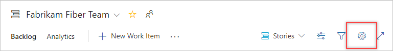

# Definition of Done

[!INCLUDE [temp](../_shared/version-vsts-tfs-2015-on.md)]  

As your team updates the status of work as it progresses from one stage to the next, it helps that they agree on what "done" means. By specifying the Definition of Done criteria for each Kanban column, you help share the essential tasks to complete before moving an item into a downstream stage. 
Also, you'll have implemented one of the core Kanban tenets: **make processes and policies explicit.**

When set, team members can quickly double-check the done criteria.

::: moniker range=">= tfs-2017" 
> [!div class="mx-imgBorder"]
> 
::: moniker-end   
::: moniker range="tfs-2015" 

::: moniker-end   

If you're just getting started, review [Kanban basics](kanban-basics.md) to get an overview of how to implement Kanban.

[!INCLUDE [temp](../_shared/prerequisites-team-settings.md)]

## Specify the Definition of Done for a column 

::: moniker range=">= azure-devops-2019"

0.  [Open your Kanban board](kanban-quickstart.md). 

	If you're not a team admin, [get added as one](../../organizations/settings/add-team-administrator.md). Only team and project admins can customize the Kanban board.

0. Choose the  gear icon to configure the board and set general team settings.  

	> [!div class="mx-imgBorder"]
	>   

2. Choose **Columns** and then a column tab to configure the Definition of Done for that column. 

	> [!div class="mx-imgBorder"]
	>   

0. When done with your changes, choose **Save**.

::: moniker-end 

::: moniker range=">= tfs-2017 <= tfs-2018" 
0. [Open your Kanban board](kanban-quickstart.md). If you're not a team admin, [get added as one](../../organizations/settings/add-team-administrator.md). Only team and project admins can customize the Kanban board.

0. Choose  to open the common configuration settings dialog for the Kanban board. 

	  

0. Choose **Columns** and then a column tab to configure the Definition of Done for that column. You can specify the Definition of Done for each intermediate column on your team's Kanban board.   

	> [!div class="mx-imgBorder"]
	>   

0. When done with your changes, choose **Save**.  
::: moniker-end  
::: moniker range="tfs-2015"  
0. [Open your Kanban board](kanban-quickstart.md). If you're not a team admin, [get added as one](../../organizations/settings/add-team-administrator.md). Only team and project admins can customize the Kanban board.

0. Choose  to open the common configuration settings dialog for the Kanban board. 

	  

    **For TFS 2015.1 and later versions**   

0. Choose **Columns** and then a column tab to configure the Definition of Done for that column. You can specify the Definition of Done for each intermediate column on your team's Kanban board.  

         
	**For TFS 2015**  
0. Choose **Edit Definition** within an intermediate column tab and specify  the Definition of Done for that column.  

	    	 

0. Enter text that defines your team's Definition of Done.    
	  

::: moniker-end   

Team members can quickly check that they have met the criteria by choosing the Information tooltip  info icon.  

## Related articles

- [Add, rename, move, and delete columns](add-columns.md)
- [Work in Progress limits](wip-limits.md)  
- [Add swimlanes, expedite work](expedite-work.md)
- [Split columns](split-columns.md) 
- [Customize cards](../../boards/boards/customize-cards.md)
