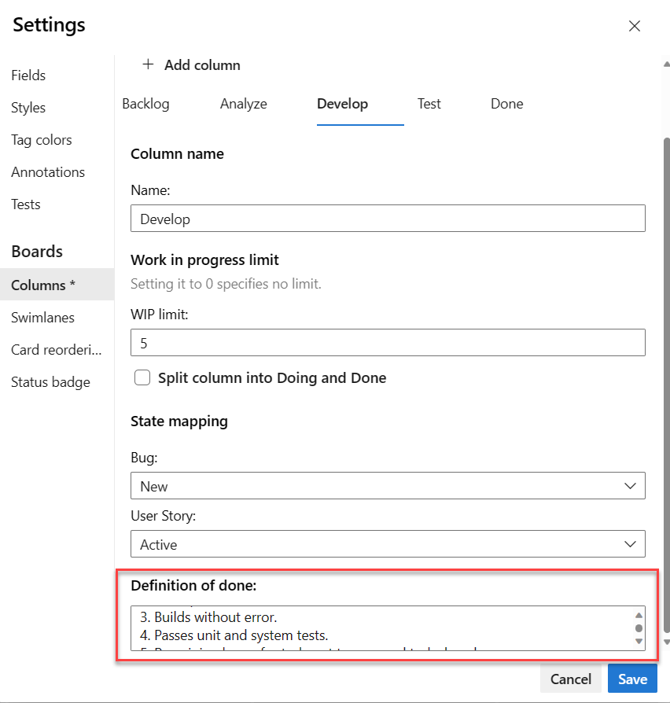

# Specify the Definition of Done criteria for your Kanban columns

[!INCLUDE [version-lt-eq-azure-devops](../../includes/version-lt-eq-azure-devops.md)]  

When your team advances from one stage to the next in their work, it's crucial that they have a shared understanding of what constitutes "done." You can define the criteria for the Definition of Done in each Kanban column. By doing so, the team can identify the necessary tasks that need to be completed before advancing an item to the next stage. By doing so, you're also implementing one of the core Kanban tenets, *make processes and policies explicit*.

Team members can quickly double-check the done criteria.

> [!div class="mx-imgBorder"]
> 

If you're just getting started, review [Kanban basics](kanban-basics.md) to get an overview of how to implement Kanban.

[!INCLUDE [temp](../includes/prerequisites-team-settings.md)]

## Add the Definition of Done to a column 

::: moniker range=">= azure-devops-2019"

1. [Open your Kanban board](kanban-quickstart.md). 

   If you're not a team admin, [get added as one](../../organizations/settings/add-team-administrator.md). Only team and project admins can customize the Kanban board.

1. Choose the  :::image type="icon" source="../../media/icons/blue-gear.png" border="false":::  gear icon to configure the board and set general team settings.  

	> [!div class="mx-imgBorder"]
	>   

2. Choose **Columns** and then a column tab to configure the Definition of Done for that column. 

	> [!div class="mx-imgBorder"]
	>   

3. When you're done with your changes, select **Save and close**.

::: moniker-end 

::: moniker range="tfs-2018" 

1. [Open your Kanban board](kanban-quickstart.md). If you're not a team admin, [get added as one](../../organizations/settings/add-team-administrator.md). Only team and project admins can customize the Kanban board.

2. Choose  to open the common configuration settings dialog for the Kanban board. 

	  

3. Choose **Columns** and then a column tab to configure the Definition of Done for that column. You can specify the Definition of Done for each intermediate column on your team's Kanban board.   

	> [!div class="mx-imgBorder"]
	>   

4. When done with your changes, choose **Save**.  
   ::: moniker-end  

Team members can quickly check that they've met the criteria by choosing the Information tooltip :::image type="icon" source="media/ALM_DD_InfoIcon.png" border="false"::: info icon.  

## Related articles

- [Add, rename, move, and delete columns](add-columns.md)
- [Work in Progress limits](wip-limits.md)  
- [Add swimlanes, speed up work](expedite-work.md)
- [Split columns](split-columns.md) 
- [Customize cards](../../boards/boards/customize-cards.md)
