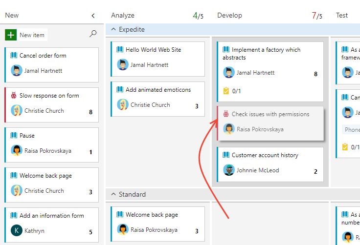
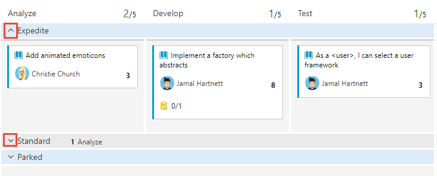
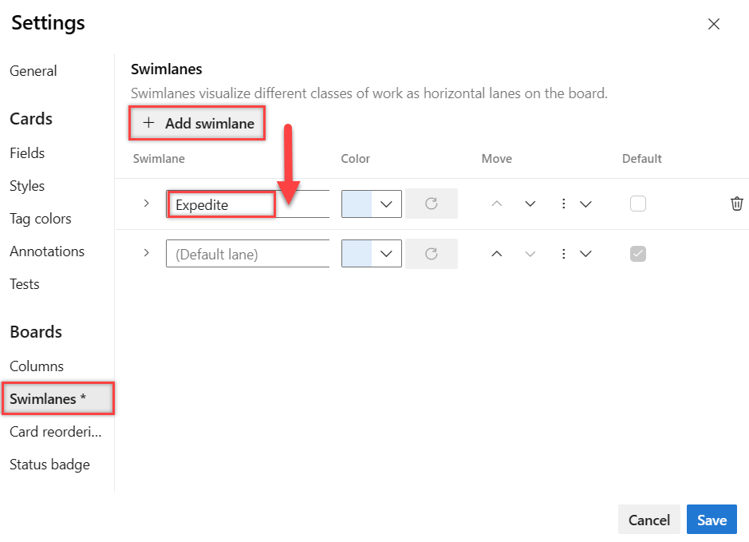
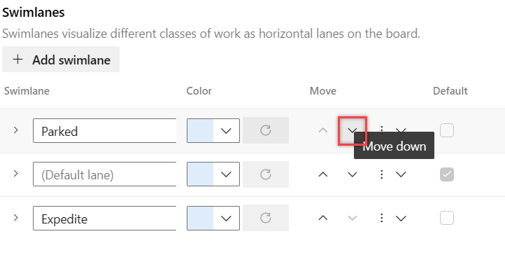
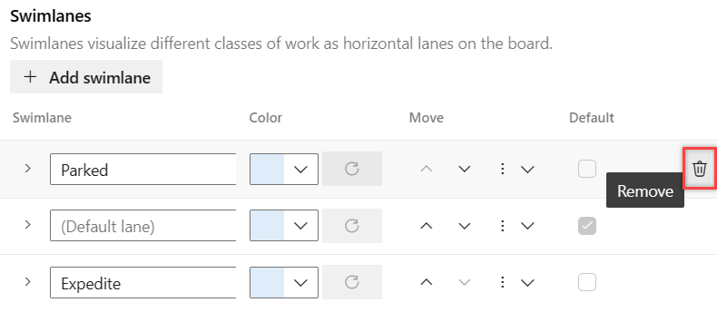

# Expedite work using swimlanes

[!INCLUDE [version-lt-eq-azure-devops](../../includes/version-lt-eq-azure-devops.md)]  

Your Kanban board helps you visualize the flow of work as it moves from defined to completed. When you add swimlanes, you can also visualize the status of work that supports different service-level classes. You can create a swimlane to represent any other dimension that supports your tracking needs.    

[!INCLUDE [temp](../includes/prerequisites-team-settings.md)]

## Types of swimlanes  

You can use swimlanes to sort work on your Kanban board to track items that you differentiate as follows: 
*	High priority items  
*	Service-level class  
*	Date-driven requirement  
*	Dependency for or from another team   
*	Blocked items  
*	Technical debt or other engineering work that's not a specific user story  

## Track work in swimlanes  

Once you've set up your swimlanes, you can drag items into a swimlane, and also reorder them within the lane.  

> [!TIP]  
> - Enter `o` to expand all swimlanes and `u` to collapse all swimlanes. To move the focus up or down, enter the `↑↓` up/down arrows. For more information, see [Keyboard shortcuts](../../project/navigation/keyboard-shortcuts.md).
> - When you have many swimlanes or cards on your board, you may encounter slow performance when dragging a card. We recommend that you use swimlanes in conjunction with card styles, tags, and board filters to manage your work items. If you have a lot of cards in the default lane, place that lane lower on the board to enhance performance when dragging a card to another swimlane.  

> [!div class="mx-imgBorder"]
>   

You can also focus on a single swimlane by collapsing all other lanes.

> [!div class="mx-imgBorder"]  
>   

[!INCLUDE [temp](../includes/note-kanban-boards-teams.md)]
	
## Add or remove a swimlane 

*Which swimlanes support your tracking needs?* Once you've identified one or two, add them to your Kanban board.  

::: moniker range="azure-devops"

1. [Open your Kanban board](kanban-quickstart.md). If you're not a team admin, [get added as one](../../organizations/settings/add-team-administrator.md). Only team and project administrators can customize the Kanban board.

1. Choose :::image type="icon" source="../../media/icons/blue-gear.png" border="false"::: **Configure board settings** to configure the board.  

	:::image type="content" source="media/expedite/choose-configure-board-settings.png" alt-text="Screenshot of Kanban board, Choose Configure board settings.":::

1. Choose **Swimlanes**, choose **Add swimlane**, and then enter the name of the swimlane you want to add. For example, here we enter *Expedite*. 

	> [!NOTE]  
	> The following images show the user interface that displays when the **New Boards Hub** preview feature is enabled. Some features are only available when the **New Boards Hub** is enabled as described in [Key concepts and work item tasks in Azure Boards](../work-items/quick-ref.md). For example, the ability to choose the swimlane color is only supported when the **New Boards Hub** feature is enabled. To enable it, see [Manage or enable features](../../project/navigation/preview-features.md).

	:::image type="content" source="media/expedite/add-swimlane-new-board-hubs-enabled.png" alt-text="Screenshot of Kanban board Settings, Swimlane tab, Add swimlane.":::

	The default lane appears unlabeled on the Kanban board. You can rename it to anything you like, however, you can't delete it. 

1. To set the color of the swimlane, choose a color from the drop-down menu. To reset the swimlane to the default, choose :::image type="icon" source="../media/icons/refresh.png" border="false":::  **Reset to default color**. 

	:::image type="content" source="media/expedite/pick-swimlane-color.png" alt-text="Screenshot of Kanban board Settings, Swimlane tab, choose swimlane color.":::

3. To reorder or delete a swimlane, choose :::image type="icon" source="../media/icons/more-actions.png" border="false"::: context menu for the swimlane, and select the corresponding option from the menu.    

	:::image type="content" source="media/expedite/move-remove-swimlane-options.png" alt-text="Screenshot of Kanban board Settings, Swimlane tab, swimlane menu options."::: 

	> [!NOTE]  
	> If you need to delete a swimlane, first move all items out of the lane. Then open the Settings dialog, choose :::image type="icon" source="../media/icons/more-actions.png" border="false"::: context menu for the swimlane,  and select **Remove**. 

5. When you're done with your changes, choose **Save**.  

::: moniker-end 

::: moniker range=">= azure-devops-2019 < azure-devops"

1. [Open your Kanban board](kanban-quickstart.md). If you're not a team admin, [get added as one](../../organizations/settings/add-team-administrator.md). Only team and project admins can customize the Kanban board.

1. Choose the  :::image type="icon" source="../../media/icons/blue-gear.png" border="false":::  gear icon to configure the board and set general team settings.  

	> [!div class="mx-imgBorder"]
	>   

2. Choose **Swimlanes** and then choose the :::image type="icon" source="../media/icons/green_plus_icon.png" border="false"::: plus icon and enter the name of the swimlane you want to add.  

	> [!div class="mx-imgBorder"]
	>   

	The default lane appears unlabeled on the Kanban board. You can rename it to anything you like, however, you can't delete it. Also, you can rename it directly from the Kanban board. 
    
3. To reorder your swimlanes, grab the lane and move it up or down.   

   > [!div class="mx-imgBorder"]
   >   

4. If you need to delete a swimlane, first move all items out of the lane. Then open the Settings dialog, choose the  :::image type="icon" source="../../media/icons/actions-icon.png" border="false":::  actions icon and select **Remove**. 
	
   > [!div class="mx-imgBorder"]
   >   

5. When you're done with your changes, choose **Save**.  

::: moniker-end 

::: moniker range="tfs-2018"  

1. [Open your Kanban board](kanban-quickstart.md). If you're not a team admin, [get added as one](../../organizations/settings/add-team-administrator.md). Only team and project admins can customize the Kanban board.  

2. Choose the :::image type="icon" source="../../media/icons/team-settings-gear-icon.png" border="false"::: gear icon to open the common configuration settings dialog for the Kanban board. 

	  

3. Choose **Swimlanes** and then choose the :::image type="icon" source="../media/icons/green_plus_icon.png" border="false"::: plus icon and enter the name of the swimlane you want to add.  

	> [!div class="mx-imgBorder"]
	>   

	The default lane appears unlabeled on the Kanban board. You can rename it to anything you like, however, you can't delete it. Also, you can rename it directly from the Kanban board. 
    
4. To reorder your swimlanes, grab the lane and move it up or down. 

   > [!div class="mx-imgBorder"]
   >   

5. If you need to delete a swimlane, first move all items out of the lane. Then open the Settings dialog, choose the  :::image type="icon" source="../../media/icons/actions-icon.png" border="false":::  actions icon and select **Remove**. 
	
   > [!div class="mx-imgBorder"]
   >   

6. When you're done with your changes, choose **Save**.  

::: moniker-end  

## Set up swimlane rules

Swimlane rules are similar to style rules, but instead they allow you to set up conditions on your Kanban board to automatically move work items into specific lanes. For example, you can set up a lane for each person on your team. When you assign the work item, it gets placed into that lane. 

The following limits apply to swimlanes:
- Up to 50 lanes on a board
- Up to five rules per lane
- Max of 25 rules total

Complete the following steps to set up swimlane rules for your Kanban board.

1. From your Kanban board, choose the :::image type="icon" source="../../media/icons/team-settings-gear-icon.png" border="false"::: gear icon to **Configure board settings**.

2. Select **Swimlanes**, select the **swimlane** or **[+ Add swimlane](#add-or-remove-a-swimlane)**, and then select **+ Add criteria**.

   :::image type="content" source="media/expedite/add-swimlane-criteria.png" alt-text="Screenshot showing sequence of buttons to select to add a swimlane rule.":::

3. Choose from the dropdown menus for each of the following entries: **Field**, **Operator**, and **Value**, and then choose **Save**. For more information, see the [examples in the next section](#examples-of-swimlane-rules). 

   :::image type="content" source="media/expedite/swimlane-rule-criteria.png" alt-text="Screenshot showing field, operator, and value selections for swimlane rule.":::

> [!TIP]
> You can't assign rules to the Default lane, but you can optionally rename it.

When your board refreshes, your work items are listed within the appropriate swimlane. 

### Examples of swimlane rules

The following examples show some of the ways you can use and set up swimlane rules.

- **Track priority**. We created rules for the `Work Item Type` and `Priority` fields and renamed the default lane, so work items automatically go into the appropriate swimlane.
  
  :::image type="content" source="media/expedite/priority-swimlane-rule-setup.png" alt-text="Screenshot showing swimlane rules set up by priority.":::
  **Kanban board results**
  :::image type="content" source="media/expedite/board-priority-swimlanes.png" alt-text="Screenshot showing priority swimlanes on Kanban board.":::

- **Track the parents of your work items**. We created rules for the `Work item type` field, so you can quickly see parents (features) and children (user stories and bugs) in their own swimlanes on the Kanban board.
  **Settings**
  :::image type="content" source="media/expedite/work-item-type-swimlane-rule-setup.png" alt-text="Screenshot showing rules set up for work item types.":::
  **Kanban board results**
  :::image type="content" source="media/expedite/board-track-parent-work-items-swimlanes.png" alt-text="Screenshot showing parent work item swimlanes on Kanban board.":::

- **Track each person's work on your team**. We created rules for the `Triage` and `Assigned to` fields, so that when you assign a work item, it's placed into that person's lane.
  **Settings**
  :::image type="content" source="media/expedite/assigned-to-swimlane-rule-setup.png" alt-text="Screenshot showing rule criteria for swimlane, by Assigned To field.":::
  **Kanban board results**
  :::image type="content" source="media/expedite/board-assigned-to-swimlanes.png" alt-text="Screenshot showing swimlanes grouped by priority.":::

## Query for work items based on swimlane

You can track which work items have been added to a Kanban board swimlane by creating a query and using the [Board Lane field](../queries/query-by-workflow-changes.md#kanban_query_fields).  

## Next steps

> [!div class="nextstepaction"] 
> [Customize cards](../../boards/boards/customize-cards.md)  

## Related articles

* [About teams and Agile tools](../../organizations/settings/about-teams-and-settings.md)
* [Query by assignment or workflow changes](../queries/query-by-workflow-changes.md#kanban_query_fields)
* [Add columns](add-columns.md)  
* [Split columns](split-columns.md)    

### REST API resources

To programmatically interact with the Kanban board and other team settings, see the [REST API, Boards reference](/rest/api/azure/devops/work/boards).

