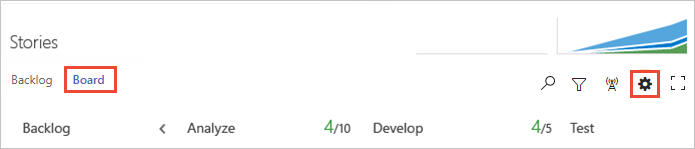

# Expedite work with swimlanes

[!INCLUDE [temp](../_shared/version-vsts-tfs-2015-on.md)]  

Your Kanban board supports your ability to visualize the flow of work as it moves from just defined to completed. When you add swimlanes, you can also visualize the status of work that supports different service-level classes. You can create a swimlane to represent any other dimension that supports your tracking needs.    

For example, you can create three swimlanes&mdash;Expedite, Standard, and Parked&mdash;to track high-priority work, standard work, and work that's currently blocked.  

> [!TIP]
> Type **o** to expand all swimlanes and **u** to collapse all swimlanes. To move the focus up or down, enter the  up/down arrows. For more tips, see [kanban board keyboard shortcuts](kanban-board-keyboard-shortcuts.md).

[!INCLUDE [temp](../_shared/prerequisites-team-settings.md)]

## Types of swimlanes  

You can use swimlanes to sort work on your Kanban board to track items that you differentiate as follows: 
*	High priority items  
*	Service-level class  
*	Date-driven requirement  
*	Dependency for or from another team   
*	Blocked items  
*	Technical debt or other engineering work that's not a specific user story  

## Track work in swimlanes  

Once you've set up your swimlanes, you can drag items into a swimlane as well as reorder them within the lane.  

::: moniker range=">= tfs-2018"  
> [!div class="mx-imgBorder"]
>   
::: moniker-end   
::: moniker range=">= tfs-2015 <= tfs-2017"  
  
::: moniker-end   
You can also focus on a single swimlane by collapsing all other lanes.

::: moniker range=">= tfs-2018"  
> [!div class="mx-imgBorder"]  
>   
::: moniker-end  
::: moniker range=">= tfs-2015 <= tfs-2017"  
  
::: moniker-end   

	
## Add or remove a swimlane 

So, what swimlanes will support your tracking needs?  

Once you've identified one or two, add them to your Kanban board.  

::: moniker range=">= azure-devops-2019"

0.  [Open your Kanban board](kanban-quickstart.md). If you're not a team admin, [get added as one](../../organizations/settings/add-team-administrator.md). Only team and project admins can customize the Kanban board.

0. Choose the  gear icon to configure the board and set general team settings.  

	> [!div class="mx-imgBorder"]
	>   

0. Choose **Swimlanes** and then choose the  plus icon and enter the name of the swimlane you want to add.  

	> [!div class="mx-imgBorder"]
	>   

	The default lane appears unlabeled on the Kanban board. You can rename it to anything you like, however, you can't delete it. Also, you can rename it directly from the Kanban board. 
    
0.	To reorder your swimlanes, simply grab the lane and move it up or down.   

	> [!div class="mx-imgBorder"]
	>   

0.	If you need to delete a swimlane, first move all items out of the lane. Then open the Settings dialog, choose the  actions icon and select **Remove**. 
	
	> [!div class="mx-imgBorder"]
	>   

0. When done with your changes, choose **Save**.  

::: moniker-end 

::: moniker range=">= tfs-2017 <= tfs-2018"  

0.  [Open your Kanban board](kanban-quickstart.md). If you're not a team admin, [get added as one](../../organizations/settings/add-team-administrator.md). Only team and project admins can customize the Kanban board.  

0. Choose the  gear icon to open the common configuration settings dialog for the Kanban board. 

	  

0. Choose **Swimlanes** and then choose the  plus icon and enter the name of the swimlane you want to add.  

	> [!div class="mx-imgBorder"]
	>   

	The default lane appears unlabeled on the Kanban board. You can rename it to anything you like, however, you can't delete it. Also, you can rename it directly from the Kanban board. 
    
0.	To reorder your swimlanes, simply grab the lane and move it up or down.   

	> [!div class="mx-imgBorder"]
	>   

0.	If you need to delete a swimlane, first move all items out of the lane. Then open the Settings dialog, choose the  actions icon and select **Remove**. 
	
	> [!div class="mx-imgBorder"]
	>   

0. When done with your changes, choose **Save**.  
::: moniker-end  
::: moniker range="tfs-2015"  
0.  [Open your Kanban board](kanban-quickstart.md). If you're not a team admin, [get added as one](../../organizations/settings/add-team-administrator.md). Only team and project admins can customize the Kanban board.  

0. Choose the  gear icon to open the common configuration settings dialog for the Kanban board. 

	 

0.	Choose **Swimlanes**, and then choose the  plus icon, and enter the name of the swimlane you want to add.       

	**For TFS 2015.1 and later versions**       
	     
	The default lane appears unlabeled on the Kanban board. You can rename it to anything you like, however, you can't delete it. Also, you can rename it directly from the Kanban board.    

	**For TFS 2015**    
	     
	The default lane is automatically renamed to Standard when you add a second lane. You can rename it to anything you like, however, you can't delete it.   
    
0.	To reorder your swimlanes, simply grab the lane and move it up or down.   
	   

0.	If you need to delete a lane, first move all items out of the lane. Then, choose the  actions icon and select **Delete**.      

	

0. When done with your changes, choose **Save**.  

::: moniker-end 

::: moniker range=">= tfs-2017"  

## Query for work items based on swimlane

You can track which work items have been added to a Kanban board swimlane by creating a query and using the [Board Lane field](../queries/query-by-workflow-changes.md#kanban_query_fields).  
::: moniker-end  

::: moniker range="tfs-2015"  

## Track lane moves  

**For TFS 2015.1 and later versions**  

You can track Kanban board swimlane moves by creating a query and using the [Board Lane field](../queries/query-by-workflow-changes.md#kanban_query_fields).  

**For TFS 2015**

Similar to the way [column moves are tracked](add-columns.md), swimlane moves are captured in the history field.  

   

For TFS 2015 and earlier versions, you can't [query](../queries/using-queries.md) for all items in a particular swimlane. To perform such a query, you'd have to assign a value to a field, such as the Priority field, or [tag](../queries/add-tags-to-work-items.md) each item in a similar way.  
::: moniker-end  

## Related articles

As you can see, swimlanes provides another way to organize and visualize the flow of work using [Kanban](kanban-basics.md). Here are a few more options you have for customizing the look and feel of your Kanban board.   

* [About teams and Agile tools](../../organizations/settings/about-teams-and-settings.md)
* [Query by assignment or workflow changes](../queries/query-by-workflow-changes.md#kanban_query_fields)
* [Add columns](add-columns.md)  
* [Split columns](split-columns.md)   
* [Customize cards](../../boards/boards/customize-cards.md)   

### REST API resources
To programmatically interact with the Kanban board and other team settings, see the [REST API, Boards reference](/rest/api/azure/devops/work/boards).

