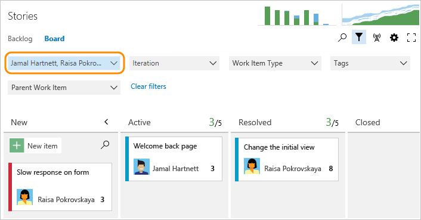

---
title: Filter your Kanban board 
titleSuffix: Azure Boards
description: Filter your Kanban board based on work item type, assigned to, iteration or sprint, tags, or parent work items
ms.custom: boards-kanban 
ms.technology: devops-agile
ms.prod: devops
ms.assetid:  
ms.manager: jillfra
ms.author: kaelli
author: KathrynEE
ms.topic: conceptual
monikerRange: '>= tfs-2015'
ms.date: 11/19/2018
--- 

# Filter your Kanban board

[!INCLUDE [temp](../_shared/version-vsts-tfs-2015-on.md)]


<a id="filter"></a>

Depending on the size of your team and the number of stories in progress, your Kanban board can get a bit crowded. With filtering, you can selectively choose what cards display to focus on what's of interest in the moment. With parent work item filters, you can focus on one or more select features or epics.  


<a id="text-filter"></a>
## Filter using keywords and tags 

To filter the Kanban board, first customize the board settings so that the cards display the fields or tags that contain keywords that you want to filter on. Otherwise, the keywords you enter will filter work items based on title.    

For example, to filter by Assign To, Iteration Path, or Work Item Type&mdash;or the contents of any other field&mdash;you add those fields to show on the cards. For details, see [Customize cards](../../boards/boards/customize-cards.md).  

::: moniker range=">= tfs-2018"

::: moniker-end
::: moniker range=">= tfs-2015 <= tfs-2017"

::: moniker-end

The filter function displays work items based on any visible/displayed column or field, including tags, based on the keyword that you enter. 

For example, here we filter the backlog to only show items that include 'Web' in any one of the displayed column fields.  
::: moniker range=">= tfs-2017"

::: moniker-end
::: moniker range="tfs-2015"

::: moniker-end


::: moniker range=">= tfs-2017"

> [!TIP]  
> Type **f** to move your cursor to the filter box. To move the focus up or down within a column, enter the  up/down arrows.    
>For more tips, see [Kanban board keyboard shortcuts](kanban-board-keyboard-shortcuts.md).
 
If you want to filter for a specific work item ID, you must choose to show IDs on the cards. 
::: moniker-end

::: moniker range=">= azure-devops-2019"
The filter criteria ignores the following characters: `,` (comma), `.` (period), `/` (forward slash), and `\` (back slash). 
::: moniker-end


::: moniker range=">= tfs-2017 <= tfs-2018"
The filter criteria ignores the following characters when the field value starts with the characters:<br/>
```{ ( [ ! @ # $ % ^ & * ~ ` ' "```
::: moniker-end


::: moniker range=">= tfs-2017"

<a id="field-filter"></a>
## Filter using select field values  

You can filter by select field values using the Kanban board for your product backlog (Stories, Product Backlog Items, or Requirements) or a portfolio backlog (Features or Epics). 

To start filtering, click the  Kanban board filter icon. 


Choose one or more values from the multi-select drop-down menu for each field. The values for these fields are populated  as follows: 
- **Assigned To**: All users who are currently assigned to work items on the board plus Unassigned  
- **Iteration**: All Iteration Paths [activated for the current team](../sprints/define-sprints.md)   
- **Work item type**: Work item types defined for the Requirements Category (product backlog) or Features or Epic categories (feature or epic portfolio backlogs)  
- **Tags**: All tags assigned to work items on the board  
- **Parent Work Items**: All features defined for the team, or all epics defined for the team when viewing the Features board (The Parent Work Items field doesn't appear when viewing the Epic or top-level Kanban board)  

For example, here we filter for all items assigned to Jamal and Raisa. 

  
Filters remain in place until you explicitly clear them by clicking **Clear filters**. When you refresh your Kanban board or sign in from another browser, filters remain set to your previous values. 

Once the board is filtered, you can click the filter icon to hide the drop downs and view the applied filters on the board. The filter icon also turns opaque to signify a filtered board.

::: moniker-end

::: moniker range=">= tfs-2017"
<a id="parent-filter"></a>
## Filter by specifying parent work items

You can use the **Filter by parent** feature to filter by select parent work items using the Kanban board for your product backlog (Stories, Product Backlog Items, or Requirements) or a portfolio backlog (Features).

You can use this feature only when you've created features or epics and linked them to user stories or features, respectively. A quick and easy way to create the links is to [map them using drag-and-drop](../backlogs/organize-backlog.md). Mapping creates parent-child links between the work items. 
 
> [!NOTE]    
>The **Filter by parent**  feature doesn't support filtering of parent work items of the same work item type. For example, you can't filter the Stories backlog by specifying user stories that are parents of nested user stories.     

To start filtering, click the  Kanban board filter icon. Choose one or more values from the multi-select drop-down menu for the Parent Work Item. These values are derived from the [Features](kanban-epics-features-stories.md) you've defined.  

Here, we choose two features on which to filter the board.  

 

The final board displays just those stories linked as child work items to the selected features.


<a id="filter-logic"></a>
## Kanban board filter logic    
Cards are filtered based on the assignments made in the following order and logic: 
 
1. **Assigned to**:  Show all cards that are assigned to user 1 ```OR``` user 2  
	```AND```  
2. **Iteration**: Show all cards that are assigned to Iteration 1 ```OR```  Iteration 2  
	```AND```  
3. **Work Item type**: Show all cards that are work item type 1 ```OR``` work item type 2  
	```AND```  
4.	**Tags**: Show all cards that have tag 1 ```AND``` or ```OR``` tags 2, based on your selection of ```AND | OR```.  
	```AND```  
5.	**Parent Work Items**: Show all cards that have Parent Work Item 1 ```OR``` Parent Work Item 2.   

::: moniker-end


## Related articles  
- [Tags](../queries/add-tags-to-work-items.md) 
- [Customize cards](../../boards/boards/customize-cards.md)


