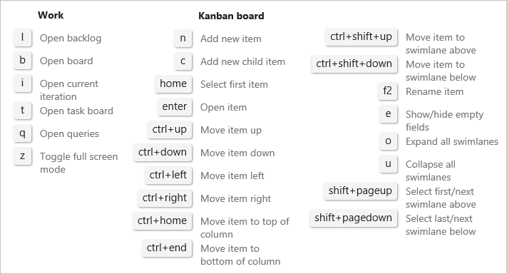

# Kanban board controls

[!INCLUDE [temp](../_shared/version-vsts-tfs-all-versions.md)]

You can quickly switch from the backlog view to the board view using the **Backlog** and **Board** links. Use the following icons to enable other user interface features. 

::: moniker range=">= tfs-2018"

> [!div class="mx-tdCol2BreakAll"]
> |Control                  | Function                      |
> |--------------------------|-------------------------------|
> | **Backlog**               | [Switch to backlog view](../backlogs/create-your-backlog.md)           |
> | **Board**    | [Switch to Kanban board view](kanban-quickstart.md)            |  
> |  | [Filter by keywords, tags, or fields](filter-kanban-board.md)     | 
> |   | [Enable live updates](kanban-basics.md#live-updates)  |
> |  | Customize the board and configure team settings: [Cards](../../boards/boards/customize-cards.md)  &#124; [Card reordering](../../boards/boards/reorder-cards.md) &#124; [Columns](add-columns.md)  &#124; [Swimlanes](expedite-work.md)  &#124; [CFD chart](../../report/dashboards/cumulative-flow.md) &#124; [Backlogs](../../organizations/settings/select-backlog-navigation-levels.md) &#124; [Working days](../../organizations/settings/set-working-days.md) &#124; [Working with bugs](../../organizations/settings/show-bugs-on-backlog.md)   |
> |  /  | Enter or exit full screen mode      |  

::: moniker-end

::: moniker range="tfs-2017"

> [!div class="mx-tdCol2BreakAll"]
> |Control                  | Function                      |
> |--------------------------|-------------------------------|
> | **Backlog**               | [Switch to backlog view](../backlogs/create-your-backlog.md)           |
> | **Board**    | [Switch to Kanban board view](kanban-quickstart.md)            | 
> |  | [Filter by keywords, tags, or fields](filter-kanban-board.md)     | 
> |   | [Enable live updates](kanban-basics.md#live-updates)  |
> |  | Customize the board and configure team settings: [Cards](../../boards/boards/customize-cards.md)  &#124; [Card reordering](../../boards/boards/reorder-cards.md) &#124; [Columns](add-columns.md)  &#124; [Swimlanes](expedite-work.md)  &#124; [CFD chart](../../report/dashboards/cumulative-flow.md) &#124; [Backlogs](../../organizations/settings/select-backlog-navigation-levels.md) &#124; [Working days](../../organizations/settings/set-working-days.md) &#124; [Working with bugs](../../organizations/settings/show-bugs-on-backlog.md)   |
> |  /  | Enter or exit full screen mode      |  

::: moniker-end

::: moniker range=">= tfs-2013 <= tfs-2015"
> [!div class="mx-tdCol2BreakAll"]
> |Control                  | Function                      |
> |--------------------------|-------------------------------|
> | **Backlog**               | [Switch to backlog view](../backlogs/create-your-backlog.md)           |
> | **Board**    | [Switch to Kanban board view](kanban-quickstart.md)            | 
> |  | [Filter by keyword or tag](filter-kanban-board.md)   |  
> |  | Customize the board and configure team settings: [Cards](../../boards/boards/customize-cards.md)  &#124; [Card reordering](../../boards/boards/reorder-cards.md) &#124; [Columns](add-columns.md)  &#124; [Swimlanes](expedite-work.md)  &#124; [CFD chart](../../report/dashboards/cumulative-flow.md) &#124; [Backlogs](../../organizations/settings/select-backlog-navigation-levels.md) &#124; [Working days](../../organizations/settings/set-working-days.md) &#124; [Working with bugs](../../organizations/settings/show-bugs-on-backlog.md)   |

::: moniker-end

::: moniker range=">= tfs-2015"

## Keyboard shortcuts

Enter **?** to open the Kanban board keyboard shortcuts.  

  
  
::: moniker-end

::: moniker range="tfs-2015"
Global keyboard shortcuts are available from TFS 2015.2 and later versions.
::: moniker-end

::: moniker range=">= tfs-2017"
[!INCLUDE [temp](../_shared/live-updates.md)]  

::: moniker-end