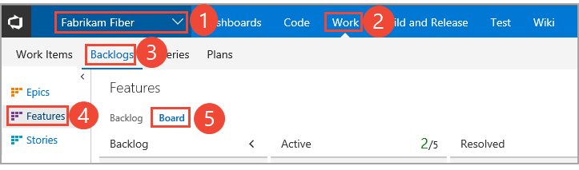
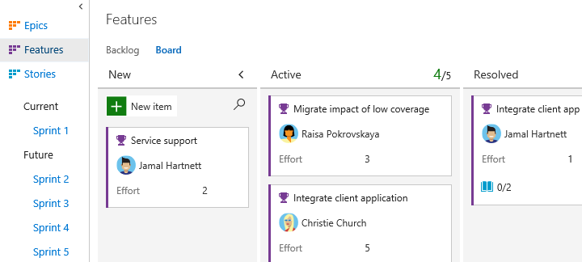
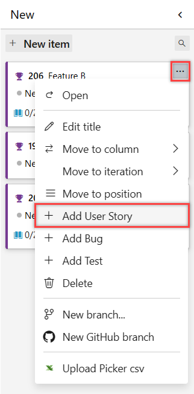

# Kanban board features and epics  

[!INCLUDE [temp](../includes/version-all.md)]

If you use Kanban to track progress on your backlog, you can also use Kanban boards to track epics and features.  

And, just as with [child task checklists for backlog items](add-task-checklists.md), you can quickly define and track the progress of child items for your features or epics. Here we see several stories defined for features, both in progress and those completed.    

In this article, you'll learn: 
>[!div class="checklist"]    
> * How to add epics and features using your portfolio backlogs    
> * Keyboard shortcuts for working with the Kanban board  

For information on managing features and epics as a list and examples for features and epics, see [Define features and epics](../backlogs/define-features-epics.md). 

::: moniker range="tfs-2013"
> [!NOTE]   
> Epic portfolio backlogs are supported in TFS 2015 and later versions. You can add them manually as described in [Add a portfolio backlog level](../../reference/add-portfolio-backlogs.md).
::: moniker-end

> [!div class="mx-imgBorder"]
> 

::: moniker range=">= tfs-2013 <= tfs-2015"
> [!NOTE]    
>Child checklists for feature and epic Kanban boards are supported from TFS 2017 and later versions.
::: moniker-end

[!INCLUDE [temp](../includes/prerequisites-kanban.md)]

## Open your Kanban board from the web portal

Your Kanban board is one of two types of boards available to you. For an overview of the features supported on each backlog and board, see [Backlogs, boards, and plans](../backlogs/backlogs-boards-plans.md). To switch to the [product backlog](../backlogs/create-your-backlog.md), choose **Stories backlog**. And, to switch to the [taskboard](../sprints/task-board.md), choose **Sprints** and then choose **Taskboard**.  

::: moniker range=">= azure-devops-2019"

1. (1) Check that you have selected the right project, (2) choose **Boards>Boards**, and then (3) select the correct team from the team selector menu. 

	  

	To choose another team's board, open the selector and select a different team or choose the :::image type="icon" source="/azure/devops/media/icons/home-icon.png" border="false"::: **Browse all team boards** option. Or, you can enter a keyword in the search box to filter the list of team backlogs for the project.

	> [!div class="mx-imgBorder"]  
	>  

	> [!TIP]    
	> Choose the :::image type="icon" source="/azure/devops/media/icons/icon-favorite-star.png" border="false"::: star icon to favorite a team board. Favorited artifacts (:::image type="icon" source="/azure/devops/media/icons/icon-favorited.png" border="false"::: favorited icon) appear at the top of the team selector list.

1. Select **Features** or **Epics** from the backlog selector menu . 

	> [!div class="mx-imgBorder"]  
	>  

::: moniker-end

::: moniker range=">=tfs-2017 <= tfs-2018"

1. To view a portfolio backlog, open your (1) project from a web browser and choose (2) **Work**, (3) **Backlogs**, (4) **Features** or **Epics**, and then (5) **Board**.  

	

	If you don't see **Work**, your screen size may be reduced. Click the three dots (:::image type="icon" source="/azure/devops/media/ellipses-reduced-screen-size.png" border="false":::, then choose **Work**, **Backlogs**, and then **Board**.   

	   

2.	To choose another team, open the project/team selector and select a different team or choose the **Browse** option.  

	> [!div class="mx-imgBorder"]  
	>   

3. Your Kanban board for the selected portfolio backlog displays.  

	   

::: moniker-end

::: moniker range="<= tfs-2015"

1. To view a portfolio backlog, open your (1) project from a web browser and choose (2) **Work**, (3) **Backlogs**, (4) **Features** or **Epics**, and then (5) **Board**.  

	

	If you don't see **Work**, your screen size may be reduced. Click the three dots (:::image type="icon" source="/azure/devops/media/ellipses-reduced-screen-size.png" border="false":::, then choose **Work**, **Backlogs**, and then **Board**.   

	   

0.	To choose another team, open the project/team selector and select a different team or choose the **Browse** option.  

	  

1. Your Kanban board for the selected portfolio backlog displays.  

	   

::: moniker-end

## Add epics or features    

Add new items to a feature or epic through the item's   :::image type="icon" source="../media/icons/actions-icon.png" border="false":::  Action menu. For descriptions of fields used to support features and epics, see [Define features and epics](../backlogs/define-features-epics.md). 

If you have a number of items to add, simply keep typing your task titles and click Enter. If you have details you want to add about to a work item, hover over the item and press Enter.  
 

## Related articles

If you're new to working with the Kanban board, see [Kanban basics](kanban-basics.md)

For additional guidance on working with a checklist on a Kanban board, see [Add task checklists](add-task-checklists.md). You can perform the same operations for the features and epics Kanban boards as you do with the Kanban board for the product backlog. This includes:    

- Mark an item as done  
- Reorder and reparent work items  

To customize the columns, swimlanes, or cards for each Kanban board, make sure you first select the board and then choose the  :::image type="icon" source="../../media/icons/blue-gear.png" border="false":::  or :::image type="icon" source="../../media/icons/gear_icon.png" border="false"::: gear icon to open the Settings dialog. See these topics for details: 

* [Add columns](add-columns.md)  
* [Customize cards](../../boards/boards/customize-cards.md)  

### REST API resources
To programmatically interact with Kanban board and other team settings, see the [REST API, Boards reference](/rest/api/azure/devops/work/boards).