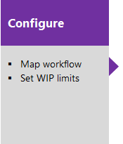
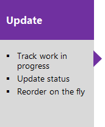
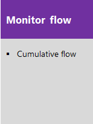
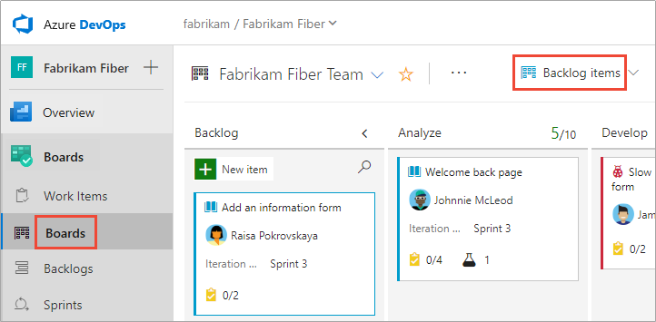

# About Boards and Kanban  

[!INCLUDE [temp](../includes/version-all.md)]
 

Collaborate with others by adding, updating, and reviewing your work items as cards on a Kanban board. 

If you're a project administrator just getting started, review the [Configure settings and manage your Azure Boards project](../get-started/manage-boards.md) to learn more about defining area and iteration paths and customizing your work item types. If you want to add another Kanban board, you do that by adding a team. For details, see [About teams and Agile tools](../../organizations/settings/about-teams-and-settings.md?toc=/azure/devops/boards/boards/toc.json&bc=/azure/devops/boards/boards/breadcrumb/toc.json).

## Use Kanban boards

Your Kanban board provides you with a visual interactive space for you and your team to plan and show progress. With it, your team can track the critical information they need by seeing which work items are in progress, where the bottlenecks are, who work is assigned to, and more.

Boards present work items as cards and support quick status updates through drag-and-drop, similar to sticky notes on a physical whiteboard. 

#### In a nutshell you use boards to: 

- Implement [Kanban methods](kanban-basics.md) 
- Define work your team is tasked with by [defining user stories, product backlog items, or requirements](kanban-quickstart.md)
- Monitor progress and update the status of work items by [drag-and-drop to a column](#update)
- [Add details and estimates](../backlogs/create-your-backlog.md#estimates) to your backlog items 
- Quickly [define tasks or child items for backlog items](add-task-checklists.md) 
- [Add, run, and update inline tests](add-run-update-tests.md) 

To get started, you'll want to follow the steps outlined below. 

> [!NOTE]  
> A Kanban board is provisioned with the addition of each project and each team. You can only create or add Kanban boards to a project by adding another team. To learn more, see [About teams and Agile tools](../../organizations/settings/about-teams-and-settings.md).

## Product and portfolio Kanban boards 

Each [product and portfolio backlog](../backlogs/backlogs-overview.md) has a corresponding Kanban board. Both backlogs and boards are associated with a team, and display work items based on the area and iteration paths selected by the team as described in [Define iteration (sprint) paths and configure team iterations](../../organizations/settings/set-iteration-paths-sprints.md). 

Each board supports many Kanban practices such as defining columns and swimlanes, setting Work-in-Progress (WIP) limits, defining the Definition of Done, and more. To get started, see [Kanban quickstart](../boards/kanban-quickstart.md). 

::: moniker range=">= azure-devops-2019"

   

::: moniker-end

::: moniker range=">= tfs-2017 <= tfs-2018"
     
::: moniker-end  
 
::: moniker range=">= tfs-2013 <= tfs-2015"    
> [!div class="mx-imgBorder"]  
>        
::: moniker-end   

## Configure and customize your Kanban board

Your Kanban board is highly configurable to support your team's workflow. Each team can configure each board in the following areas:

::: moniker range=">= tfs-2017"
- Configure boards:
	- [Add columns](add-columns.md)  
	- [Set WIP limits](wip-limits.md)  
	- [Set Definition of Done](definition-of-done.md)  
	- [Add swimlanes](expedite-work.md)
	- [Define card reordering](reorder-cards.md)
	- [Enable backlog and board levels](../../organizations/settings/select-backlog-navigation-levels.md)
	- [Working with bugs](../../organizations/settings/show-bugs-on-backlog.md)
- Configure card displays:
	- [Add or remove fields from cards](customize-cards.md)
	- [Define card styles](customize-cards.md#style-rule)
	- [Apply tag colors](customize-cards.md#color-tags)
	- [Enable/disable annotations](customize-cards.md#annotations)
	- [Define inline test behavior on cards](customize-cards.md#tests) 

::: moniker-end

::: moniker range="tfs-2015"
- Configure boards:
	- [Add columns](add-columns.md)
	- [Set WIP limits](wip-limits.md)  
	- [Set Definition of Done](definition-of-done.md)  
	- [Add swimlanes](expedite-work.md)
	- [Define card reordering](reorder-cards.md)
	- [Enable backlog and board levels](../../organizations/settings/select-backlog-navigation-levels.md)
	- [Working with bugs](../../organizations/settings/show-bugs-on-backlog.md)
- Configure card displays:
	- [Add or remove fields from cards](customize-cards.md)
	- [Define card styles](customize-cards.md#style-rule)
	- [Apply tag colors](customize-cards.md#color-tags)

::: moniker-end

::: moniker range="tfs-2013"
- [Add columns](add-columns.md)  
- [Set WIP limits](wip-limits.md)  
- [Set Definition of Done](definition-of-done.md)
- [Working with bugs](../../organizations/settings/show-bugs-on-backlog.md)
::: moniker-end

In addition to these team configurations, you can [customize a project](#customize) by adding or modifying work item types, the workflow, and add customized portfolio backlogs and boards. 

<a id="update" />

## Update work item status

::: moniker range=">= tfs-2015"

Once you've configured your Kanban board, you can add work items directly to the board. You can then update the status of work by dragging a card to another column on the Kanban board. You can even change the order of items as you move a card to a new column. For additional information, see [Workflow states and state categories](../work-items/workflow-and-state-categories.md). 

::: moniker-end

::: moniker range="tfs-2013"
Once you've configured your Kanban board, you can add work items directly to the board. You can then update the status of work by dragging a card to another column on the Kanban board. 
::: moniker-end

## Cumulative flow diagram

The Cumulative Flow Diagram (CFD) is an in-context report available for both product and portfolio backlog levels. Use this chart to monitor key metrics to fine tune your processes. 

::: moniker range=">= azure-devops-2020"

> [!div class="mx-imgBorder"]  
> 

The Average work in progress value excludes completed work items. Use the interactive controls to choose the time frame, swimlanes, and workflow states or Kanban board columns. 

::: moniker-end

::: moniker range="<= azure-devops-2019"

   

The CFD shows the count of items in each Kanban column for the past 30 weeks or less. From this chart you can gain an idea of the amount of work in progress and lead time. Work in progress counts unfinished requirements. Lead time indicates the amount of time it takes to complete a requirement from the time it was first proposed.  

::: moniker-end

By monitoring these metrics, you can gain insight into how to optimize your processes and minimize lead time.  

To learn more, see the following articles:  
- [Configure a cumulative flow chart](../../report/dashboards/cumulative-flow.md) 
- [Cumulative flow, lead time, and cycle time guidance](../../report/dashboards/cumulative-flow-cycle-lead-time-guidance.md)
- [Lead time and cycle time widgets](../../report/dashboards/cycle-time-and-lead-time.md)

## Display of leaf node work items  

[!INCLUDE [temp](../includes/display-leaf-nodes.md)]

<a id="limits-multi-team" /> 
<a id="limitations-of-multi-team-kanban-board-views" /> 

## Exercising select features with multi-team ownership 

When you share area paths across two or more teams, you'll want to understand how Azure Boards manages conflicts that can arise when exercising these features: 
- Reordering or reparenting work items on a backlog or board
- Updates made to Kanban Board Column, Done, and Lane fields when dragging items to a different column 

### Reordering and reparenting work items 

All backlogs and boards support drag-and-drop to reorder and reparent work items. Updates made to one team backlogs and boards are reflected in other team backlogs and boards that share the same area path. You may need to refresh the page to view the changes. 

You can only use drag-and-drop to reorder or reparent work items assigned to area paths selected for your team. When the **Parents** view option is enabled, work items may appear on your backlog that your team doesn't own. Anything that appears with the :::image type="icon" source="../../media/icons/info.png" border="false"::: information icon can't be reordered nor reparented as it is owned by another team.  
 
:::image type="content" source="../plans/media/config-teams/information-message-owned-by-other-team.png" alt-text="Screenshot of information message on team ownership.":::

### Kanban board column updates  

Because each team can customize the Kanban board columns and swimlanes, the values assigned to Kanban board fields may differ from what you expect when another team updates the work item from a different board. Even if the management team and the feature teams configure their Feature [Kanban board columns](add-columns.md) with identical workflow mapping, updating work items on one team's Kanban board won't be reflected on another team's Kanban board. Only when the work item moves to a column that maps to a workflow state does the card column reflect the same on all boards.

By design, the team with the longest area path wins the conflict and determines the values for the Kanban **Board Column**, **Board Column Done**, and **Board Lane** fields. If the shared area shared area paths are of equal depth, the results are non-deterministic.  
 
::: moniker range=">= azure-devops-2019"
 The primary work around for this issue is to maintain single ownership of work items by [Defining area paths and assign to a team](../../organizations/settings/set-area-paths.md). Another option is to add custom workflow states which all teams can use. For details, see [Customize the workflow (Inheritance process)](../../organizations/settings/work/customize-process-workflow.md). 

::: moniker-end

::: moniker range="<= tfs-2018"
 The primary work around for this issue is to maintain single ownership of work items by [Defining area paths and assign to a team](../../organizations/settings/set-area-paths.md). Another option is to add custom workflow states which all teams can use. For details, see [Change the workflow for a work item type](../../reference/xml/change-workflow-wit.md).
::: moniker-end
 

## Permissions and access

As a member added to the Contributors group of a project, you can use most features provided under **Boards** or **Work**. Users with Basic access have full access to all features. Users with Stakeholder access are limited to certain features. For details, see [Stakeholder access quick reference](../../organizations/security/stakeholder-access.md). 

To learn more about permissions and access, see [Permissions and access for work tracking](../../organizations/security/permissions-access-work-tracking.md) and [Stakeholder access quick reference](../../organizations/security/stakeholder-access.md).   

To add users to a project, see [Add users to a project or team](../../organizations/security/add-users-team-project.md).

<a id="customize" />

## Customize your project and boards 

::: moniker range=">= azure-devops-2019" 

If you need more than three board levels, you can add more. To learn how, see <a href="../../organizations/settings/work/customize-process-backlogs-boards.md" data-raw-source="[Customize your backlogs or boards for a process](../../organizations/settings/work/customize-process-backlogs-boards.md)">Customize your backlogs or boards for a process</a>. 

You can also add or modify the fields defined for a work item type (WIT), add a custom WIT, or modify the workflow. To learn more, see [Customize an inheritance process](../../organizations/settings/work/inheritance-process-model.md). 

::: moniker-end
 
::: moniker range="< azure-devops-2019" 

If you need more than three board levels, you can add more. To learn how, see [Add portfolio backlogs](../../reference/add-portfolio-backlogs.md).

You can also add or modify the fields defined for a work item type (WIT), add a custom WIT, or modify the workflow.  To learn more, see [Customize the On-premises XML process model](../../reference/on-premises-xml-process-model.md). 

::: moniker-end

## Try this next  

Take these tools for a test run by [signing up for free](../get-started/index.md). From there, you're ready to add items to your Kanban board and customize it. 

> [!div class="nextstepaction"]
> [Kanban quickstart](kanban-quickstart.md)  
  

## Related articles  

- [Kanban key concepts](kanban-key-concepts.md) 
- [Web portal navigation](../../project/navigation/index.md) 
- [Backlogs, portfolios, and Agile project management](../backlogs/backlogs-overview.md) 
- [About work items](../work-items/about-work-items.md)  
- [What is Agile?](/devops/plan/what-is-agile)   
- [What is Agile development?](/devops/plan/what-is-agile-development)  
 

 