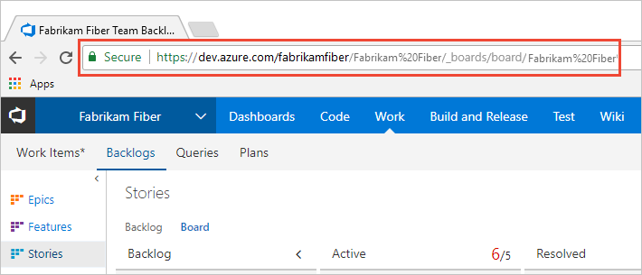

# Start using your Kanban board

[!INCLUDE [temp](../_shared/version-vsts-tfs-all-versions.md)]

Your Kanban board turns your backlog into an interactive signboard, providing a visual flow of work. As work progresses from idea to completion, you update the items on the board. Each column represents a work stage, and each card represents a backlog item, user story, or bug at that stage of work. 

> [!div class="mx-imgBorder"]  
>  

User stories and bugs correspond to types of work items. You use [work items](../backlogs/add-work-items.md) to share information, assign work to team members, update status, track dependencies, and more.

[!INCLUDE [temp](../_shared/prerequisites.md)]

## Add a Kanban board

Each Kanban board is associated with a team and a work item type. For the Agile process, the three boards are Stories, Features, and Epics.

When you add a team, you add a number of team assets which a team admin can  configure to support the way the team works. To add a set of Kanban boards to support a new team, [add a team](../../organizations/settings/add-teams.md). 

::: moniker range="vsts" 
To add a board to support an additional portfolio backlog, see [Customize your backlogs or boards](../../organizations/settings/work/customize-process-backlogs-boards.md).
::: moniker-end 
::: moniker range=">= tfs-2013 <= tfs-2018"   
To add a board to support an additional portfolio backlog, see [Add a portfolio backlog level](../../reference/add-portfolio-backlogs.md).
::: moniker-end   

[!INCLUDE [temp](../_shared/open-kanban-board.md)] 

## Add work items 

0. To add a work item, simply choose the  plus sign, enter a title, and then press Enter on your keyboard. 

# [New navigation](#tab/new-nav)

::: moniker range="vsts"

To add a work item, simply choose the  plus sign, enter a title, and then press Enter on your keyboard. 

> [!div class="mx-imgBorder"]  
>  

The system automatically saves the work item with the title you entered. You can add as many work items you want using this method. 

::: moniker-end

::: moniker range=">= tfs-2013 <= tfs-2018"
[!INCLUDE [temp](../_shared/new-agile-hubs-feature-not-supported.md)]
::: moniker-end

# [Previous navigation](#tab/previous-nav)

To add a work item, simply choose the  plus sign, enter a title, and then press Enter on your keyboard. 

> [!div class="mx-imgBorder"]  
> 

The system automatically saves the work item with the title you entered. You can add as many work items you want using this method. 

---

To add details to any work item, choose the title. Or, you can directly modify any field that displays. For example, you can reassign a work item by choosing the **Assigned To** field. For a description of each field, see [Create your backlog, Add details and estimates](../backlogs/create-your-backlog.md#estimates). 

To customize the set of fields displayed on the card, see [Customize cards](../../boards/boards/customize-cards.md).

## Update status via drag-and-drop

As work completes in one stage, update the status of an item by dragging and dropping it to a downstream stage. 

  

::: moniker range=">= tfs-2015"
## Update fields from the card 

You can quickly update a field or reassign ownership directly from the board. If the field you want to update isn't showing, then [customize the card to show it](../../boards/boards/customize-cards.md). 

::: moniker-end

::: moniker range="vsts"
## Invite others to work on your Kanban board 

All members of a project will be able to view and contribute to your Kanban board. To invite users to start contributing, copy the URL of your Kanban board and email it to those you want to invite to your project. 

 

To add users to your project, see [Add users to a project](../../organizations/security/add-users-team-project.md)   
::: moniker-end

## Try this next 

To get the full power of the Kanban board working for you, you'll want to configure it to map the flow of work and set WIP limits for your team. To configure the Kanban board, you must be [added as a team administrator](../../organizations/settings/add-team-administrator.md) or be a member of the Project Administrators group. If you're the organization owner or creator of the project, then you'll have these permissions. 

> [!div class="nextstepaction"]
> [Kanban basics](kanban-basics.md)  

 
 

