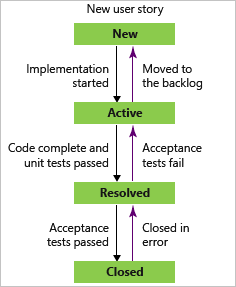
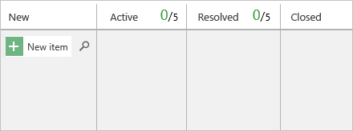

# Use your Kanban board

[!INCLUDE [version-lt-eq-azure-devops](../../includes/version-lt-eq-azure-devops.md)]

Your Kanban board turns your backlog into an interactive signboard, which provides a visual flow of work. As work progresses from idea to completion, you update the items on the board. Each column represents a work stage. Each card represents a backlog item, user story, or bug at that stage of work. 

To maximize a team's ability to consistently deliver high-quality software, Kanban emphasizes two main practices. The first is to visualize the flow of work. This practice requires you to map your team's workflow stages and configure your Kanban board to match. The second, constrain the amount of work in progress, requires you to set work-in-progress (WIP) limits. You're then ready to track progress on your Kanban board and monitor key metrics to reduce lead or cycle time.

> [!NOTE]  
> Both Kanban boards and Taskboards support visualizing the flow of work and monitoring metrics to optimize that flow. Kanban boards track requirements, are sprint-independent, and provide a cumulative flow chart for monitoring progress. Each sprint is associated with a Taskboard that supports tracking tasks defined for the sprint. You can monitor progress through capacity charts and the sprint burndown chart. For guidance on using the Taskboard, see [Update and monitor your Taskboard](../sprints/task-board.md).

[!INCLUDE [temp](../includes/prerequisites-kanban.md)]

[!INCLUDE [temp](../includes/open-kanban-board.md)] 

## Map the flow of how your team works

When you first open your Kanban board, you have one column for each [workflow state](../work-items/guidance/choose-process.md#workflow-states). Your actual columns vary based on the [process](../work-items/guidance/choose-process.md) used to create your project.

1. Identify your team's workflow stages. Your team's workflow stages most likely don't map to the default states. For your team to have a functional board, identify the stages of workflow process and then configure the board to match.
   For example, for user stories, the **New**, **Active**, **Resolved**, and **Closed** states track progress from idea to completion.
    :::row:::
       :::column span="1":::
       
       :::column-end:::
       :::column span="2":::
       
       :::column-end:::
    :::row-end:::
    
1. Add and change your Kanban columns to map to your workflow stages. Keep the number of columns to a minimum while still representing the key handoffs that occur for your team. For more information, see [Manage columns](add-columns.md).

    :::image type="content" source="media/ALM_KB_Board2.png" alt-text="Screenshot showing Kanban board, Columns customized.":::

## Set WIP limits

Your team sets WIP limits for each workflow stage. While setting WIP limits is easy, adhering to them takes a team commitment. Teams new to Kanban may find WIP limits counterintuitive and uncomfortable. This single practice, however, has helped teams identify bottlenecks, improve their process, and increase the quality of software they ship.

1. Start with number limits that don't exceed two or three items per team member working within a stage. Respecting WIP limits means teams don't pull items into a column if doing so causes the number of items in the column to exceed the WIP limit.

    When they do exceed the limit, the column count displays red. Teams can use this color as a signal to focus immediately on activities to bring the number of items in the column down.

    

For more information, see [Set WIP limits](wip-limits.md).

## Add work items 

::: moniker range=">= azure-devops-2019"
To add a work item, select the :::image type="icon" source="../media/icons/add_icon.png" border="false"::: plus sign, enter a title, and then press Enter. 
::: moniker-end

::: moniker range=">= azure-devops-2020"
> [!div class="mx-imgBorder"]  
>  
::: moniker-end

::: moniker range="azure-devops-2019"
> [!div class="mx-imgBorder"]  
>  
::: moniker-end

::: moniker range=">= azure-devops-2019"
The system automatically saves the work item with the title you entered. You can add as many work items you want by using this method. 

::: moniker-end

::: moniker range="tfs-2018"
To add a work item, select the :::image type="icon" source="../media/icons/add_icon.png" border="false"::: plus sign, enter a title, and then press Enter. 

> [!div class="mx-imgBorder"]  
> 

The system automatically saves the work item with the title you entered. You can add as many work items you want by using this method. 
::: moniker-end

To add details to any work item, select the title. Or, you can directly modify any field that displays. For example, you can reassign a work item by selecting **Assigned To**. For a description of each field, see [Create your backlog, Add details and estimates](../backlogs/create-your-backlog.md#estimates). 

[!INCLUDE [temp](../includes/note-user-assigned.md)]

## Update the status of a work item 

As work completes in one stage, update the status of an item by dragging it to a downstream stage. 

[!INCLUDE [temp](../includes/note-closed-items.md)]

::: moniker range="< azure-devops-2022"

> [!NOTE]   
> Users assigned Stakeholder access aren't able to use the drag-and-drop feature to update status. 

::: moniker-end

  

## Update fields from the card 

You can quickly update a field or reassign ownership directly from the board. If the field you want to update isn't showing, then customize the card, so it displays. For more information, see [Customize cards](../../boards/boards/customize-cards.md). 

### Filter your board with keywords, field values, or tags

You can apply filters interactively to focus on a subset of work. For example, you can filter the board to focus on work assigned to at team member for a specific sprint. To start filtering, choose **Filter** :::image type="icon" source="../../media/icons/filter-icon.png" border="false":::. To learn more about applying filters, see [Interactively filter your backlogs, boards, and plans](../backlogs/filter-backlogs-boards-plans.md).

::: moniker range="<= azure-devops-2019"

::: moniker-end

For example, in the following image, we filtered all items assigned to Jamal and Raisa.

::: moniker range=">= azure-devops-2020"
> [!div class="mx-imgBorder"]  
> 
::: moniker-end

::: moniker range="< azure-devops-2020"

::: moniker-end

## Track work in progress

Once you&#39;ve configured your Kanban board to match how your team works, you&#39;re ready to use it.

Here are a few things you can do. See at a glance the estimated size of work for each item that displays at the bottom right of each card. Add items to your backlog in the first column. When priorities change, move items up and down within a column. And, as work completes in one stage, update the status of an item by moving it to a downstream stage.

Also, you can quickly update a field or reassign ownership directly from the board.

Updating your Kanban board as work progresses helps keep you and your team in sync. Also, you can see and share the value stream your team is delivering to customers.

[!INCLUDE [temp](../includes/note-kanban-boards-teams.md)]

## Invite others to work on your Kanban board 

All members of a project can view and contribute to your Kanban board. To invite users to contribute, copy the URL of your Kanban board and email it to people you want to invite to your project.

::: moniker range=">= azure-devops-2020"
:::image type="content" source="media/quickstart/kanban-board-url-s155.png" alt-text="Screenshot showing red square surrounding the URL for the Kanban board.":::
::: moniker-end

::: moniker range="azure-devops-2019"
:::image type="content" source="media/quickstart/kanban-board-url.png" alt-text="Screenshot showing red square surrounding the Kanban board URL.":::
::: moniker-end

::: moniker range="tfs-2018"
:::image type="content" source="media/kanban-basics-url.png" alt-text="Screenshot showing highlighted URL for the Kanban board.":::
::: moniker-end

To add users to your project, see [Add users to a project](../../organizations/security/add-users-team-project.md).   

## Enable live updates 

Enable live updates to automatically refresh your Kanban board when changes occur. With live updates enabled, you no longer have to press **F5** to see the latest changes. To view or modify work items, **View work items in this node** and **Edit work items in this node** permissions must be set to **Allow**. By default, the Contributors group has this permission set. Users with Stakeholder access for a private project can add work items and update status through drag-and-drop, but can't update fields displayed on cards. They can add tasks and change task status.

::: moniker range=">= azure-devops-2019"
Choose the :::image type="icon" source="../../media/icons/view-options-icon.png" border="false"::: view options icon and move the slider for **Live updates** to On.  

:::image type="content" source="media/turn-live-updates-on-agile.png" alt-text="Screenshot showing moving the slider for Live updates to On.":::
::: moniker-end

::: moniker range="tfs-2018"
Choose the :::image type="icon" source="../media/icons/live-updates-icon.png" border="false"::: **Live updates** icon.  

:::image type="content" source="media/turn-live-updates-on-agile.png" alt-text="Screenshot showing Kanban board, live updates icon.":::

As one team member updates the status of a work item, other team members see those updates in real time as they occur.  

  

::: moniker-end

## Monitor metrics

As with most Agile practices, Kanban encourages monitoring key metrics to fine tune your processes. After your team has used the Kanban board for several weeks, check out your Cumulative Flow Diagram (CFD).

::: moniker range=">= azure-devops-2020"
Choose the **Analytics** tab, and then choose **View full report** for the CFD as shown in the following image. 

:::image type="content" source="media/quickstart/open-analytics.png" alt-text="Screenshot showing highlighted Analytics tab.":::

The Average work in progress value excludes completed work items. 

Use the interactive controls to choose the time frame, swimlanes, and workflow states or Kanban board columns. Hover over a point in time to show how many work items are in a particular state. The default settings for the Cumulative Flow Diagram-Average work in progress includes completed work items since the team started tracking work. 

For example, On July 3, 101 items were in a Research state.

:::image type="content" source="../../report/dashboards/media/cfd/analytics-cfd-azure-devops.png" alt-text="Screenshot showing opened CFD Analytics.":::

The selections you make are only set for you, and persist across sessions until you change them. 
::: moniker-end

::: moniker range="<= azure-devops-2019"
Choose the chart as shown in the following image. 

:::image type="content" source="media/kanban-basics-open-cfd.png" alt-text="Screenshot showing the cumulative flow diagram square, surrounded by red box.":::

The CFD shows the count of items in each Kanban column for the past 30 weeks or less. From this chart, you can gain an idea of the amount of work in progress and lead time. Work in progress counts unfinished requirements. Lead time indicates the amount of time it takes to complete a requirement from the time it was first proposed.  

:::image type="content" source="media/ALM_KB_CumulativeFlow.png" alt-text="Screenshot showing Kanban board, cumulative flow diagram.":::
::: moniker-end

By monitoring these metrics, you can gain insight into how to optimize your processes and minimize lead time. For more information, see [Configure a cumulative flow chart](../../report/dashboards/cumulative-flow.md). 

::: moniker range=">= azure-devops-2019"
You can also add Analytics widgets to your dashboard. The Analytics Service is in preview and provides access to several widgets. For more information, see the following articles: 
- [Widgets based on the Analytics Service](../../report/dashboards/analytics-widgets.md)
- [Add a widget to a dashboard](../../report/dashboards/add-widget-to-dashboard.md)
- [What is the Analytics Service?](../../report/powerbi/what-is-analytics.md)
::: moniker-end

::: moniker range=">= azure-devops-2019"
## Can I view a Kanban board of work items defined by a query?  
The [Query Based Boards](https://marketplace.visualstudio.com/items?itemName=realdolmen.EdTro-AzureDevOps-Extensions-QueryBasedBoards-Public) Marketplace extension supports viewing a flat-list query of work items as a Kanban board. The query can contain different work item types and work items defined in different projects.  
::: moniker-end

## Next steps 

> [!div class="nextstepaction"]
> [Expedite work using swimlanes](expedite-work.md)  

## Related articles

- [Filter backlogs, boards, queries, and plans](../backlogs/filter-backlogs-boards-plans.md)
- [Kanban key concepts](kanban-key-concepts.md)
- [Kanban best practices](best-practices-kanban.md)
- [Cumulative flow diagram](../../report/dashboards/cumulative-flow.md)
- [Cumulative flow, lead time, and cycle time guidance](../../report/dashboards/cumulative-flow-cycle-lead-time-guidance.md)
