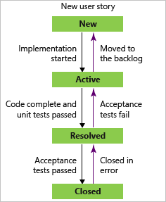
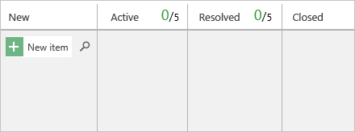

# Use your board

[!INCLUDE [version-lt-eq-azure-devops](../../includes/version-lt-eq-azure-devops.md)]

Boards provide an intuitive, visual way to manage your projects, track work items, and collaborate with your team. If you have a project, you already have a board. This quickstart shows the most common board tasks so you can get productive fast.

What you'll learn:
- How to add and update work items on your board.
- How to map your team's workflow to columns and set WIP limits.
- How to filter, invite teammates, and monitor basic analytics.

Quick steps:
1. Open your team's board.
2. Add work items (use the plus button).
3. Move items across columns to update status.
4. Set WIP limits and use filters to focus work.

> [!NOTE]  
> You can only create or add boards to a project by adding another team. Boards are created when a project or team is created. For more information, see [About teams and Agile tools](../../organizations/settings/about-teams-and-settings.md).

## Prerequisites

[!INCLUDE [temp](../includes/prerequisites-kanban.md)]

[!INCLUDE [enable-mcp-server](../includes/enable-mcp-server.md)]

[!INCLUDE [temp](../includes/open-kanban-board.md)]

## Map the flow of how your team works

When you first open your board, there's one column for each [workflow state](../work-items/guidance/choose-process.md). Your actual columns vary based on the [process](../work-items/guidance/choose-process.md) used to create your project.

1. Identify your team's workflow stages—they often don't match the default states. Configure the board so it reflects the true handoffs your team uses.
   
   For example, for user stories, the **New**, **Active**, **Resolved**, and **Closed** states track progress from idea to completion.

    :::row:::
       :::column span="1":::
       
       :::column-end:::
       :::column span="2":::
       
       :::column-end:::
    :::row-end:::
    
2. [Manage your columns](add-columns.md) so they match your workflow stages. Keep the number of columns minimal while still representing the key handoffs for your team.

    :::image type="content" source="media/ALM_KB_Board2.png" alt-text="Screenshot showing board, Columns customized.":::

## Set WIP limits

Set work in progress (WIP) limits for each workflow stage so that when items exceed the limit, the column count displays as red. Teams use that visual signal to immediately address bottlenecks. For more information, see [Set WIP limits](wip-limits.md).

:::image type="content" source="media/alm-kb-wip-limits.png" alt-text="Screenshot showing WIP limit reached with red numbering.":::

## Track work in progress

See the estimated size of work for each item at the bottom right of each card. Add items to your backlog in the first column. When priorities change, move items up and down within a column. As work completes in one stage, update the status by moving the card to a downstream stage.

:::image type="content" source="media/alm-cc-move-card.png" alt-text="Screenshot showing moving a card on board to update status.":::

Update your board frequently to keep the team in sync and to make the value stream visible.

[!INCLUDE [temp](../includes/note-kanban-boards-teams.md)]

## Add work items

To add a work item, select the plus sign (the add icon), type a title, and press **Enter**. The system saves the work item automatically.

::: moniker range="<=azure-devops"
:::image type="content" source="media/quickstart/add-new-item-agile-s155.png" alt-text="Screenshot showing adding a new item on a board, new nav.":::
::: moniker-end

You can add as many work items as you want using this method. To add or edit details for any work item, select the title. You can also directly modify any field that appears on the card (for example, change **Assigned To**). For a description of each field, see [Create your backlog, Add details, and estimates](../backlogs/create-your-backlog.md#estimates). You can also [add tasks or child items as checklists on your cards](add-task-checklists.md).

[!INCLUDE [temp](../includes/note-user-assigned.md)]

## Update work item status

As work progresses, update the status of an item by dragging it to a downstream column.

[!INCLUDE [note-closed-items](../includes/note-closed-items.md)]

:::image type="content" source="media/alm-cc-move-card.png" alt-text="Screenshot showing update status of work item with arrow showing movement of card.":::

## Update card fields

Quickly update a field or reassign ownership directly from the board. If the field you want to update isn't showing, customize the card to display it. You can also show other work item types, such as change requests, incidents, issues, or custom types. For more information, see [Customize cards](../../boards/boards/customize-cards.md) and [About configuring and customizing Azure Boards](../configure-customize.md).

:::image type="content" source="media/alm-cc-update-card-field.png" alt-text="Screenshot showing update of card field.":::

### Filter your board with keywords, field values, or tags

Apply interactive filters to focus on a subset of work. For example, filter the board to show work assigned to a specific team member during a sprint. To start filtering, choose **Filter** :::image type="icon" source="../../media/icons/filter-icon.png" border="false":::. For more information, see [Filter your backlogs, boards, and plans](../backlogs/filter-backlogs-boards-plans.md).

In the following example image, we filtered items assigned to Jamal and Raisa.

::: moniker range="<=azure-devops"
:::image type="content" source="../backlogs/media/filter-boards/filter-kb-filters-chosen-services.png" alt-text="Screenshot showing filtering on assignment field.":::
::: moniker-end

## Invite others to work on your board

All members of a project can view and contribute to your board. To invite users to contribute, copy the URL of your board and send it to them.

::: moniker range="<=azure-devops"
:::image type="content" source="media/quickstart/kanban-board-url-s155.png" alt-text="Screenshot showing red square surrounding the URL for the board.":::
::: moniker-end

To add users to your project, see [Add users to a project](../../organizations/security/add-users-team-project.md).

## Monitor metrics

After your team uses the board for several weeks, review key metrics like the Cumulative Flow Diagram (CFD) to optimize your process.

::: moniker range="<=azure-devops"
Choose the **Analytics** tab, and then choose **View full report** for the CFD as shown in the following image. 

:::image type="content" source="media/quickstart/open-analytics.png" alt-text="Screenshot showing highlighted Analytics tab.":::

Use the interactive controls to choose the time frame, swimlanes, and workflow states or board columns. Hover over a point on the CFD to see how many items were in a particular state at that time.

The following example shows that on July 3, 101 items were in a *Researching* state.

:::image type="content" source="../../report/dashboards/media/cfd/analytics-cfd-azure-devops.png" alt-text="Screenshot showing opened CFD Analytics.":::

> [!TIP]
> Your selections persist across sessions until you change them.

::: moniker-end

By monitoring these metrics, you can find opportunities to reduce lead time. For more information, see [Configure a cumulative flow chart](../../report/dashboards/cumulative-flow.md). 

You can also add Analytics widgets to your dashboard. The Analytics Service is in preview and provides access to several widgets. For more information, see:
- [Widgets based on the Analytics Service](../../report/dashboards/analytics-widgets.md)
- [Add a widget to a dashboard](../../report/dashboards/add-widget-to-dashboard.md)
- [What is the Analytics Service?](../../report/powerbi/what-is-analytics.md)

## Can I view a board of work items defined by a query?  
The [Query Based Boards](https://marketplace.visualstudio.com/items?itemName=realdolmen.EdTro-AzureDevOps-Extensions-QueryBasedBoards-Public) Marketplace extension supports viewing a flat-list query of work items as a board. The query can contain different work item types and work items defined in different projects.  

## Next step

> [!div class="nextstepaction"]
> [Expedite work using swimlanes](expedite-work.md)  

## Related content

- [Filter backlogs, boards, queries, and plans](../backlogs/filter-backlogs-boards-plans.md)
- [Cumulative flow diagram](../../report/dashboards/cumulative-flow.md)
- [Cumulative flow, lead time, and cycle time guidance](../../report/dashboards/cumulative-flow-cycle-lead-time-guidance.md)
