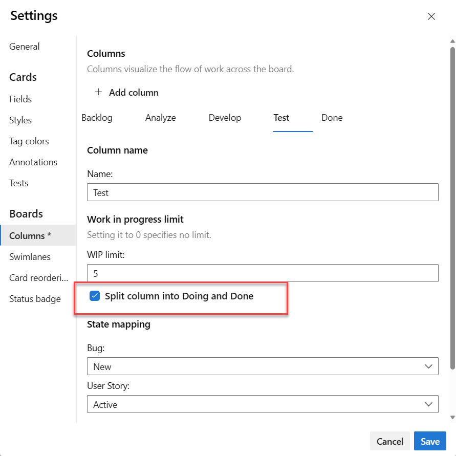

# Split columns on your Kanban board to show work in progress

[!INCLUDE [version-lt-eq-azure-devops](../../includes/version-lt-eq-azure-devops.md)]  

You use your Kanban board to visualize the flow of work, and monitor how items are or aren't progressing. Because each column corresponds to a stage of work, you can quickly see the number of items in progress at each stage.  

However, a lag often exists between when work gets moved into a column and when work actually starts. To counter that lag and reveal the actual state of work in progress, you can turn on split columns.  

When split, each column contains two subcolumns, **Doing** and **Done**.

  

Split columns let your team implement a pull mechanism within the workflow process. Without split columns, teams push work forward, to signal that they've completed their stage of work. However, pushing it to the next stage doesn't necessarily mean that a team member immediately starts work on that item.  

By contrast, with split columns, your team knows exactly how many items sit idle, waiting for work to begin. You now have greater visibility into the quantity of items that sit idle at each stage throughout your workflow process. 

[!INCLUDE [temp](../includes/prerequisites-team-settings.md)]

## Move items into the Doing and Done columns 

With split columns turned on, you update status of items on the Kanban board in the same way you have before. However, now when you've completed work on an item, you move it into Done, instead of a downstream column. When the next team member becomes free to work on the next high priority item, they pull it into Doing and reassigns it to themself.  

For example, as a team member completes their coding task, they move the item into Done under the Develop column. When the tester is ready to test the item, they pull it into Doing under the Test column.  

> [!div class="mx-imgBorder"]  
> 

If you're new to Kanban, review [Kanban basics](kanban-basics.md)  to get an overview of how to access your board and implement Kanban.

<a id="id-bottlenecks" />

## Identify bottlenecks to drive toward a perfect flow scenario
How can you use split columns to improve workflow?  

Split columns provide you even greater insight into how many items sit idle in a Done column. Your team can readily see when items pile up, which signal a potential bottleneck.   

  

By reviewing the frequency of pile ups and where they occur, your team can adjust their processes to eliminate the bottlenecks. Workflow processes that incur no or few bottlenecks correspond to perfect flows. No item sits in a queue for any 

## Choose which columns you want to split  

Now that you understand how your team can use split columns, here's how to turn them on. Before you split columns, ensure you [mapped each stage of your team's process to a Kanban column](add-columns.md).

Only split columns where clear hand-offs exist and you want teams to pull the item into the next stage. 

::: moniker range=">= azure-devops-2019"

1. [Open your Kanban board](kanban-quickstart.md). If you're not a team admin, [get added as one](../../organizations/settings/add-team-administrator.md). Only team and project admins can customize the Kanban board.

2. Choose the  :::image type="icon" source="../../media/icons/blue-gear.png" border="false":::  gear icon to configure the board and set general team settings.  

	> [!div class="mx-imgBorder"]
	>   

3. Choose **Columns** and then choose the column tab that you want to split. Add a check mark in the checkbox to cause the column to split.  

	> [!NOTE]   
	> You'll see different column titles and choices based on the [process](../work-items/guidance/choose-process.md) used to create your project and whether your team has chosen to [treat bugs like requirements or like tasks](../../organizations/settings/show-bugs-on-backlog.md).  
	
	> [!div class="mx-imgBorder"]
	>   

4. When you're done, choose **Save and close**.

	> [!TIP]    
	> You can filter queries and create charts using the [Board Column Done field](../queries/query-by-workflow-changes.md#kanban_query_fields). 

::: moniker-end 

::: moniker range="tfs-2018" 
1. [Open your Kanban board](kanban-quickstart.md). If you're not a team admin, [get added as one](../../organizations/settings/add-team-administrator.md). Only team and project admins can customize the Kanban board.

1. Choose :::image type="icon" source="../../media/icons/team-settings-gear-icon.png" border="false"::: gear icon to open the common configuration settings dialog for the Kanban board.  

	  

2. Choose **Columns** and then choose the column tab that you want to split. Place a check in the checkbox to cause the column to split.   

	> [!NOTE]   
	> You'll see different column titles and choices based on the [process](../work-items/guidance/choose-process.md) used to create your project and whether your team has chosen to [treat bugs like requirements or like tasks](../../organizations/settings/show-bugs-on-backlog.md).  

	> [!div class="mx-imgBorder"]
	>   

3. When done with your changes, choose **Save**.  

	> [!TIP]    
	> You can filter queries and create charts using the [Board Column Done field](../queries/query-by-workflow-changes.md#kanban_query_fields).  
   ::: moniker-end

## List work items in a Doing or Done column 

You can query for work items in a split column using the **Board Column Done** field. This field takes of a value of False when in the Doing column and True when in the Done column. 

For examples on querying Board columns, see [Query by assignment or workflow changes](../queries/query-by-workflow-changes.md#kanban_query_fields)

## Related articles   

- [Add columns](add-columns.md)  
- [Query by assignment or workflow changes](../queries/query-by-workflow-changes.md)
- [Work in Progress limits](wip-limits.md)  
- [Set up swimlanes](expedite-work.md)   
- [Definition of Done](definition-of-done.md)  
- [Customize cards](../../boards/boards/customize-cards.md)   
