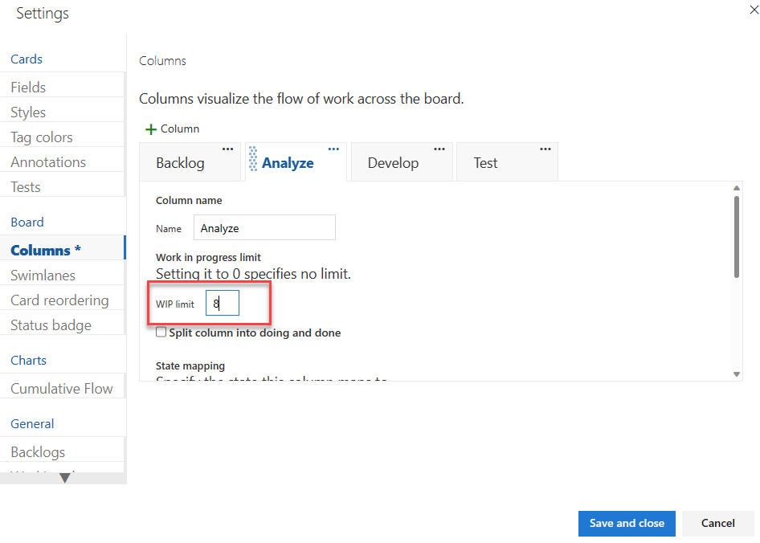

# Set Work in Progress limits in Azure Boards

[!INCLUDE [version-lt-eq-azure-devops](../../includes/version-lt-eq-azure-devops.md)]

An essential Kanban practice&mdash;Work in Progress limits, referred to as "WIP limits"&mdash;constrains the amount of work your team undertakes at each work stage. It's designed to focus your team on completing items before starting new work. While counter-intuitive at first, many teams find WIP limits helps them increase their productivity and improve their software quality.  

You define WIP limits for each work stage, corresponding to each intermediate column. The limit sets a soft constraint on the number of items allowed within the column. Nothing actually prevents you from moving more items into the column and exceeding the limit. Your Kanban board shows the count of items at each stage next to each limit.

:::image type="content" source="media/WIP_1.png" alt-text="Example image showing Kanban board columns with WIP limits."::: 

While [setting WIP limits](#Set) is simple, adhering to the limits takes a team commitment. Successful adoption of WIP limits involves a culture change. It moves teams from a focus on individual productivity to one of team productivity. 

[!INCLUDE [temp](../includes/prerequisites-team-settings.md)]

<a id="Initial WIP" />

## Determine initial WIP limits

To get started, have your team determine the initial WIP limits to set and how to use and monitor them. Few rules apply to what numbers to set as they can vary based on several factors. Here are two guidelines to help you determine what limits to set:

* Set limits based on current works in progress. Count the items present in your existing Kanban columns.

* Set limits that don't exceed two or three items per team member that works within a stage. For example, if you have three team members and each team member can work on no more than two tasks at a time, the resulting WIP limit is 6 (= 3 developers X 2 tasks/developer).

Starting low may help your team discover bottlenecks more quickly and identify process issues to address.

After you've defined an initial set of WIP limits, you'll likely want to fine tune them as your project progresses.

If you're new to Kanban, review [Kanban basics](kanban-basics.md) to get an overview of how to access your board and implement Kanban.

<a id="Keep within WIP" />

## Keep within WIP limits

After you've set your WIP limits, you'll want to track how well your team keeps within the limits. 

Respecting WIP limits means teams don't pull items into a column if doing so causes the number of items in the column to exceed the column limit. When they do, your Kanban board provides immediate feedback. This feedback should act as a signal to the team to focus immediately on activities to reduce the number of items in the column.

:::image type="content" source="media/WIP_2.png" alt-text="Example image of a Kanban board showing a column over the WIP limit.":::

Although simple in theory, keeping within WIP limits can force individuals, teams, and organizations out of their comfort zone. Team members who like to multitask might feel constrained. Others might find themselves without work as they wait for work to complete at an upstream stage. 

To gain the advantages of constraining work-in-progress, have your team meet frequently to discuss the process changes taking place. Consider hosting discussions around some of the [challenges and solutions to support successful implementation of WIP limits](best-practices-kanban.md#practices), in the following sections.

<a id="Keep within WIP" />

## Identify bottlenecks

To optimize the flow of value, you naturally want to identify and eliminate bottlenecks. Bottlenecks indicate waste exists in the overall workflow process. 

By monitoring your Kanban board over time, you can learn where bottlenecks occur. When several items sit in a column unworked for several days, a bottleneck has occurred. Bottlenecks typically occur when WIP limits are too high. However, no bottlenecks could indicate that WIP limits are too low. 

The free eBook, [Kanban and Scrum - making the most of both](https://www.infoq.com/minibooks/kanban-scrum-minibook), provides this guidance:

*Too low WIP limit => idle people => bad productivity*
*Too high WIP limit => idle tasks => bad lead time* 

Taking periodic snapshots of your Kanban board can visually catalog where work flows smoothly and where bottlenecks appear.

:::image type="content" source="media/WIP_3.png" alt-text="Screenshot of example snapshots.":::

Such snapshots can show your team the following information:

* How many items on average exist within a workflow stage/column  
* How many items are being worked versus team members who work within a workflow stage/column  
* How many and which items remained in a workflow stage/column for long periods of time  
* How many items did the team complete at the end of a one, two, or three week period 

<a id="Eliminate waste" />

## Eliminate waste

Because bottlenecks signal waste in your workflow process, you need to identify the source of the waste. Kanban defines waste as anything not strictly needed to produce desired outcomes.

Common wastes in software development include:

* Unused code or features
* Defects leading to rework
* Delays or time spent waiting for something
* Handoffs from one person, team, or business process to another
* Insufficient requirements
* Slow or poor communication

Eliminating waste calls for team discussions to identify causes and solutions acceptable to the team. Along with addressing the [challenges and solutions posed by WIP limits](best-practices-kanban.md#practices), the team may decide to adjust their workflow process or WIP limits. 

<a id="Set" />

## Set WIP limits

With an understanding of how you want to use WIP limits, here's how you set them. If you haven't yet [mapped your team's work flow to Kanban columns](add-columns.md), do that first. For information about accessing your Kanban board, see [Kanban basics](kanban-basics.md). 

::: moniker range=">= azure-devops-2019"

1. [Open your Kanban board](kanban-quickstart.md). If you're not a team admin, [get added as one](../../organizations/settings/add-team-administrator.md). Only team and project admins can customize the Kanban board.

1. Choose the  :::image type="icon" source="../../media/icons/blue-gear.png" border="false":::  gear icon to configure the board and set general team settings.  

	> [!div class="mx-imgBorder"]
	>   

2. Choose **Columns** and then a column tab to set the WIP limit for that column. 

    
	:::image type="content" source="media/wip-columns-settings.png" alt-text="Screenshot showing Kanban board, Customize columns, default columns, Agile process, set WIP limits."::: 

	> [!NOTE]   
	> You'll see different column titles and choices based on the [process](../work-items/guidance/choose-process.md) used to create your project  and whether your team has chosen to [treat bugs like requirements or like tasks](../../organizations/settings/show-bugs-on-backlog.md).  

3. When done with your changes, choose **Save**.  

::: moniker-end 

::: moniker range="tfs-2018"
1. [Open your Kanban board](kanban-quickstart.md). If you're not a team admin, [get added as one](../../organizations/settings/add-team-administrator.md). Only team and project admins can customize the Kanban board.

1. Choose  to open the common configuration settings dialog for the Kanban board. 

	  

2. Choose **Columns** and then a column tab to set the WIP limit for that column. 

	  

	> [!NOTE]   
	> You'll see different column titles and choices based on the [process](../work-items/guidance/choose-process.md) used to create your project  and whether your team has chosen to [treat bugs like requirements or like tasks](../../organizations/settings/show-bugs-on-backlog.md).  

3. When done with your changes, choose **Save**.  

::: moniker-end

## Related articles

- [Split columns](split-columns.md)  
- [Speed up work](expedite-work.md)  
- [Definition of Done](definition-of-done.md)  
- [Customize cards](../../boards/boards/customize-cards.md)  
- [Show bugs on backlogs and boards](../../organizations/settings/show-bugs-on-backlog.md)  
