# Delivery Plans 1.0 Marketplace extension

**Azure DevOps Server 2020 | Azure DevOps Server 2019 | TFS 2018 - TFS 2017**  

Use the visualization options provided by Delivery Plans to review the schedule of stories or features your teams plan to deliver. Delivery Plans show the scheduled work items by sprint (iteration path) of selected teams against a calendar view.

> [!NOTE]   
> Delivery Plans 2.0 is available for Azure DevOps Services. The new version of Delivery Plans supports several new features and is a supported feature of Azure Boards,. It isn't an extension. The plans you have already defined with the extension will open using [Delivery Plans 2.0](../plans/review-team-plans.md). For a summary of the differences between the two versions, see [Delivery Plans FAQs](../plans/faqs.yml).

Use Delivery Plans to ensure your teams are aligned with your organizational goals. You can view multiple backlogs and multiple teams across your whole account. You can interact with the plan with simple drag-and-drop operations to update or modify the schedule, opening cards, expanding and collapsing teams, and more.

You can change the assigned sprint of a work item by dragging it to a new sprint as shown in the following image. 

> [!div class="mx-imgBorder"]  
> 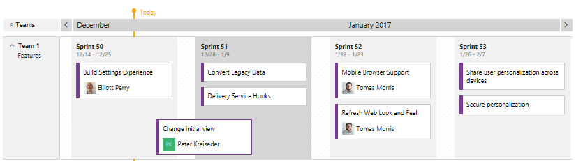

 
In this article you'll learn:

> [!div class="checklist"]   
> - How to review a plan with your teams
> - How to add and edit a plan
> - How to add field criteria, customize cards, and add markers
> - How to open a plan from the list of defined plans 
> - How to work with the interactive elements of plans and change the plan view
> - What permissions are required to create and view plans  

## Prerequisites

- In order to add and configure a Delivery Plan, you must have the following in place:  
	- Installed the Delivery Plans extension from the [Visual Studio Marketplace](https://marketplace.visualstudio.com/items?itemName=ms.vss-plans).    
	- Be a member of a project and granted [Basic access or greater access level](../../organizations/security/access-levels.md). Users granted **Stakeholder** access cannot add nor view plans.
	- [Configured teams](../../organizations/settings/add-teams.md)
	- [Define area paths and assign to a team](../../organizations/settings/set-area-paths.md)
	- [Define iteration (sprint) paths and configure team iterations](../../organizations/settings/set-iteration-paths-sprints.md) 
	- Teams have defined [user stories](../backlogs/create-your-backlog.md), features, or other product or portfolio backlogs and assigned those items to iterations.  
	- Team Backlog settings have enabled the backlogs to show in the delivery plans. To learn more, see [Select backlog navigation levels for your team](../../organizations/settings/select-backlog-navigation-levels.md).
- To view a Delivery Plan, you must be a member of the Project Collection Valid Users group. Members of the project's Readers group are valid users. Users with Stakeholder access for a private project can't view or add plans.  
- To manage permissions for a Delivery Plan or edit or delete a plan, you must be the creator of the plan, a member of the Project Administrators or Project Collection Administrators group, or granted explicit permission through the plan's Security dialog. For details, see [Edit or manage Delivery Plan permissions](../plans/edit-delivery-plan-permissions.md).  

::: moniker range="tfs-2017" 
> [!NOTE]
> Installation of Delivery Plans requires TFS 2017.2 or later version.
::: moniker-end
 

## Review a plan with your teams

It takes several teams to develop large software projects. Very large projects require multiple autonomous teams (review [Agile culture](../plans/agile-culture.md) for a discussion of autonomous teams and organizational alignment). Autonomous teams manage their own backlog and priority which contributes to a unified direction for that project.

Regular reviews of the project schedule with these teams help ensure that the teams are working toward common goals. Delivery Plans provide the needed multi-team view of your project schedule. 

Some questions you might address during the review: 
- *How confident are the teams in meeting the deliverables scheduled for each sprint?* 
- *Are dependencies across teams adequately addressed via the planned deliverables?* 
- *Are there gaps in the schedule, where no deliverables are scheduled? What's the cause? Can this be mitigated?*  

For example, we use Delivery Plans internally to share the schedule of Features. By seeing the work many teams have planned for the next 3 sprints, we can easily discuss whether these are the right priorities and if dependencies exist. 

In this way, a Delivery Plan is a driver of alignment while allowing each team to retain a strong sense of autonomy. Individual teams can work to different sprint cadences, if needed, and manage different work item types&mdash;stories, features, or epics. Their work is all visible with the same plan view. Teams can even be part of different projects if they use different processes. You can also customize the card fields so that you only see the data fields of interest and applicable per work item type.  

## Best practices 

- Use a consistent sprint schedule across your project teams and organization. Use the same sprints for backlogs, features, and epics. Don't create specific sprints for epics or other portfolio backlogs. 
- Minimize the number of fields you choose to display on your cards.  
- Eliminate cross-team ownership of area paths. Cross-team area path ownership isn't recommended and can lead to undesirable edge cases.  

Note the following: 
- Plan views are limited to 12 to 13 months. 
- Plan views are limited to a maximum of ten teams/backlogs
- Zooming out can cause fields and tags to disappear from the cards. The further you zoom out, the harder it is to fit items on a card. By design, we hide select items depending on the zoom level.  

## Add a plan  

::: moniker range=">= azure-devops-2019 <= azure-devops-2020"  

1. Open **Boards>Plans**. 

	> [!div class="mx-imgBorder"]  
	> 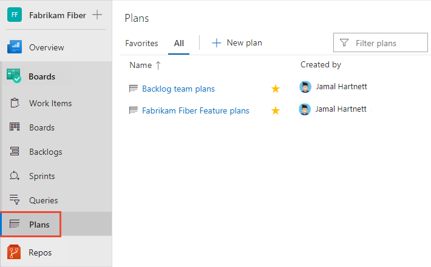 

1. To add a plan, choose **New Plan**. 

	> [!div class="mx-imgBorder"]  
	> 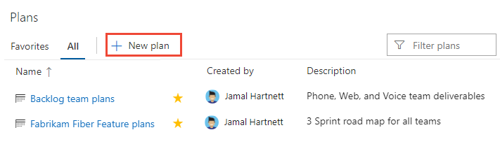 

	All users, except users [assigned Stakeholder access](../../organizations/security/change-access-levels.md), have permissions to create a plan and manage the plans they create. To manage permissions for a plan, see [Set permissions and access for work tracking, Manage or edit Delivery Plans](../../organizations/security/set-permissions-access-work-tracking.md#plan-permissions).  

2. Fill in the form to name, describe, and specify the team backlogs that you want to appear within your plan.    

	> [!div class="mx-imgBorder"]  
	> 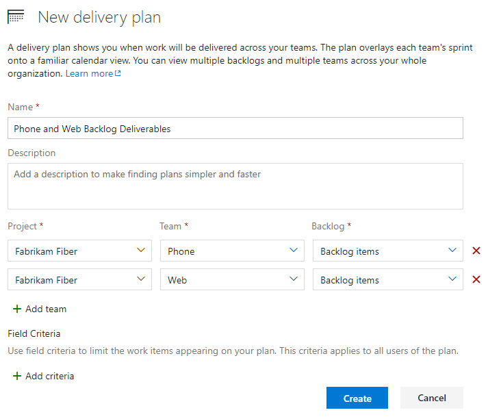  

::: moniker-end  

::: moniker range=">= tfs-2017 <= tfs-2018"  

1. Open **Boards>Plans**. 

	> [!div class="mx-imgBorder"]  
	> 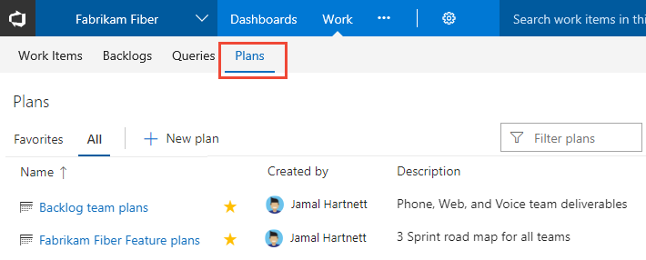 

1. To add a plan, choose **New Plan**. 

	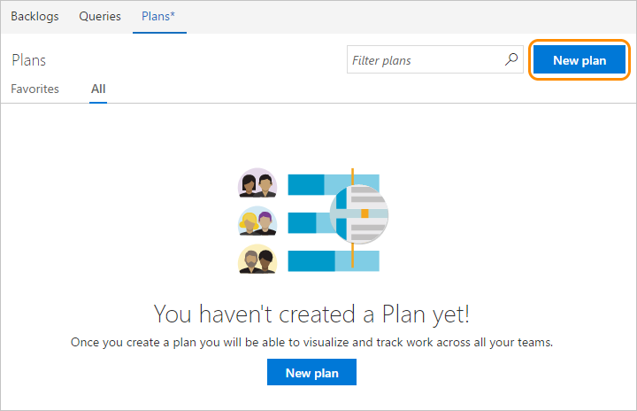  

	All users, except users [assigned Stakeholder access](../../organizations/security/change-access-levels.md), have permissions to create a plan and manage the plans they create. To manage permissions for a plan, see [Set permissions and access for work tracking, Manage or edit Delivery Plans](../../organizations/security/set-permissions-access-work-tracking.md#plan-permissions).  

2. Fill in the form to name, describe, and specify the team backlogs that you want to appear within your plan.    
	> [!div class="mx-imgBorder"]  
	>  

::: moniker-end

When defining a plan, note the following:  
- Use the name and description field to clearly identify your plan within the project 
- You can choose one or more teams from any project defined in the organization or collection, up to a maximum of ten teams   
- You can choose one or more [active backlogs for a team](../../organizations/settings/select-backlog-navigation-levels.md) 
	> [!NOTE] 
	> If you aren't able to select a backlog level, check the Team Backlog settings to ensure the backlog level is enabled for the team. To learn more, see [Select backlog navigation levels for your team](../../organizations/settings/select-backlog-navigation-levels.md).
- You can reorder the team backlogs by dragging and dropping them into the sequence you want 
-  To filter for specific work items, specify the field criteria. For example, to exclude bugs from the view, add the following criteria: `Work Item Type <> Bug`. 

## Edit a plan 

Once you've defined a plan, you can further customize it. 
  
1. To open the Settings dialog, choose **Configure plan settings**:::image type="icon" source="media/plans/gear-icon.png" border="false":::.  

2. Then, choose the page you want to edit. You can customize the plan in the following ways: 
   - Edit the teams you've selected and their backlog level  
   - Set field criteria to further limit the work items that will appear on the plan 
   - Add markers to show important upcoming events on your timeline 
   - Customize the fields that display on the cards, similar to how you [customize them for your Kanban or taskboard](../../boards/boards/customize-cards.md).  

     Here, we add the Tags field criteria. Only work items that contain the *RC Review* tag will appear in the Delivery Plan. 

     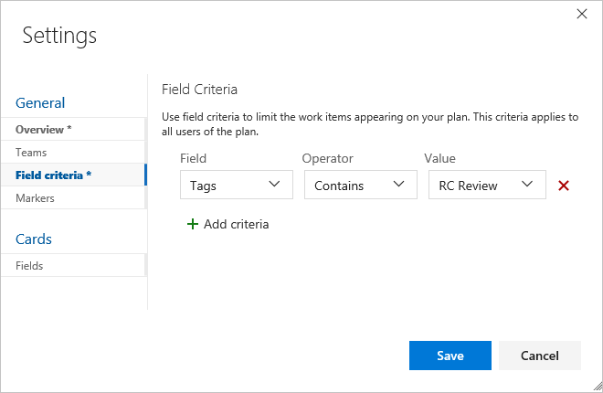

3. To set a marker, open the Markers page, specify a date and select a color. 	

	

	Markers appear on the plan as shown: 

	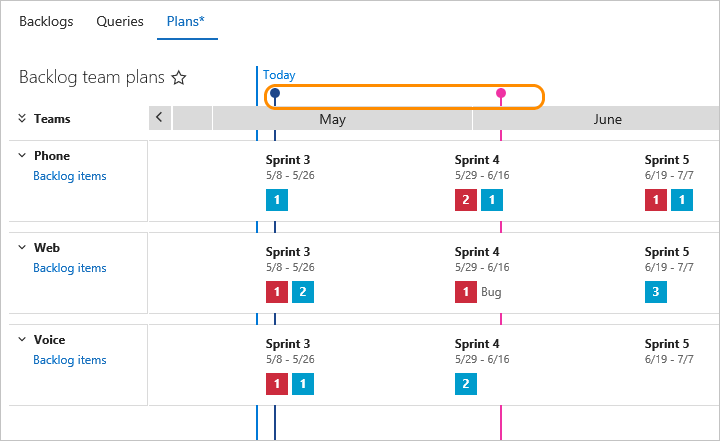

## Open a plan  

Once you've defined a few plans, you'll see them listed from the **Plans** page under **All**, or the ones you've favorited (**Add to favorites** :::image type="icon" source="../../media/icons/icon-favorite-star.png" border="false":::) under **Favorites**. You can see their title, description and their most recent creator/editor. 

Use the favorite's star to favorite a plan so that you can quickly return to that plan. You can also search for other plans in the project. 

To open a plan, simply choose the plan name.  

## Interact with a plan
 
Each team's backlog specified in a Delivery Plan appears as a row within the plan view. When collapsed, a roll-up of the backlog items shows. When expanded, a card for each backlog item appears, organized by their assigned iteration. 

:::image type="content" source="media/plans/plans-view-2.png" alt-text="Interactive plan elements.":::

You can interact with the plan in the following ways:  

- Filter the plan by choosing Choose **Filter** :::image type="icon" source="../../media/icons/filter-icon.png" border="false":::. For additional details, see [Interactively filter your backlogs, boards, and plans](../backlogs/filter-backlogs-boards-plans.md).
- Scale the size of the cards (enter **+** or **-** to also scale) 
- Scroll the view horizontally via the calendar to view previous months or future months (Enter **Shift-left** or **Shift-right** to scroll) 
- You can also scroll the plan via click and dragging your mouse.
- Scroll the view vertically to view teams that appear lower within the plan view. You can also scroll the plan by clicking the plan and dragging your mouse vertically.
- Click a card title to open the backlog item and view details. Close the work item to return to the plan.  
- To view details for a team, expand the team row by choosing **Expand team row**.  
- To expand and collapse all team rows, choose **Expand all team rows** or **Collapse all team rows** next to **Teams**. (Enter **u** to collapse, **o** to expand all rows). 
- Enter **t** to quickly toggle fields shown on cards to just the Title or all other card field settings 
- To edit the plan and [change the fields displayed on the cards](#card-settings), , choose **Configure plan settings**:::image type="icon" source="media/plans/gear-icon.png" border="false":::. 

In the following example, Team 1 features expanded, two items are scheduled for delivery in Sprint 50. 

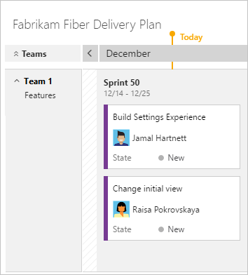

You can also quickly see that:  
* Team 1 is currently working on Sprint 50 deliverables
* Sprint 50 began on December 14th and is scheduled to end December 25th. 
* The team expects to deliver the two features shown by the cards.

## Collapse teams for summary information

A benefit of Delivery Plans is to view multiple teams across your projects that you care about. Two main ways to view more teams within the plan view is to collapse all teams to focus on summary data and to minimize the number of fields displayed on cards. 

To gain a summary view of work that is schedule, collapse all teams. You can then more easily look for gaps in the forward forecast.

For example, here you can see the count of Features for Team 1 for the next 3 sprints. You can collapse/expand team rows by by choosing **Expand team row** or **Collapse team row** next to the team name.

> [!div class="mx-imgBorder"]  
> 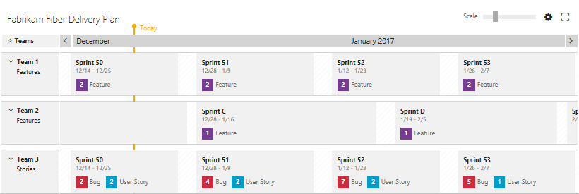  

## View titles only, collapsed card view 

The collapsed card view allows you to quickly switch back and forth between cards showing titles only and cards showing all fields configured for the plan. To toggle between titles only and show all fields, enter "**t**" from your keyboard.     

## Update the iteration for a backlog item 

As changes occur to the schedule, you can update the iteration for a backlog item by moving a card to a different iteration. This will help to drive alignment across your organization.

> [!div class="mx-imgBorder"]  
> 

## Minimize the fields displayed on cards  

To quickly change the cards to only show their Title, enter the keyboard shortcut '**t**'. This will hide all other fields, as shown in the following image, the Assigned to field no longer appears. To persist this view, edit the [plan's settings for card fields](#card-settings).

> [!div class="mx-imgBorder"]  
> 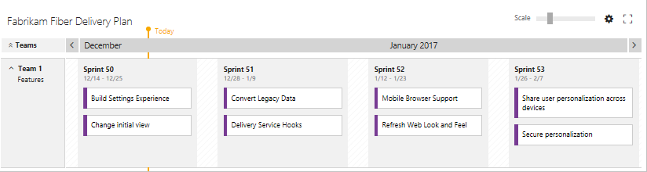   

## Keyboard shortcuts

You can use the following keyboard shortcuts when [interacting with a delivery plan](../../boards/plans/review-team-plans.md). To view the valid shortcuts, enter **?** when viewing a plan from the **Boards>Plans** or **Work>Plans** page.

[!INCLUDE [temp](../../includes/keyboard-shortcuts/delivery-plan-shortcuts.md)]

## Related articles  

For additional resources for working with multiple teams, see these additional topics: 

- [Interactively filter your backlogs, boards, and plans](../backlogs/filter-backlogs-boards-plans.md)
- [Backlogs, boards, and plans](../backlogs/backlogs-boards-plans.md)  
- [Add teams](../../organizations/settings/add-teams.md)  
- [Portfolio management](../plans/portfolio-management.md)  
- [Manage teams and configure team tools](../../organizations/settings/manage-teams.md)  
- [Keyboard shortcuts](../../project/navigation/keyboard-shortcuts.md)  

### Programmatically manage Delivery Plans  

You can manage plans using the [REST API, Plans](/rest/api/azure/devops/work/plans).

 
