# Plan and track dependencies using the Dependency Tracker

[!INCLUDE [temp](../includes/version-vsts-only.md)]


The Dependency Tracker extension provides you with the ability to plan and manage dependencies across teams, projects, and organizations. It provides filterable views to show all dependencies a team is consuming and producing. These views allow you to track the state and schedule of dependencies to support you in assessing the risk of dependencies to product deliverables. 

> [!NOTE]   
> The Dependency Tracker extension is not a supported feature of Azure Boards and therefore not supported by the product team. For questions, suggestions, or issues you have when using the extension, visit the [Marketplace for Azure DevOps, Dependency Tracker extension](https://marketplace.visualstudio.com/items?itemName=ms-eswm.dependencytracker&ssr=false#overview) page. The Dependency Tracker extension is only available on Azure DevOps Services. 
> 
> Another tool that supports dependency views is [Delivery Plans](../plans/track-dependencies.md).

You use the Dependency Tracker to plan dependencies at the beginning of an iteration or release, as well as to track the status during development. For any given dependency, there are two parties involved: 
- **Consumer**: Feature team who has a need and initiates a request for work
- **Producer**: Feature team who makes a commitment to deliver work 

Each work request and work deliverable is defined as a work item. The work items are linked by the Successor-Predecessor link type or other directional link type. For details about link types, see [Link type reference](../queries/link-type-reference.md) 
Producing for/Consuming from link.

> [!TIP]   
> While any work item type can participate in dependency tracking, you may want to decide if you want to limit dependencies to specific types, such as Features, Epics, User Stories, or Bugs. You can create that restriction through [Configuration of Dependency Tracker](#configuration).

From the Dependency Tracker, you can choose different views and filters, as well as drill down to obtain specific details. These views and options are described in the following sections: 
- [Filter options](#filter)
- [Drill-down](#drill-down)
- [Consuming Dependencies](#consume)
- [Producing Dependencies](#produce)
- [Timeline](#timeline)
- [Risk Graph](#risk-graph)

## Recommended use and key terms

You can use Dependency Tracker to visualize and track the following work items: 
- Dependencies on deliverables for work that your team is delivering  
- Dependencies you have on other teams for work that your team is delivering 
- Dependencies that other teams have on work your team is delivering 

All teams across organizations can participate in tracking dependencies. 

> [!NOTE] 
> Dependency Tracker doesn't replace the in person interactions required to agree to doing the work. It provides easier planning and tracking capabilities. Dependencies should be agreed upon by all parties before they are entered in to the Dependency Tracker.

### Key terms

- **Dependency**: work that Team A requires from Team B to do the work Team A is trying to do
- **Consumer**: the team that wants work done
- **Producer**: the team that is being asked to do the work
- **Sequencing**: when a producing team's work is needed before the consuming team can start their work

### Recommended practices 

- The consumer is the team that asks for the work – they initiate all discussions on the work they require
- The consumer owns the engagement and tracking of that work – since it is the work their scenario requires, the burden is on the consumer to file, monitor, and track the status of the work
- The consumer owns entering the work into Azure Boards and submitting that work request to the producer
- Once the work has been submitted to the producer, the producer owns the work item,
    - The producer is responsible for maintaining the work item in Azure Boards
    - The producer owns the state of the work item (is it going to be done) and iteration (when it will be done).  
    - The consumer should not touch these values, once the work item has been handed off
- The consumer is in charge of managing the work they requested  so that they are aware of any material changes and adjustments.


## Prerequisites

- Install the [Dependency Tracker extension](https://marketplace.visualstudio.com/items?itemName=ms-eswm.dependencytracker&ssr=false#overview) for the organization(s) for which you want to track dependencies.
- To view dependencies, you must be a member of the Project Valid Users group for the project.  
- To create a dependency, you must be a member of the Contributors group for both projects that participate in the dependency linking.
- To support cross-organization participation, all organizations must authenticate users through the same [Azure Active Directory](../../organizations/accounts/connect-organization-to-azure-ad.md). 
- Azure Boards must be enabled as a service. If it is disabled, then you'll need to have it reenabled. For details, see [Turn a service on or off](../../organizations/settings/set-services.md). 
- In order to modify the configuration, you must be a member of the  Project Collection Administrator Group. 

> [!IMPORTANT]  
> The default configuration for Dependency Tracker supports the Agile process. If your project(s) are based on a different process or you have customized your process, you may need to modify the configuration. See [Configure the Dependency Tracker](#configuration) later in this article. 

In addition, the following configuration or customization tasks should be performed: 
- Set up the area paths and teams that will participate in dependency tracking. 
- Configure iteration paths/sprints for the project and assign them to work items participating in dependency tracking. This task is essential for the Timeline view to yield meaningful data.
- Customize your process as needed to support any additional work items or fields. 
- [Configure the Dependency Tracker](#configuration) to support your business needs and address any customizations you've made.


## Open the Dependency Tracker

1. Open the web portal for the project where your team is defined.  

2. Choose **Dependency Tracker** from under the Boards group. 

    > [!div class="mx-imgBorder"]  
    > 

1. To focus on your area of ownership, choose the **Area** that corresponds to the team you want to view dependencies for.   

    > [!div class="mx-imgBorder"]  
    > 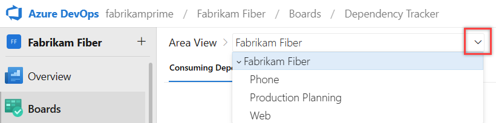

    You can only filter on those Area paths defined for the project. 

<a id="filter" /> 

## Filter options 

You can filter each supported view by typing a keyword or using one or more of the fields. Provided field include State, Work item type, and Iteration Path. Based on the keyword that you enter, the filter function lists work items based on any displayed column field.  

To show the filter toolbar, choose the :::image type="icon" source="../../media/icons/filter-icon.png" border="false"::: filter icon. 

> [!div class="mx-imgBorder"]  
> 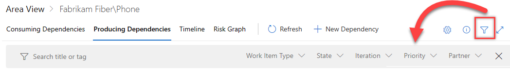  

You can toggle filters  on and off by choosing the filter icon. To see more filters use the arrows at the end of the list of filters. 

Choose one or more values from the multi-select drop-down menu for each field. The values for these fields are populated as follows:

- **State**: Check one or more check boxes for the  work item states you want to view. The drop-down list should include all workflow States defined for all work item types shown in the selected view.  
- **Work item type**: Check one or more check boxes for the Work item types you want to view. Work item types configured to participate in dependency tracking. The default work item types are: Epic, Feature, User Story, and Bug. To modify the configuration, see [Configuration of Dependency Tracker](#configuration).
- **Iteration**: Check one or more check boxes for the Iteration Paths you want to view.  The drop-down list should include all Iteration Paths [configured for the project](../../organizations/settings/set-iteration-paths-sprints.md) and for which there are work items listed in the current view.
- **Priority**:  Check one or more check boxes for the Priorities you want to view. The priority values assigned to work items  
- **Partner**: The partner organization for which the work item is defined. 

> [!NOTE]   
> Filter options are dependent on the [configuration](#configuration) defined for the Dependency Tracker. Also, only those options that correspond to work items shown in the selected view that meet the filter criteria. For example, if you don't have any work items assigned to Sprint 4, then the Sprint 4 option won't appear in the filter options for the Iteration Path. 

Ability to drop dependencies within the selected area (usually used for excluding dependencies inside my team)


<a id="drill-down" /> 

## Drill-down options 

Several views provide interactive visualizations through drill-downs. These features are addressed in the description of each of the tabbed views later in this article. 

> [!div class="mx-imgBorder"]  
>  


<a id="create" /> 

## Create a dependency 

A dependency represents work where one team is dependent on another team. Both teams should track their own work in their own area path. By linking the work that is dependent on the other teams work, the dependencies can be visualized and tracked.  

1. Choose **New Dependency**.  

    > [!div class="mx-imgBorder"]  
    > 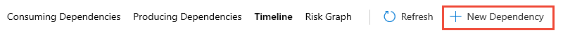

    If the partner team is in a different organization, then first choose the **Partner Account**. The Partner Account option can be enabled or disabled by [configuring the Dependency Tracker](#configuration).   

    > [!div class="mx-imgBorder"]  
    > 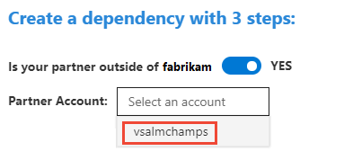

1.  You can search for work items by ID or by entering a keyword contained within the work item title. Here, we link a user story and a bug. 

    > [!div class="mx-imgBorder"]  
    > 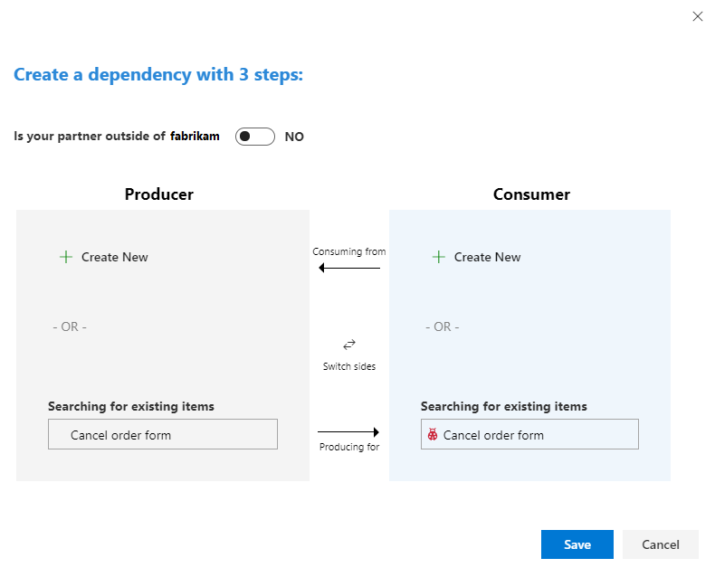

    - The Producer is the team that commits to delivering the work.
    - The Consumer is the team that needs or is dependent on the work.
    - The fastest way to create a dependency link is to type the Producer and Consumer work item IDs in the search boxes and then choose **Save**.

    Optionally, you can choose **Create New** to add work items that you then link as dependent upon each other. Here we create two new features and link them. 

    > [!div class="mx-imgBorder"]  
    > 

    If no work items exist for one half of the dependency, you can create a new work item as needed.

1.  Choose **Save**. The **Save** button becomes available only after you've chosen two work items to link.      

1. From the success confirmation dialog, choose **View dependency**. 

    > [!div class="mx-imgBorder"]  
    > 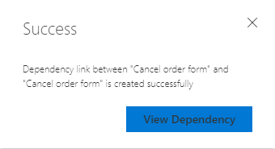

1.  The work items that you just linked are highlighted.    
    
    As shown in this example, the Fabrikam Fiber/Service Delivery/Voice team is dependent on the MyFirstProject team to deliver their `User Story 706: Cancel order form` to complete `Bug 390: Cancel order form`. 

    > [!div class="mx-imgBorder"]  
    > 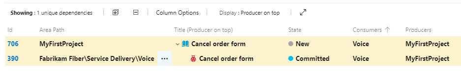

## Create links manually 

You can also link work items using the **Links** tab to create Successor/Predecessor links. A Predecessor is the producer of the work item, or the item that must come first. A Successor is the consumer of the work item, or the item that is dependent on the first item.

> [!div class="mx-imgBorder"]  
> 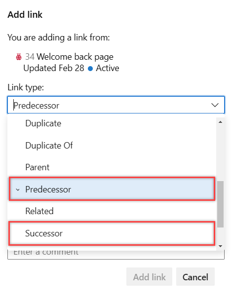

> [!NOTE]   
> The Successor/Predecessor (consumes/produces) link types are the default link types used by the Dependency Tracker. If you're projects are customized using a Hosted XML process model, it's possible to specify different link types in the Dependency Tracker configuration. See [Configure the Dependency Tracker](#configuration) later in this article.

To learn more, see [Link user stories, issues, bugs, and other work items](../backlogs/add-link.md). 

## Remove dependency links

You can remove a dependency by choosing the  :::image type="icon" source="../../media/icons/actions-icon.png" border="false"::: actions icon from the linked work item and choose **Remove Dependency Link** option from the menu. 

> [!div class="mx-imgBorder"]  
> 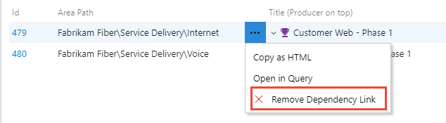

Optionally, you can remove the link from the work item's **Links** tab. 

## Create a query of dependencies 

To open a set of dependent work items, select them in the same way you would via a [bulk edit](../backlogs/bulk-modify-work-items.md), choose the  :::image type="icon" source="../../media/icons/actions-icon.png" border="false"::: actions icon from one of the selected linked work items and choose **Open in Query** option from the menu. 

> [!div class="mx-imgBorder"]  
> 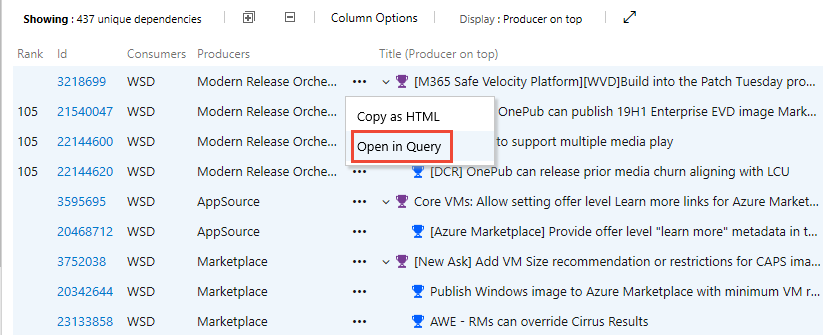

A new tab opens to the Query Results page. 

You can also create a custom query by selecting the Work items and direct links query type and choose any work item type. 

Choose **Copy to HTML** to copy the selected work items to the clipboard as a formatted table. 

<a id="consume" />

## Consuming Dependencies

The **Consuming Dependencies** view shows work that a team is dependent upon other teams/area paths. It is useful for answering the following questions: 

- *Which dependencies am I consuming as the owner of the selected areas and sub areas?* 
- *How many dependencies per producer team (by area level 3)?*
- *What are the workflow states of my consumer dependencies?*

> [!div class="mx-imgBorder"]  
> 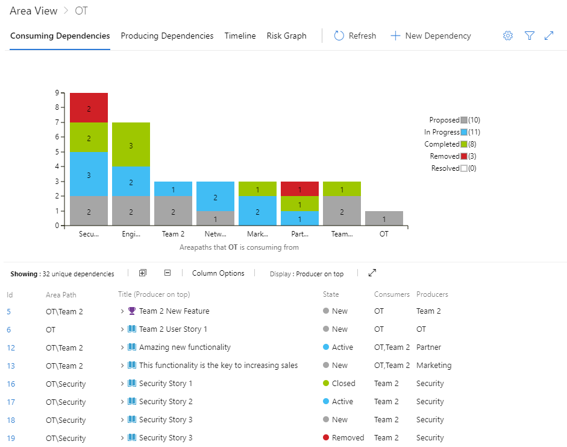

Each column on the bar chart represents another area path that is producing dependencies by workflow state for the selected **Area View**. The table shows the number of unique dependencies and lists all work items participating in the filtered view of tracked dependencies. 

Within the table, you can perform the following actions. 

- Filter the list of work items by choosing one of the area path bars and progress states in the bar chart graph 
- Expand or collapse the list of work items to show the full list of dependent work items using the :::image type="icon" source="../media/icons/expand_icon.png" border="false"::: expand and :::image type="icon" source="../media/icons/collapse_icon.png" border="false"::: collapse icons 
- Add or remove column fields by opening Column Options
- Switch the sequence of work items by choosing the Display: **Consumer on top** or **Producer on top**


<a id="produce" />

## Producing Dependencies 

The **Producing Dependencies** view shows work that other teams/area paths are dependent on per the selected area. It is useful for answering the following questions: 

- *Which dependencies is my team responsible for delivering as the owner of the selected area(s)?* 
- *How many dependencies exist per consumer team (by area level 3)?*
- *What are the workflow states of my producer dependencies?*

> [!div class="mx-imgBorder"]  
> 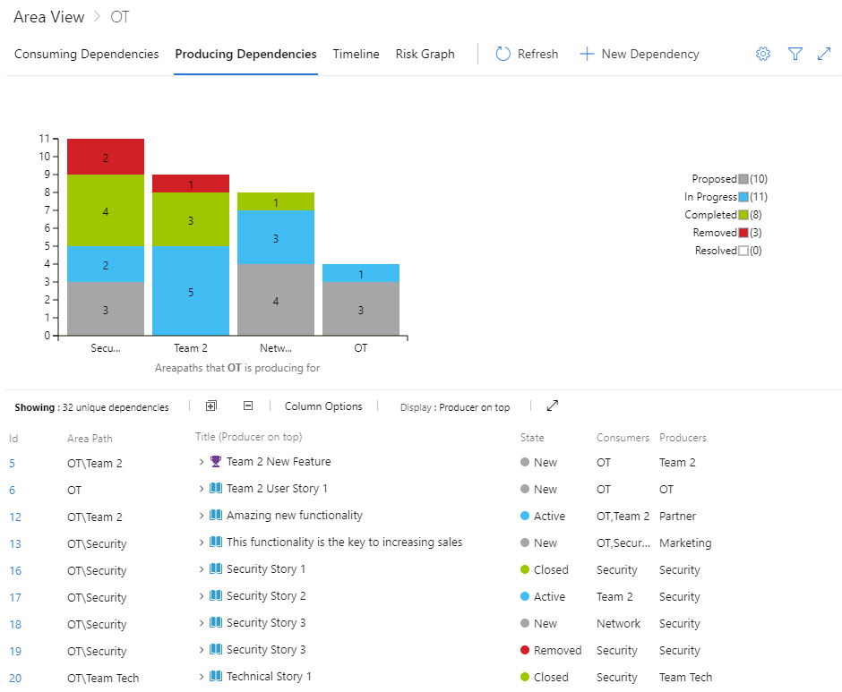

Each column on the bar chart represents another area path that is consuming dependencies by workflow state for the selected **Area View**. The table shows the number of unique dependencies and lists all work items participating in the filtered view of tracked dependencies. 

Within the table, you can perform the same actions as in the Consuming Dependencies view. 
 
 
<a id="timeline" />

## Timeline 

The **Timeline** tab provides a calendar view of dependencies. The Timeline view is in Beta. The Timeline view helps answering the following questions: 

- *What is the sequence of dependencies within the time window.*
- *What are all the deliverable dependencies against within the three-month time window for a given team?*

> [!IMPORTANT]   
> In order for the Timeline to show meaningful data, you must have assigned the dependent work items to Iteration Paths, and the Iteration Paths must have start and end dates assigned.  

There are two versions of the Timeline view: **Correct Flow** and **Incorrect Flow**. Each version shows the color-coded workflow state. Color codes can be customized within the [Dependency Tracker configuration](#configuration).

#### Correct Flow

The Correct Flow view shows those dependencies that are in the correct sequence. Successor work items are scheduled to be completed after their predecessor work item.

> [!div class="mx-imgBorder"]  
> 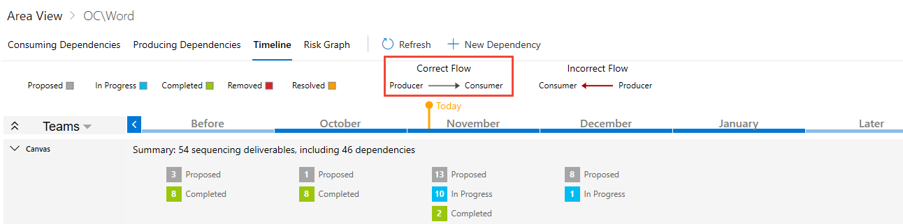

#### Incorrect Flow

The Incorrect Flow  view shows those dependencies that are out of order. At least one predecessor work item is scheduled to be completed after it's successor work item.

> [!div class="mx-imgBorder"]  
> 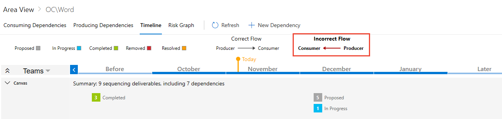


<a id="risk-graph" />

## Risk Graph

The Risk Graph provides a visualization of how dependencies flow from Consumer team to Producer team, or from Producer to Consumers. The graph allows a team to, at a glance, understand the magnitude of dependencies and level of risks associated. In addition, the risk graph view demonstrates the value of linking dependencies and laddering them up to Stories. 

> [!div class="mx-imgBorder"]  
> 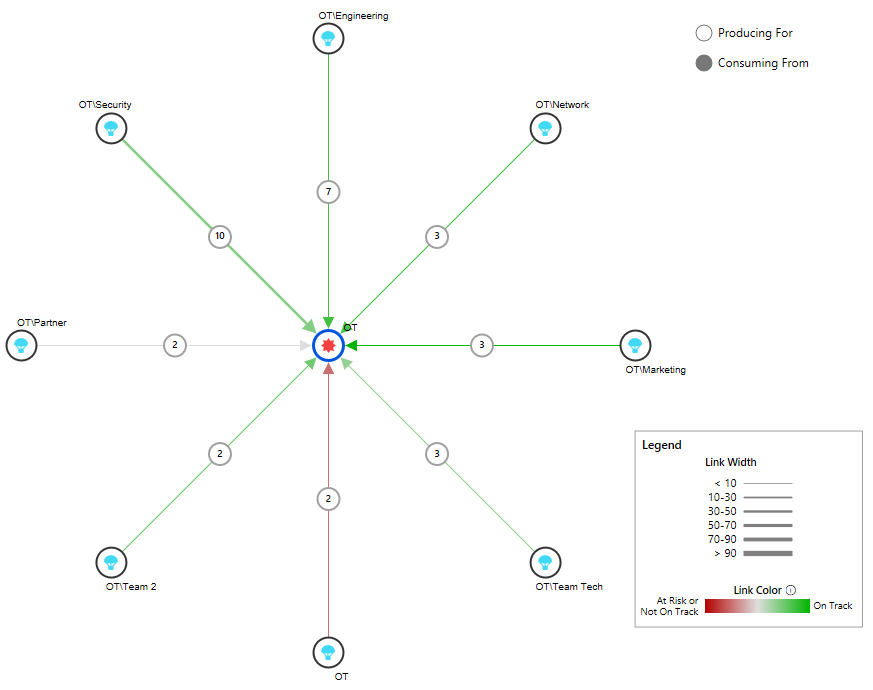

There are two views: **Consuming From** and **Producing For**. The workflow state color coding is configurable. The width of the lines indicate how many dependencies exist in that area, the thicker the link the more dependencies as indicated in the legend.

#### Consuming From

> [!div class="mx-imgBorder"]  
> 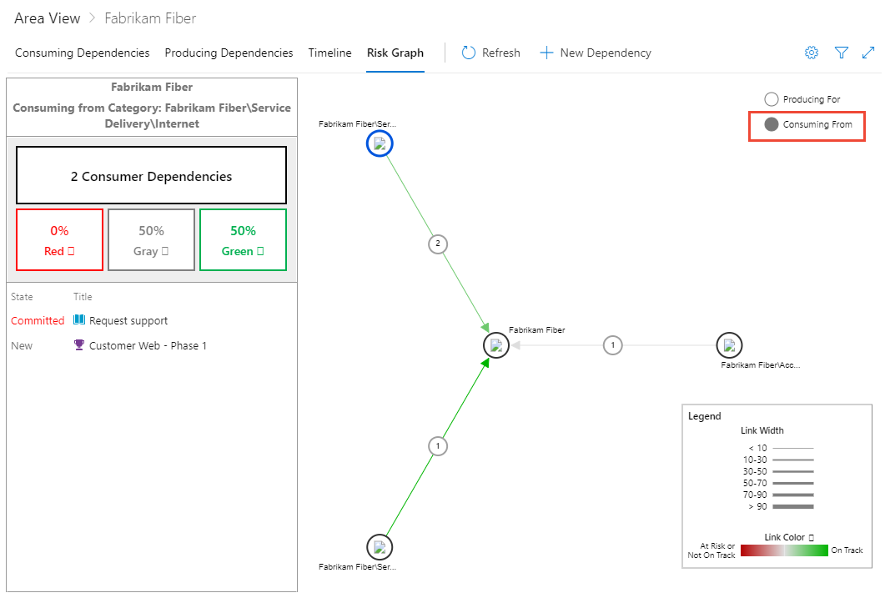

#### Producing For

> [!div class="mx-imgBorder"]  
> 


#### Filtered on a specific dependency

You can drill down into specifics by choosing one of the dependencies. 

> [!div class="mx-imgBorder"]  
> 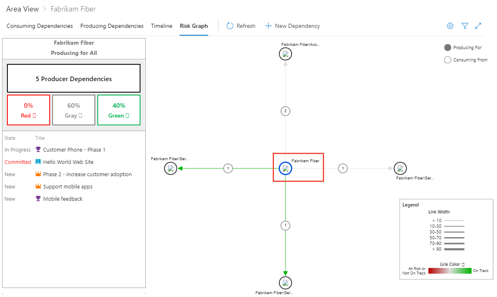


<a id="configuration" /> 

## Configure the Dependency Tracker

You must be a member of the  Project Collection Administrator Group in order to modify the configuration. All changes to the configuration apply to all projects defined in the organization. 

To change the configuration, choose the  :::image type="icon" source="../../media/icons/blue-gear.png" border="false":::  gear icon  and modify the syntax listed. Choose **Save** when done. 

The main properties you can modify are summarized as follows: 
- The link types to use to create dependency links. Defaults are the Successor/Predecessor link types. Only customize when you use the [Hosted XML process model](../../organizations/settings/work/hosted-xml-process-model.md) to customize work tracking.  
- Work items and work item types
    - Work item types to participate in dependency tracking 
    - Mapping of work item category states to colors 
    - Mapping of work item workflow states and colors
- Default field columns in dependency list tables
- Default filter selections:
    - Selected dependency work item types
    - Selected Iteration Paths
- Enabled options:
    - Timeline
    - New Dependency link 
    - Cross account (organization) dependencies 
    - Cross account dependency toggle default state 
- Risk graph configuration:
    - Work item state(s) associated with at risk (Red color) work items
    - Work item state(s) associated with neutral (Gray color) work items
    - Work item state(s) associates with on track (Green color) work items

For a full list and description, see the [Property descriptions](#table) provided later in this section. 

### Enable or disable the New Dependency option

The `newDependencyButtonEnabled` property enables or disables the **New Dependency** link option. When enabled, the link appears on the Dependency Tracker page. When disabled, users can't create dependencies from the tracker, only review the dependencies that have been created through other means. The default value is set to `true` (enabled).  


### Enable or disable cross-organization linking

The `crossAccountConfigs` property enables or disables cross-organization dependency linking from the New dependency dialog. The default value is set to `true` (enabled).  

To disable, set the following syntax in the JSON configuration to `false`.

> [!div class="tabbedCodeSnippets"]
```
{
"crossAccountConfigs": {
  "crossAccountDependencyEnabled": false,
  "crossAccountDependencyToggleDefaultState": false, //default state for cross account toggle
  "crossAccountDependencyToggleOnText": "Cross-account dependencies on",
  "crossAccountDependencyToggleOffText": "Cross-account dependencies off"}
}
```

Cross account linking requires the use of a special link type and should only be used in coordination with the **New Dependency** option.

<a id="table" />

### Property descriptions 

The following table describes each of the property items specified in the configuration file. 

<table valign="top">
<tbody valign="top">
<tr>
<th>Property/Description</th>
<th>Default/Example</th>
</tr>
<tr>
<td>consumesLinkName
<blockquote>Specifies the link type used to create the link from producer to consumer.  </blockquote></td>
<td>System.LinkTypes.Dependency-Reverse</td>
</tr>
<tr>
<td>producesLinkName
<blockquote>Specifies the link type used to create the link from consumer to producer. </blockquote></td>
<td>System.LinkTypes.Dependency-Forward</td>
</tr>
<tr>
<td>queryFields
<blockquote>Specifies the custom fields to use in place of the system fields used by the dependency tracker to return linked work item results. By default. system reference names are used to return values for the following fields:
<ul>
<li>areaPath - Area Path</li>
<li>assignedTo - Assigned To</li>
<li>id - ID</li>
<li>areapath - IterationID</li>
<li>areapath - Iteration Path</li>
<li>areapath - Priority</li>
<li>areapath - State</li>
<li>areapath - Tags</li>
<li>teamProject - Team Project</li>
<li>title - Title</li>
<li>workItemType - Work Item Type</li>
</ul>
</blockquote>
</td>
<td>
If a custom field is used in place of one of the system fields, you specify the substitution by entering: 
<pre>{
    title: "Custom.Title",
    assignedTo: "Custom.AssignedTo" 
}</pre>
</td>
</tr>
<tr>
<td>dependencyWorkItemTypes
<blockquote>Specifies the work item types that participate in dependency tracking. From the Create a dependency dialog, only those work item types listed can be created.  </blockquote></td>
<td>Default: <pre>
[  
  "Epic",  
  "Feature",  
  "User Story",  
  "Bug"  
]</pre>
<p>If using the Scrum process, you would change the entry to:</p>
<pre>
[  
  "Epic",  
  "Feature",  
  "Product Backlog Item",  
  "Bug"  
]</pre>
</td>
</tr>
<tr>
<td>selectedDependencyWorkItemTypes
<blockquote>Restricts the  initial focus to just those work item types that the dependency tracker displays or lists. Based on the default "Any", any work item type that contains a dependency link type is displayed or listed. Users can change the focus through filtering. </blockquote></td>
<td>Default: <pre>Any</pre><br/>
<p>To restrict the work item types to just Epics and Features, specify:</p> 
<pre>
[  
  "Epic",  
  "Feature"  
]</pre> 
</td>
</tr>
<tr>
<td>selectedReleases
<blockquote>Restricts the initial focus to just those work items that are assigned to those Iteration Paths equal to or under the specified releases. Based on the blank default, no restrictions are applied. Users can change the focus through filtering. </blockquote></td>
<td>Default: <pre>[]</pre><br/>
<p>To restrict the work item types to just Release 1 and Release 2 for the Fabrikam project, specify:</p> 
<pre>[  
  "Fabrikam/Release 1",  
  "Fabrikam/Release 2",  
]</pre>  
</td>
</tr>
<tr>
<td>workItemCategoriesAndColors
<blockquote>Specifies the colors used to represent work items based on their category and workflow state. For more information, see <a href="../work-items/workflow-and-state-categories.md">How workflow states and state categories are used in Backlogs and Boards</a>.</blockquote></td>
<td>Default: <pre>
{
  "Proposed": {
     "displayName": "Proposed",
     "color": "#a6a6a6"
        },
  "InProgress": {
      "displayName": "In Progress",
      "color": "#00bcf2"
         },
   "Completed": {
       "displayName": "Completed",
       "color": "#9ac70b"
          },
  "Removed": {
      "displayName": "Removed",
      "color": "#d9242c"
         },
  "Resolved": {
       "displayName": "Resolved",
        "color": "#ff9d00"
         }
}</pre></td>
</tr>
<tr>
<td>workItemDislayStatesAndDisplayColors
<blockquote>Maps the workflow states to colors used to display them. <p>If you customize the workflow states, or use a process that uses different workflow states, you must update this property. </p></blockquote></td>
<td>Default: <pre>
{  
  "New": {  
     "textColor": "rgb(112, 112, 112)",  
     "chartColor": "rgb(112, 112, 112)",  
     "states": [  
     "New"  
        ]  
      },  
  "Active": {  
      "textColor": "rgb(0, 122, 204)",  
      "chartColor": "rgb(0, 122, 204)",  
      "states": [  
      "Active",  
      "Resolved"  
       ]  
     },  
  "Closed": {  
     "textColor": "rgb(16, 124, 16)",  
     "chartColor": "rgb(16, 124, 16)",  
     "states": [  
     "Closed"  
      ]  
     },  
  "Removed": {  
     "textColor": "rgb(204, 41, 61)",  
     "chartColor": "rgb(204, 41, 61)",  
     "states": [  
     "Removed"  
      ]  
     },  
  "Other": {  
     "textColor": "rgb(178, 178, 178)",  
     "chartColor": "rgb(178, 178, 178)",  
     "states": []  
   }  
}  
</pre>
</td>
</tr>
<td>riskAssessementValues
<blockquote>Specifies the <a href="../queries/planning-ranking-priorities.md#risk">Risk</a> field values. The Risk field specifies a subjective rating of the relative uncertainty around the successful completion of a user story. It is defined for the Agile process, but can be added to work item types used in other processes. </blockquote></td>
<td>Default: <pre>["1-High", "2-Medium", "3-Low"]</pre></td>
</tr>
<tr>
<td>partnerAccounts
<blockquote>Optional configuration that specifies which Azure DevOps organizations are selectable from the Dependency dialog when creating a Cross account dependency. If not specified it will generate a list based on previous organizations that the user has visited. 
</blockquote></td>
<td>Default: <pre>[]</pre>
Example: <pre>["account-1", "account-2"]</pre>
</td>
</tr>
<tr>
<td>timelineEnabled
<blockquote>Enables or disables the Timeline view.</blockquote></td>
<td>Default: <pre>true</pre></td>
</tr>
<tr>
<td>newDependencyButtonEnabled
<blockquote>Enables or disables the <strong>New Dependency</strong> link to create a new linked dependency.</blockquote></td>
<td>Default: <pre>true</pre></td>
</tr>
<tr>
<td>crossAccountConfigs
<blockquote>(1) Enables or disables the support of creating new dependencies to work items in other partner accounts, and (2) specifies the default state of the Partner account options in the Create a dependency dialog.  </blockquote></td>
<td>Default: <pre>
{
"crossAccountDependencyEnabled": true,  
"crossAccountDependencyToggleDefaultState": false
}</pre> 
<p>If you don't want any dependencies created that belong to other organizations, then change this configuration to: </p>
<pre>{  
"crossAccountDependencyEnabled": false,  
"crossAccountDependencyToggleDefaultState": false
}</pre>
</td>
</tr>
<tr>
<td>priorityValues
<blockquote>Specifies the <a href="../queries/planning-ranking-priorities.md#priority">Priority</a> field values. The Priority field specifies a subjective rating of a bug, issue, task, or user story as it relates to the business. It is defined for most backlog work item types and processes, but can be added to work item types used in other processes.   </blockquote></td>
<td>Default: <pre>["0","1","2","3","4","(blank)"]</pre></td>
</tr>
<tr>
<td>defaultColumns
<blockquote>Specifies the field columns and order used to display dependency lists. </blockquote></td>
<td>Default: <pre>
[
  "Id",
  "Area Path",
  "Dependency Title",
  "State",
  "Consumers",
  "Producers"
]</pre></td>
</tr>
<tr>
<td>riskAnalysisEnabled
<blockquote>Specifies whether or not Risk functionality is enabled. If set to true, then the riskAssessmentValues property must be defined.</blockquote></td>
<td>Default: <pre>False</pre></td>
</tr>
<tr>
<td>riskAssessmentValues
<blockquote> </blockquote></td>
<td>Default: <pre>[]</pre></td>
</tr>
<tr>
<td>riskGraphConfig
<blockquote>Maps the workflow States to one of the three Risk areas displayed on the Graph: <code>atRisk</code> is Red, <code>nuetral</code> is Gray, and <code>onTrack</code> is Green.  </blockquote></td>
<td>Default: 8
<pre>
{  
    "atRisk": [  
        "Removed"  
    ],  
    "neutral": [  
        "New"  
    ],  
    "onTrack": [  
        "Active",  
        "Resolved",  
        "Closed",  
         "Other"  
        ]
}</pre>
<p>Add or remove workflow states used in work item types participating in dependency tracking.</p></td>
</tr>
<td>iterationDepth
<blockquote>Specifies the hierarchical depth of Iteration Paths that the Dependency Tracker queries to build the Timeline view. </blockquote></td>
<td>Default: 8<p>A depth of 3 would correspond to: Fabrikam/Release 1/Sprint 20. </p></td>
</tr>
</tbody>
</table>


### Default configuration syntax

> [!div class="tabbedCodeSnippets"]
```
{
    "consumesLinkName": "System.LinkTypes.Dependency-Reverse",
    "producesLinkName": "System.LinkTypes.Dependency-Forward",
    "queryFields": {},
    "dependencyWorkItemTypes": [
        "Epic",
        "Feature",
        "User Story",
        "Bug"
    ],
    "selectedDependencyWorkItemTypes": "Any",
    "selectedReleases": "",
    "workItemCategoriesAndColors": {
        "Proposed": {
            "displayName": "Proposed",
            "color": "#a6a6a6"
        },
        "InProgress": {
            "displayName": "In Progress",
            "color": "#00bcf2"
        },
        "Completed": {
            "displayName": "Completed",
            "color": "#9ac70b"
        },
        "Removed": {
            "displayName": "Removed",
            "color": "#d9242c"
        },
        "Resolved": {
            "displayName": "Resolved",
            "color": "#ff9d00"
        }
    },
    "workItemDislayStatesAndDisplayColors": {
        "New": {
            "textColor": "rgb(112, 112, 112)",
            "chartColor": "rgb(112, 112, 112)",
            "states": [
                "New"
            ]
        },
        "Active": {
            "textColor": "rgb(0, 122, 204)",
            "chartColor": "rgb(0, 122, 204)",
            "states": [
                "Active",
                "Resolved"
            ]
        },
        "Closed": {
            "textColor": "rgb(16, 124, 16)",
            "chartColor": "rgb(16, 124, 16)",
            "states": [
                "Closed"
            ]
        },
        "Removed": {
            "textColor": "rgb(204, 41, 61)",
            "chartColor": "rgb(204, 41, 61)",
            "states": [
                "Removed"
            ]
        },
        "Other": {
            "textColor": "rgb(178, 178, 178)",
            "chartColor": "rgb(178, 178, 178)",
            "states": []
        }
    },
    "riskAssessmentValues": [],
    "releases": [],
    "partnerAccounts": [],
    "timelineEnabled": true,
    "newDependencyButtonEnabled": true,
    "crossAccountConfigs": {
        "crossAccountDependencyEnabled": true,
        "crossAccountDependencyToggleDefaultState": false
    },
    "priorityValues": [
        "0",
        "1",
        "2",
        "3",
        "4",
        "(blank)"
    ],
    "defaultColumns": [
        "Id",
        "Area Path",
        "Dependency Title",
        "State",
        "Consumers",
        "Producers"
    ],
    "riskGraphConfig": {
        "atRisk": [
            "Removed"
        ],
        "neutral": [
            "New"
        ],
        "onTrack": [
            "Active",
            "Resolved",
            "Closed",
            "Other"
        ]
    },
    "iterationDepth": 8
}
```


## Related articles

- [Work item field index](..//work-items/guidance/work-item-field.md)
- [Review team delivery plans](../plans/review-team-plans.md)
- [Inheritance process model](../../organizations/settings/work/inheritance-process-model.md)
- [Hosted XML process model](../../organizations/settings/work/hosted-xml-process-model.md)
- [How workflow states and state categories are used in Backlogs and Boards](../work-items/workflow-and-state-categories.md)


## Related Marketplace extensions

- [Work Item Visualization](https://marketplace.visualstudio.com/items?itemName=ms-devlabs.WorkItemVisualization) 

<!---

## Dependency Bot

The dependency bot works in the background to notify teams when dependencies are created. These include performing the following actions: 
- Notify the producer (copy the consumer) when a dependency is created
- Notify the consumer (copy the producer) when the producer has changed the State of the deliverable to Cut
- Notify the consumer (copy the producer) when the producer has moved out the iteration path of a committed dependency.

--> 

<!--- TO BE COMPLETED

- cross linking
- Ask how her link type is Producing for/Consuming from link

--> 

