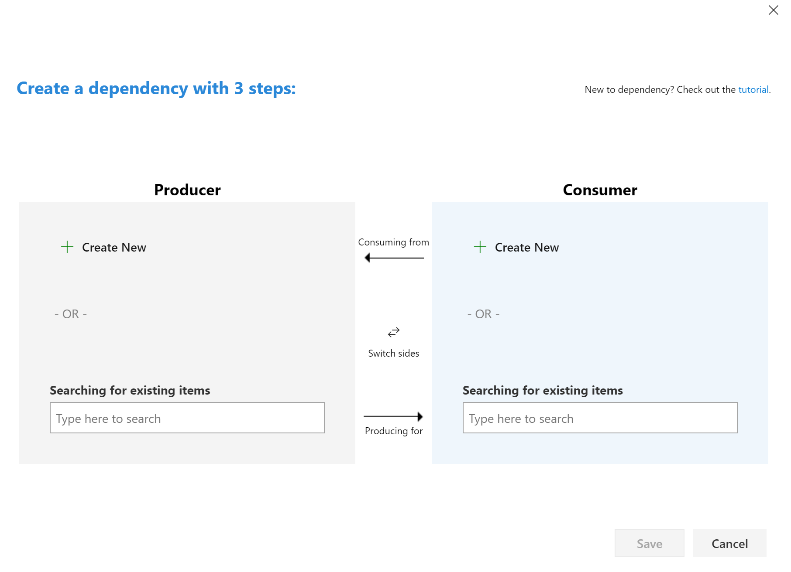

# Create a Dependency

When one team is dependent on another team for work a dependency needs to be created.  Both teams should track their own work in their own area path and they should create a dependency link between the two work items.

To find Dependency tracker go to :

From there the Dependency Creation screen pops up.

The Producer is the team that commits to delivering the work.
The Consumer is the team that needs or is dependency on the work.
The fastest way to create a dependency link is to type the Producer and Consumer work item ids in the search boxes and then click save.

If no work items exist for one half of the dependency it is possible to create a new work item also.

## Dependencies can also be created from the Links Tab

Dependencies can be created using the Predecessor and Successor links on the Links tab.
A predecessor is the producer of the work item, or the item that must come first.
A successor is the consumer of the work item, or the item that is dependent on the first item.

