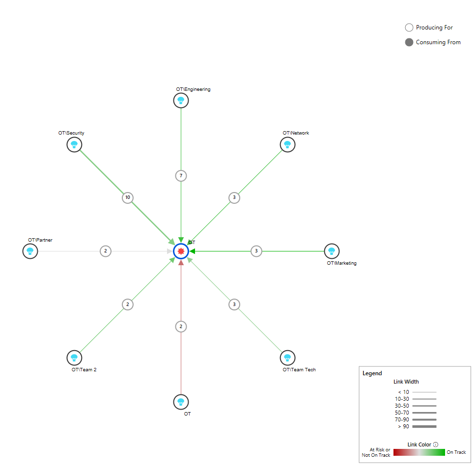

# Dependency Risk Graph

[!INCLUDE [temp](../../_shared/version-vsts-only.md)]

Dependency Risk Graph is a bird's eye view of how dependencies flow from the Producer to all Consumers or to the Consumer from all Producers.  The graph allows a team to, at a glance, understand the magnitude of dependencies and level of risks associated.  In addition the risk graph view demonstrates the value of linking dependencies.

The color coding in the risk graph is dependent on the State of the item and is configurable.  The width of the lines in the risk graph indicate how many dependencies exist in that area, the thicker the link the more dependencies (as indicated in the legend).
