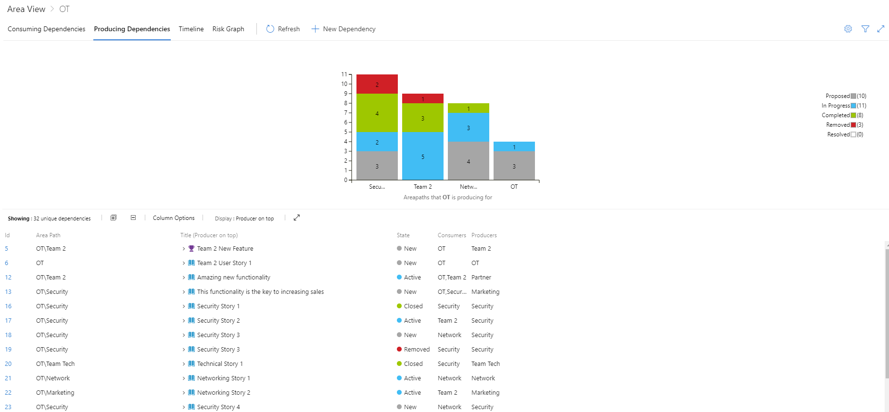

# Dependency Views

## Consume dependencies

Shows dependencies that an area path is consuming from other area paths. These are all of the dependencies you are receiving from other teams.

On the bar chart each column represents another area path that is producing dependencies for this area path by state or risk.  The table below shows a list of all of the associated work items.

## Options in this view

- Filtering down work items
- Changing if the Producer or Consumer work items are displayed on top
- Expanding using the + to show both halves of the dependency

## Produce dependencies

Shows dependencies that an area path is producing for other area paths. These are all of the dependencies your team is producing for others.

## Options in this view

- Filtering down work items
- Changing if the Producer or Consumer work items are displayed on top
- Expanding using the + to show both halves of the dependency
