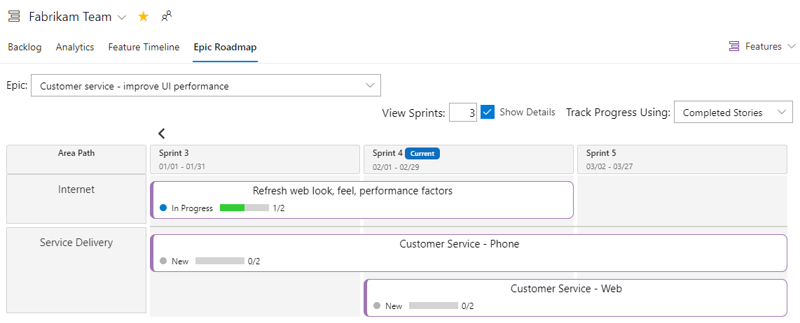
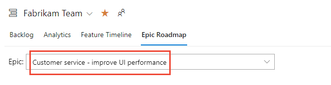
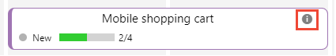
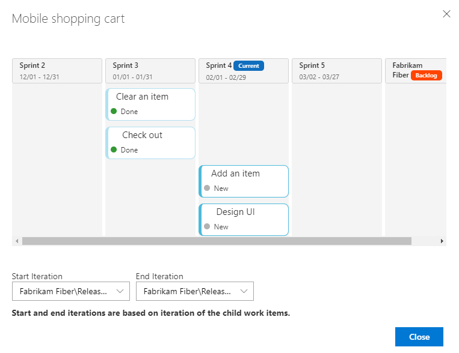
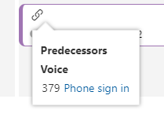

# View progress using the Epic Roadmap 

[!INCLUDE [temp](../includes/version-vsts-tfs-2017-on.md)]

Similar to the Feature Timeline, the Epic Roadmap supports portfolio management by providing a calendar view of a single epic and it's child features. Within each epic roadmap view, you can drill down to see details at the feature and requirements level.  

> [!div class="mx-imgBorder"]  
> 
> 
> [!NOTE]   
> The Feature Timeline and Epic Roadmap extension is not a supported feature of Azure Boards and therefore not supported by the product team. For questions, suggestions, or issues you have when using the extension, visit the extension page.  

Use the Epic Roadmap to focus on a single epic and to support the following tasks: 

- Support roadmap planning  
- View work that spans several iterations
- Produce reports at each business level to show high and low-level progress views  
- Adjust sprint assignments to child work items  
- View dependencies linked to features 

> [!NOTE]   
> The Feature Timeline and Epic Roadmap  extension is available on TFS 2017 Update 2 and later versions. You can download it from the [Marketplace for Azure DevOps, Feature Timeline and Epic Roadmap](https://marketplace.visualstudio.com/items?itemName=ms-devlabs.workitem-feature-timeline-extension).

## Minimum Viable Product (MVP)

Agile methodologies favor defining a Minimum Viable Product (MVP) over Critical Path Management (CPM). An MVP defines a product with just enough features to satisfy early adopters. You then define and complete additional features after receiving feedback from the early adopters users. By gleaning insights from an MVP, you're more likely to decrease development costs and risks.  

By using MVP, you identify the shortest path and dependencies by performing these tasks: 

- Define requirements, features, and epics that support MVPs 
- Prioritize your requirements, features, and epics to work on the most important work to deliver your MVPs
- Group features under epics, and requirements under features. 

[!INCLUDE [note-requirements](../includes/note-requirements-terms.md)]

For additional context, see [Running a lean startup on Azure DevOps](https://medium.com/@giladkhen/running-a-lean-startup-on-azure-devops-5934ced2cc42). 

[!INCLUDE [section-portfolio-backlog-requirements](../includes/section-portfolio-backlog-requirements.md)]

## Prerequisites

- Install the [Feature Timeline and Epic Roadmap](https://marketplace.visualstudio.com/items?itemName=ms-devlabs.workitem-feature-timeline-extension) extension for the organization(s) or collection(s) for which you want to track progress at the epic and feature level. In order to install an extension, you must be a member of the Project Collection Administrator Group. To learn more, see [Install extensions](../../marketplace/install-extension.md). 
- To view the Epic Roadmap, you must be a member of the project and have view permissions to work items under the area path they are assigned to.
- To modify work items, you must have permissions to edit work items under the area path they are assigned to.  

## Define your epics, features, and stories 

The Epic Roadmap displays individual epics, and the features and requirements mapped to them. Features are grouped under the Area Path their assigned to, which generally corresponds to a feature team. Only those features that are children of an epic appear in the Epic Roadmap view. 

To use the Epic Roadmap, make the following definitions:

- Define teams and area paths to support the rollup of the team's work into features and epics. 
- Define sprints with dates for the project. Select sprints for the team.  
	> [!NOTE]   
	> Make sure you assign work items to a **flat set of sprints**. Assigning features to a hierarchy of sprints and child items to another set of sprints won't display correctly in the Epic Roadmap view.  
or work to be performed in some future iteration, you can leave the dates unset for the iteration and it will appear as the last sprint in the roadmap. 
- Make sure the team is subscribed to the sprints of interest. 
- Define epics and their child features. If no child work items are defined, then assign the feature to a sprint. 
- When child work items are defined, assign the child items to sprints. 
- To view progress by Effort, Story Points, or Size, assign values to those fields to the child requirements. 
- Once all child requirements are completed, set the State of the parent feature or epic to Done or Completed. Closed epics no longer appear in the drop-down list of the Epic Roadmap. 

> [!TIP]   
> To support roadmap planning, make sure your team has subscribed to several future iterations.  

To learn more, review the following articles:  
- [Create your backlog (Requirements)](../backlogs/create-your-backlog.md)  
- [Define features and epics](../backlogs/define-features-epics.md)  
- [Define area paths & assign to a team](../../organizations/settings/set-area-paths.md)  
- [Define iteration paths (sprints) & assign team iterations ](../../organizations/settings/set-iteration-paths-sprints.md)  

## Open Epic Roadmap 

You can access the Epic Roadmap from either your team's Kanban board or backlog. 

1. Open the Board or Backlog for your team, see [View portfolio progress with the Feature Timeline, Open Boards or Backlogs](feature-timeline.md#open-boards). 

1. Choose **Epic Roadmap** and then choose the Epic you want to view. 

	> [!div class="mx-imgBorder"]  
	> 

	If you don't see the **Epic Road** link, then the [Feature Timeline and Epic Roadmap](https://marketplace.visualstudio.com/items?itemName=ms-devlabs.workitem-feature-timeline-extension) extension isn't installed or enabled. Check with your Project Collection Administrator to request that it be installed. To learn more, [Request and approve extensions](../../marketplace/request-extensions.md). 

2. Choose the Epic you want to view from the drop-down menu. 

	> [!div class="mx-imgBorder"]  
	> 
	
4. Customize your view. 
 
	- **View Sprints**: Enter the number of iterations to show. The maximum number is 11. 
		> [!NOTE]  
		> Sprint labels may not display for iterations above six, however, the calendar view displays the iterations.
	- **Show Details**: Displays progress bars of Feature child items
	- **Track Progress Using**: Progress bars indicate completion based on child requirements or overall total effort. 

## Drill-down to view details 

1. To view the requirements linked to a feature, choose the  info :::image type="icon" source="../media/icons/info.png" border="false":::  icon for that feature. 

	> [!div class="mx-imgBorder"]  
	> 

	A dialog opens showing the child items of the feature. 

	> [!div class="mx-imgBorder"]  
	> 

	The Start and End iterations are derived from the iteration paths assigned to the child work items. You can change those values by selecting new Start and End iterations from the drop down path. 

1. To view the dependency linked to a feature, choose the :::image type="icon" source="../media/icons/icon-links-tab-wi.png" border="false"::: link icon for that feature. 

	> [!div class="mx-imgBorder"]  
	> 

::: moniker range="azure-devops"

> [!NOTE]   
> Another tool that supports dependency views is [Delivery Plans](../plans/track-dependencies.md).
::: moniker-end

## Related articles

- [Review team delivery plans](../plans/review-team-plans.md)
- [View portfolio progress with the Feature Timeline](feature-timeline.md) 
- [Plan and track dependencies using the Dependency Tracker](dependency-tracker.md)

## Related Marketplace extensions

- [Work Item Visualization](https://marketplace.visualstudio.com/items?itemName=ms-devlabs.WorkItemVisualization) 
 
