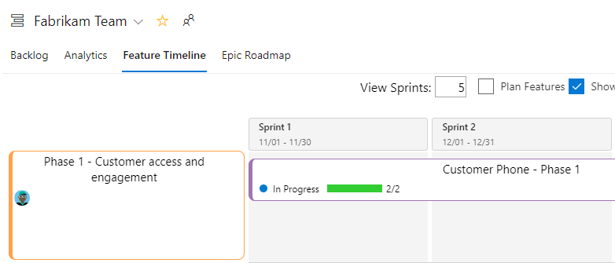
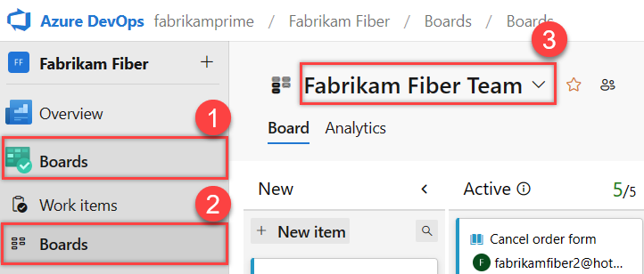
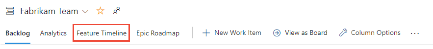
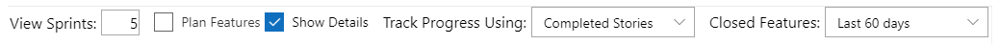
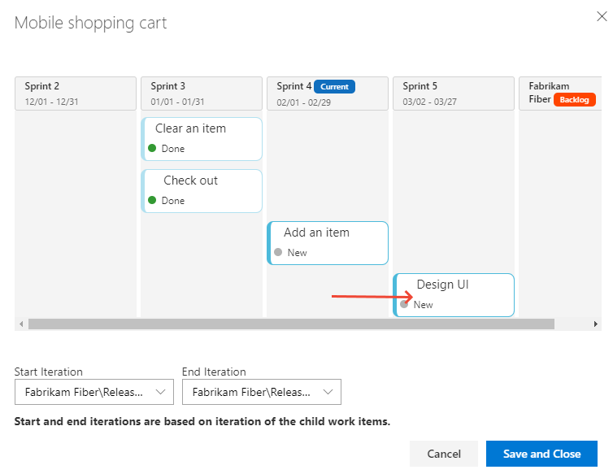

 
# View portfolio progress with the Feature Timeline 

[!INCLUDE [temp](../includes/version-vsts-tfs-2017-on.md)]

The Feature Timeline supports portfolio management by providing an all-up progress view of features grouped by their epic parents. This view provides you with calendar views of feature progress with the ability to drill down to see details at the requirements level. 

[!INCLUDE [temp](../../includes/lightbox-image.md)] 

> [!NOTE]   
> The Feature Timeline and Epic Roadmap extension is not a supported feature of Azure Boards and therefore not supported by the product team. For questions, suggestions, or issues you have when using the extension, visit the extension page. 

Use the Feature Timeline to support the following tasks: 

- Support roadmap planning  
- Produce reports at each business level to show high and low-level progress views  
- Adjust sprint assignments to child work items  

> [!NOTE]   
> The Feature Timeline and Epic Roadmap extension is available on TFS 2017 Update 2 and later versions. You can install it from the [Marketplace for Azure DevOps, Feature Timeline and Epic Roadmap](https://marketplace.visualstudio.com/items?itemName=ms-devlabs.workitem-feature-timeline-extension).

[!INCLUDE [section-portfolio-backlog-requirements](../includes/section-portfolio-backlog-requirements.md)]

## Prerequisites

- Install the [Feature Timeline and Epic Roadmap](https://marketplace.visualstudio.com/items?itemName=ms-devlabs.workitem-feature-timeline-extension) extension for the organization(s) or collection(s) for which you want to track progress at the epic and feature level. In order to install an extension, you must be a member of the Project Collection Administrator Group. To learn more, see [Install extensions](../../marketplace/install-extension.md). 
- To view the Feature Timeline, you must be a member of the project and have view permissions to work items under the area path they are assigned to.
- To modify work items, you must have permissions to edit work items under the area path they are assigned to.   

## Define your features and requirements
 
The Feature Timeline is designed to display features and the progress made to their child requirements. The Feature Timeline displays features grouped under epics when they are linked to parent epics. Ungrouped features appear at the bottom of the view. 

[!INCLUDE [note-requirements](../includes/note-requirements-terms.md)]

To gain the most from the Feature Timeline view, make the following definitions:

- Define teams and area paths to support the rollup of the team's work into features and epics. 
- Define sprints with dates for the project. Select sprints for the team.  
	> [!NOTE]   
	> Make sure you assign work items to a **flat set of sprints**. Assigning features to one hierarchy of sprints and child items to another won't display correctly in the Feature Timeline view.  
- For work to be performed in some future iteration, you can leave the dates unset for the iteration and it will appear as the last sprint in the roadmap. 
- Make sure the team is subscribed to the sprints of interest. 
- Define features and child work items. If no child work items are defined, then assign the feature to a sprint. 
- When child work items are defined, assign the child items to sprints. 
- To view progress by Effort, Story Points, or Size, assign values to those fields to the child requirements. 
- Once all child requirements are completed, set the State of the parent feature or epic to Done or Completed. Closed epics and features no longer appear in the Feature Timeline.  

> [!TIP]   
> To support roadmap planning, make sure your team has subscribed to several future iterations.  

To learn more, review the following articles:  
- [Create your backlog (Requirements)](../backlogs/create-your-backlog.md) 
- [Define features and epics](../backlogs/define-features-epics.md) 
- [Configure a hierarchy of teams](../plans/configure-hierarchical-teams.md) 
- [Define area paths & assign to a team](../../organizations/settings/set-area-paths.md)  
- [Define iteration paths (sprints) & assign team iterations ](../../organizations/settings/set-iteration-paths-sprints.md)  

<a id="open-boards" />

## Open Boards or Backlogs 

You can access the Feature Timeline from either your team's Kanban board or backlog. 

Here we open Boards. 

::: moniker range=">= azure-devops-2020"

1. Check that you selected the right project, and select **Boards** > **Boards**. Then select the correct team from the team selector menu. 

	> [!div class="mx-imgBorder"]  
	>   

	To select another team's board, open the selector. Then select a different team, or select the  **Browse all team boards** option. Or, you can enter a keyword in the search box to filter the list of team backlogs for the project.

	> [!div class="mx-imgBorder"]  
	>  

::: moniker-end

::: moniker range="azure-devops-2019"

1. Check that you selected the right project, and select **Boards** > **Boards**. Then select the correct team from the team selector menu. 

	> [!div class="mx-imgBorder"]  
	>   

	To select another team's board, open the selector. Then select a different team, or select the  **Browse all team boards** option. Or, you can enter a keyword in the search box to filter the list of team backlogs for the project.

	> [!div class="mx-imgBorder"]  
	>  

::: moniker-end

::: moniker range=">= tfs-2017 <= tfs-2018"

1. To view your Kanban board, open your project from a web browser. Select **Work** > **Backlogs** > **Stories**, and then select **Board**. 

	> [!div class="mx-imgBorder"]  
	> 

	If you don't see **Work**, your screen size might be reduced. Select the three dots (:::image type="icon" source="../../media/ellipses-reduced-screen-size.png" border="false":::) icon. Then select **Work** > **Backlogs** > **Board**.   

	> [!div class="mx-imgBorder"]  
	>    

1. To select another team, open the project and team selector. Select a different team, or select the **Browse** option.  

   > [!div class="mx-imgBorder"]  
   >   

   Your Kanban board appears. 
	  
	> [!div class="mx-imgBorder"]  
	>    

::: moniker-end   

## Open the Feature Timeline

Choose **Feature Timeline**. 

> [!div class="mx-imgBorder"]  
> 

If you don't see the **Feature Timeline** link, then the [Feature Timeline and Epic Roadmap](https://marketplace.visualstudio.com/items?itemName=ms-devlabs.workitem-feature-timeline-extension) extension isn't installed or enabled. Check with your Project Collection Administrator to request that it be installed. To learn more, [Request and approve extensions](../../marketplace/request-extensions.md). 

<a id="customize" /> 

## Customize your view

You can customize your view of the Feature Timeline with the controls shown in the following image:

> [!div class="mx-imgBorder"]  
>   

- **View Sprints**: Enter the number of iterations to show. The maximum number is 11. 
	> [!NOTE]  
	Sprint labels may not display for iterations above six, however, the calendar view represents those iterations.
- **Plan Features**: Opens a side panel of additional features participating in a Portfolio Plan. 
- **Show Details**: Displays progress bars of Feature child items
- **Track Progress Using**: Progress bars indicate completion based on child requirements or overall total effort. 
- **Closed Features**: Filters the Features based on those closed within the selected time frame. 

> [!NOTE]  
> The Plan Features is in preview and available for Azure DevOps Services only at this time. Use of this feature integrates with Portfolio plans. Portfolio Plans are  not yet documented.

<a id="drill-down" /> 

## Drill-down and change Start and End iterations 
 
1. To view the requirements linked to a feature, choose the  :::image type="icon" source="../media/icons/info.png" border="false":::  info icon for that feature. 

	> [!div class="mx-imgBorder"]  
	> 

	A dialog opens showing the child items of the feature. 

	> [!div class="mx-imgBorder"]  
	> 

	The Start and End iterations are derived from the iteration paths assigned to the child work items. You can change those values by selecting new Start and End iterations from the drop down path. 

1.	Or, you can also drag and drop a child item to a new iteration. 

	> [!div class="mx-imgBorder"]  
	> 

## Q & A

### How can I view the roadmap, the next three sprints? 

A: Make sure you enter sufficient number of sprints to display the next three sprints, and assign work items to the next three sprints. Use the Planning pane to assign work items to sprints through drag-and-drop. To learn how, see [Assign backlog items to a sprint](../sprints/assign-work-sprint.md).

## Related articles

- [Configure and customize Azure Boards](../configure-customize.md) 
- [Review team delivery plans](../plans/review-team-plans.md)  
- [View progress using the Epic Roadmap](epic-roadmap.md)  

## Related Marketplace extensions

- [Work Item Visualization](https://marketplace.visualstudio.com/items?itemName=ms-devlabs.WorkItemVisualization) 
