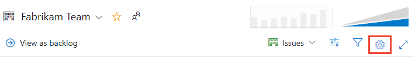
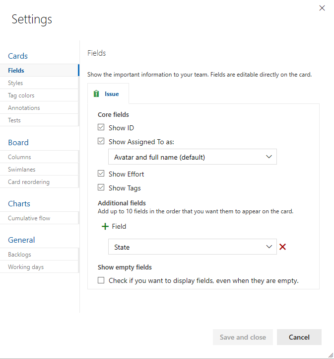
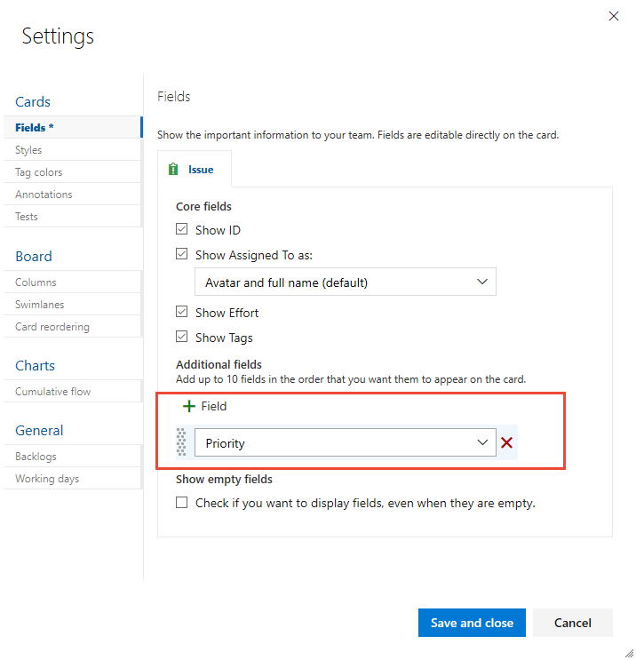
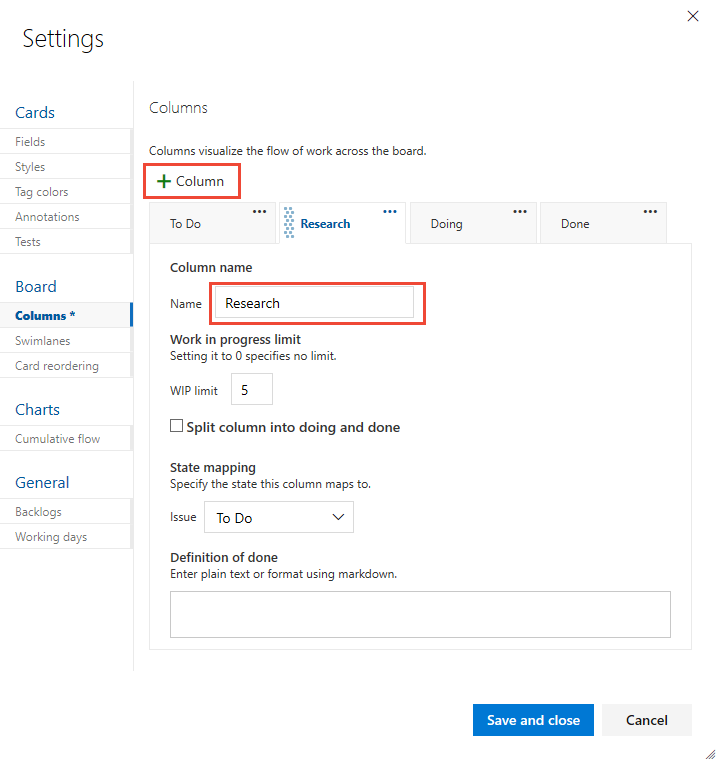
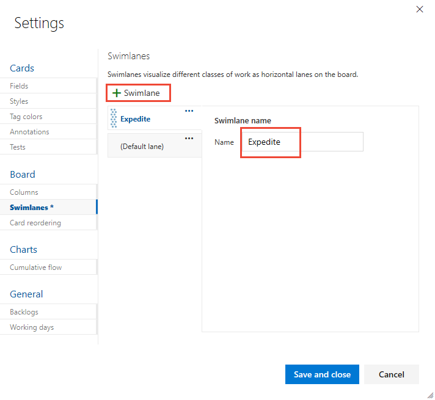
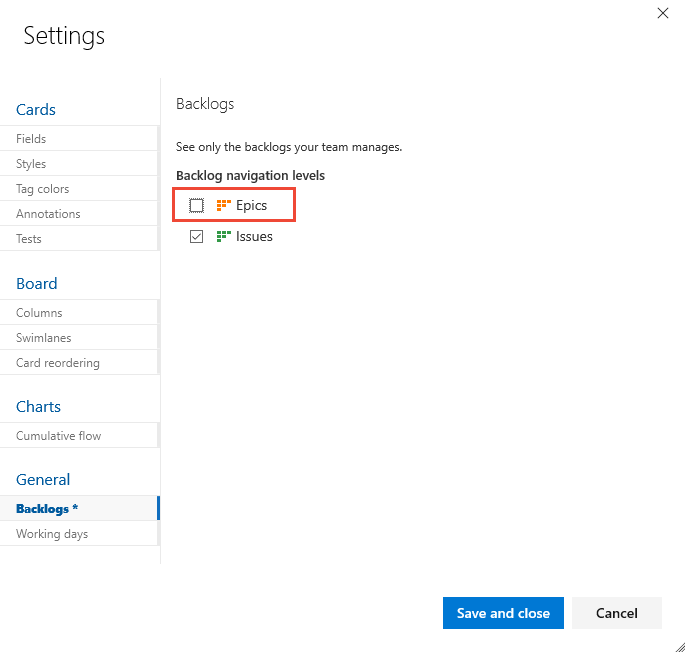
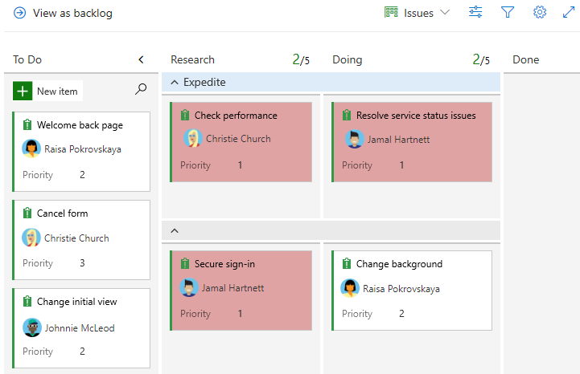

# Customize your boards

[!INCLUDE [temp](../_shared/version-vsts-only.md)]

This article shows how to customize a Kanban board for the Basic process. You have one Kanban board for each active product or portfolio backlog. 

> [!IMPORTANT]  
> **Select the version that meets your location and process**:
> We are experimenting with a new acquisition model which is 
> currently available for users located in the United States and that sign up through [azure.com/boards](https://azure.microsoft.com/en-us/services/devops/boards/?nav=min). This model supports a new Basic process.  
> For International users and others who sign up through another method, the Agile process is used. Select your version of this article based on your location and process used.
> - [**Basic process**](customize-boards.md?toc=/azure/devops/boards/get-started/toc.json&bc=/azure/devops/boards/get-started/breadcrumb/toc.json)
> - [**Agile process**](customize-boards-agile.md?toc=/azure/devops/boards/get-started-agile/toc.json&bc=/azure/devops/boards/get-started-agile/breadcrumb/toc.json) 

You can configure your Kanban board in several ways to support specific tracking needs. For example:  
- Update fields directly from the card  
- Highlight cards based on field assignments  
- Add columns to track other workflow states  
- Add swimlanes to expedite work or differentiate work assigned to different service classes. 

Each team can customize their Issues and Epics boards and sprint Taskboards. 

<!---
## Prerequisites

- To configure a board, you must connect to a project. If you don't have a project yet, [create one in Azure DevOps](sign-up-invite-teammates.md). 
- Also, you must be added as a team administrator for your team, or be a member of the Project Administrators or Project Collection Administrators group. If you created the project, then you have permissions. 
- If you have been granted **Stakeholder** access, you can configure team settings as long as you have been added to one of the administrator roles or groups.  

For details, see [Default permissions and access for Azure Boards](permissions-access-boards.md)

-->

## Open Settings for the board 

0.  [Open your Kanban board](track-issues-tasks.md). <!--- If you're not a team admin, [get added as one](../../organizations/settings/add-team-administrator.md). Only team and project admins can customize the Kanban board. -->

0. Choose the  gear icon to configure the board setting settings.  

	> [!div class="mx-imgBorder"]
	>   

	The Settings dialog opens. 
	
	> [!div class="mx-imgBorder"]
	>  
	
0. Choose one of the following tabs based on what you want to customize:  

	**Common customizations:**  
	<ul>
	<li>**Fields**: Set what fields appear on cards.</li>
	<li>**Columns**: Add, rename, and configure columns for the board.</li>
	<li>**Swimlanes**: Add swimlanes to a board to easily track high priority levels, distinguish different service classes, or track blocked items.</li>
	<li>**Backlogs**: Enable or disable issues or epics from being tracked on backlogs and boards.</li>
	</ul>
	**Less common customizations:**  
	<ul>
	<li>**Styles**: Specify the card color to display based on field criteria you specify.</li>
	<li>**Tag colors**: Specify the tag color to display based on tag criteria you specify.</li>
	<li>**Annotations**: Enable or disable task or test annotations.</li>
	<li>**Tests**: Configure how you want tests to appear and behave on the cards.</li>
	<li>**Card reordering**: Choose to enable/disable changing of the backlog priority when dragging and dropping cards on the board.</li>
	<li>**Cumulative flow**: Set how you want the cumulative flow diagram to display.</li>
	<li>**Working days**: Set the active weekdays to use when tracking capacity and burndown.</li>
	</ul>

## Customize fields

To quickly assign fields from the card without having to open the work item, add them to display on the card. 

0. To configure the fields displayed on cards, choose the **Fields** tab. 

0. Check or uncheck those fields you want to display or not display on the board.

0. To add a field, choose  **Field** to add a field. 

	For example, here we uncheck **Show ID** and add the **Priority** field. 

	> [!div class="mx-imgBorder"]
	>  
	
0. To remove a field, choose the  delete icon next to the field.

0. Choose **Save and close** when done. To learn more, see [Customize cards](../boards/customize-cards.md). 

## Customize columns

0. To add a column or change column settings, choose **Columns** tab.

	Here we choose  **Column**, and then specify the name as **Research**.  

	> [!div class="mx-imgBorder"]
	>  

0. Choose **Save and close** when done. To learn more about column settings, see [Add columns to your Kanban board](../boards/add-columns.md). 

## Customize swimlanes 

0. To add a swimlane, choose **Swimlanes** tab and choose  **Swimlane**, and then specify the name.  

	Here we label the swimlane **Expedite**. 

	> [!div class="mx-imgBorder"]
	>  

0. Choose **Save and close** when done. To learn more about working with swimlanes , see [Expedite work with swimlanes](../boards/expedite-work.md). 

## Add or remove backlog levels

If you decide you don't want to use Epics to track work, you can turn it off and it won't show up as a board or backlog. By default, it is enabled for new projects.

0. Choose **Backlogs** tab and uncheck the work item type you no longer want to track on backlogs and boards.

	> [!div class="mx-imgBorder"]
	>  

0. Choose **Save and close** when done. 

	> [!NOTE]   
	> Contributors will still be able to create Epics from other views, they just won't be able to view Epics within a backlog or board. To completely disable the Epic work item type, see [Add and manage work item types, Enable or disable a WIT](../../organizations/settings/work/customize-process-wit.md#enable-disable)

## Review your changes 

After you close the settings dialog, refresh (F5) your board to view your changes. Verify that all changes appear as expected, or revisit the Settings dialog to make a change. 

Here we show the customizations made in this article. The following image also shows a style applied to the color when the Priority=1. 

> [!div class="mx-imgBorder"]
>  

## Try this next  
 
> [!div class="nextstepaction"]
> [Manage your project](manage-boards.md) 

## Related articles

* [Customize cards](../boards/customize-cards.md) (addresses **Styles**, **Tag colors**, **Annotations** and **Tests**)  
* [Card reordering](../boards/reorder-cards.md)
* [Work in Progress limits](../boards/wip-limits.md)  
* [Split columns](../boards/split-columns.md)   
* [Definition of Done](../boards/definition-of-done.md)  
* [Set working days](../../organizations/settings/set-working-days.md)  
* [Cumulative flow](../../report/dashboards/cumulative-flow.md)  