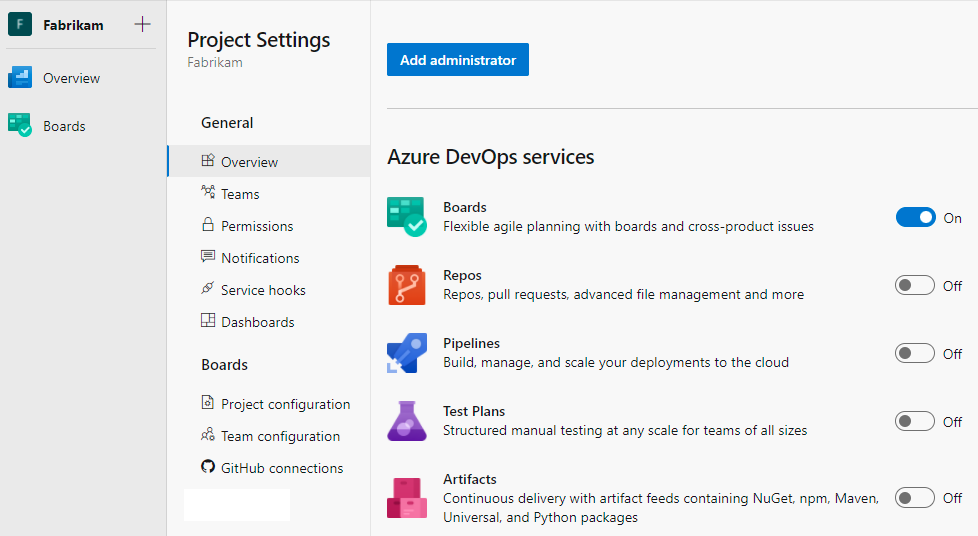

# Configure and manage your Azure Boards project

[!INCLUDE [version-lt-eq-azure-devops](../../includes/version-lt-eq-azure-devops.md)]

You can start using Azure Boards project and configure resources as you go. No up-front work is required. Most settings define defaults.

As an organization owner or a project administrator, there are a few items you might want to attend to at the start. If you own a large organization, you'll want to consider other tasks to structure your projects. More tasks can be structured to help support multiple teams or software development apps.

Specifically, consider doing one or more of the following tasks: 

- [Add users to your project](#add-users). To assign users to issues or tasks, you need to add them to your project. 
- [Share your project vision](#share-vision). To support people who will contribute to your project, provide them some directions via the project summary page, or through your [project wiki](../../project/wiki/about-readme-wiki.md). 
- [Define area and iteration paths](#areas-iterations). Define Iteration Paths if you work with Scrum methods or want to time-box your issues and tasks.
- [Customize your issues or tasks](#customize). If you need more fields to track data, or other type of work item, you can customize your process.

[!INCLUDE [add-users-project](../../includes/get-started/add-users-project.md)]  

[!INCLUDE [share-project-vision](../../includes/get-started/share-project-vision.md)]  

::: moniker range=">= azure-devops-2019"  

## Remove unused services 

To simplify the web portal user interface, you can disable select services. For example, if you use a project only to plan and track work, then disable all services except for **Boards** as shown in the following image. Once you disable the services, refresh your browser to see the changes take effect. To learn more, see 
[Turn a service on or off](../../organizations/settings/set-services.md).

> [!div class="mx-imgBorder"]
> 

::: moniker-end   
 

## Manage security and permissions

Access to select tasks is controlled by permissions and security groups. To quickly understand the defaults configured for your project, see [Default permissions and access](../../organizations/security/permissions-access.md).  

[!INCLUDE [project-level-permissions](../../organizations/security/includes/project-level-permissions.md)]

To learn more about security and setting permissions at the project-level, review the following articles:

- [Get started with permissions, access, and security groups](../../organizations/security/about-permissions.md)   
- [Change permissions at the project-level](../../organizations/security/change-project-level-permissions.md) 
 
### Add members to the Project Administrators group 

[!INCLUDE [add-project-administrators](../../includes/get-started/add-project-administrators.md)]  

### Grant or restrict permissions  

Permissions are managed at the following three levels and through role-based assignments. 
- object
- project
- organization or collection

As a member of the **Project Administrators** group, you can grant or restrict permissions for all objects and at the project-level. To delegate specific tasks to others, we recommend that you add them to a built-in or custom security group or add them to a specific role. To learn more, see the following articles.

- [Role-based permissions](../../organizations/security/about-permissions.md#role-based-permissions)
- [Add or remove users or groups, manage security groups](../../organizations/security/add-remove-manage-user-group-security-group.md)
- [Grant or restrict access to select features and functions](../../organizations/security/restrict-access.md)   
- [Set object-level permissions](../../organizations/security/set-object-level-permissions.md) 

[!INCLUDE [review-notifications](../../includes/get-started/review-notifications.md)] 

[!INCLUDE [determine-traceability-requirements](../../includes/get-started/determine-traceability-requirements.md)]  

## Configure and customize Azure Boards 

You can configure and customize Azure Boards to support a number of business requirements for planning and tracking work. At a minimum, you'll want to configure the following elements:

- Area paths to group work items by team, product, or feature area
- Iteration paths to group work into sprints, milestones, or other event-specific or time-related periods. 

If you're new to Azure Boards and want an indepth overview of what you can configure and customize, see [Configure and customize Azure Boards](../configure-customize.md).

[!INCLUDE [define-area-iteration-paths](../../includes/get-started/define-area-iteration-paths.md)] 
 

[!INCLUDE [customize-work-tracking](../../includes/get-started/customize-work-tracking.md)] 

## Install and manage extensions 

To add new features and capabilities to Azure Boards, install extensions from the [Azure DevOps Marketplace](https://marketplace.visualstudio.com/azuredevops). You can install [free, preview, or paid](../../marketplace/faq-extensions.yml) 

To learn more, see [Install free extensions for Azure DevOps](../../marketplace/install-extension.md). To learn about building your own Azure DevOps extensions, see [developing](../../extend/overview.md) and [publishing](../../extend/publish/overview.md) extensions.

## Integrate with other services 

Azure DevOps supports integration with Azure, GitHub, and many other services. As a member of the **Project Administrators** group, you can configure integration with many of these services. To learn more, see the following articles. 

- [Azure DevOps and GitHub integration overview](../../cross-service/github-integration.md)
- [Azure Boards and GitHub integration](../github/index.md)
- [Azure Boards with Microsoft Teams](../integrations/boards-teams.md) 
- [Azure Boards with Slack](../integrations/boards-slack.md) 
- [Integrate with service hooks](../../service-hooks/overview.md) 

[!INCLUDE [add-teams-to-scale](../../includes/get-started/add-teams-to-scale.md)] 

## Related articles

- [Web portal navigation](../../project/navigation/index.md)  
- [Set user preferences](../../organizations/settings/set-your-preferences.md)  
- [Enable a preview feature](../../project/navigation/preview-features.md)   
- [Get started managing your organization or project collection](../../user-guide/manage-organization-collection.md)