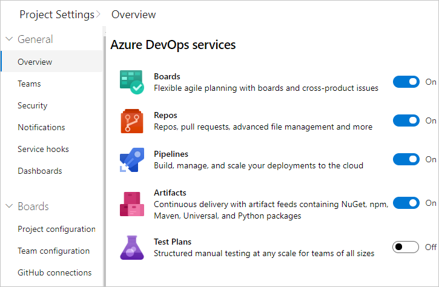

# Configure settings and manage your Azure Boards project

[!INCLUDE [temp](../_shared/version-vsts-only.md)]

You can start using Azure Boards and configure resources as you go. No up-front work is required. Most settings define defaults.

As an organization owner or a project admin, there are a few items you might want to attend to at the start, to ensure a smooth operational experience. If you own a large organization, you'll want to consider additional tasks to structure your projects to support multiple teams or software development apps.

Specifically, consider performing one or more of the following tasks: 
- [Add users to your project](#add-users). To assign users to issues or tasks, you need to add them to your project. 
- [Share your project vision](#share-vision). To support people who'll contribute to your project, provide them some directions via the project summary page, or through your [project wiki](../../project/wiki/index.md). 
- [Define area and iteration paths](#areas-iterations). If you work with Scrum methods or want to time-box your issues and tasks, you'll want to define Iteration Paths.
- [Customize your issues or tasks](#customize). If you need additional fields to track data, or other type of work item, you can customize your process.  

<a id="add-users" />
## Add users to your project 

The first task is to ensure that all members of your organization or group are added to your organization and projects. For small groups, using [Microsoft Accounts](https://account.microsoft.com/account) to add users to your organization and projects works fine. For details, see [Add users](../../organizations/accounts/add-organization-users.md).

<a id="share-vision" />
## Share your project vision and support collaboration 

Each project has a summary page where you can share information through **README** files or by pointing to a project Wiki. To orient users who are new to your project and share established processes and procedures, we recommend that you [set up your project summary page](../../organizations/projects/project-vision-status.md) or [provision a Wiki](../../project/wiki/wiki-create-repo.md). 

<a id="areas-iterations" />
## Define area and iteration paths for work tracking
If you support several products or feature areas, you can assign issues and tasks (Basic process) or user stories and tasks (Agile process) to a feature area by defining [Area Paths](../../organizations/settings/set-area-paths.md). To assign work items to specific time intervals, also known as sprints, you'll want to configure [Iteration Paths](../../organizations/settings/set-iteration-paths-sprints.md). To use the Scrum tools&mdash;sprint backlogs, taskboards, and team capacity&mdash;you need to configure several sprints. For an overview, see [About areas and iteration paths](../../organizations/settings/about-areas-iterations.md).  

> [!div class="mx-tdBreakAll"] 
> |Iterations| Areas |
> |-------------|----------| 
> | |   | 

<a id="customize" />
## Customize your issues or tasks     
You and your team can start using all work-tracking tools immediately after you create a project. But often, one or more users want to customize the experience to meet one or more business needs. Although you can customize the process easily through the user interface, you'll want to establish a methodology for who will manage the updates and evaluate requests. 

> [!NOTE]   
> By default, organization owners and users added to the **Project Collection Administrators** security group are granted permission to create, edit, and manage processes used to customize the work-tracking experience. If you want to lock down who is able to perform these tasks, you can set permissions at the organization-level to **Deny**.  

To learn more, see these articles:  
- [About process customization and inherited processes](../../organizations/settings/work/inheritance-process-model.md)  
- [Customize a project](../../organizations/settings/work/customize-process.md)  
- [Add and manage processes](../../organizations/settings/work/manage-process.md)  

## Review and update notifications

A number of notifications are predefined for each project. Notifications are based on subscription rules. Subscriptions arise from the following areas:

- [Out-of-the-box or default subscriptions](../../notifications/oob-built-in-notifications.md).
- [Team notifications](../../notifications/howto-manage-team-notifications.md), managed by a team administrator.
- Project notifications, managed by a member of the Project Administrators group.

If users believe they're getting too many notifications, they can [opt out of a subscription](../../notifications/howto-manage-personal-notifications.md). 

> [!div class="mx-imgBorder"]  
>  

## Install and manage extensions 

To add new features and capabilities to Azure Boards, install extensions from the [Visual Studio Marketplace](https://marketplace.visualstudio.com/azuredevops). You can install [free, preview, or paid](../../marketplace/faq-extensions.md#difference) 

To learn more, see [Install free extensions for Azure DevOps](../../marketplace/install-extension.md). To learn about building your own Azure DevOps extensions, see [developing](https://aka.ms/vsoextensions) and [publishing](https://aka.ms/vsmarketplace-publish) extensions.

## Related articles

- [Web portal navigation](../../project/navigation/index.md)  
- [Set user preferences](../../organizations/settings/set-your-preferences.md)  
- [Enable a preview feature](../../project/navigation/preview-features.md)   
- [Get started as an administrator for Azure DevOps](../../user-guide/project-admin-tutorial.md)

<!---

## Enable or remove services from the user interface

To simplify the web portal user interface, you can disable select services. If you use a project only to log bugs, then you can remove all services except for **Boards**. 

This example shows that **Test Plans** has been disabled:

> [!div class="mx-imgBorder"]  
>    

--> 

