# Plan and track work in Azure Boards

[!INCLUDE [version-lt-eq-azure-devops](../../includes/version-lt-eq-azure-devops.md)]

In this article, learn how to use Azure Boards to plan and track your work using an **Agile**, **Basic**, **Scrum**, or **Capability Maturity Model Integration (CMMI)** process. For more information about these processes, see [Choose a process](../work-items/guidance/choose-process.md).

[!INCLUDE [temp](../includes/basic-process-note.md)] 

#### [Agile process](#tab/agile-process) 

The Agile process uses various work item types such as user stories, tasks, bugs, features, and epics to plan and track work. Begin by adding user stories and grouping them into features if needed. You can add tasks to a user story to track more details.

> [!div class="mx-tdCol2BreakAll"]
> |Work item types| Backlog hierarchy |
> |------|---------|
> |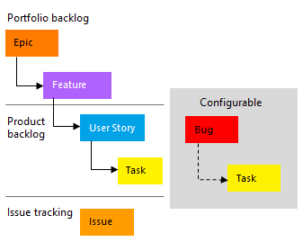 | 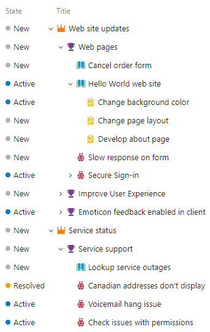 |

Within each work item form, you can describe the work to be done, assign work to project contributors, track status, and collaborate with others through the Discussion section. 

We show you how to add user stories and child tasks from the web portal and add details to those work items. 

#### [Basic process](#tab/basic-process) 

The Basic process offers three work item types - epics, issues, and tasks - for planning and tracking work. Begin by adding issues to track user stories, bugs, or feature items. For grouping, define epics. To track more details, add tasks to an issue.

> [!div class="mx-tdCol2BreakAll"]
> |Work item types| Backlog hierarchy |
> |------|---------|
> | | 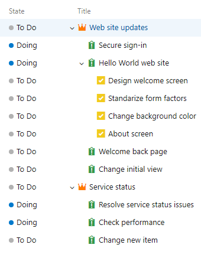 |

In each work item form, describe work, assign contributors, track status, and collaborate in the Discussion section. We show you how to add issues, child tasks, and work item details on the web portal.


#### [Scrum process](#tab/scrum-process) 

The Scrum process uses various work item types, including product backlog items, tasks, bugs, features, and epics, to plan and track work. Add product backlog items and group them into features if needed. Add child tasks to track more work details.  

> [!div class="mx-tdCol2BreakAll"]
> |Work item types| Backlog hierarchy |
> |------|---------|
> |  | 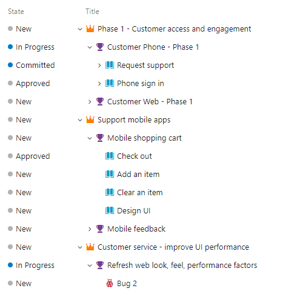  |

In each work item form, describe work, assign contributors, track status, and collaborate in the Discussion section. We show you how to add product backlog items, child tasks, and work item details on the web portal.


#### [CMMI process](#tab/cmmi-process) 

The CMMI process uses work item types such as requirements, tasks, bugs, features, and epics to plan and track work. Start by adding requirements and group them into features or epics if needed. Add child tasks to track more work details.

> [!div class="mx-tdCol2BreakAll"]
> |Work item types| Backlog hierarchy |
> |------|---------|
> | | 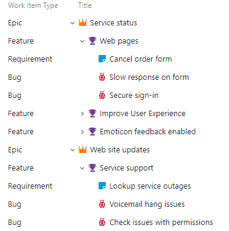  |

In each work item form, describe work, assign contributors, track status, and collaborate in the Discussion section. We show you how to add user stories, child tasks, and work item details on the web portal.

* * * 

## Prerequisites

::: moniker range="azure-devops"

- You must have **Basic** access and be a member of the Contributors or Project Administrators group to add work items to a board and use all other board features. 
- You must have **Stakeholder** access for a *private* project and be a member of the Contributors or Project Administrators group to view boards, open and modify work items, and add child tasks to a checklist. But, you can't reorder or reparent a backlog item using drag-and-drop, nor update a field on a card.
- You must have **Stakeholder** access for a *public* project and be a member of the Contributors or Project Administrators group to have full access to all Boards features. 

::: moniker-end

::: moniker range="azure-devops-2020"

- You must have **Basic** access and be a member of the Contributors or Project Administrators group to add work items to a board and use all other board features. 
- You must have **Stakeholder** access and be a member of the Contributors or Project Administrators group to view boards, open and modify work items, and add child tasks to a checklist. But, you can't reorder or reparent a backlog item using drag-and-drop, nor update a field on a card.

> [!NOTE]   
> To drag-and-drop cards to different, columns you must have [Azure DevOps Server 2020 Update 1](/azure/devops/server/release-notes/azuredevops2020u1#stakeholders-can-move-work-items-across-board-columns).  

::: moniker-end

::: moniker range="< azure-devops-2020"

- You must have **Basic** access and be a member of the Contributors or Project Administrators group to add work items to a board and use all other board features. 
- You must have **Stakeholder** access for a *private* project and be a member of the Contributors or Project Administrators group to view boards, open and modify work items, and add child tasks to a checklist. But, you can't reorder or reparent a backlog item using drag-and-drop, nor update a field on a card.
- You must have **Stakeholder** access for a *public* project and be a member of the Contributors or Project Administrators group to have full access to all Boards features. 

::: moniker-end

For more information, see [Default permissions and access for Azure Boards](permissions-access-boards.md).

::: moniker range="tfs-2018"
> [!NOTE]   
> The images shown in this article correspond to the latest version of Azure Boards. While they may differ from those shown in earlier, on-premises versions of Azure DevOps, they are similar in the functions described unless otherwise noted. 
::: moniker-end

<a id="define-new-work">  </a>

## Open your Kanban board 

A Kanban board is provisioned with the addition of each project and each team. You can only create or add Kanban boards to a project by adding another team. For more information, see [About teams and Agile tools](../../organizations/settings/about-teams-and-settings.md).

1. Sign in to your organization (```https://dev.azure.com/{your_organization}```) and go to your project.
2. Select **Boards** > **Boards**.  

   :::image type="content" source="media/plan-track-work/open-boards.png" alt-text="Screenshot showing two selections highlighted with red boxes, to open boards.":::

3. Select a board from the **All Team Boards** dropdown menu.

   :::image type="content" source="media/plan-track-work/select-from-all-team-boards-dropdown-menu.png" alt-text="Screenshot showing All Team Boards to choose from, listed in the dropdown menu.":::

## Add work items to your board

Work items on your board are automatically assigned the default **Area Path** and **Iteration Path** assigned to the team. For more information, see [Configure team settings](../../organizations/settings/manage-teams.md). 

#### [Agile process](#tab/agile-process) 

1. From the Stories board, choose **New item** and the stories you want to track. 

	> [!div class="mx-imgBorder"]  
	> 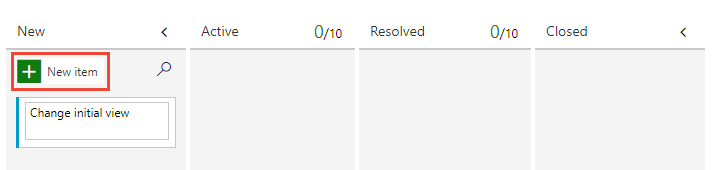 

1. Enter return and the system assigns a work item ID to the user story. 

	> [!div class="mx-imgBorder"]  
	>  

1. Add as many user stories as you need.  

> [!TIP]
> To quickly add features and child user stories, choose **Features** from the board selector. 
>:::image type="content" source="media/plan-track-work/choose-features-board.png" alt-text="Screenshot to Open the features board, Agile process.":::

#### [Basic process](#tab/basic-process) 

1. From the Issues board, choose **New item** and add the issues you want to track. 

	> [!div class="mx-imgBorder"]  
	>  

2. Enter return and the system assigns a work item ID to the issue. 

	> [!div class="mx-imgBorder"]  
	>  

3. Add as many issues as you need.  

> [!TIP]
> The Epics Kanban board is the best tool for quickly adding epics and issues that are children of those epics. To open the Epics board from the Issues board, choose **Epics** from the board selector. 
> :::image type="content" source="media/track-issues/choose-epics-board.png" alt-text="Screenshot to Open the Epics board, Basic process."::: 

#### [Scrum process](#tab/scrum-process) 

1. From the Backlog items board, choose **New item** and add the stories you want to track. 

	> [!div class="mx-imgBorder"]  
	> 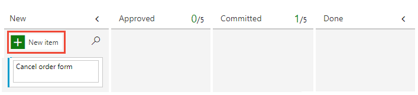 

1. Enter return and the system assigns a work item ID to the user story. 

	> [!div class="mx-imgBorder"]  
	> 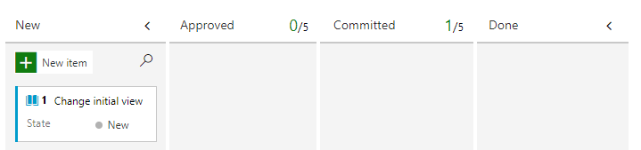 

1. Add as many backlog items as you need.  

> [!TIP]
> The Features Kanban board is the best tool for quickly adding features and product backlog items that are children of those features. To open the Features board from the Backlog items board, choose **Features** from the board selector. 
>:::image type="content" source="media/plan-track-work/choose-features-board-scrum.png" alt-text="Screenshot to Open the Features board, Scrum process.":::

The default Scrum process configuration doesn't enable the Epic backlog level for a team. To enable it, see [Select backlog navigation levels for your team](../../organizations/settings/select-backlog-navigation-levels.md).

#### [CMMI process](#tab/cmmi-process) 

1. From the Requirements board, choose **New item** and add the stories you want to track. 

	> [!div class="mx-imgBorder"]  
	>  

1. Enter return and the system assigns a work item ID to the user story. 

	> [!div class="mx-imgBorder"]  
	> 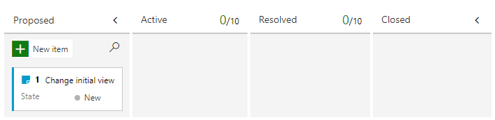 

1. Add as many requirements as you need.  

> [!TIP]
> The Features Kanban board is the best tool for quickly adding features and requirements that are children of those features. To open the Features board from the Requirements board, choose **Features** from the board selector. 
>:::image type="content" source="media/plan-track-work/choose-features-board-requirements.png" alt-text="Screenshot to Open the Features board, CMMI process.":::

* * *

## Add details to a board item

Select the issue or user story title to open it. Change one or more field values, add a description, or make a note in the **Discussion** section. You can also choose the  **Attachments** tab and drag-and-drop a file to share the file with others.  

#### [Agile process](#tab/agile-process) 

For example, here we assign the story to Raisa Pokrovskaya and add a discussion note, at-mentioning Raisa. 

> [!div class="mx-imgBorder"]
> 

Choose **Save & Close** when you're done.

#### [Basic process](#tab/basic-process) 

For example, here we assign the issue to Raisa Pokrovskaya and add a discussion note, at-mentioning Raisa. 

> [!div class="mx-imgBorder"]
> 

Choose **Save & Close** when you're done. 

#### [Scrum process](#tab/scrum-process) 

For example, here we assign the product backlog item to Christie Church and set an Effort level of 8. 

> [!div class="mx-imgBorder"]  
>  

Choose **Save & Close** when you're done. 

#### [CMMI process](#tab/cmmi-process) 

For example, here we assign the product backlog item to Jamal Hartnett and set Size to 8. 

> [!div class="mx-imgBorder"]  
>  

Choose **Save & Close** when you're done.  

#### CMMI-specific field descriptions

[!INCLUDE [temp](../includes/section-cmmi-field-descriptions.md)] 

* * *


### Field descriptions

[!INCLUDE [temp](../includes/section-basic-field-descriptions.md)] 

## Update work status

The State field tracks the status of a work item. With the Kanban board, you can quickly update the status of backlog items by dragging and dropping them to a different column.

#### [Agile process](#tab/agile-process) 

As work begins, drag the user story card from the **Backlog** column to the **Active** column. Once work is ready for review, move it to the **Resolved** column. After it's reviewed and accepted, move it to the **Closed** column. 

> [!div class="mx-imgBorder"]  
>  

#### [Basic process](#tab/basic-process) 

As work begins, drag the issue from the **To Do** column to the **Doing** column. Once it's completed, move it to the **Done** column. 

> [!div class="mx-imgBorder"]  
>  

#### [Scrum process](#tab/scrum-process) 

Once a backlog item is approved to start work, drag the backlog item card from the **New** column to the **Approved** column.  When work begins, drag the card to the **Committed** column. Once work has completed, move it to the **Done** column. 

> [!div class="mx-imgBorder"]  
> 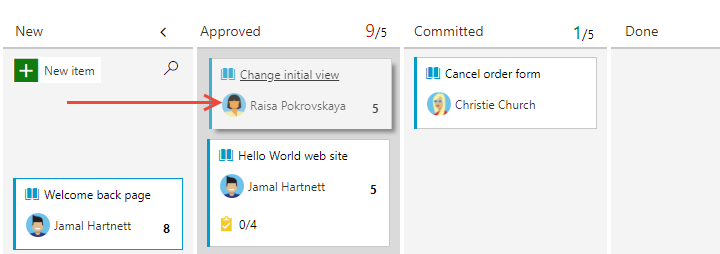 

#### [CMMI process](#tab/cmmi-process) 

As work begins, drag the requirement card from the **Backlog** column to the **Active** column. Once work is ready for review, move it to the **Resolved** column. After it's reviewed and accepted, move it to the **Closed** column. 

> [!div class="mx-imgBorder"]  
> 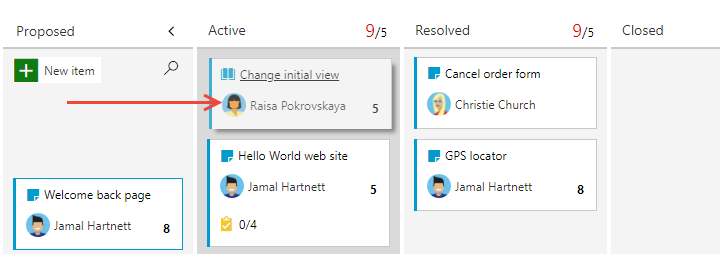 

* * *

> [!TIP]  
> To add or rename columns as needed, see [Customize your board](../configure-customize.md). 

## Add tasks 

Task checklists provide a quick and easy way to track elements of work that are important to support completing a backlog item. Also, you can assign individual tasks to different team members. 

> [!TIP]   
> Tasks that you create from the Kanban board are automatically assigned the **Area Path** and **Iteration Path** of their parent work item and show up on your sprint taskboard. 

Tasks that you create from the [sprint backlog](../sprints/assign-work-sprint.md) or [taskboard](../sprints/task-board.md) show up within tasks checklists on the Kanban board.  

#### [Agile process](#tab/agile-process) 

1. Select the  :::image type="icon" source="../../media/icons/actions-icon.png" border="false":::  actions icon for the story and select  **Add Task**.  

	> [!div class="mx-imgBorder"]  
	> 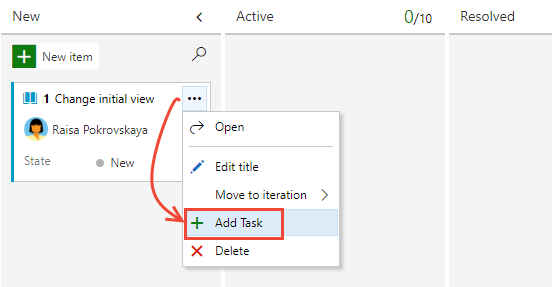 

	Enter a title for the task and select **Enter** when you're done.

	> [!div class="mx-imgBorder"]  
	> 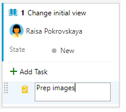 

2. If you have many tasks to add, keep typing your task titles and type Enter.   

	> [!div class="mx-imgBorder"]  
	>   

3. You can mark a task as done, expand or collapse the task checklist, or reorder and reparent tasks. 

	> [!div class="mx-tdCol2BreakAll"]  
	> |Mark a task as done |Reorder and reparent tasks | Expand or collapse the checklist| 
	> |------------------|--------------|--------------|  
	> |To mark a task as complete, check the task checkbox. The task State changes to **Done**.<br/>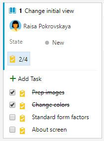 |To reorder a task, drag it within the checklist. To reparent a the task, drag it to another issue on the board.<br/>  |To expand or collapse a task checklist, simply choose the task annotation.<br/>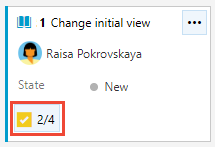 |  

#### [Basic process](#tab/basic-process) 

1. Select the  :::image type="icon" source="../../media/icons/actions-icon.png" border="false":::  actions icon for the issue and select  **Add Task**.  

	> [!div class="mx-imgBorder"]  
	> 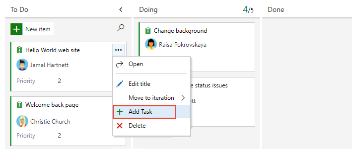 

	Enter a title for the task and type Enter when you're done.

	> [!div class="mx-imgBorder"]  
	>  

2. If you have various tasks to add, keep typing your task titles and type Enter.   

	> [!div class="mx-imgBorder"]  
	>   

3. You can mark a task as done, expand or collapse the task checklist, or reorder and reparent tasks. 

	> [!div class="mx-tdCol2BreakAll"]  
	> |Mark a task as done |Reorder and reparent tasks | Expand or collapse the checklist| 
	> |------------------|--------------|--------------|  
	> |To mark a task as complete, check the task checkbox. The task State changes to **Done**.<br/>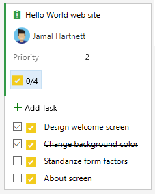 |To reorder a task, drag it within the checklist. To reparent a the task, drag it to another issue on the board.<br/>  |To expand or collapse a task checklist, simply choose the task annotation.<br/> |  

#### [Scrum process](#tab/scrum-process) 

1. To start adding tasks, choose the  :::image type="icon" source="../../media/icons/actions-icon.png" border="false":::  actions icon for the story and select the   **Add Task** option.  

	> [!div class="mx-imgBorder"]  
	>  

	Enter a title for the task and type Enter when you're done.

	> [!div class="mx-imgBorder"]  
	>  

1. If you have many tasks to add, just keep typing your task titles and type Enter.   

	> [!div class="mx-imgBorder"]  
	>   

2. You can mark a task as done, expand or collapse the task checklist, or reorder and reparent tasks. 

	> [!div class="mx-tdCol2BreakAll"]  
	> |Mark a task as done |Reorder and reparent tasks | Expand or collapse the checklist| 
	> |------------------|--------------|--------------|  
	> |To mark a task as complete, check the task checkbox. The task State changes to **Done**.<br/> |To reorder a task, drag it within the checklist. To reparent a the task, drag it to another issue on the board.<br/>  |To expand or collapse a task checklist, simply choose the task annotation.<br/> |  

#### [CMMI process](#tab/cmmi-process) 

1. To start adding tasks, choose the  :::image type="icon" source="../../media/icons/actions-icon.png" border="false":::  actions icon for the story and select the   **Add Task** option.  

	> [!div class="mx-imgBorder"]  
	>  

	Enter a title for the task and type Enter when you're done.

	> [!div class="mx-imgBorder"]  
	>  

1. If you have various tasks to add, just keep typing your task titles and type Enter.   

	> [!div class="mx-imgBorder"]  
	>   

2. You can mark a task as done, expand or collapse the task checklist, or reorder and reparent tasks. 

	> [!div class="mx-tdCol2BreakAll"]  
	> |Mark a task as done |Reorder and reparent tasks | Expand or collapse the checklist| 
	> |------------------|--------------|--------------|  
	> |To mark a task as complete, check the task checkbox. The task State changes to **Done**.<br/> |To reorder a task, drag it within the checklist. To reparent a the task, drag it to another issue on the board.<br/>  |To expand or collapse a task checklist, simply choose the task annotation.<br/> |  

* * *

## Add details to a task

If you have details you want to add about a task, choose the title, to open it. Change one or more field values, add a description, or make a note in the **Discussion** section. Choose **Save & Close** when you're done. 

#### [Agile process](#tab/agile-process) 

Here we assign the task to Christie Church.   

> [!div class="mx-imgBorder"]  
>   

#### [Basic process](#tab/basic-process) 

Here we assign the task to Jamal.   

> [!div class="mx-imgBorder"]  
>   

#### [Scrum process](#tab/scrum-process) 

Here we assign the task to Jamal.  

> [!div class="mx-imgBorder"]  
> 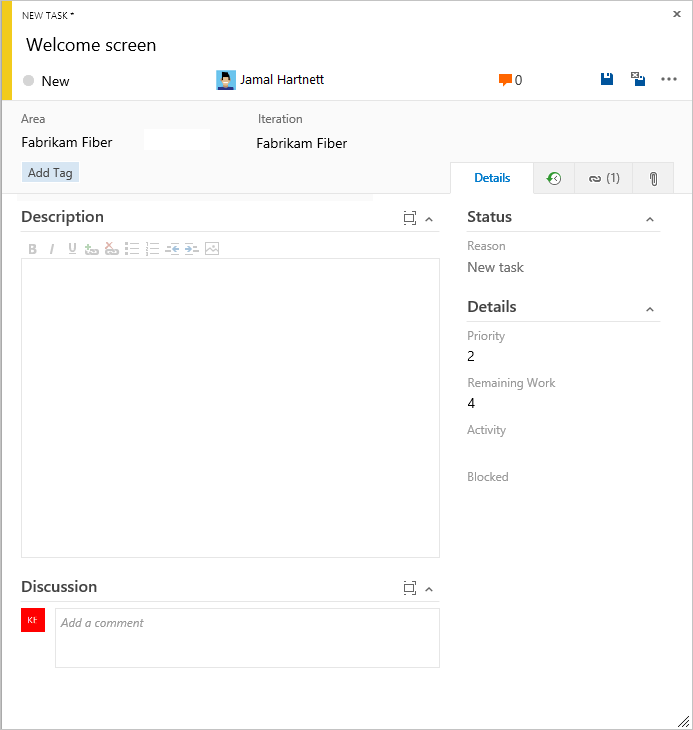  


#### [CMMI process](#tab/cmmi-process) 

Here we assign the task to Jamal.   

> [!div class="mx-imgBorder"]  
>   

* * *


### Field descriptions

In addition to the fields you can define for a backlog item&mdash;user story, issue, product backlog item, or requirement&mdash;you can specify the following fields for a task to support capacity and time tracking. 

> [!NOTE]   
> There are no inherent time units associated with this field even though the taskboard always shows "h" for hours in relationship to Remaining Work. You can specify work in any unit of measurement your team chooses. 

:::row:::
   :::column span="":::
      **Field**
   :::column-end:::
   :::column span="3":::
      **Usage**
   :::column-end:::
:::row-end:::
---
:::row:::
   :::column span="":::
      [Activity](../queries/query-numeric.md) 
   :::column-end:::
   :::column span="3":::
      The type of activity that's required to do a task.For more information about how this field is used, see [Capacity planning](../sprints/set-capacity.md). Allowed values are:  
      - **Deployment**
      - **Design**
      - **Development**
      - **Documentation**
      - **Requirements**
      - **Testing**
   :::column-end:::
:::row-end:::
:::row:::
   :::column span="":::
      [Discipline](../queries/query-numeric.md) (CMMI process)
   :::column-end:::
   :::column span="3":::
      The type of activity that's required to do a task.For more information about how this field is used, see [Capacity planning](../sprints/set-capacity.md). Allowed values are:  
      - **Analysis**
      - **Development**
      - **Test**
      - **User Education**
      - **User Experience**
   :::column-end:::
:::row-end:::
:::row:::
   :::column span="":::
      [Original Estimate](../queries/query-numeric.md)
   :::column-end:::
   :::column span="3":::
      The amount of estimated work required to complete a task. Typically, this field doesn't change after it's assigned. 
   :::column-end:::
:::row-end:::
:::row:::
   :::column span="":::
      [Remaining Work](../queries/query-numeric.md)
   :::column-end:::
   :::column span="3":::
      The amount of work that remains to finish a task. You can specify work in hours or in days. As work progresses, update this field. It's used to calculate [capacity charts](../sprints/set-capacity.md) and the [sprint burndown chart](../../report/dashboards/configure-sprint-burndown.md).   
      If you divide a task into subtasks, specify Remaining Work for the subtasks only. 
   :::column-end:::
:::row-end:::
:::row:::
   :::column span="":::
      [Completed Work](../queries/query-numeric.md)
   :::column-end:::
   :::column span="3":::
      The amount of work spent implementing a task. Enter a value for this field when you complete the task.
   :::column-end:::
:::row-end:::
:::row:::
   :::column span="":::
      [Task Type](/previous-versions/azure/devops/boards/work-items/guidance/cmmi/guidance-requirements-field-reference-cmmi) (CMMI only)
   :::column-end:::
   :::column span="3":::
      Select the kind of task to implement from the allowed values:</p>
      - **Corrective Action**
      - **Mitigation Action**
      - **Planned**
   :::column-end:::
:::row-end:::

[!INCLUDE [temp](../includes/discussion-tip.md)]

## Next steps  
 
> [!div class="nextstepaction"]
> [Customize your board](../configure-customize.md)

## Related articles

- [Azure Boards FAQs](../faqs.yml) 
- [Add tags to issues or tasks](../queries/add-tags-to-work-items.md)   
